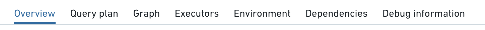
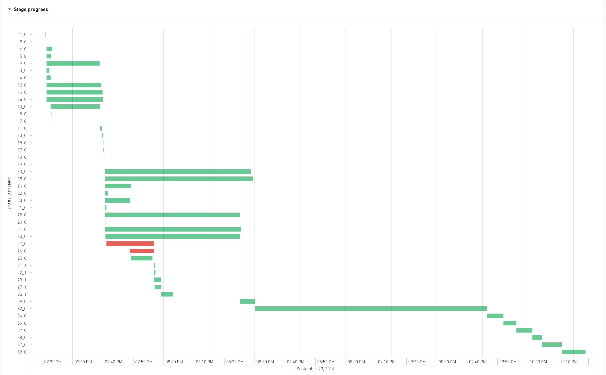
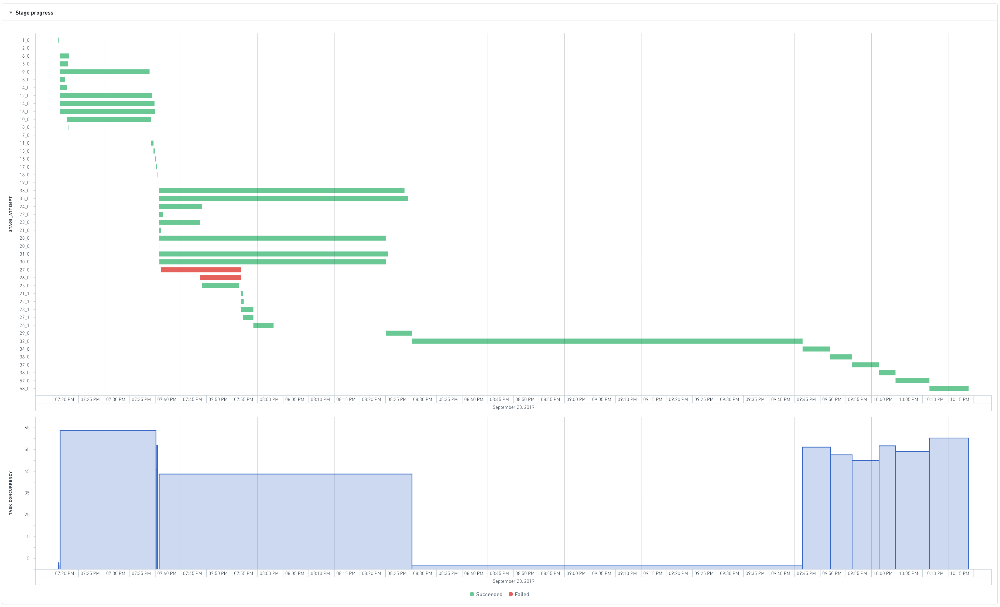
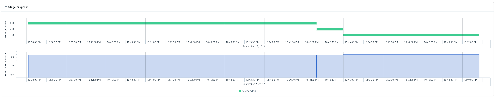
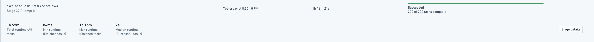
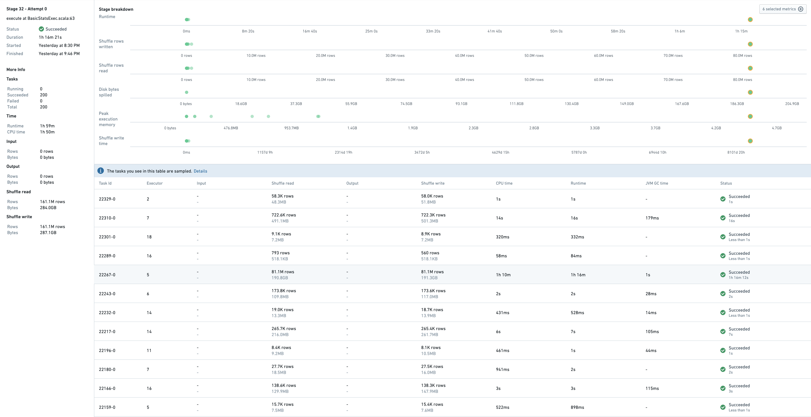
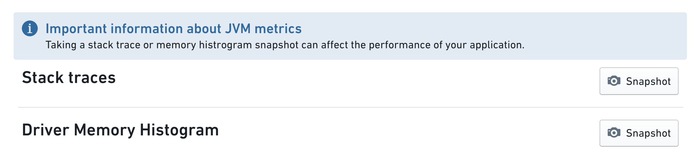

<!-- source: https://palantir.com/docs/foundry/optimizing-pipelines/understand-spark-details/ · mirrored 2026-08-14 from Palantir Foundry docs -->

# Understand Spark details

[Apache Spark ↗](https://spark.apache.org/docs/latest/) is the most commonly used execution engine in Foundry's data integration layer. In order to understand your pipeline's performance characteristics and find ways to optimize your pipeline, it's important to understand the details of how your code is executing in Spark. Foundry provides integrated tools to help you view and understand the performance of your jobs in Spark. This page outlines the Spark details that are available and provides guidance about what those details mean.

## Getting to Spark details

For any dataset built in Foundry, follow these steps to view Spark details:

1. **View the Build report**.
   * From a [Dataset Preview](/docs/foundry/dataset-preview/overview/) or from Data Lineage, select the **History** tab, select an individual build in the list, then select **View build report**.
   * From the view of [All builds](/docs/foundry/data-integration/application-reference/#builds), simply select a build in the list.
2. **Select a job**. A build consists of one or more jobs, visible in the list below the Gantt chart. Select a job from the list, then select the **Spark details** button:


The Spark details page provides information regarding the execution of jobs in Spark. For each job, the Spark details page displays information in various categories as shown below:



## Overview tab

The Overview tab provides the following information about a job:

* [High-level job metrics](#high-level-job-metrics)
* [Stage execution timeline and inter-stage dependencies](#stage-execution-timeline-and-inter-stage-dependencies)
* [Task concurrency chart](#task-concurrency-chart)
* [Stage details](#stage-details)

### High-level job metrics

* **Total runtime across all tasks:** The sum of the runtime of all tasks in all stages
* **Job duration:** The duration of the Spark computations (time between the start of the first stage and the completion of the last stage)

With these two metrics, you can compute the parallelism ratio as

```
Total runtime across all tasks / Job duration
```

A ratio close to 1 indicates a poor parallelism.

* **Disk spillage:** The size of the data that has been moved from executors' RAM to disk, across all stages.
  * This happens when the data cannot fit into the memory of the executor. Writing and reading to disk is a slow operation, therefore if your job spills, it will be significantly slower. Occasionally, depending on the type of computation that is happening, spilling can cause an executor to run out of memory and the job to fail.
  * Note that for large datasets, disk spillage is expected.

* **Shuffle write:** The amount of data that has been shuffled during the job, across all stages.
  * Shuffling is the process by which data gets moved between Spark stages and across partitions; for example, to compute a join (when none of the tables are broadcasted), perform aggregations, or apply repartitioning.
  * Since shuffling leads to both network IO and disk IO, it can account for a large portion of a job's runtime.
  * Therefore, a key goal of writing a performant Spark job is to minimize shuffling; for example, by ensuring that joins that can be broadcasted are in fact being broadcasted, by taking advantage of bucketing for a dataset that might often be joined or aggregated on the same keys in downstream jobs (in order to avoid downstream shuffling for this dataset), or by avoiding unnecessary repartitioning steps.

### Stage execution timeline and inter-stage dependencies

At the beginning of a job, Spark interprets the code of the transform to create an execution plan, which can be represented as a set of stages with interdependencies. The following graph shows the execution timeline of the stages.



The most-left stage typically represents the loading of inputs, whereas the most-right stage typically represents the writing of the output.
In the above example, stages 28, 30, 31, 32, 33, and 35 take a long time to execute, so they are good candidates for optimizing the runtime of this job.

Stages 28, 30, 31, 33, and 35 are able to run in parallel, which means that they do not have inter-dependencies. However stage 32 only starts when all the previous stages finish, which means:

* Decreasing the runtime of stage 35 will not yield any significant improvement as the waiting time is dominated by max\_runtime(28, 30, 31, 33, 35). Therefore to see a visible improvement, all these stages would have to be accelerated.
* Stage 32 is the bottleneck of the job as it takes approximately 35 percent of the total job duration

### Task concurrency chart

The task concurrency chart helps understand how well resources are used. It plots the stage concurrency over time. Similar to the job concurrency, the stage concurrency can be computed as:

```
Total runtime of tasks in the stage / Stage duration
```

The time axis of the task concurrency chart is shared with the Gantt chart of stages above so that it is easy to identify correlations.



In the above chart, stage 32 has a concurrency of almost 1. This means that almost all the work performed in this stage happens in one (very long) task, indicating that the computation was not distributed.

A perfectly distributed job would look like this:


### Stage details

When trying to understand why a particular stage is failing or is slow, it can be useful to have more information. Unfortunately, automatically tracing what a stage is doing back to the original code or even the physical plan is not currently possible as Spark does not expose this lineage when converting the code into stages.

The stage overview still allows for some investigation of failed or long-running stages:


Half of the tasks take less than 2 seconds, but what is more interesting is the maximum runtime. One task is taking approximately 63% of the total runtime of the stage. This is consistent with the observation made on the previous charts that shows that this stage is a bottleneck and that almost all the work happens in one task.

To know more, it is possible to jump to the stage details:


This shows a sample of tasks that have run in this stage, as well as metrics associated to stage itself.

Task 22267-0 takes 1h16, so it is the slowest one. Indeed, this task processes 81M rows whereas others process between 10K-700K rows. The symptoms of this skewness are:

* high disk spillage: 190GB vs 0 for other tasks
* high executor peak memory: 4.5GB vs 1GB for other tasks

## Executors tab



The **Executors** tab captures certain metrics from the Spark job's driver or executors, including stack traces and memory histograms. These metrics are useful when debugging performance issues with Spark jobs.

Selecting the *Snapshot* button captures either a Java stack trace or a driver-only memory histogram from the running job. The job has to be in a running state (if the job is completed, these metrics are no longer available to collect).

Stack traces are a way to see what each thread of your spark job is executing at that moment. For example if a job seems to be hanging (that is, not making progress when expected), taking a stack trace might reveal what is being executed at that time.

The Memory histogram shows the number of Java objects and their size in memory (in bytes) currently on the heap. It is useful in understanding how the memory is used and when debugging memory related issues.

Note that taking metrics may affect the performance of the running job. Collecting these metrics is additional work that needs to be done by the JVM. For example, taking a memory histogram triggers garbage collection.
