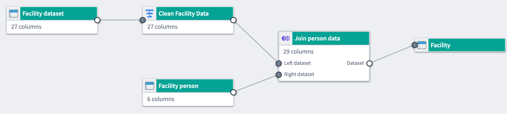
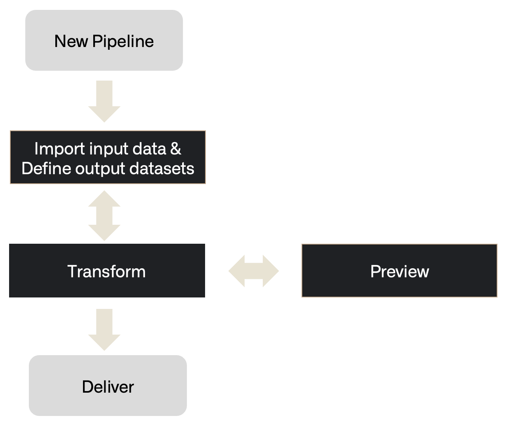
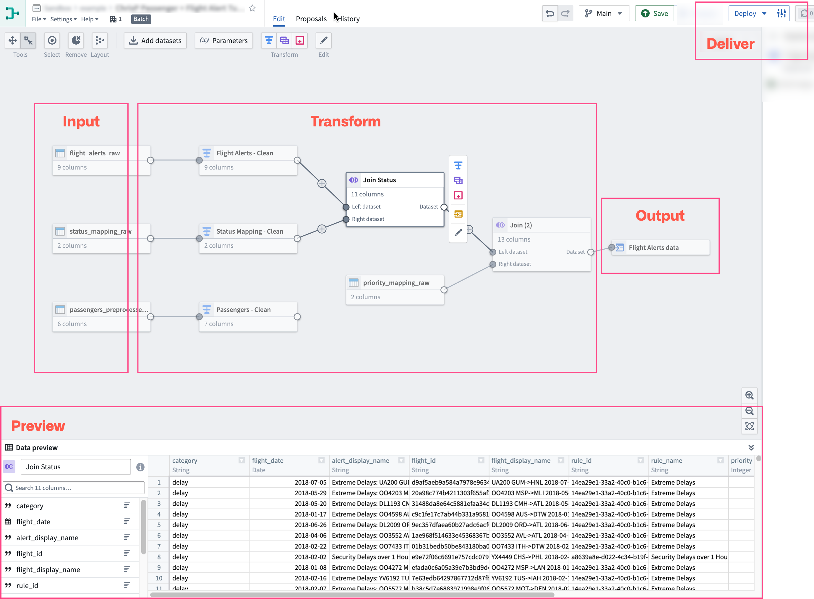

<!-- source: https://palantir.com/docs/foundry/pipeline-builder/ · mirrored 2026-08-18 from Palantir Foundry docs -->

# Pipeline Builder

Pipeline Builder is Foundry's primary application for data integration. You can use Pipeline Builder to build data integration pipelines that transform raw data sources into clean outputs ready for further analysis.

With Pipeline Builder and a robust backend model, users who code and users who do not code can collaborate jointly on a pipeline workflow. Pipeline Builder leverages both Spark and Flink as part of its architecture while incorporating a variety of advanced features supported by Palantir-developed custom libraries and services. Instead of writing code that requires lengthy health checks, Pipeline Builder integrates various programming languages beneath a streamlined builder point-and-click interface through which users apply data transforms without the need for specialized programming language knowledge.

Pipeline Builder uses a next-generation data transformation backend specifically designed to act as an intermediary between logic creation and execution. As users describe the pipeline they want to build, the backend writes transform code and performs checks on pipeline integrity, identifying refactoring errors and offering solutions to ensure a healthy build. With the backend acting as a middle layer between logic creation and execution, builders can solve schema problems before a pipeline is built and save time previously spent on computation and code checks.

## Features

Pipeline Builder includes features focusing on comprehensive pipeline creation, maintenance, and control.

* **Intuitive user interface:** Users write pipelines using graph and form-based interfaces that provide feedback, including join keys and column casting suggestions.

* **Type-safe functions:** Functions are strongly typed and can flag errors immediately instead of at build time.

* **Strict output checks:** If the expected output checks are not met, builds are prevented to avoid unintentional downstream breaks.

* **Automatic build path pruning:** Pipeline Builder will prune transform paths that are not connected to outputs to avoid unnecessary computation in builds.

* **Abstract implementation details:** Users focus on describing their end-to-end pipeline and desired outputs. Builds, syncs, and other orchestrations are handled automatically by the Pipeline Builder backend.

* **Independent pipeline logic:** Pipeline Builder can connect to different logic execution engines, including Spark, Flink, Azure instances, and more.

* **Reusability:** Use [subgraphs](/docs/foundry/pipeline-builder/subgraphs/) to extract and reuse pipeline logic as reusable blocks.

* **Full version control:** Users can draft a pipeline separately, collaborate on one pipeline, or revert to previous versions.

* **Media processing transformations:** Users can pass media sets as transform inputs within their pipeline.

* **Large Language Models (LLMs):** Use LLMs and AIP to transform your data. Use the [LLM evaluation suite](/docs/foundry/pipeline-builder/evaluation-suite/) to test your LLM transforms before deployment.

* **Trained models:** Import machine learning models to generate predictions within your pipeline.

* **Model Studio integration:** Open datasets directly in Model Studio for model training using the **Train in Model Studio** action.

* **Geospatial transformations:** Use Pipeline Builder to load, transform, and yield different forms of geospatial data.

* **Faster pipelines:** Build faster batch and incremental pipelines powered by DataFusion that significantly improve execution speed, especially for pipelines that typically run in under 15 minutes. Learn how to [create a faster pipeline](/docs/foundry/building-pipelines/create-faster-pipeline-pb/).

* **Streaming capability:** Pipeline Builder offers the ability to write pipelines that execute with real-time latencies. This feature is not available on all Foundry environments. Contact your Palantir representative if your workflow requires the availability of streaming pipelines.

* **External pipelines:** Push down compute to external systems such as Databricks and Snowflake using [external pipelines](/docs/foundry/building-pipelines/create-external-pipeline-pb/). External pipelines require [virtual table](/docs/foundry/data-integration/virtual-tables/) inputs and outputs from the same source as your compute.

## Workflow

Pipeline Builder follows a workflow comprising the following steps from importing data to delivering a healthy build.

* **Inputs:** Add a new data source or add additional datasets.
* **Transform:** Transform, join, or union data towards the desired output.
* **Preview:** After applying transformations, preview the output.
* **Deliver:** Once the pipeline is complete, build the pipeline outputs.
* **Outputs:** Add an object type, link type, or dataset output for your pipeline.

When visualized on a Pipeline Builder graph, this is how the steps might be demonstrated:

Learn how to [create a simple batch pipeline](/docs/foundry/building-pipelines/create-batch-pipeline-pb/), [create an external pipeline](/docs/foundry/building-pipelines/create-external-pipeline-pb/), or learn more about the [core concepts](/docs/foundry/pipeline-builder/core-concepts/) of building and managing pipelines in Pipeline Builder. To prepare unstructured text for embeddings and semantic search, learn how to [chunk text with the Chunk string board](/docs/foundry/ontology/document-processing/#chunking).

:::callout{theme="success" title="Palantir Learning portal"}
Try to build out your first pipeline in a course on [learn.palantir.com ↗](https://learn.palantir.com/deep-dive-building-your-first-pipeline).
:::

:::callout{theme="neutral" title="Tips and tricks"}
For guidance on working faster, improving performance, and organizing pipelines, see [Pipeline Builder tips and tricks](/docs/foundry/pipeline-builder/tips-and-tricks/).
:::
