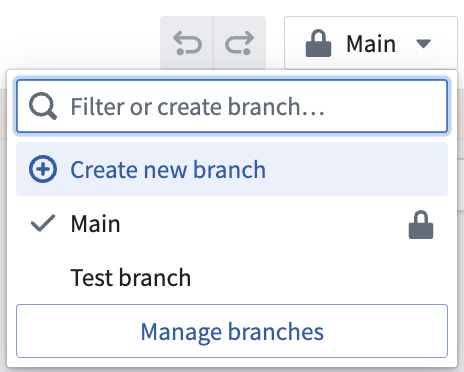
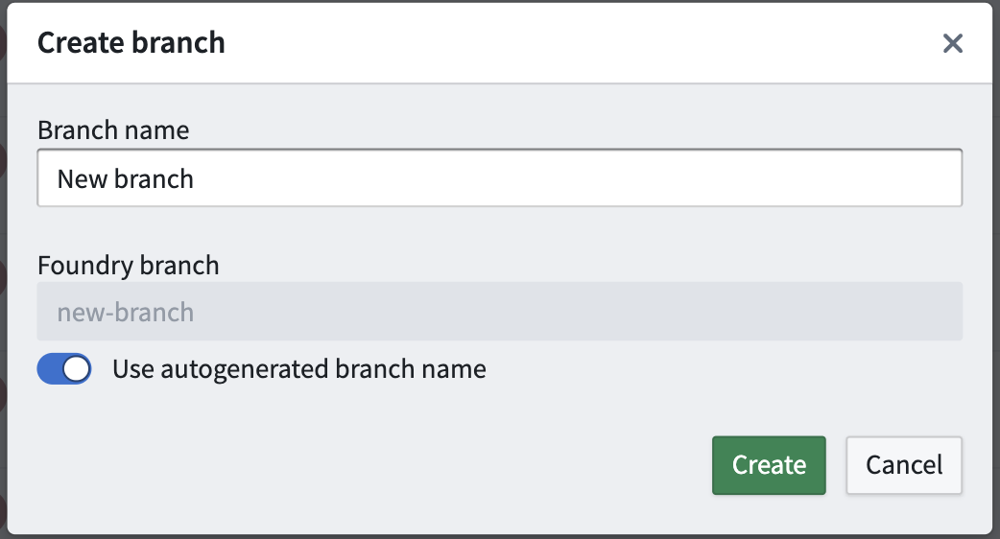

<!-- source: https://palantir.com/docs/foundry/pipeline-builder/branches-create-a-branch/ · mirrored 2026-07-23 from Palantir Foundry docs -->

# Create a branch

To create a branch, navigate to the top toolbar and click the branch dropdown; you will be in the **Main** branch by default after creating a new pipeline workflow. In the dropdown, click **Create new branch**.

In the **Create branch** window, name your branch and choose to use the autogenerated Global Branch name or to rename it. Dataset inputs will be read using this Global Branch or the main branch if it does not exist.

Click **Create** to copy the current state of the **Main** branch and work from the new branch. You can navigate to other branches from the branch dropdown.
