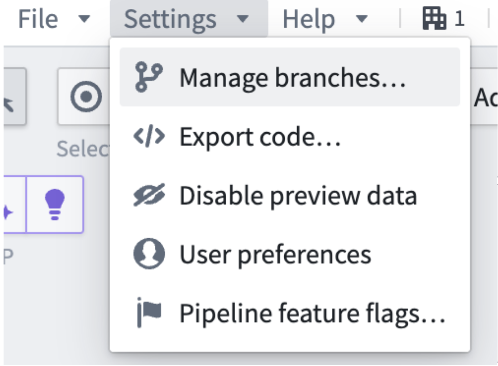
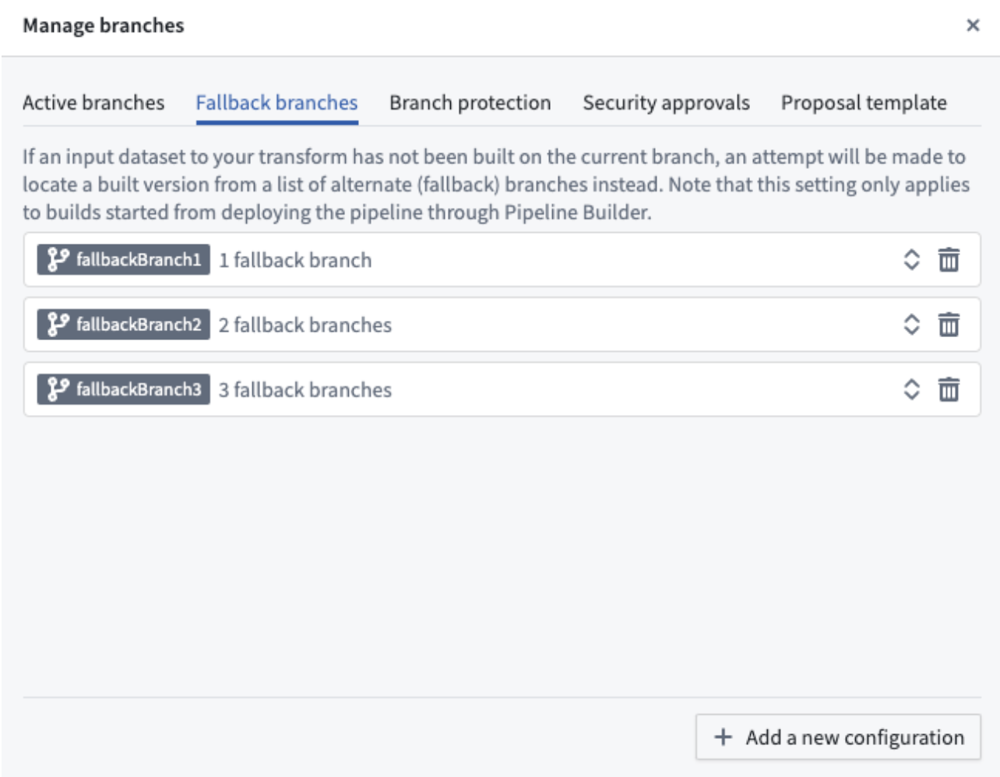
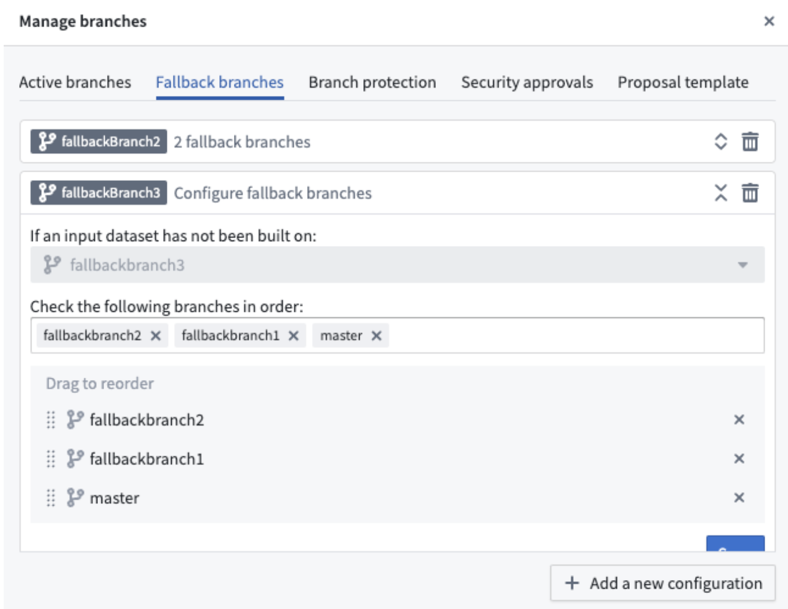

<!-- source: https://palantir.com/docs/foundry/pipeline-builder/branches-fallback-branches/ · mirrored 2026-08-18 from Palantir Foundry docs -->

# Fallback branches

Pipeline Builder allows you to build datasets on any branch and view the effect your logic has on the data. If an input dataset to your pipeline has not been built on the current branch, Pipeline Builder makes an attempt to locate a built version from a list of fallback branches instead. The default branch will automatically be set as the fallback branch unless configured otherwise. You can set different fallback branches to each branch and have more than one fallback if needed.

:::callout{theme="neutral"}
Give a Pipeline Builder branch the same name as a Code Repositories branch to read input datasets from that branch. You can then update the Pipeline Builder pipeline and Code Repositories transforms together. Fallback branches in Pipeline Builder work like [authoring fallbacks in Code Repositories](/docs/foundry/code-repositories/branch-settings/#fallback-branches).
:::

## Configure fallback branches in Pipeline Builder

To configure fallback branches, follow the steps below:

1. Select **Settings > Manage branches**.

2. Select the **Fallback branches** tab and expand your branch using the double arrow icon on the right. To change the fallback branch configuration, search under the **Check the following branches in order** field by either typing the branch directly into the text box or dragging to reorder the fallback branch order in the **Drag to reorder** section below.

3. Select **Save** after completing branch fallback configurations.

If your branch is not listed under the **Fallback branches** tab, use **Add a new configuration** on the bottom right of the pop-up window. To delete a branch’s fallback configuration, select the trash can icon on the right side of the branch.
