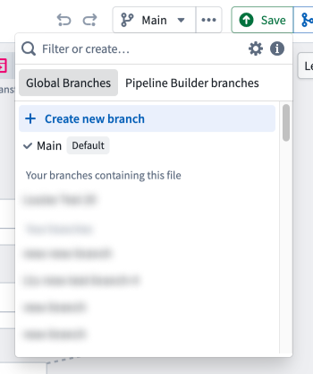
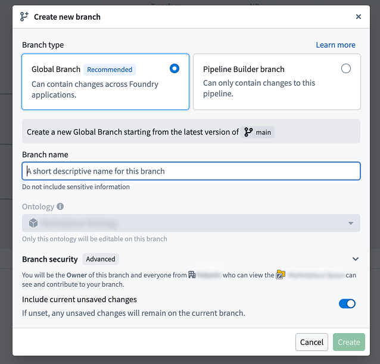
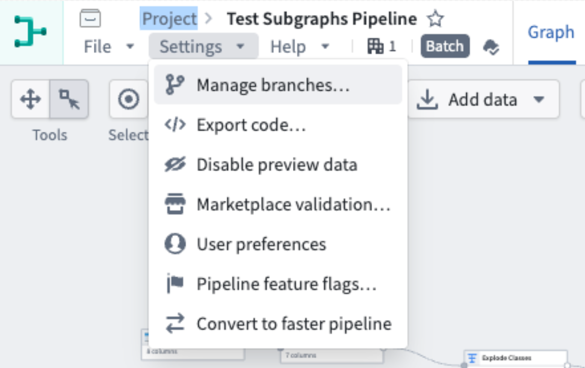

<!-- source: https://palantir.com/docs/foundry/pipeline-builder/branches-overview/ · mirrored 2026-07-23 from Palantir Foundry docs -->

# Branches

Version control with branching is widely used throughout Foundry and is a key part of Pipeline Builder. Version control is crucial to maintaining healthy pipeline workflows, supporting safe collaboration, and ensuring that the main production branch remains protected.

Pipeline Builder refers to each unique version of a pipeline workflow as a pipeline *branch* (similar to a branch in Git), with one branch serving as **main**.

A **branch** is a copy of the pipeline on which a user can iterate without saving back to the main pipeline. Branches in Pipeline Builder are analogous to code branches in a Git repository; users work within their own branches to make edits and test changes without the risk of negatively affecting the pipeline. Every pipeline workflow starts with one **main** branch, and users can create additional branches from the main branch when they want to collaborate. Once users are happy with changes in their branch, they can propose to merge the branch into the **main** branch.

## Global and Pipeline Builder branches

When creating a branch, you can select a Pipeline Builder branch or a [global branch](/docs/foundry/global-branching/overview/). Global branches allow you to make changes to multiple applications on a single branch, while Pipeline Builder branches are scoped to the pipeline you are working on. Note that object types created in Pipeline Builder are not modifiable in Ontology Manager on a branch.

:::callout{theme="neutral" title="Working with Code Repositories branches"}
You can create a Pipeline Builder branch with the same name as a Code Repositories branch to have your Pipeline Builder transforms read input datasets from that matching branch. This allows you to iterate on both your Pipeline Builder pipeline and your Code Repositories transforms together on a shared branch name. You can also configure [fallback branches](/docs/foundry/pipeline-builder/branches-fallback-branches/) in Pipeline Builder to control which branch is used when an input dataset has not been built on the current branch, functioning the same way as [authoring fallbacks in Code Repositories](/docs/foundry/code-repositories/branch-settings/#fallback-branches).
:::

Learn more about [branching workflows in Foundry](/docs/foundry/data-integration/branching/).

## Manage branches

To manage branches, navigate to the top toolbar and select **Manage branches** under **Settings**.

### Active branches

In the **Active branches** tab, view all currently active branches, or choose to archive an active branch. Archived branches will not show in the branch dropdown menu in the pipeline graph and cannot be edited or used unless restored. To restore an archived branch, choose to **View archived branches** in the **Active branches** tab. Find the branch to restore, then select the **Restore branch** icon on the right.

### Branch protection

In this tab, enable **Require proposals...** to protect one or more branches by preventing users from making direct changes to the specified branch or branches. This option requires users to make a change to a separate branch before it can be merged into any of the protected branches.

Choose to **Require at least one approval...** to add another layer of protection with an additional user approval of the proposed change before it can be merged into the main branch. Valid approvers are users with `Edit` permissions for the pipeline who did not contribute to the proposed change. Learn more about multiple protected branches in the [documentation on branch protection](/docs/foundry/pipeline-builder/branches-protected-branches/).

Under **General settings**, you can choose from:

* **Require proposals to update protected branches**
* **Require at least one approval before merging into protected branches**

### Proposal template

Add or view a proposal template in this tab. Write a new proposal in Markdown in the available text box, or preview your text in the **Preview** tab. If a template is added, it will be included in the body of all new proposals in the pipeline.
