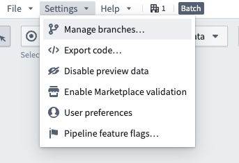
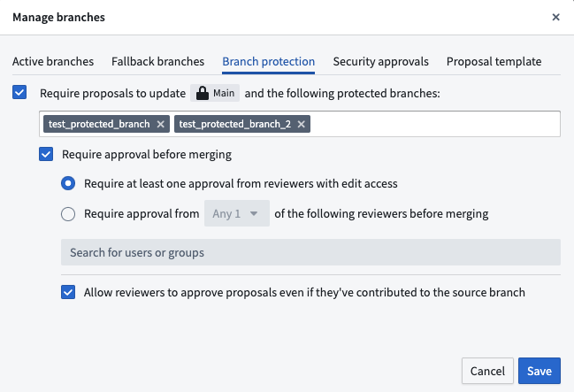
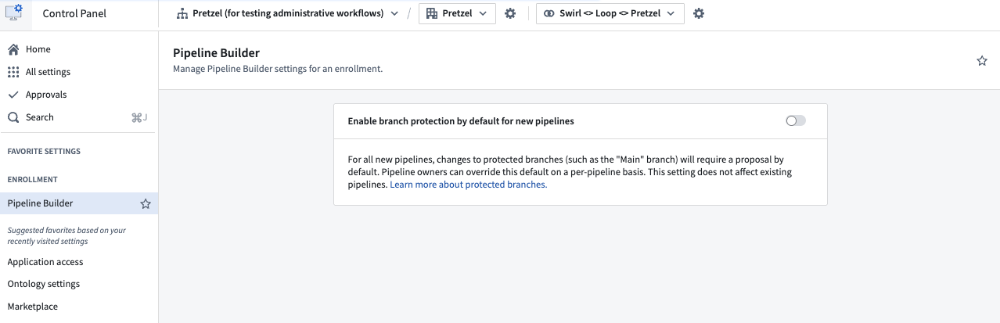

<!-- source: https://palantir.com/docs/foundry/pipeline-builder/branches-protected-branches/ · mirrored 2026-08-18 from Palantir Foundry docs -->

# Branch protection

When there are multiple authors contributing to the same Pipeline Builder instance, or when the pipeline backs critical data assets, you can *protect* your branch to achieve a greater level of governance and defense against unintentional changes. A *protected branch* can only be modified with a pull request and must satisfy a predefined set of requirements.

## How to protect branches

Navigate to the **Settings** drop down in the top left. Select **Manage branches**.

Select the **Branch protection** tab. In this tab, enable **Require proposals...** to protect the `main` branch and any other branches specified in the text box below. Select **Save** when done.

All protected branches require users to make changes on a separate branch before those changes can be merged into protected branches. Currently, all protected branches in Pipeline Builder share the same approval rules.

:::callout{theme="warning"}
The **Resolve changes** action, which allows you to merge a target branch into your current branch, does not work when your target branch is protected. This is by design, as **Resolve changes** would directly save changes to the pipeline, which is not permitted for protected branches. Instead, use the proposal flow to merge changes into a protected branch.
:::

## Interactions with security approvals and marking removals

When changes to security markings are enabled for a pipeline, branch protection settings are subject to additional governance:

* Enabling security approvals for changes to markings and organizations on outputs requires protected branch workflows. While this setting is enabled, you cannot change branch protection settings or disable proposal approval requirements.
* If a protected branch contains marking removals, you must undo those removals before you can disable the setting that allows changes to security markings in the pipeline.
* In pipelines with multiple protected branches, marking removals target all protected branches. If there are marking removals on any branch, stop removing markings from all branches before protecting or unprotecting branches.

## Enrollment-level branch protection

Administrators can enable default branch protection for the `main` branch of all new pipelines on an enrollment. Branch protection enhances the security and integrity of your repository by requiring proposals to be approved before any changes can be made to a protected branch.

:::callout{theme="warning"}
Enabling enrollment-level branch protection will **not** affect existing pipelines. To change the branch protection of existing pipelines, see [how to protect branches](#how-to-protect-branches) above.
:::

Go to Control Panel and navigate to **Pipeline Builder**. Then, toggle the setting for **Enable branch protection by default for new pipelines**. This will make `main` branches on new pipelines protected branches, so they will require proposals before changes can be merged.

## Project approval policies

In addition to the local branch protection settings described above, Pipeline Builder pipelines can also be governed by [project approval policies](/docs/foundry/global-branching/resource-protection-and-approval-policies/). Project approval policies define approval requirements at the project level for protected resources, providing an additional layer of governance alongside local branch protection settings.
