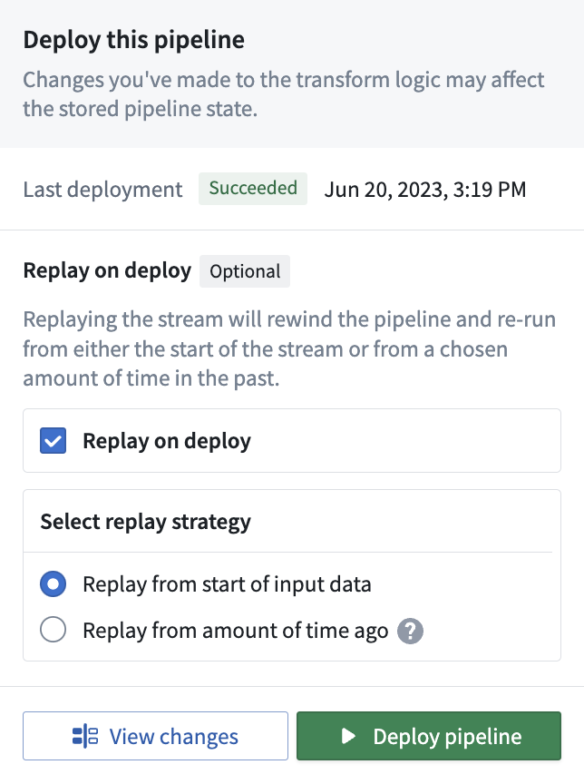
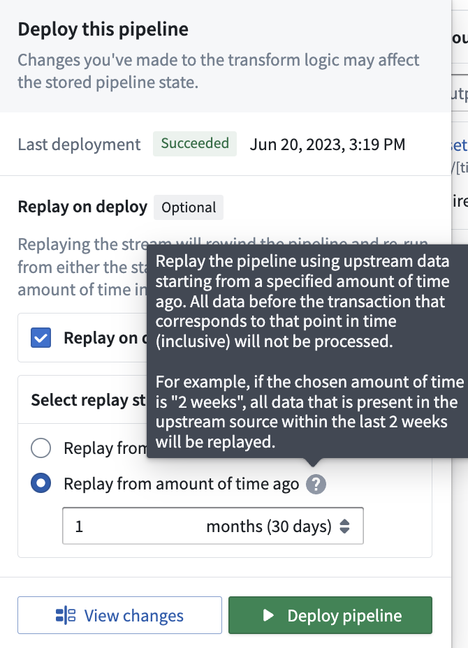
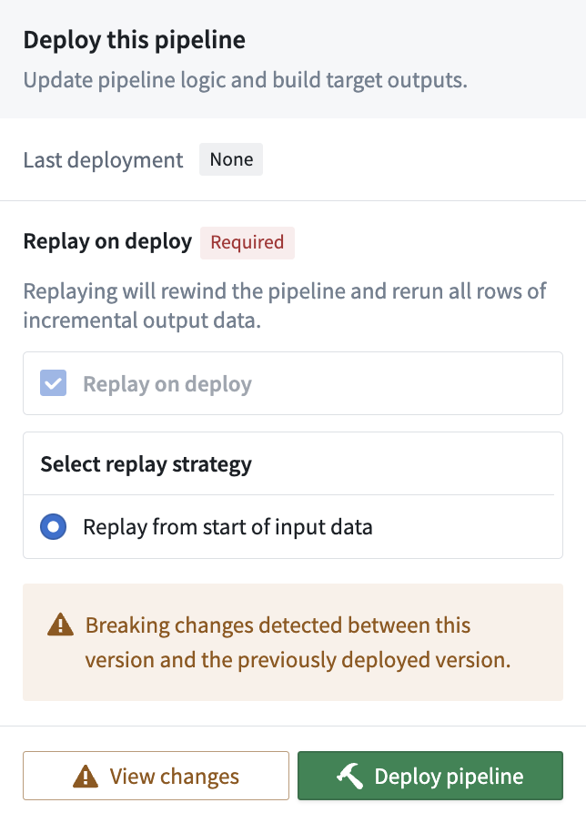
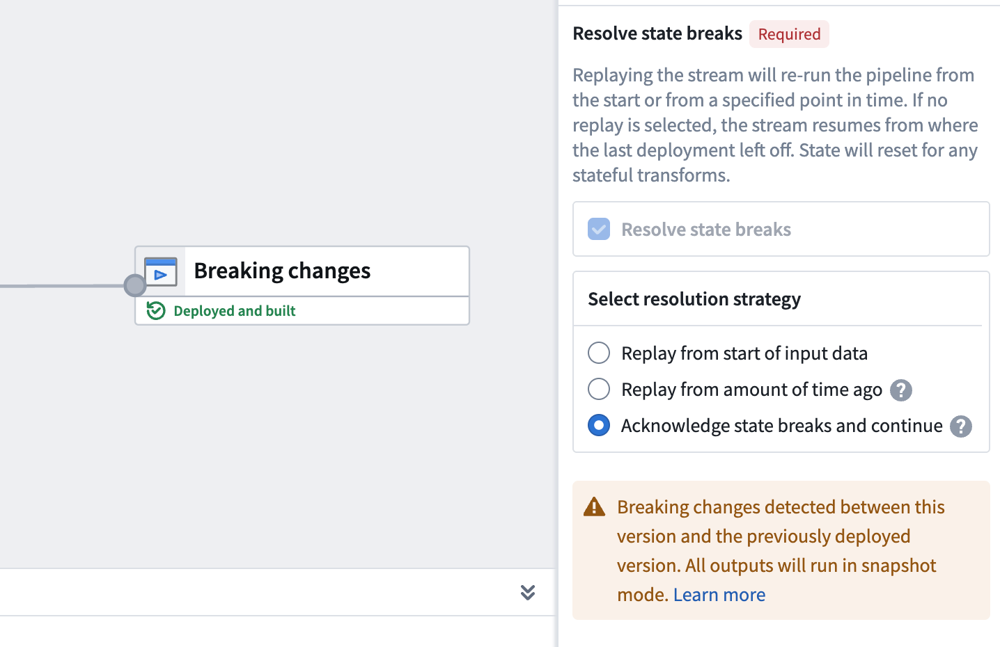
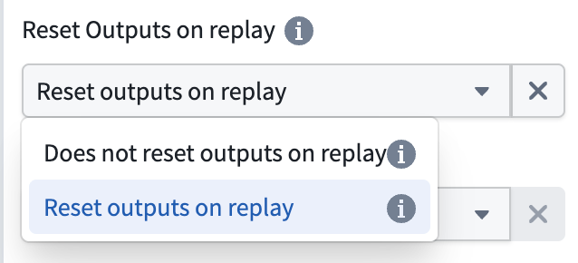
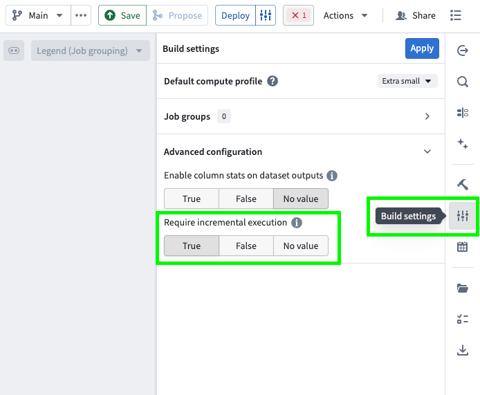

<!-- source: https://palantir.com/docs/foundry/pipeline-builder/breaking-changes/ · mirrored 2026-08-18 from Palantir Foundry docs -->

# Breaking changes

Breaking changes occur when stateful functions are modified in streaming or incremental pipelines. Transforms are either row-level or stateful.

* **Row level transform:** Only requires data in a single row to produce a result, for example `Multiply numbers` or `Filter`.
* **Stateful function:** A transform that requires data across multiple rows to produce a result.

There are four main stateful functions:

* Aggregate (Aggregate over Window in Streaming)
* Outer caching join (only in streaming)
* Heartbeat detection (only in streaming)
* Time bounded drop duplicates (only in streaming)
* Time bounded event time sort (only in streaming)

When a stateful function is modified, the previous output may no longer be accurate. For example, imagine you are filtering to even numbers and taking the sum of that set. If you change the filter to be all odd numbers, the existing state will be the sum of even numbers, but all new filtered values will be odd. Therefore, what the sum represents is now ambiguous, being the sum of a set of even numbers added to the sum of a set of odd numbers. To refresh the state, you can run a **replay**.

There are two types of replays:

* **Replay from start of input data:** Replays your pipeline from the start of data, either the start of a stream or the first transaction on an input dataset as determined by whether the input is a stream or an incremental dataset.

* **Replay from amount of time ago (only available for Streaming):** Replay the pipeline using upstream data starting from a specified amount of time ago. The granular replay will include all data starting with the first transaction that committed before the time specified, all data before that will not be processed. This means you may get one transaction's worth of data from before the time you specify.

Replays can be optional or required; in the case of breaking changes, Pipeline Builder automatically detects this change and requires a replay on deploy. The image below shows a forced replay in an Incremental pipeline.

When a state break occurs, Pipeline Builder moves the replay to the **Errors** tab and blocks pipeline deployment until the break is resolved. This ensures you acknowledge and address breaking changes before proceeding with deployment.

To protect against accidental replays, the **Advanced settings** section of the **Deploy pipeline** panel is collapsed by default with all replay options unselected. When you select a replay strategy, a **Confirm replay strategy** modal appears to explain the strategy and identify any downstream effects before execution.

:::callout{theme="danger"}
Replaying your pipeline could lead to lengthy downtimes, possibly as long as multiple days. When you replay your pipeline, your stream history will be lost and all downstream pipeline consumers will be required to replay.
:::

When a deployment involves breaking state changes, Pipeline Builder displays replay strategy information in the deployment timeline. You can view whether breaking changes were detected and which replay strategy was selected. This information appears as a task row in the deployment event details, helping you understand what replay decisions were made during deployment.

## Common causes of state breaks

The following changes commonly result in a state break that requires a full replay. Understanding these scenarios can help you plan pipeline modifications and avoid unexpected downtime.

### Stateful transform modifications

Removing or modifying stateful transforms (such as Aggregate, Outer caching join, or Heartbeat detection) requires a full replay. This includes removing inputs that feed into stateful transforms, because the stateful function can no longer produce consistent results without the removed data.

### Input changes affecting stateful transforms

Adding or removing inputs triggers a state break that you can acknowledge without a full replay. However, changes to inputs that feed into stateful transforms can break logical consistency with historical data. For example, if a stateful aggregate depends on a particular input and that input is removed or replaced, the existing state no longer accurately reflects the data that the pipeline processes.

:::callout{theme="warning"}
Even when Pipeline Builder allows you to acknowledge an input change without a replay, evaluate whether the change affects any stateful transforms later in the pipeline. If it does, a replay may still be necessary to maintain data consistency.
:::

### Output schema changes

Adding new columns to an output schema does not require a replay. However, removing columns from an output schema is a state break that requires a replay, because the existing output data contains columns that no longer match the updated schema.

### Source pipeline changes

Replaying a pipeline that feeds into your current pipeline can require you to replay your pipeline as well. When source data is reprocessed, the data arriving at your pipeline inputs may differ from the data your pipeline originally processed, which can invalidate the current state of stateful transforms.

When an upstream streaming pipeline runs with **Reset Outputs on replay** enabled (the default behavior), the upstream pipeline's output dataset is cleared and repopulated only with data from the replay window. In this scenario, downstream pipelines should replay from the start of input data rather than from a specific time window. This ensures that downstream outputs, such as ontology objects, are rebuilt correctly for the entire reprocessed period without creating duplicates.

## State-preserving modifications

Pipeline Builder includes features that allow certain pipeline modifications without a replay. These features enable you to continue processing from where you left off, preserving your stream history and avoiding impact to downstream consumers.

### Input and output modifications

You can modify a pipeline's inputs and outputs after deployment. The behavior depends on the type of change:

* **Adding inputs:** New inputs are read from the beginning, while existing inputs continue from their last processed position.
* **Removing inputs or outputs:** The state associated with removed inputs or outputs is dropped from the processing cluster without requiring a replay.
* **Adding outputs:** Adding an output results in a state break that requires replay, either from an amount of time ago or from the start of input data.

When Pipeline Builder detects input or output changes, a state-break module prompts you to acknowledge the change. This acknowledgment tells the system to continue processing from where it left off rather than requiring a replay.

:::callout{theme="warning"}
If you remove an input or output that is within a job group, the acknowledge option is not available and requires replay, either from an amount of time ago or from the start of input data. Evaluate whether any changes to inputs or outputs affect stateful transforms later in the pipeline, as a replay may still be necessary to maintain data consistency.
:::

### Schema changes

Input schemas are pinned when you deploy your pipeline. If an input schema changes, the pipeline continues reading data using the previous schema until you manually redeploy.

For output schemas, adding new columns does not require a replay. However, removing columns from an output schema is a state break that requires a replay.

### Selective data re-ingestion

You can re-ingest data from a specific point in time without resetting output views. When you choose to re-ingest, all data present in the outputs at the time of re-ingestion is preserved, allowing you to reprocess historical data while maintaining your existing output state.

To configure this behavior, expand the **Advanced** section in the deploy panel and disable the **Reset Outputs on replay** option when replaying your pipeline.

## Force incremental behavior for outputs

You can enforce incremental execution in your pipelines using the **Require incremental execution** setting in Pipeline Builder.

This setting ensures that jobs configured to run incrementally will automatically fail if incremental execution is not possible. This helps prevent unintended snapshot scenarios, such as:

* Accidentally snapshotted inputs
* Forced snapshots due to output schema changes
* Other unexpected full refreshes

Follow the steps below to configure enforced incremental execution for your pipeline:

1. Open your pipeline in **Pipeline Builder**.
2. Select the **Build settings** sliders icon to the right of the Deploy button or in the right toolbar.
3. Scroll down to **Advanced configuration**.
4. Set **Require incremental execution** to `True`. This setting is disabled by default (set to `No value`).

### Key considerations

* When enabled, **all** incremental outputs in your pipeline will fail if they cannot run incrementally, regardless of job groupings.
* The **Require incremental execution** setting can only be set to `True` if your pipeline has at least one incremental input or output. If not, enabling this option will result in a deployment error.
* The only case in which a pipeline configured to require incremental execution can run as a snapshot is when changes to the pipeline require a state break. You will be asked to acknowledge this before running.

:::callout{theme="neutral"}
This feature is also available in PySpark incremental transforms by setting `require_incremental=True` in the `@incremental` decorator.
:::

## Commit empty transactions

Incremental pipelines in Pipeline Builder include a build setting that allows you to commit empty transactions when a build produces zero output rows. When enabled, Pipeline Builder commits empty transactions to avoid reprocessing input on subsequent builds.

This setting is useful for incremental pipelines where some builds may legitimately produce no output rows. Without this setting enabled, input data that produced no output would be reprocessed on subsequent builds.

To configure this setting:

1. Open your pipeline in **Pipeline Builder**.
2. Select the **Build settings** sliders icon to the right of the Deploy button or in the right toolbar.
3. Scroll down to **Advanced configuration**.
4. Enable the **Commit empty transactions** option.
