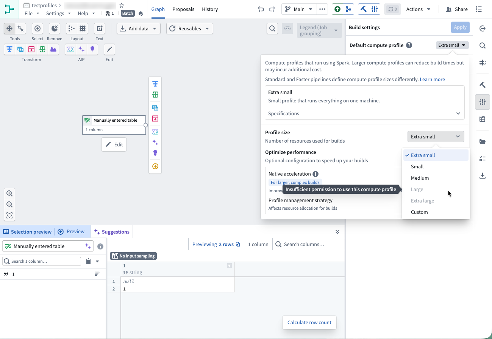
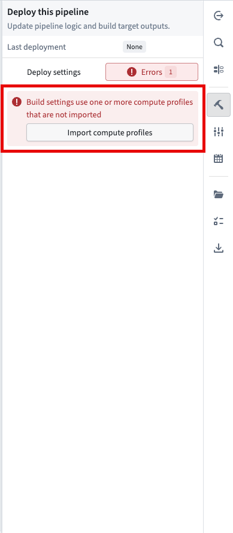
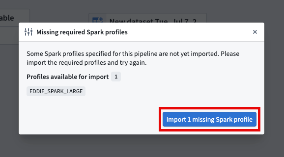
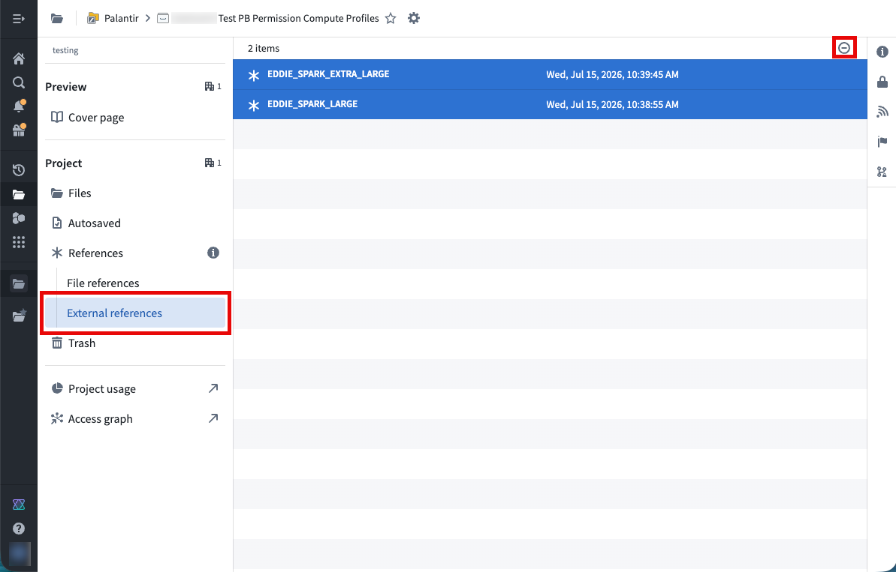
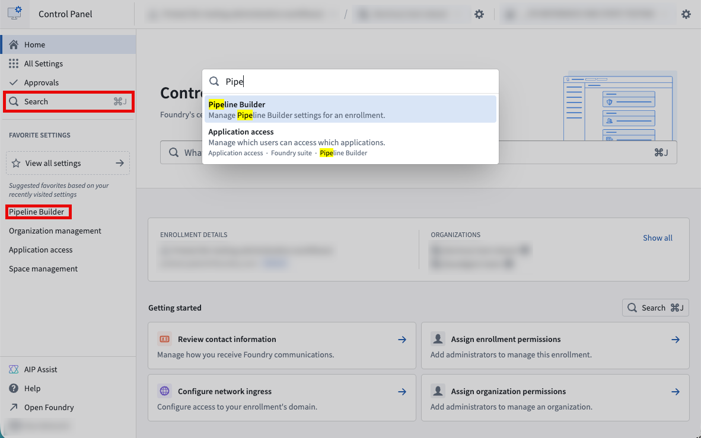
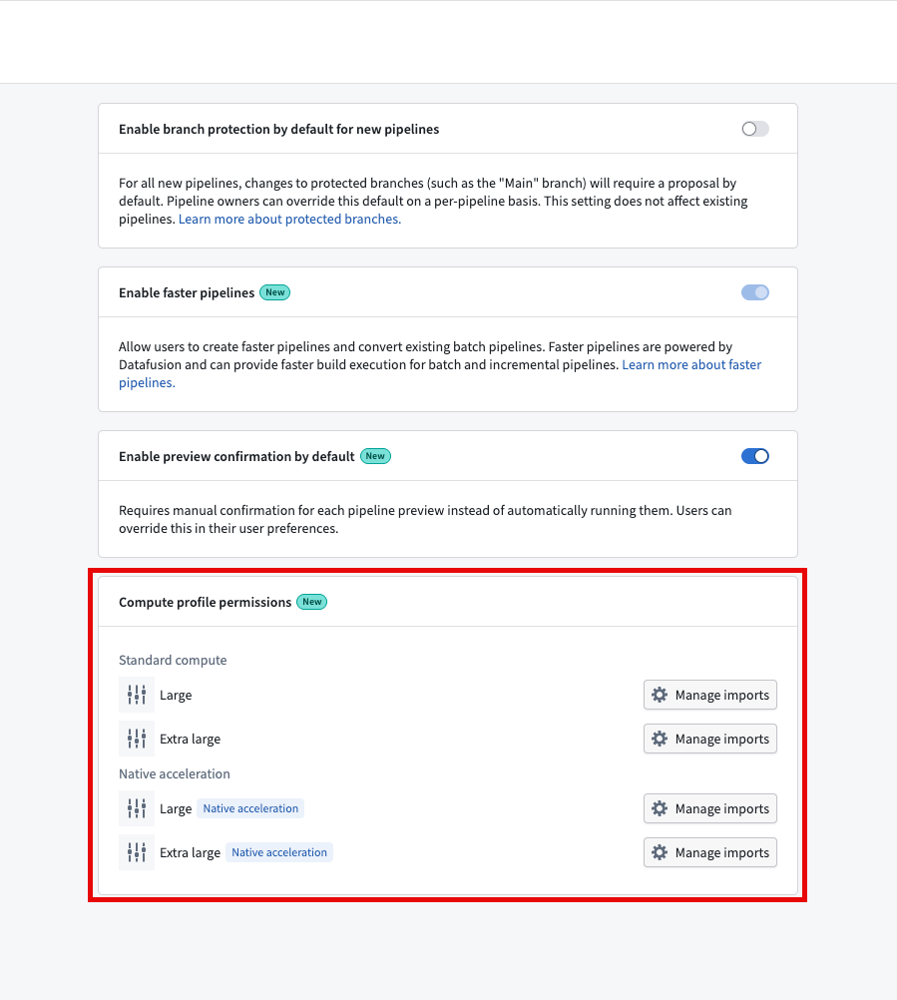
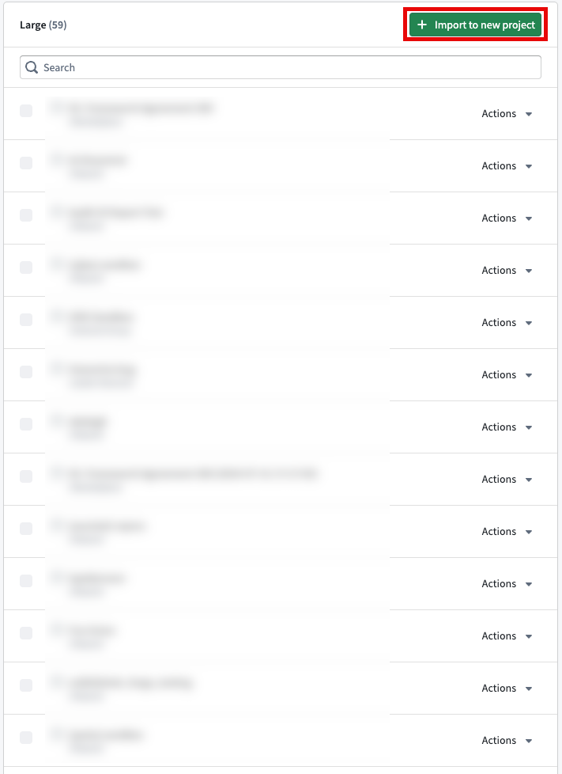
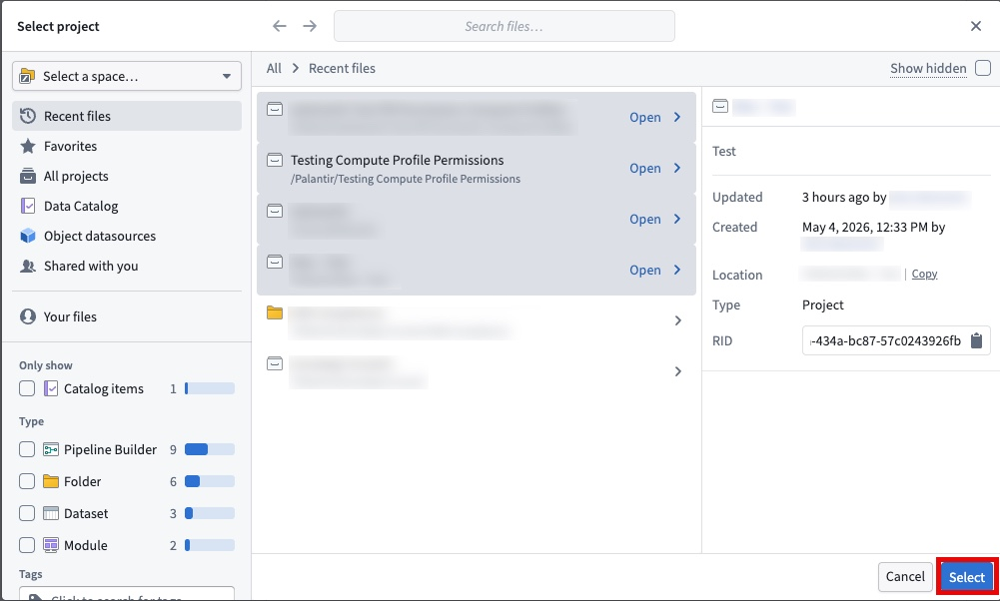
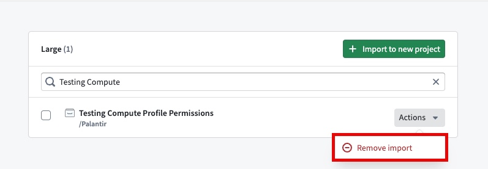
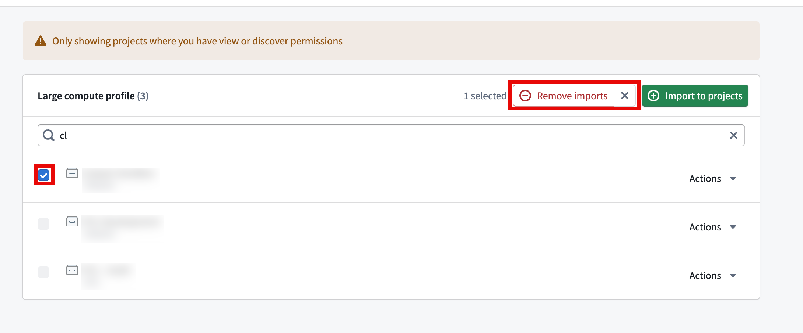

<!-- source: https://palantir.com/docs/foundry/pipeline-builder/compute-profile-permissions/ · mirrored 2026-08-18 from Palantir Foundry docs -->

# Configure compute profile permissions

Compute profile permissions are configured at the project level for standard batch Spark-backed pipelines. When a profile is imported to a project, every pipeline in that project can use it. Profiles can be imported directly in the Pipeline Builder graph, added or removed in the **Control Panel** application, or removed directly from the project's references in Compass.

Compute profiles fall into two permission tiers:

* **Auto-imported profiles** (up to and including medium): Imported automatically to the project.
* **Non-auto-imported profiles** (large and extra large): Must be imported manually by a user with a Compass project editor or owner role and Resource Management administrator role. This requirement also applies to large and extra large custom compute profiles. To learn more, see [Configure access](/docs/foundry/resource-management/configure-access/).

:::callout{theme="neutral"}
Compute profile permissions apply to all projects, including those created before this feature was introduced. Any large or extra large profiles already in use in a project are retained, so existing pipelines will continue to run with no action required. To use a large or extra large profile that was not already imported, you must import the profile to the project first.
:::

:::callout{theme="neutral"}
Streaming and Faster pipelines are not affected by this feature. Their compute profile selection process remains the same, with no additional permission configuration needed. Standard batch Spark compute profiles have different definitions than Faster or Streaming profiles; to learn more, see [Build settings](/docs/foundry/pipeline-builder/management-build-settings/#build-settings).
:::

## Import compute profiles directly from Pipeline Builder

:::callout{theme="neutral"}
Permissions for compute profiles are defined at the Compass project level and Resource Management Administration level. Granting a user owner permissions at the pipeline level will not allow them to import additional compute profiles.
:::

You can import compute profiles directly from Pipeline Builder if you have a Compass project owner or editor role and a Resource Management administrator role.

If you do not have the role set required to import the selected profile, you will see the Large and Extra Large options as disabled.

If you are missing the selected compute profile from the project's resources, you will see an error `Build settings use one or more compute profiles that are not imported` when trying to deploy a pipeline, as shown in the screenshot below.

If you select the **Import compute profiles** button below the error, you will be prompted to import the missing profiles.

Once you select **Import 1 missing Spark profile**, you will see a banner appear stating that the profile was successfully imported. If you do not have a Compass project owner or editor role or the Resource Management administrator role, this import button will be disabled.

Once this process is completed, you will be able to execute builds with the newly imported compute profiles.

### Remove compute profile

You can also remove compute profiles in the Compass project. Navigate to the **External references** tab, select the reference you would like to remove, then select the **Remove reference** button in the top right.

## Configure compute profile permissions in Control Panel

You can also manage compute profile permissions centrally in the **Control Panel** application.

The following table summarizes which actions each Compass project role can perform for large and extra large compute profiles.

| Compass project role | Import | Remove |
| --- | --- | --- |
| Owner | Yes | Yes |
| Editor | Yes | No |
| Viewer | No | No |
| Discoverer | No | No |

:::callout{theme="neutral"}
Importing large and extra large profiles requires a Resource Management administrator role as well as a Compass project editor or owner role. To learn more, see [Configure access](/docs/foundry/resource-management/configure-access/).
:::

Ensure you have either an editor or owner role on the Compass project containing your pipeline. Then navigate to the **Control Panel** application in your Foundry environment.

Once you are in **Control Panel**, use the search bar in the left-hand menu to find **Pipeline Builder**.

Once you have selected **Pipeline Builder**, you will see the **Compute profile permissions** configuration options as shown below.

For each compute profile, the **Compute profile permissions** section lists projects with the profile imported where you have at least a Compass discover role, giving you a central view of profile usage.

From the **Compute profile permissions** section, you can select the compute profile you would like to import to or remove from your project. For this example we will choose **Standard Large**.

Next, select the **Import to new project** button in the top-right of the interface as shown below.

Then, use the **Select** button to choose one or more projects into which you would like to import the selected profile. You can import a profile into multiple projects at once.

Selected projects will appear in the **Manage imports** list for a given compute profile.

If needed, you can remove the profile from a single project through the **Actions** tab.

You can also remove up to 20 projects in a bulk operation by selecting the checkbox on their left hand side and using the **Remove** button in the top right.

## Compute profiles in Marketplace products

When you install a Marketplace product that contains a pipeline, compute profile permissions are checked during installation, and any required profiles are imported as part of that process. As a result, an installed pipeline is always deployable. If you do not have permission to import the profile packaged with the product, you can select a smaller profile during installation.

:::callout{theme="warning"}
Importing a large or extra large profile during installation is subject to the same permissions as importing it in a project. You must have a Compass project editor or owner role and a Resource Management administrator role.
:::
