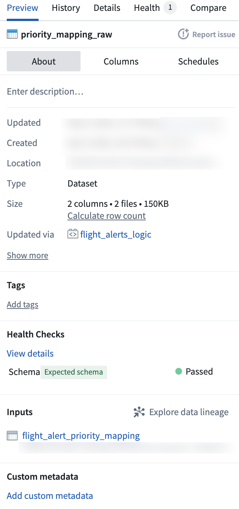
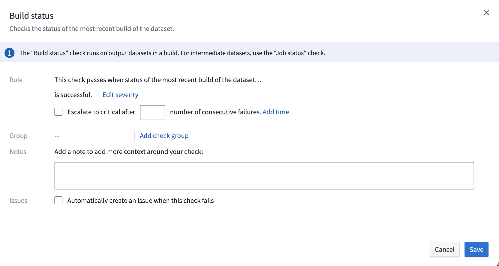
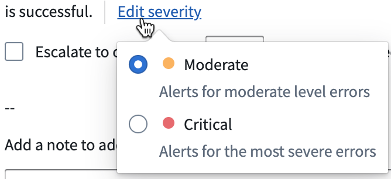

<!-- source: https://palantir.com/docs/foundry/pipeline-builder/dataexpectations-configure-health-check/ · mirrored 2026-08-18 from Palantir Foundry docs -->

# Configure data health checks

You can configure a dataset health check in Pipeline Builder by accessing the data preview panel within the graph, or by opening the Dataset Preview app.

* Open the preview panel by double-clicking a dataset node in the graph.
* Open the Dataset Preview app by right-clicking on a dataset node and selecting **Open**.

In the **About** tab of the preview, you will find the **Health Checks** section. This section shows any active health checks configured for the dataset. Choose **View details** to learn more about active health checks or to configure a new check. This will open the **Health** tab in the Dataset Preview app.

To add a new health check, first search for an available check. Use the search bar to find a check by name, or use the various tabs to search for checks based on status, time, size, content, or schema. For a list of available checks, descriptions, and example options, view [Checks reference](/docs/foundry/health-checks/checks-reference/).

Health check types include:

* **Job-level status checks:** Validate that the job corresponding to an output dataset is completing successfully.
* **Build-level checks:** Validate that builds are completing successfully within an expected duration.
* **Freshness checks:** Validate that data is being kept up-to-date.

If you want to add a **Build status** check, for instance, search for **Build status** in the search bar or within the **Status** tab. Select the check to open a configuration side panel. Use this panel to configure the health check rule, group, notes, and issue prompt.

* **Rule:** Describes the rule of the check you are configuring.
  * Choose **Edit severity** to mark the check as **Moderate** or **Severe**.   
       

  * Decide whether to escalate the check to critical after a set number of consecutive failures. Select **Add time** to set a time parameter of consecutive failures.

* **Group:** Shows the monitoring view to which this health check will belong. Select **Add group** to search for available monitoring views.
  * Learn more about [monitoring views](/docs/foundry/monitoring-views/overview/).

* **Notes:** Add context to your new health check by including a note with your configuration.

* **Issues:** Check the box to prompt an issue creation when the check fails.

Select **Save** in the bottom right of the configuration panel to save your new health check to the dataset.

Learn more about recommended [health checks](/docs/foundry/data-integration/health-checks/) and [Data Health](/docs/foundry/health-checks/overview/).
