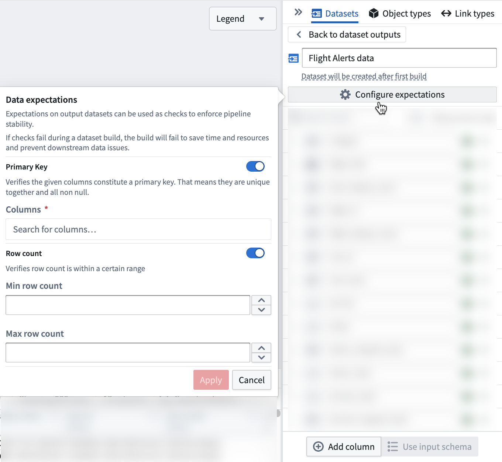

<!-- source: https://palantir.com/docs/foundry/pipeline-builder/dataexpectations-overview/ · mirrored 2026-08-18 from Palantir Foundry docs -->

# Data expectations

Data expectations are requirements that can be applied to dataset outputs. These requirements (known as "expectations") can be used to create checks that improve data pipeline stability.

Data expectations can be set on each pipeline output to define an expectation on the resulting output. Pipeline Builder supports the following data expectation types:

* **Primary key:** Verifies that the selected columns contain no null values and that their combination is unique.
* **Row count:** Verifies that the output contains a number of rows within an expected range.
* **Value is one of:** Verifies that each value in the selected column belongs to a list of permitted values.
* **Value is not null:** Verifies that the selected column contains no null values.
* **Floats and doubles are not NaN:** Verifies that the selected floating point column contains no `NaN` values.
* **Row-level:** Takes a column expression that returns a boolean and verifies that the condition holds for every row of the output.

If any expectations fail, the build will fail. The job expectations pane will show which data expectations passed and failed.

## Primary key data expectations

Primary key expectations are provided with one or more column names and verify:

* Each column has no null values.
* The combination of columns is unique.

:::callout{theme="neutral"}
If you have an incremental build, and your primary key check is taking a long time, try [adding a projection](/docs/foundry/optimizing-pipelines/projections-setup/) to your primary key column.
:::

### Example of a primary key data expectation

In the specific column selected, we check that every entry underneath is unique.

If two columns are selected, we check that the combination of both columns are unique.

In our example, we'll use `id` and `time` as two columns existing in our dataset.

Example dataset:

| id | time |
|----|------|
| 1  | 8pm  |
| 1  | 9pm  |
| 2  | 8pm  |
| 3  | 8pm  |

The above example would pass the check. This is because even though `1` and `8pm` are repeated individually, the combination of `id` and `time` remains unique.

Conversely, the following would fail:

| id | time |
|----|------|
| 1  | 8pm  |
| 2  | 9pm  |
| 1  | 8pm  |

This table would fail the check because the `1` and `8pm` combination is repeated.

## Row count data expectations

Row count expectations are provided with a minimum and/or maximum row count.

If a minimum row count is provided, the expectation will verify that there are at least the specified amount of rows.

If a maximum row count is provided, the expectation will verify that there are at most this many rows.

## Value is one of data expectations

The **Value is one of** expectation is provided with a column and a list of permitted values. It verifies that the value of that column in every row matches one of the permitted values.

Use this expectation to protect downstream logic that assumes a fixed set of categories, such as a status column that must only contain the values `ACTIVE`, `INACTIVE`, or `PENDING`.

For example, if the permitted values are `ACTIVE` and `INACTIVE`, the following table would pass the check:

| id | status   |
|----|----------|
| 1  | ACTIVE   |
| 2  | INACTIVE |
| 3  | ACTIVE   |

Conversely, the following table would fail the check because `PENDING` is not one of the permitted values:

| id | status   |
|----|----------|
| 1  | ACTIVE   |
| 2  | PENDING  |

## Value is not null data expectations

The **Value is not null** expectation is provided with a column and verifies that no row in the output has a missing value in that column.

:::callout{theme="neutral"}
This expectation only checks for null values. An empty string is a value rather than a missing value, so rows containing an empty string will pass. If a column must be both populated and unique, use a [primary key expectation](#primary-key-data-expectations) instead.
:::

## Floats and doubles are not NaN data expectations

The **Floats and doubles are not NaN** expectation verifies that a floating point column contains no `NaN` ("not a number") values. `NaN` values are typically introduced by undefined arithmetic, such as dividing zero by zero, or by casting a non-numeric value to a float or double.

Because `NaN` is a valid floating point value rather than a missing value, a **Value is not null** expectation will not detect it. `NaN` values also propagate through aggregations, meaning that a single `NaN` value can turn an aggregated result such as a sum or an average into `NaN`. Add this expectation to numeric outputs where downstream consumers, such as dashboards or models, depend on well-defined numeric values.

:::callout{theme="warning"}
Objects with `NaN` property values will fail to index. Object Storage v2 (OSv2) does not allow `NaN` or `±infinity` as property values, so `NaN` values reaching an object type datasource will cause indexing jobs to fail for batch datasources, and violating records will be dropped for streaming datasources. If your output backs an object type, add this expectation to catch `NaN` values before they reach the Ontology. Review the [data restrictions](/docs/foundry/object-indexing/data-restrictions/#property-type-restrictions) for more information.
:::

## Row-level data expectations

Row-level expectations are provided with a column expression that returns a boolean and run that condition against every row of the output. Select the expression you want to evaluate from the dropdown when configuring the expectation. The expectation passes only if the condition evaluates to true for every row.

Use a row-level expectation when the condition you want to verify is not covered by the other expectation types, or when it depends on more than one column. For example, you can verify that a `quantity` column is always greater than zero, or that an `end_time` value is always later than the corresponding `start_time` value in the same row.
