<!-- source: https://palantir.com/docs/foundry/pipeline-builder/dataexpectations-unit-tests/ · mirrored 2026-08-18 from Palantir Foundry docs -->

# Unit testing in Pipeline Builder

Improve the reliability of your pipeline in Pipeline Builder through unit tests. These tests serve as a valuable tool for debugging, detecting breaking changes, and ultimately ensuring higher quality pipelines.

## What is a unit test?

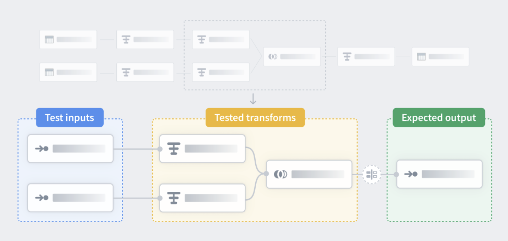

Similar to unit tests in code, unit tests in Pipeline Builder are a way to check that your pipeline logic produces the expected outputs when tested with predefined inputs. Unit tests consist of:

* Test inputs
* Transform nodes
* Expected outputs

Test inputs and expected outputs are created with manually entered tables, but you can copy and paste for faster creation. The transform nodes you want to test can be selected in your main Pipeline Builder workspace. To learn more about creating a unit test see below.

## Create a unit test

1. In the main workspace on the right side panel, select the **Unit tests** icon.   
   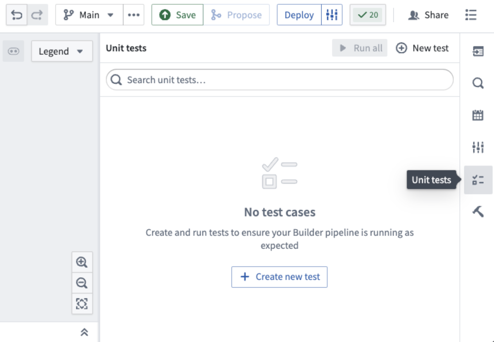   

2. Select **Create new test** in the center of the screen or **New test** in the top right. This will open a dialog at the top of your workspace, prompting you to choose the relevant nodes.   
   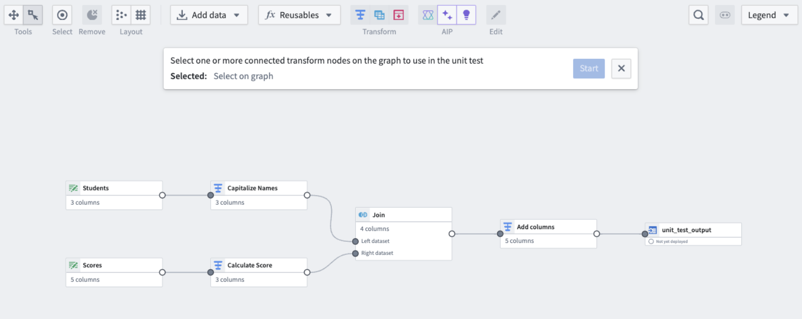   

3. Once all relevant nodes are chosen, select **Start**.   
   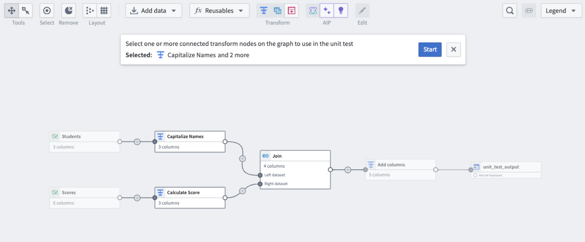   

   This will take you to the unit test configuration window.

   * Yellow nodes correspond to previously selected transform nodes.
   * Green nodes correspond to test inputs.
   * Blue nodes correspond to test outputs.

   For every unit test, you must fill out the input and output data.   
   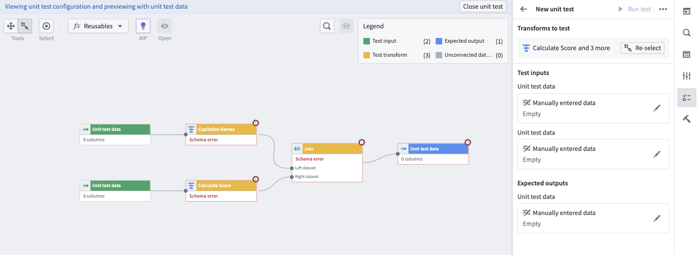   

4. Fill out the input data or expected output data by double clicking on the node. This will take you to the page below:   
   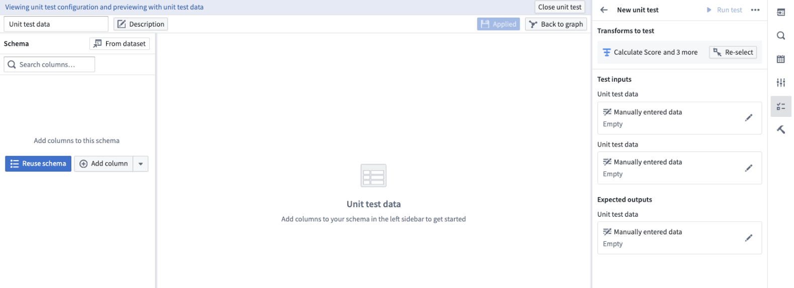   

   On the left side select:

   * **Reuse schema:** To set the output schema to match the schema of the connected table.
   * **From dataset:** To use a schema from an existing dataset.
   * **Add column:** To manually enter the data schema.

   Once the schema is set, fill out the rows in the center table and select **Apply**, then **Back to graph**.   
   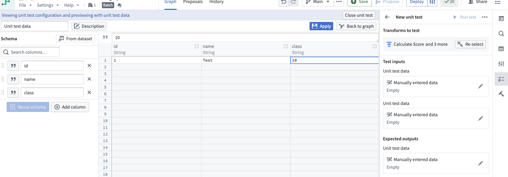   

5. Repeat this step for all input and output datasets.

When you are done, you will be able to see the manually entered data on the right side panel detailing the number of rows and columns in each table.

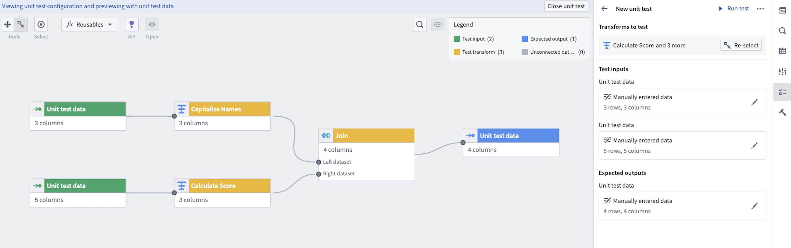

## Run a unit test

For each unit test, you have the option to **Run test** on the top right.

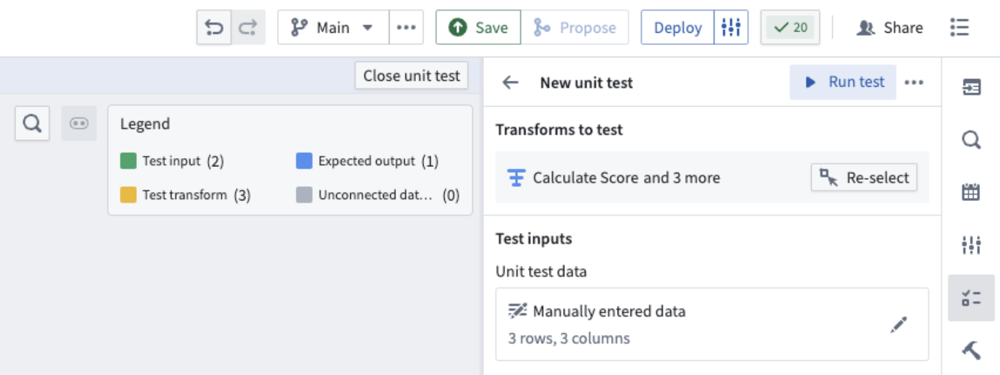

Once the test runs, you can see the test results underneath. To view the exact table results, select **View test result**.

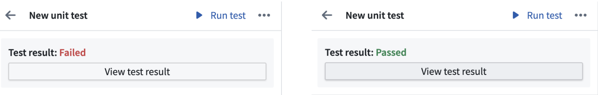

This will open a view of the expected and received output at the bottom of your screen.

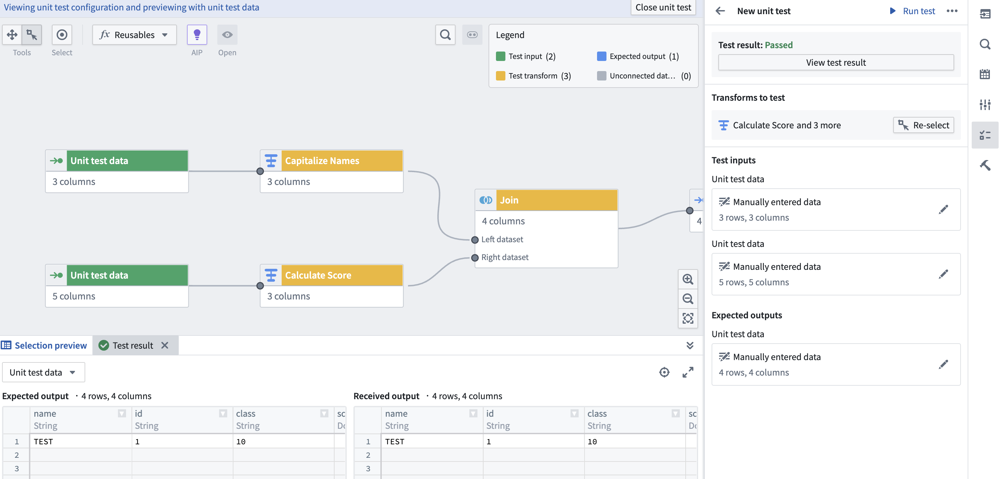

When you are done editing and viewing your unit test, you can select **Close unit test** in the top right.

## Delete a unit test

To delete a unit test, select it and open the options menu using the three dots in the top right corner. Select **Delete test case**.

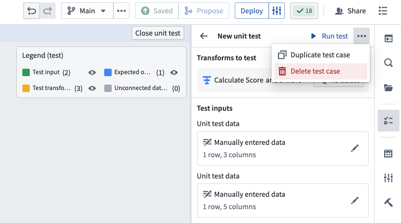

## Edit existing unit tests

Select the **Unit tests** icon to see a list of the unit tests in your pipeline. Select the pencil icon to edit the selected unit tests.

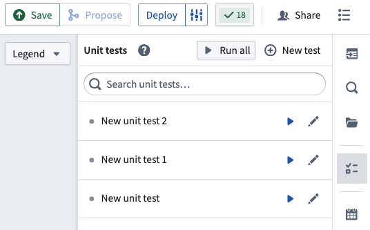

To change the selected test transforms in a unit test, use the **Re-select** button. This will take you back to the selection page.

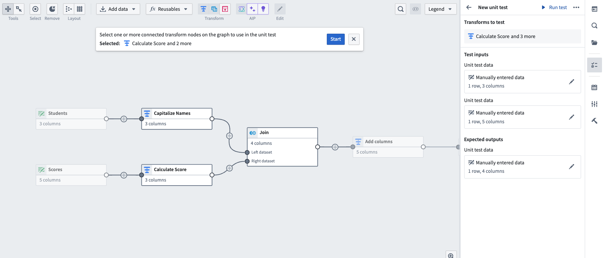

:::callout{theme="neutral"}
If you add nodes between nodes that are already included as test transforms in a unit test, the added nodes will automatically show up in the existing unit test.
:::

To change any of the test inputs or expected outputs, you can double click directly on the nodes in the graph view, or select the pencil icon on the right side panel.

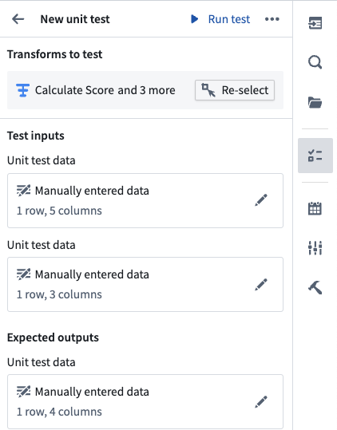

When you are done editing the unit test, select **Close unit test** on the top right to return to the main graph.

## Unit testing in proposals

Any changes to unit tests will also show up in the proposals page under the **Unit Test** tab on the left side panel.

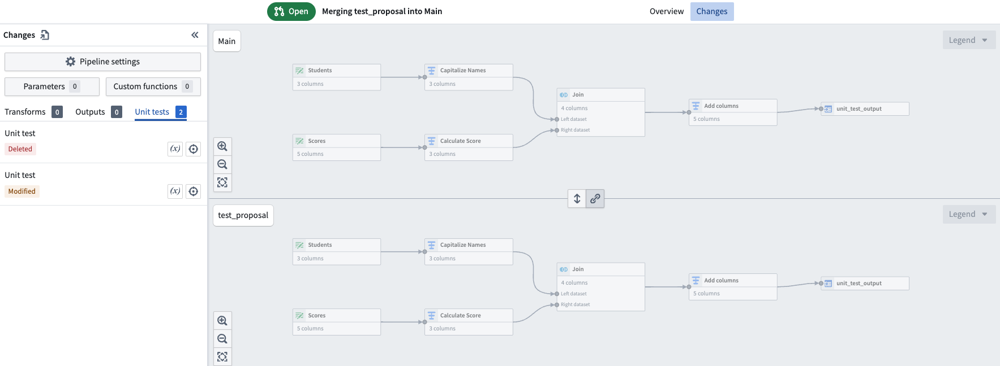

On the proposal page, you will see the **Unit tests succeeded** section. Pipeline Builder will check that unit tests pass before merging a proposal.

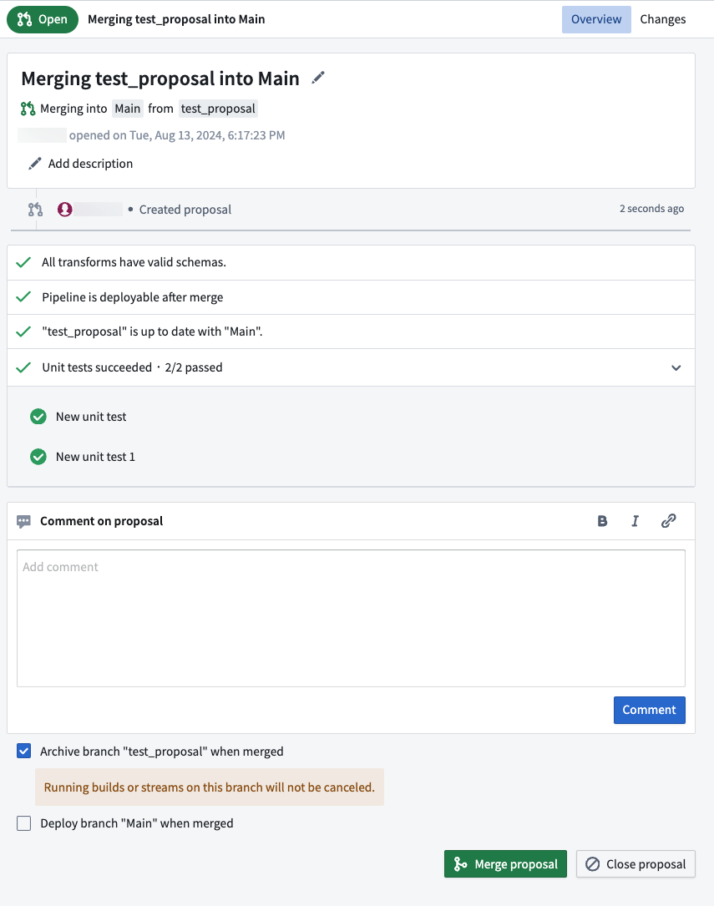

## Unit testing in streaming

For streaming unit tests, test input data requires an additional `ordering` long type value for each row.

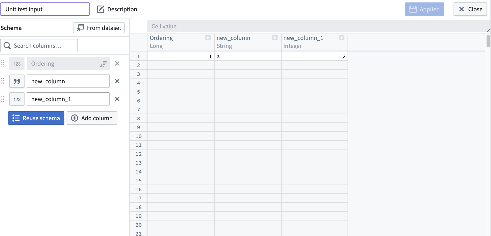

The ordering column is a required metadata column for streaming unit tests that controls the global order in which the rows will be emitted, but does not impact the actual contents or schema of the test data. The ordering value should be a unique long type value for each row in all test data sources in a test, and rows will be emitted from the sources in order from lowest ordering value to highest.

Ordering is important to achieve deterministic and desired outputs from streaming transforms, especially for joins and unions.
