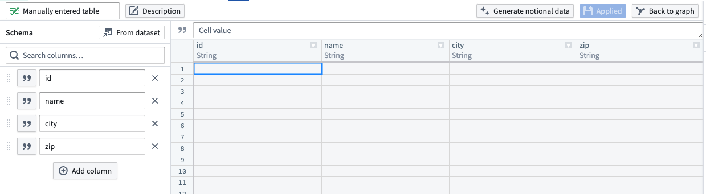
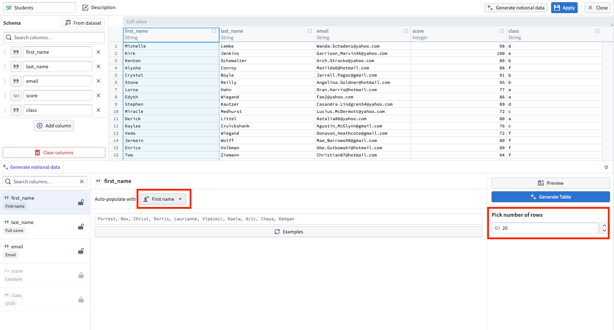
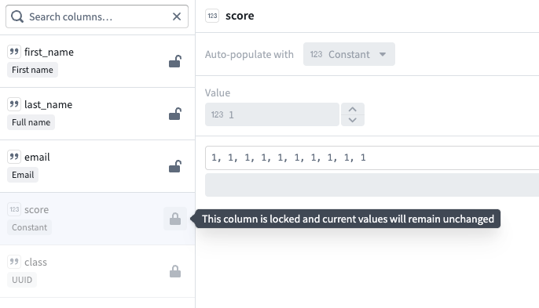
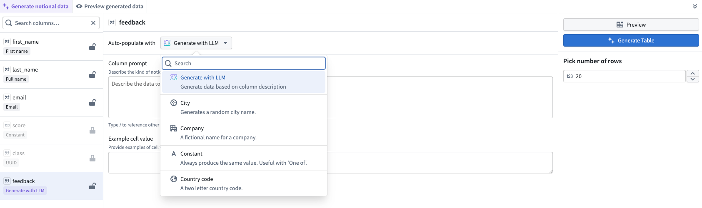
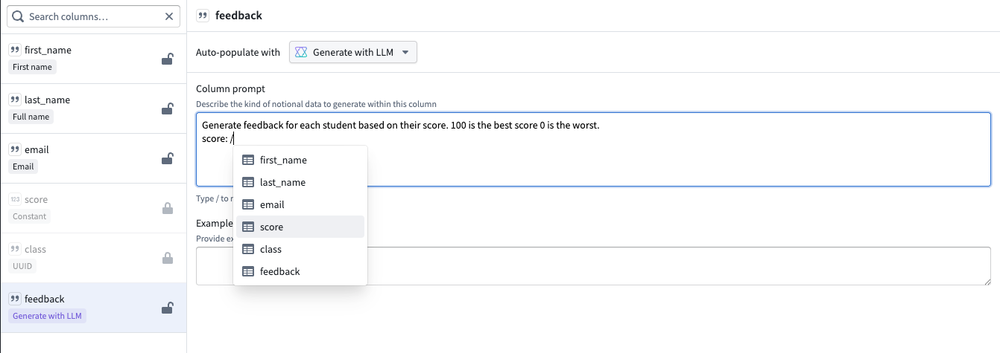

<!-- source: https://palantir.com/docs/foundry/pipeline-builder/datasets-generated/ · mirrored 2026-08-18 from Palantir Foundry docs -->

# Automatically generate input data

When creating a [manually-entered dataset](/docs/foundry/pipeline-builder/datasets-add/#manually-enter-data-in-pipeline-builder) in Pipeline Builder, you can generate notional data to populate your dataset.

:::callout{theme="warning"}
Manually-entered datasets and notional data generation are not available for faster (lightweight) pipelines on CBAC stacks. If you require this functionality, use standard (Spark) pipelines instead.
:::

To do this, inside your manually-entered dataset, select **Generate notional data**.

On the left side, select the column for which you want to generate data. Then, in the **Auto populate with** field, select the category of data that column should contain. To view examples of what the notional data would look like, select **Examples**.

To specify how many rows you want generated, you can enter a number between 1 to 1000 for the **Pick number of rows** field.

If you want to preview your manually entered table select **Preview**. This will open a new tab in the bottom panel called **Preview generated data**.

After you are finished with configuring your columns, select **Generate table** located on the right.

By default, **Generate table** will overwrite any previously-existing data in your manually-entered table.

If you want to keep the values of any columns, you can use the lock option located next to the specific column. When a column is locked, even when a table is re-generated, the values in that column will remain unchanged.

You can also use another dataset to generate a foreign key. This will link the dataset with a column from another dataset.

Other examples of data that can be auto-populated in Pipeline Builder include:

* **City:** Generates a random city name.
* **Company:**  A fictional name for a company.
* **Constant:** Always produce the same value.
* **Country code:** A two-letter country code.
* **Email:** A valid but notional email address.
* **First Name:** A string containing a notional first name.
* **Foreign key:** Links this dataset with a column from another dataset.
* **Full Name:** A first and second name combined into a single string.
* **Last Name:** A notional last name.
* **List:** Pick a weighted random value from a predefined list.
* **Null:** Always produces null.
* **One of:** Choose randomly from a weighted list of generators.
* **Street address:** A random street address.
* **Template:** Generate random string from a template using helper function.
* **US State:** A random state name from the USA.
* **US State code:** A random two letter abbreviated state name form the USA.
* **US ZIP code:** A ZIP code located in the provided state.
* **UUID:** A universally unique identifier.

## Generate data with LLMs

If none of the existing auto-population categories suit your needs, you can use a Large Language Model (LLM) to generate data based on your custom column description.

To select the LLM option, under **Auto-populate with**, choose **Generate with LLM**.

In the column prompt, enter a clear description of the data you want to generate. You can reference other columns by typing `/[name of column]`

Example cell values are highly encouraged to help the LLM understand the type and format of data you expect. You can provide examples of cell values for the LLM to reference in **Example cell value**.

Note that you can preview 10 rows at most for LLM-generated data.

:::callout{theme="warning"}
Generating a large number of rows or using a complex prompt may take up to one minute.
:::
