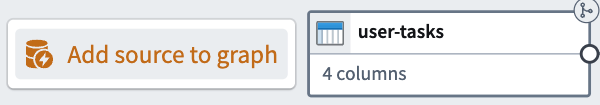
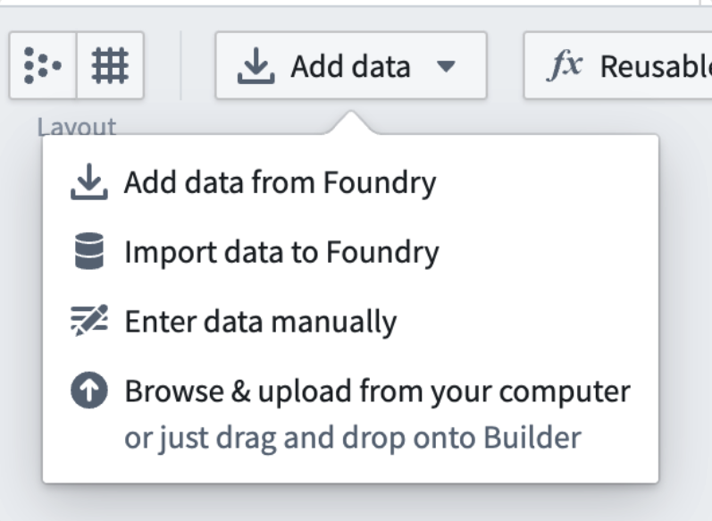
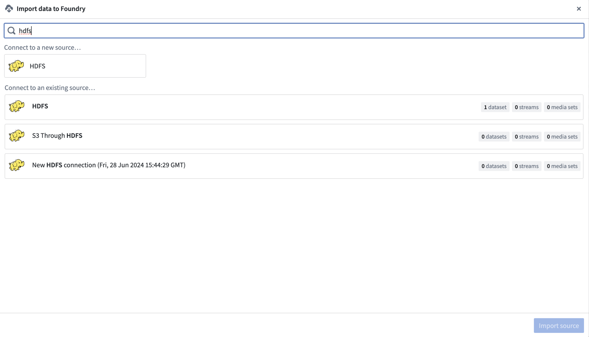
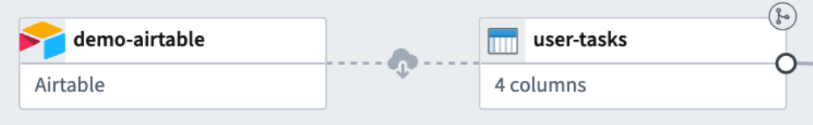
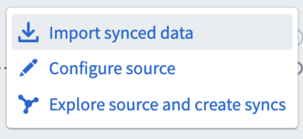
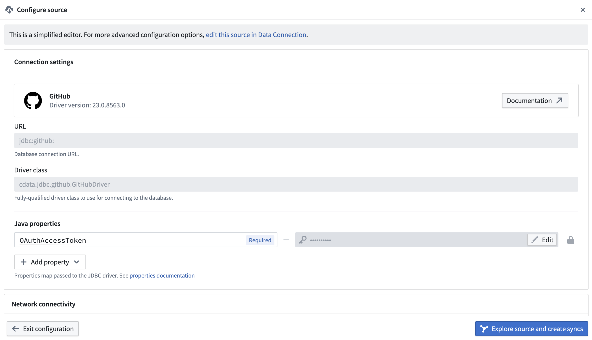
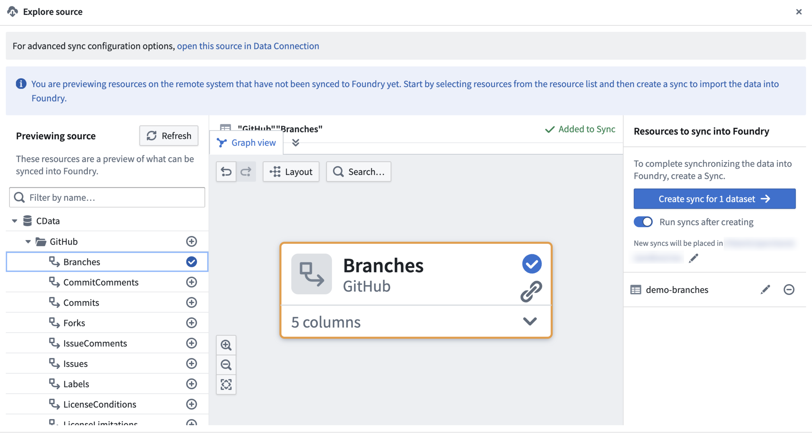

<!-- source: https://palantir.com/docs/foundry/pipeline-builder/datasets-sources/ · mirrored 2026-08-18 from Palantir Foundry docs -->

# Configure sources and data syncs within Pipeline Builder

You can create and import [Foundry-provided JDBC sources](/docs/foundry/data-integration/foundry-provided-drivers/) and sync datasets directly in Pipeline Builder.

## Import a source in Pipeline Builder

You can now import any Data Connection source to your Pipeline Builder pipeline, with the two methods listed below.

### Import sources from input datasets

If your input data was created directly from a [Data Connection sync](/docs/foundry/data-connection/set-up-sync/), then you can add the source to the Pipeline Builder graph by selecting the input data node and then using the **Add source to graph** option.

### Search over all sources and import or create a source

You can access the dialog to search over, import, and create sources through the **Add data** toolbar button, or through the **Import data to Foundry** action after creating a new pipeline.

Select **Import data to Foundry**. To create a new source, select the source type under **Connect to a new source...** Otherwise, to select an existing source, search for the name or type of the existing source and select the source under **Connect to an existing source...**

After the source is imported, you should see a new link on the graph between the imported source and any datasets synced from it.

Once a source is imported, you can either import already synced data from the source, configure the source, or explore the source and create syncs.

:::callout{theme="warning"}
Actions available will depend on the source type and your permissions for the source.
:::

For more information on sources and configuration options, [review the Data Connection source documentation.](/docs/foundry/data-connection/set-up-source/)

## Create or configure a source in Pipeline Builder

Once the [source is imported](datasets-sources.md#import-a-source-in-pipeline-builder) select **Configure Source**.

Note that Pipeline Builder solely supports [Foundry worker](/docs/foundry/data-connection/core-concepts/#foundry-worker) sources that only require the mandatory configuration fields. Optional fields are not supported. Connection sources that are more complex can be created or configured in [Data Connection](/docs/foundry/data-connection/overview/).

From the editor, you will be able to specify required source-specific configuration as well as [network egress policies](/docs/foundry/data-connection/set-up-direct-connection/#configure-a-network-policy). If any type of further configuration is needed, you can also [edit your source in Data Connection](/docs/foundry/data-connection/set-up-source/).

### Create a sync in Pipeline Builder

Select **Explore source and create syncs**. Note that this option will only show up for sources that produce batch dataset syncs.

If you do not see the **Explore source and create syncs** option, double check that you have the [correct permissions.](/docs/foundry/data-connection/permissions/)

In the source explorer dialog, you will be able to see the data available from source. Select the data you want to sync by using the + sign icon located inline with the name. Note that Pipeline Builder currently only supports batch dataset syncs.

:::callout{theme="warning"}
Creating and running a sync will only build the synced dataset once. Any deploys will not re-build the synced dataset. To build the synced dataset, configure schedules, or edit the sync, open the sync in Data Connection.
:::

To manage advanced sync options, or for a full list of options when creating syncs, [review the documentation for setting up a sync in Data Connection.](/docs/foundry/data-connection/set-up-sync/)
