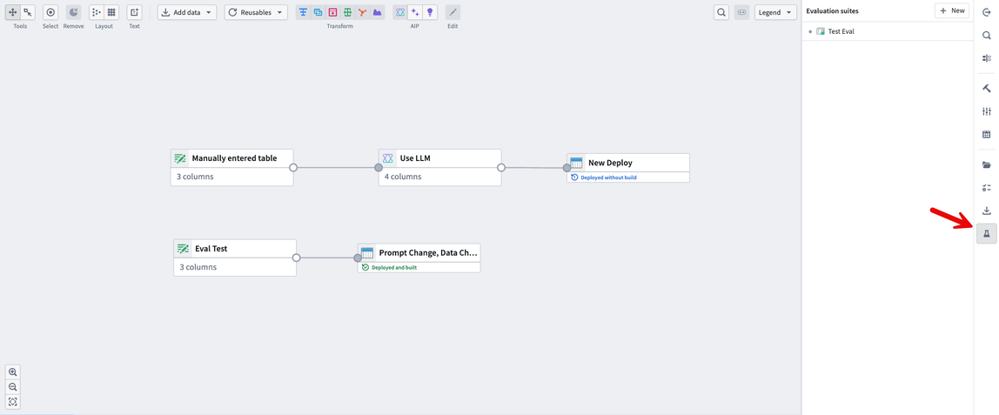
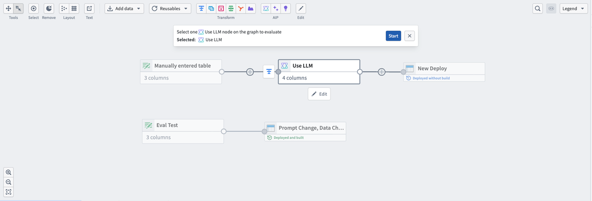
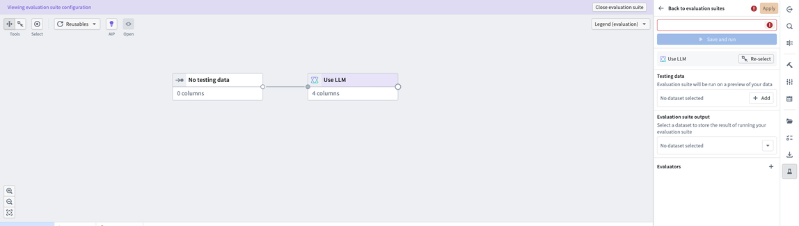
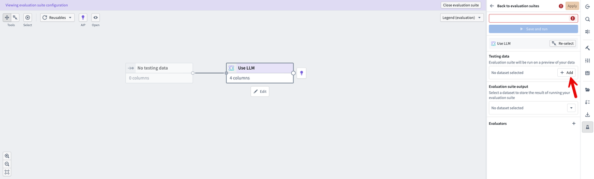
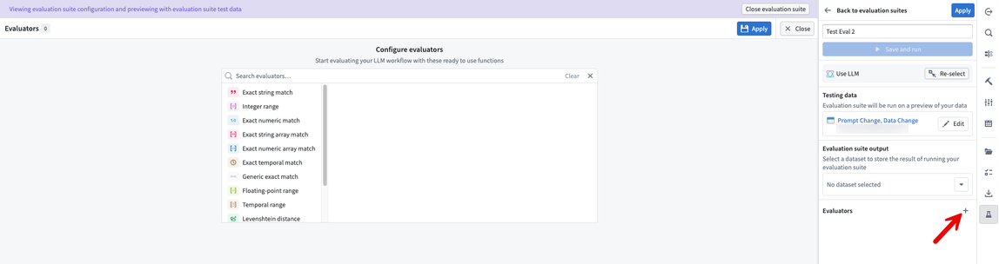
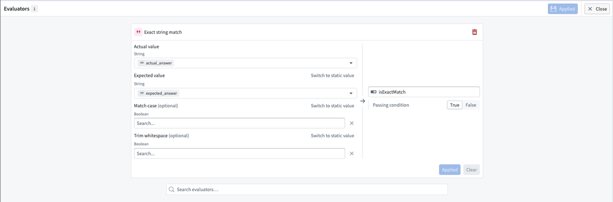
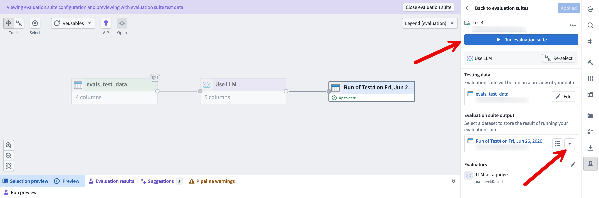
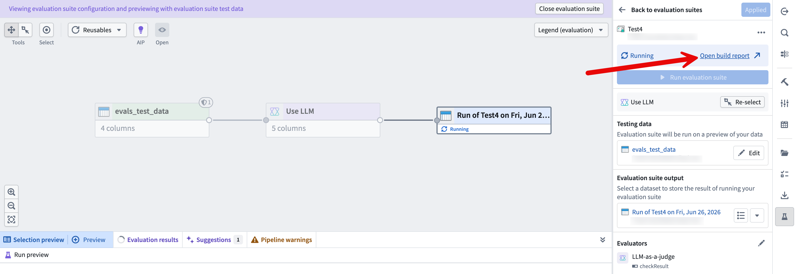
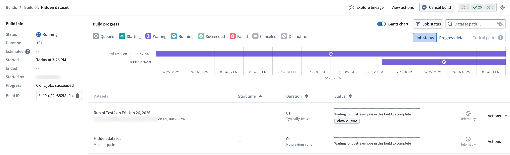
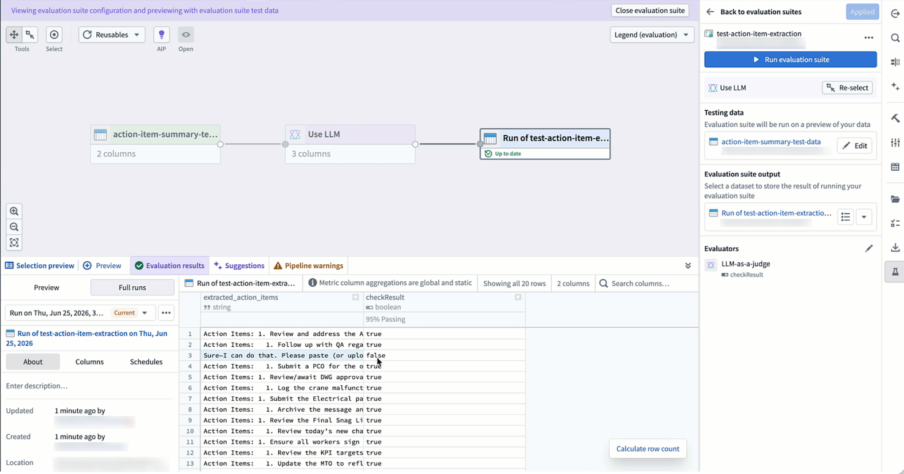

<!-- source: https://palantir.com/docs/foundry/pipeline-builder/evaluation-suite/ · mirrored 2026-08-18 from Palantir Foundry docs -->

# LLM evaluation suite in Pipeline Builder

:::callout{theme="neutral" title="Beta"}
Pipeline Builder LLM evaluation suite is in the [beta](/docs/foundry/platform-overview/development-life-cycle/) phase of development and may not be available on your enrollment. Functionality may change during active development.
:::

The large language model (LLM) evaluation suite in Pipeline Builder lets you test LLM transforms and logic before you deploy them in your pipeline. You can configure multiple evaluations in an evaluation suite and run them in an isolated test environment to observe their behavior.

The evaluation suite is designed to work with the [Use LLM node](/docs/foundry/pipeline-builder/pipeline-builder-llm/). Each evaluation runs a Use LLM node against testing data and one or more evaluators, then reports how the model output compares to your expected results.

This guide covers how to:

* Navigate to the evaluation suite
* Create a new evaluation
* Configure your evaluation
* Run your evaluation and check the results

## Navigate to the evaluation suite

Open the evaluation suite by selecting its icon at the bottom of the toolbar on the right side of your screen.

In the **Evaluation suites** panel, you can either select an existing evaluation or create a new one. To create a new evaluation, select **+ New** in the top right of the panel.

## Create a new evaluation

Select the Use LLM node you want to evaluate on the graph, then select **Start**.

After you start a new evaluation, Pipeline Builder opens the evaluation suite configuration view.

## Configure your evaluation

Configure your evaluation by adding testing data, naming the evaluation, adding evaluators, and selecting an output dataset.

### Add testing data

Select the testing data you want to use in this evaluation by selecting **+ Add** in the **Testing data** field in the right-side panel.

:::callout{theme="neutral"}
Your testing data should include all the columns you want to evaluate as inputs for your Use LLM node. It should also include a column that contains the expected LLM outputs.
:::

### Name the evaluation and add evaluators

Name your evaluation in the text box at the top right of the panel. Then, add your evaluators by selecting the **+** icon next to the **Evaluators** label. A menu of available evaluators appears, from which you can select one or more evaluators.

When you select an evaluator, Pipeline Builder opens a configuration page for that evaluator. The example below uses the **Exact string match** evaluator, which compares an **Actual value** column to an **Expected value** column and returns a Boolean result based on the **Passing condition**. You can also set the optional **Match case** and **Trim whitespace** parameters. After you apply your configuration, exit this view by selecting **Close** in the top right.

### Select the output dataset

Select the dataset where you want to store the output of your evaluation in the **Evaluation suite output** field. You can select an existing dataset or create a new one.

## Run your evaluation and check the results

:::callout{theme="warning"}
You must have edit permissions on the pipeline to run an evaluation suite.
:::

After you configure your evaluation, select **Run evaluation suite** in the top right of your screen.

To track the progress of your evaluation, select the **Open build report** link in the top right of your screen.

In the build report, you can track your build live as it progresses.

When your evaluation finishes building, view the results in the **Evaluation results** tab at the bottom of your screen. In this view, you can view a preview or the full set of results.

