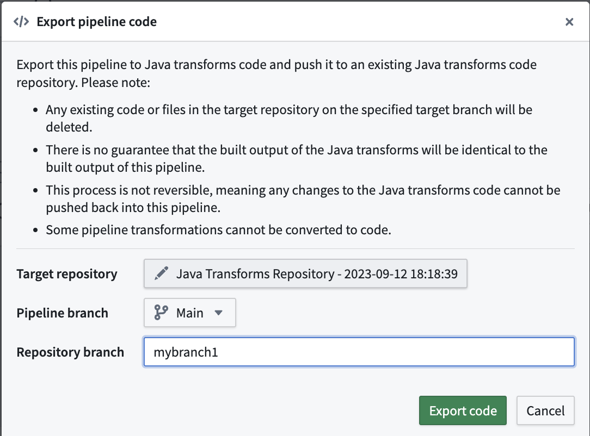
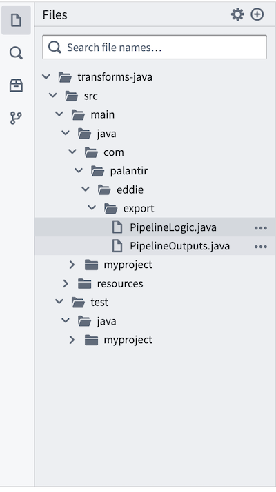

<!-- source: https://palantir.com/docs/foundry/pipeline-builder/export-pipeline/ · mirrored 2026-08-18 from Palantir Foundry docs -->

# Export pipeline code

:::callout{theme="warning"}
The export pipeline as code feature is only supported for default batch (Spark) pipelines. Faster pipelines and streaming pipelines do not support this feature, and the export option will not appear in the **Settings** menu for these pipeline types.
:::

When building in Pipeline Builder, you can export your pipeline code to an existing [Java transforms repository](/docs/foundry/transforms-java/getting-started/). This export feature is useful in situations where you need access to specific Java libraries.

During an export, your pipeline will be converted to Java transform code that will then be pushed to the target repository. Keep the following considerations in mind for this process:

* Any existing code or files on the specified branch of the target repository will be deleted.
* The new output of the Java transform code may not always be identical to the output of the Pipeline Builder pipeline. See [Exporting Pipeline Builder to Java transforms](#exporting-pipeline-builder-to-java-transforms) for more details.
* This process is irreversible, meaning any changes to the Java transforms code cannot be pushed back into the Pipeline Builder pipeline.
* Some pipeline transformations cannot be converted to code.

Open the pipeline you wish to export and navigate to **Settings > Export code**. A pop-up window will appear where you can search for and select the existing target Java transforms repository. Then, choose the Pipeline Builder branch the export comes from, and optionally create a new branch to use in the target repository.

The pipeline export will be available for use in `transforms-java/src/main/java/com/` in your repository as `PipelineLogic.java` and `PipelineOutputs.java` files.

## Exporting Pipeline Builder to Java transforms

When exporting Pipeline Builder pipelines to Java code, it is important to recognize that the new output may not always be identical to the original pipeline output. There are a few reasons for this:

* Code generation limitations: Many Pipeline Builder features are Foundry-specific and are not fully supported in exports. These include:

  * User-defined functions (UDFs)
  * LLM calls and model invocations, including embeddings
  * Media operations
  * Geotime functionality

  Unsupported features will appear as `todo` placeholder blocks in the generated code, requiring manual implementation.
* Differences from Native Spark: Some expressions in Pipeline Builder have been optimized and implemented differently from native Spark for greater reliability and better error handling. We cannot export these custom optimizations and must revert to native Spark expressions, which may behave differently in these edge cases.

All other supported expressions in code generation are validated against Spark test cases. Exporting to Java transforms should be treated as a starting point that users can manually validate against to ensure complete accuracy.

## Exporting to PySpark

Pipeline Builder supports exporting pipelines to Java (Spark) transforms only. There is no built-in capability to export Pipeline Builder pipelines to PySpark transforms.

If you need PySpark code, you can export your Pipeline Builder pipeline to Java Spark code using the process described above, then use a large language model (LLM) to convert the exported Java Spark code into PySpark. This conversion process may require manual validation to ensure accuracy, similar to the considerations outlined in [Exporting Pipeline Builder to Java transforms](#exporting-pipeline-builder-to-java-transforms).
