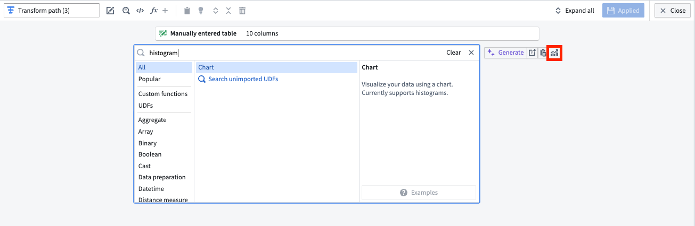
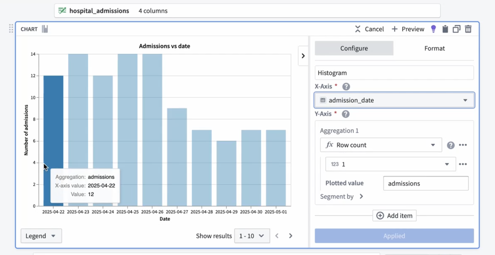
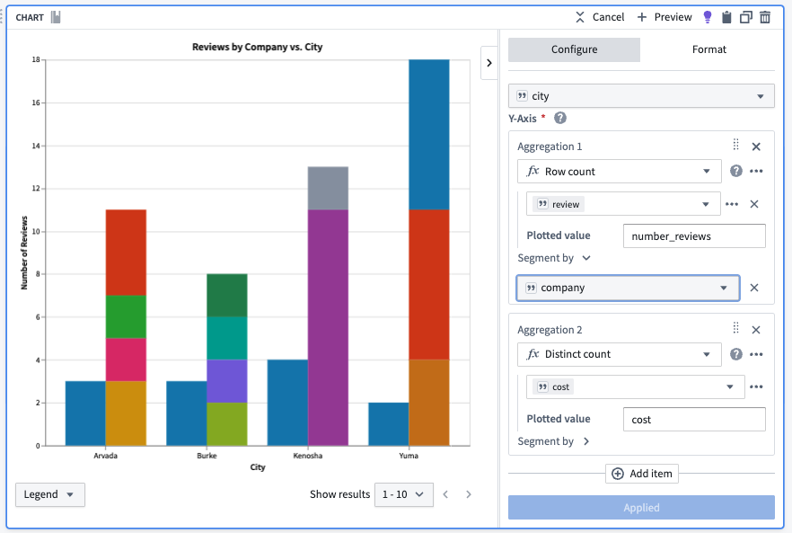
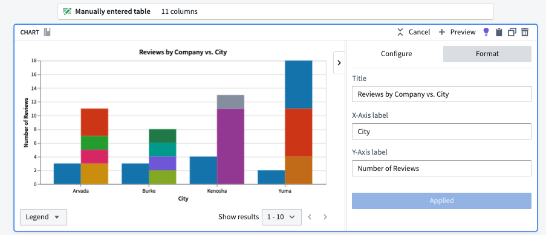

<!-- source: https://palantir.com/docs/foundry/pipeline-builder/management-charts/ · mirrored 2026-08-18 from Palantir Foundry docs -->

# Charts in Pipeline Builder

You can use charts in Pipeline Builder to seamlessly analyze and validate intermediate data without leaving your workspace. Charts can be added from any [transform node](/docs/foundry/pipeline-builder/transforms-transform-data/). Bar charts, including histograms are currently supported.

## Add a chart

1. To add a chart to your graph, navigate to any transform node and select the **Edit** option below the node. Charts can be added by searching for "chart" in the transforms search bar, or by selecting the **Visualize** option to the right of the search bar, highlighted in red below.   
      

2. In the **Configure** panel, choose the **X-Axis** and **Y-Axis** values. You can choose various aggregations for the **Y-Axis** values, including distinct count, max, min, median, mode, row count, sum, and more.       

   You can also add multiple aggregations to a single graph by selecting **Add item** at the bottom of the **Configure** panel.       

3. In the **Format** panel, you can change the chart's title and the **X-Axis** and **Y-Axis** labels.       

4. Select **Apply** when you are done.

You can collapse and expand the color legend using the **Legend** option in the lower left corner of the chart board. You can also page through results using arrows, or select a range of results from the **Show results** dropdown in the lower right side of the chart.

To view previously created charts, select a transform node and open the **Transformations** tab below the pipeline graph, or search for "chart" in the pipeline search to view nodes with associated charts.
