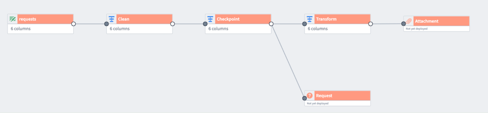
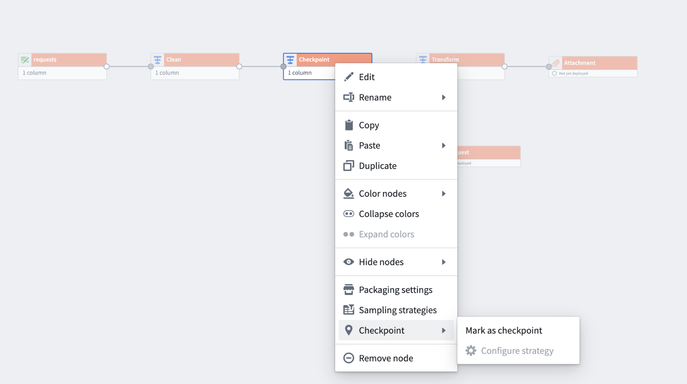
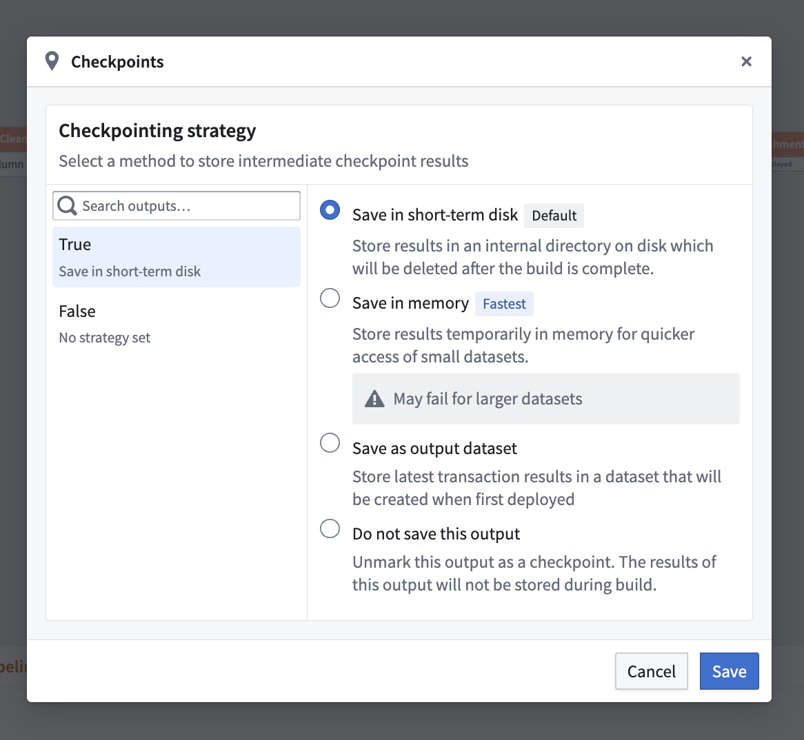
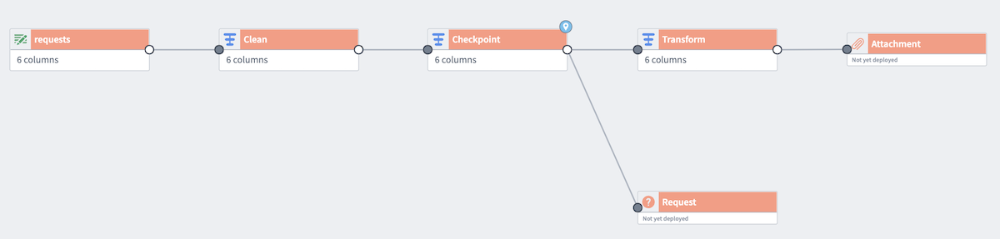
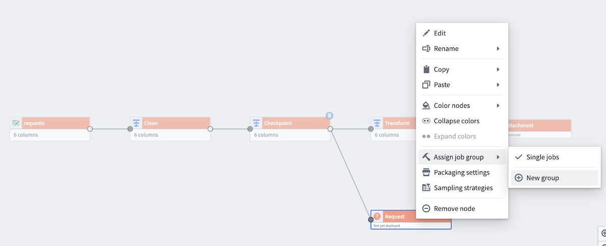
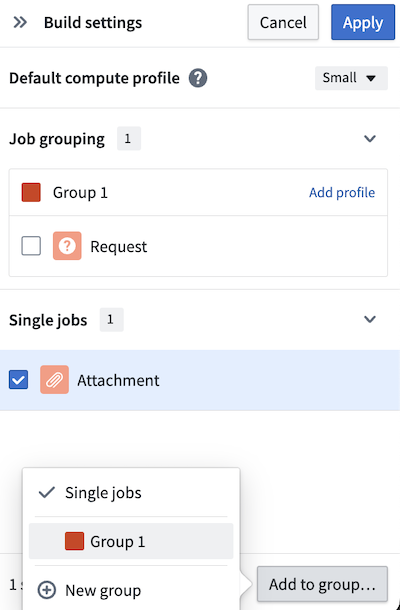

<!-- source: https://palantir.com/docs/foundry/pipeline-builder/management-checkpoints/ · mirrored 2026-08-18 from Palantir Foundry docs -->

# Checkpoints

When building pipelines, you will often use shared transform nodes between multiple outputs. This logic is typically recomputed once for each output. With checkpoints in Pipeline Builder, you can mark transform nodes as "checkpoints" to save intermediate results during your next build. Logic upstream of that checkpoint node will be computed only once for all of its shared outputs, saving compute resources and decreasing build times.

Note that checkpoints can sometimes result in decreased performance. For instance, the cost of writing the data to disk and then reading it again may be lower than recomputing the logic multiple times. Additionally, splitting up the query into multiple parts may reduce the number of optimizations that can be performed on the pipeline.

:::callout{theme="neutral"}
Outputs must be in the same job group for checkpoint nodes to improve pipeline efficiency. Learn more about [job groups in Pipeline Builder](/docs/foundry/pipeline-builder/management-job-groups/).
:::

## Add a checkpoint node

Below is an example pipeline that produces two outputs: `Attachment` and `Request`. The transform node `Checkpoint` is shared between the two outputs. In this current state, the logic nodes `Clean` and `Checkpoint` would be computed twice, once for each output.

However, we want to only compute `Clean` and `Checkpoint` once for both outputs. To do this, right-click on `Checkpoint` and select **Mark as checkpoint**.

### Checkpoint strategies

There are three types of checkpoint strategies available:

* **Save in short-term disk \[Default]:** Stores every output on disk temporarily. This is the default strategy for nodes marked as checkpoints.
* **Save in memory \[Fastest]:** Stores results temporarily in memory for faster access; this is especially useful for small datasets. Note that this option may fail for larger datasets due to memory limitations.
* **Save as output data:** Saves the latest transaction of the checkpoint in a dedicated dataset. The dataset is created upon the first deployment of the checkpoint.

:::callout{theme="warning"}
The **Save in memory** checkpoint strategy is not supported for faster pipelines.
:::

By default, nodes marked as a checkpoint will use the **Save in short-term disk** strategy for every output. To configure this, select **Checkpoint** and then choose **Configure strategy**.

When a transform has multiple outputs (for example, if the checkpointed node is a Split transform), there is an option to select a checkpoint strategy for each output.

For nodes with only one output, you must select a checkpoint strategy or unmark the node as a checkpoint.

A light blue badge will now appear in the top corner of the `Checkpoint` node.

Now, add both outputs to the same job group to verify the checkpoint behavior. Right-click one of the outputs (`Request`) to **Assign job group**. Choose **New group** to open the **Build settings** panel.

Since the datasets are in different job groupings by default, the checkpoint will be recomputed for each output, negating any benefits. To fix this, add the other output (`Attachment`) to the same job group by selecting the output, and then selecting **Add to group...** at the bottom of the panel.

Learn more about configuring nodes in Pipeline Builder with [color groups](/docs/foundry/pipeline-builder/management-color-groups/) and [job groups](/docs/foundry/pipeline-builder/management-job-groups/).

## Checkpoint storage costs

For the **Save in short-term disk** checkpoint strategy, checkpoints push the entire result of a transform to storage, such as to the Hadoop Distributed File System (HDFS). For example, if you checkpoint a join using this strategy, the entire result of the join will be output to storage. This can result in a large amount of data being stored, even if the dataset output is small.
