<!-- source: https://palantir.com/docs/foundry/pipeline-builder/management-color-groups/ · mirrored 2026-08-18 from Palantir Foundry docs -->

# Color groups

You can use node color groups in Pipeline Builder to better organize and manage your pipelines. Color groups can help identify nodes and improve the readability of your graph. Color groups can also be collapsed or hidden to simplify the graph view and clean up your pipeline visualizations.

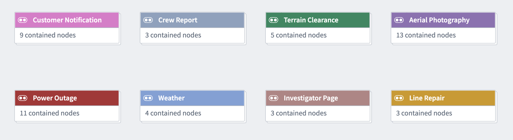

In Pipeline Builder, pipelines are typically grouped by color either vertically or horizontally. When divided into vertical sections, colors can clearly distinguish between the different stages of integration, from raw inputs to ontology outputs.

Divided horizontally, colors can be used to group the upstream lineage of a single object or a few closely related objects.

In the example below, color groups are divided both vertically and horizontally: Vertically to separate the iteration stages of raw inputs, and horizontally to group the object outputs of the pipeline.

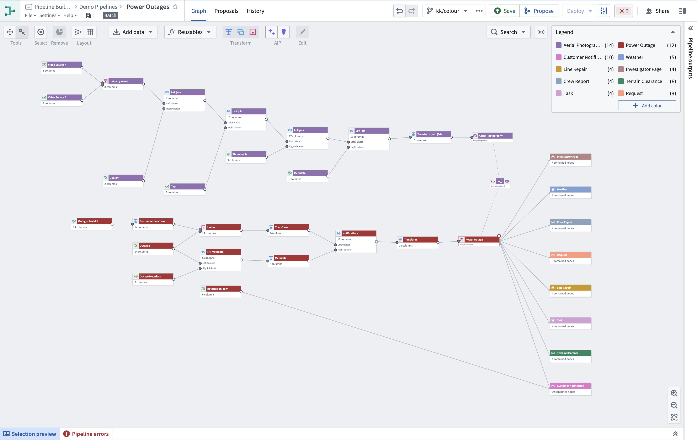

## Create and add to a color group

To create a new color group, select **Add color** in the legend in the upper-right corner of the graph. Then, set the name and color of the group.
To add nodes to the group, right-click on the node and select **Color nodes**. Then, choose the group you created to add the selected nodes.

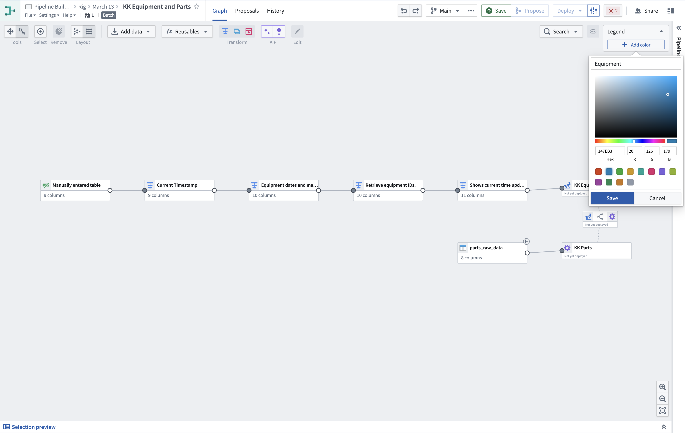

You can also create new color groups directly on the graph. Select the nodes you want to group, then right-click and select **Color nodes > New color**.

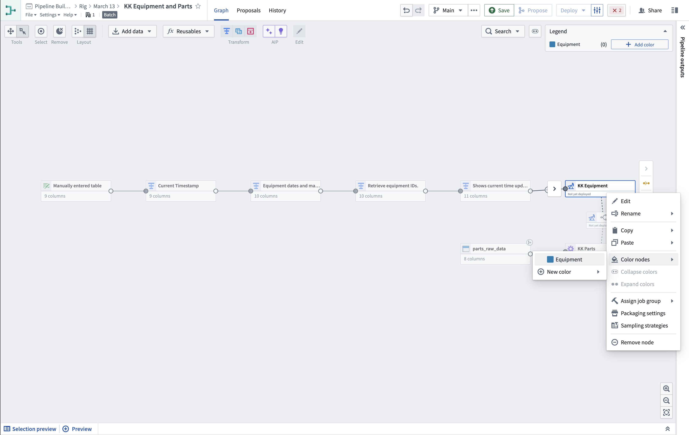

## Collapse and expand color groups

You can choose to collapse color groups to a single group node to simplify your graph view. This option can be particularly helpful if you are not actively working within nodes in a given color group.

To collapse a color group, right-click on any node in the color group and select **Collapse colors**. Alternatively, use the **Collapse colors** menu at the top right of the graph (next to the legend), and select the groups you want to collapse.

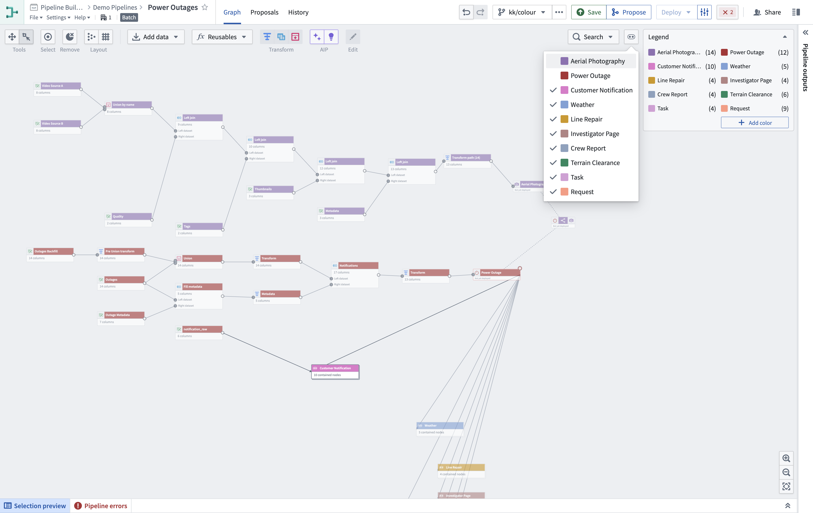

To expand the group, right-click the group node and select **Expand colors**, or double-click the collapsed group node.

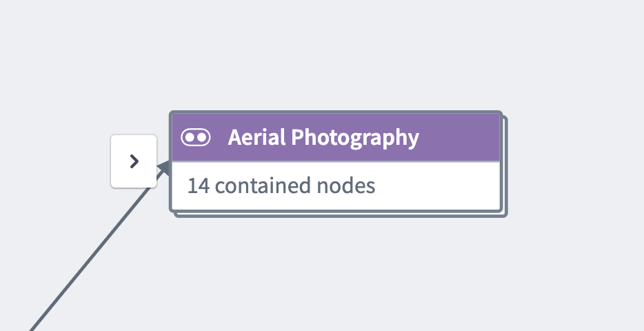

## Show and hide color groups

You can choose to hide a single color group or hide all other color groups to simplify the graph view. To hide a color, go to the color **Legend** and select the eye icon next to your chosen color. See [showing and hiding color groups](/docs/foundry/pipeline-builder/management-show-hide-nodes/#show-and-hide-color-groups) for more details.

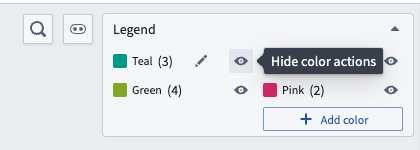

## Modify color groups

### Remove a node from a color group

To remove a node from a color group, right-click the node, select **Color nodes**, then choose the group name.

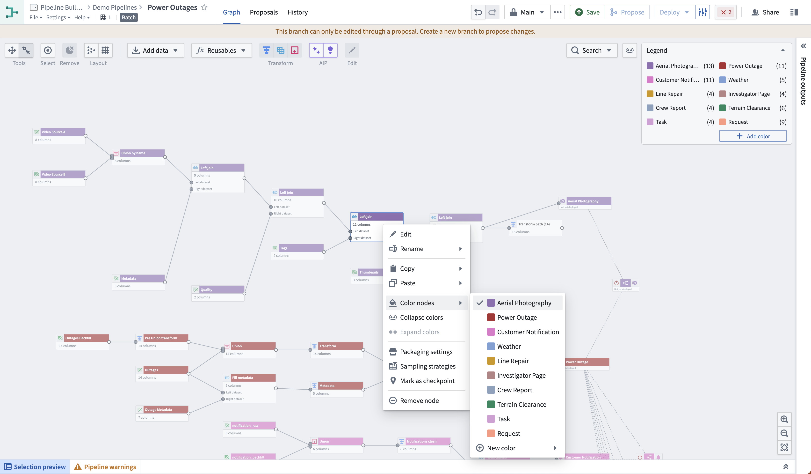

### Edit or delete node groups

To edit a color group, select the pencil icon when hovering on the group name in the legend. You can choose to rename, change the color, or delete the group.

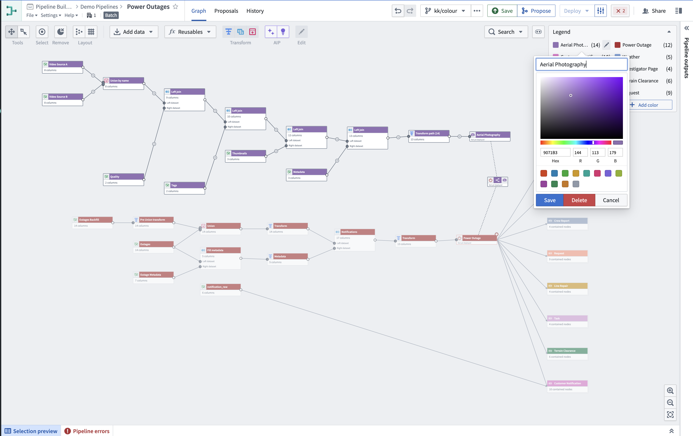

### Select nodes in a color group

To select all nodes inside a color group, select the group name in the legend.

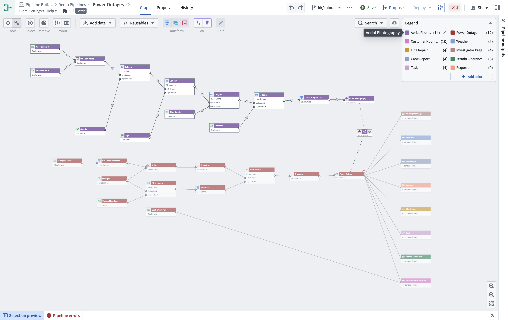

### Copy nodes with color groups

Color group assignments are preserved when you copy and paste nodes using keyboard shortcuts (`Ctrl+C` / `Ctrl+V` on Windows or `Cmd+C` / `Cmd+V` on macOS). This applies when pasting nodes within the same pipeline or when pasting nodes between different pipelines. Color groups are also preserved when duplicating nodes using `Ctrl+D` (Windows) or `Cmd+D` (macOS).

### View changes to node groups

When a [pipeline change proposal is submitted](/docs/foundry/pipeline-builder/branches-approve-a-change/), any color groups affected by the changes will be marked with a distinct color border.

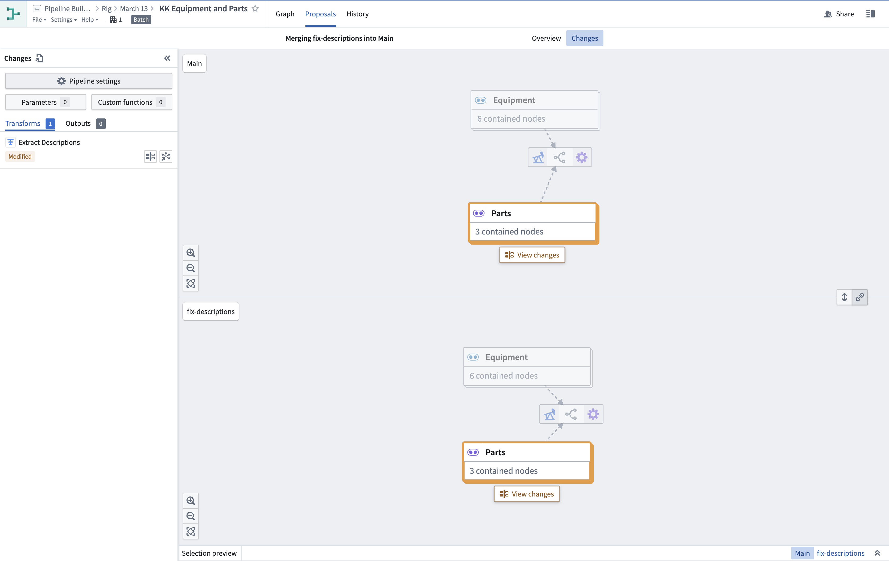

Select **View changes** to view the nodes inside the color group. Any individual nodes with proposed changes will be highlighted.

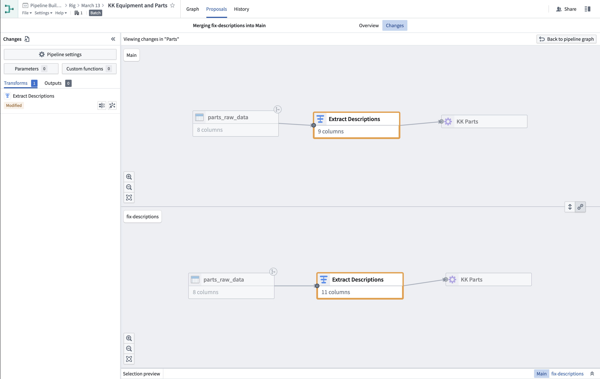

Select **Back to pipeline graph** to return to the main proposal changes view.
