<!-- source: https://palantir.com/docs/foundry/pipeline-builder/management-create-custom-functions/ · mirrored 2026-08-18 from Palantir Foundry docs -->

# Custom functions

Custom functions include both **custom expressions** and **custom transforms**. Both capabilities are useful for repeating logic across your pipeline while managing it in a single location. In the Pipeline Builder interface, these are accessed separately as **Custom Expressions** and **Custom Transform Path** under the **Reusables** dropdown.

**Custom transforms** enable you to save a series of transform boards as a single transform for reuse across your pipeline.

**Custom expressions** enable you to save a single expression with optional parameters for reuse across your pipeline. Custom expressions can be used inside of other transforms such as filters or case statements.

A custom function generally consists of a **name** (required), **description** (optional), **function arguments** (optional), and the **function definition** (required).

## Create a custom expression

To create a custom expression, select the **Reusables** dropdown at the top of the graph, then choose **Custom Expressions**.

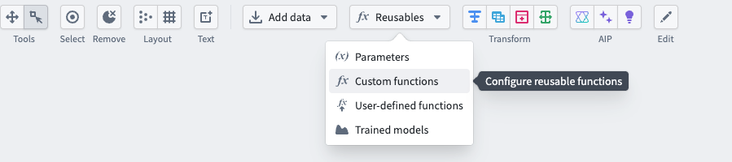

Select **Add custom expression**.

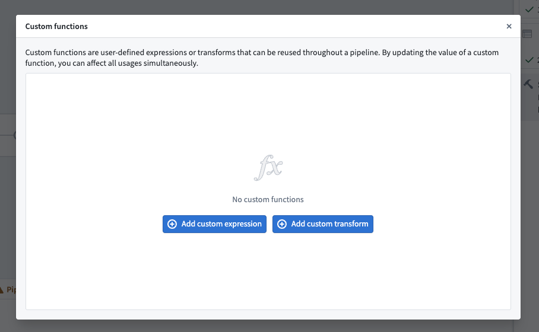

In the new window, configure your custom expression. Enter a name in the top left, add any arguments in the **Arguments** window using the **Add argument** option, and define your expression. Select **Apply** when finished.

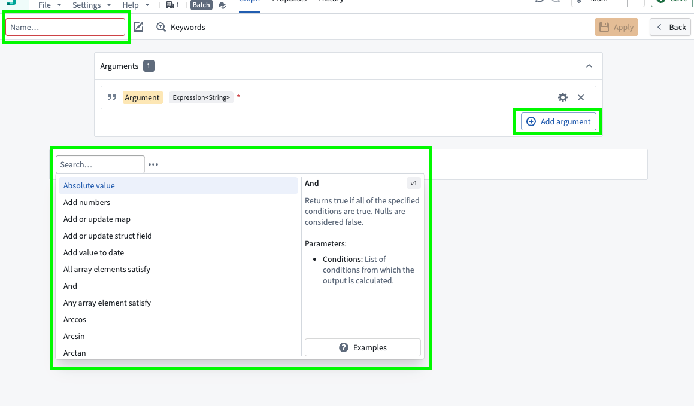

After creating a custom expression, you can search for it the same as any other expression in a transform node or in a transform.

## Create a custom transform

Two steps are required to create a custom transform:

1. Define your logic as a series of transform boards.
2. Convert the transform boards into a new custom function.

Below, we will review an example for each step.

### Define a series of transform boards

Suppose you have a table of `users`, and you want to create a primary key to uniquely identify each user. You know that each user’s `first_name`, `last_name`, and `first_login_date` is a unique combination. You would like to add a column `primary_key` of type `String` to the dataset, which is a hash of those three columns, then drop `first_name`, `last_name`, and `first_login_date`. Finally, you want to keep only one row per user if there are duplicates, retaining the row with the lowest `age` value.

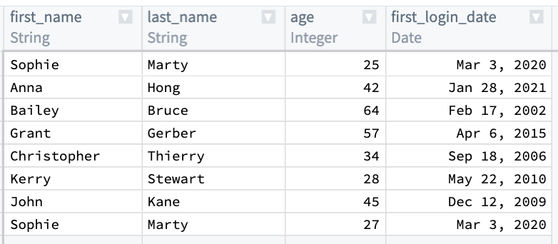

First, combine `first_name`, `last_name`, and `first_login_date` into one column. You can use the `Concatenate strings` transform to add those three columns together.

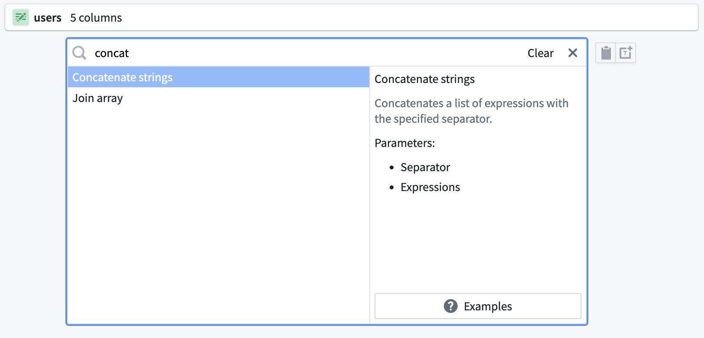

For the `Separator` field, enter a `-`. Then, choose each column in the **Expressions** dropdown. For the first two columns, choose `first_name` and `last_name`. However, `first_login_date` column is not an option for us to choose from for our third field. This is because it is a `Date` type, and the `Concatenate strings` function only accepts `String` types.

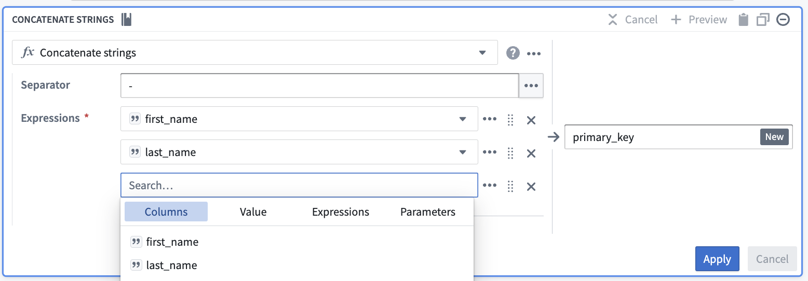

To resolve this, insert a `Cast` expression from the **Expressions** tab. The parameters will be `first_login_date` for the `Expression` and `String` for the `Type` to cast it to. This prevents you from needing to change `first_login_date` globally, which would affect all downstream transform boards.

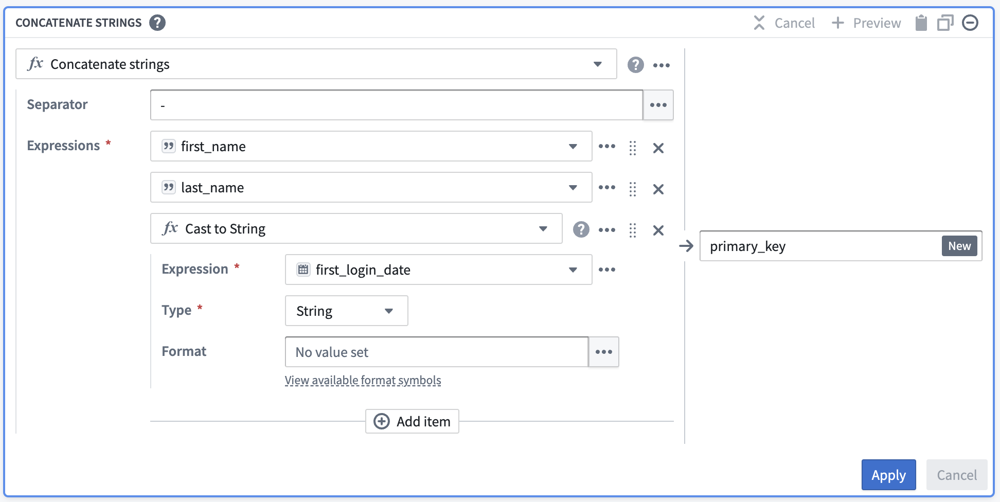

Once you select `Apply`, the output table should look like this:

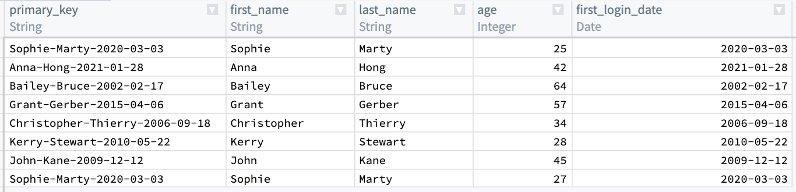

Now, you must de-identify the data within `primary_key`. One way to do this is to create a hash for each value in `primary_key` by applying the `Hash sha256` transform. You can do this in the same board by selecting the `Reuse value` option to replace `Concatenate strings` with `Hash sha256`.

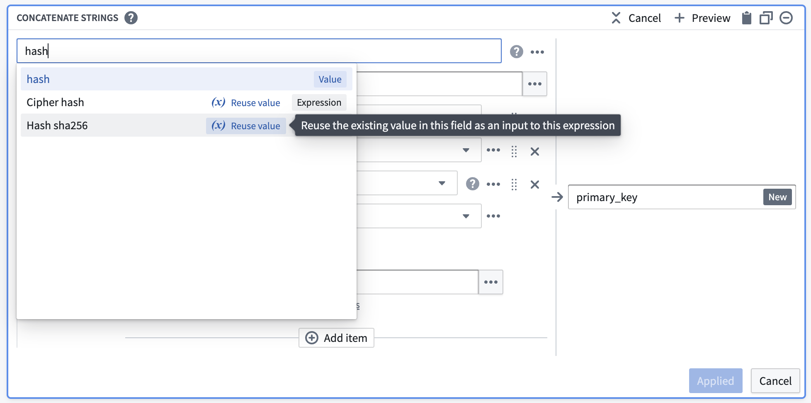

This option keeps the existing values and makes them the first input to the new transform.

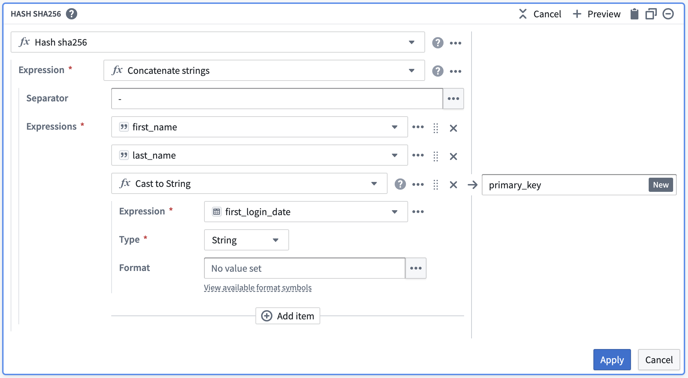

After selecting `Apply`, validate that your output matches what you would expect: a `primary_key: String` column that contains unique data about each row.

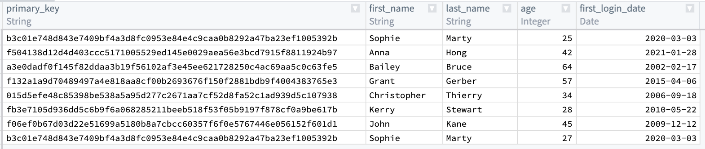

Now, you will notice that the first and last row in `primary_key` are the same. You want to keep the row with the lower `age` of 25, and drop `first_name`, `last_name`, and `first_login_date`. To do this, add an `Aggregate` transform. Input `primary_key` in the first field `Group by columns`, and `age` in the second field `Aggregations` with a `Min` expression:

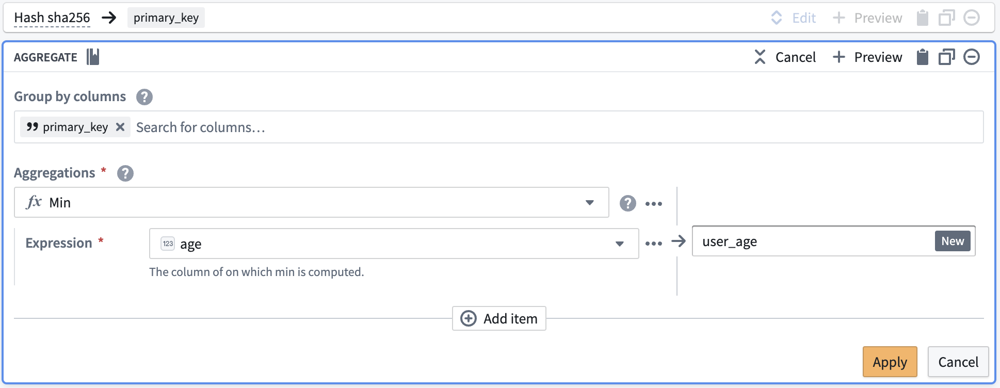

Finally, the output table should look like the image below. You can verify that there is only one row for `primary_key = b3c01...` and `age` is 25.

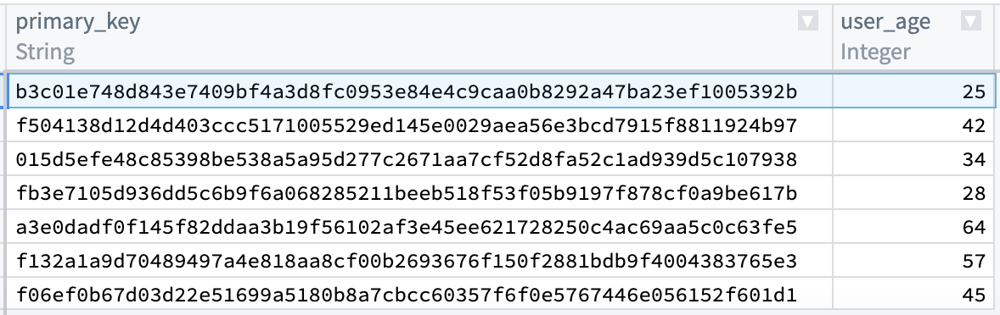

### Convert a series of transform boards into a custom function

Now, suppose that you want to reuse this logic in three different places within your pipeline. We can convert our logic into a custom function by using `Shift + Down Arrow` to select both boards, then selecting the **+** button in the top bar.

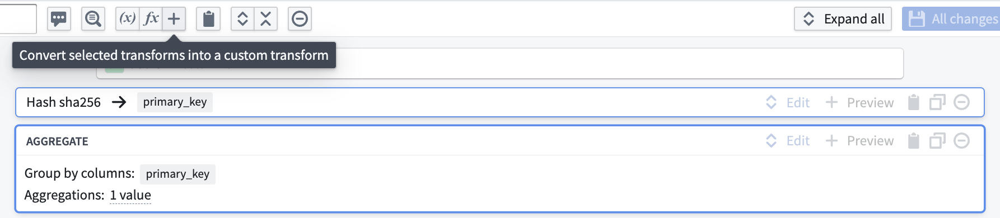

This will take you to the custom function creation page. You will notice that the column inputs `first_name`, `last_name`, `first_login_date`, and `age` are crossed out; this is because the function you are creating will be generic for any four inputs of the correct types within your pipeline regardless of column name.

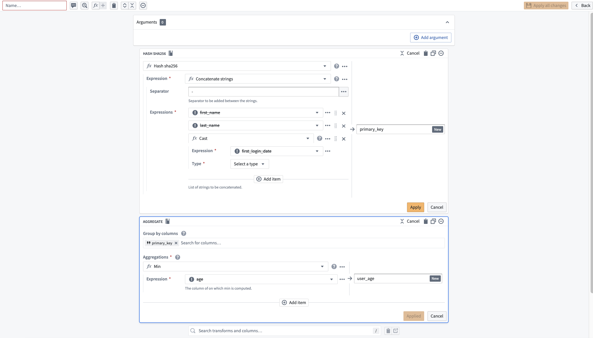

To define these inputs, select  **Add argument** four times. Configure the argument names by clicking into the yellow box.

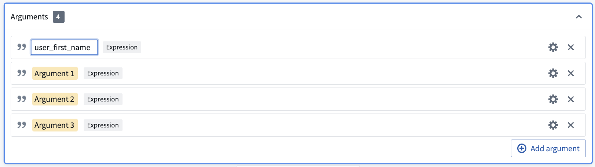

Then, configure the argument types by clicking into the gear icon to the right of each argument. Here, you want the first two arguments to be type `Expression<String>` to represent columns of `String` type, the third argument to be type `Expression<Date>`, and the last column to be type `Expression<Integer>`.

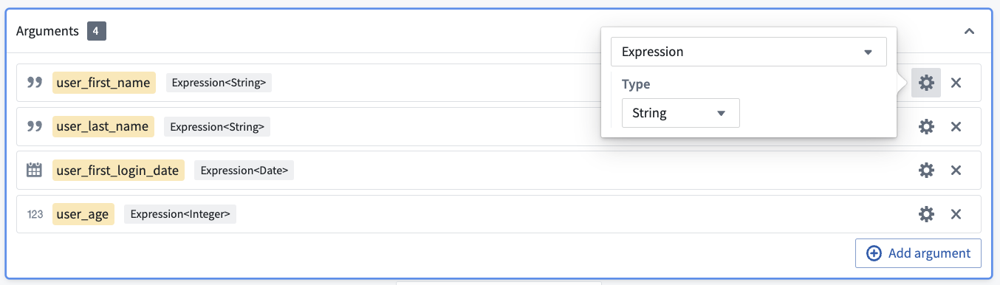

Now, you can add your new arguments to the two boards as before. However, they will now be available in the `Parameters` section instead of the `Columns` section.

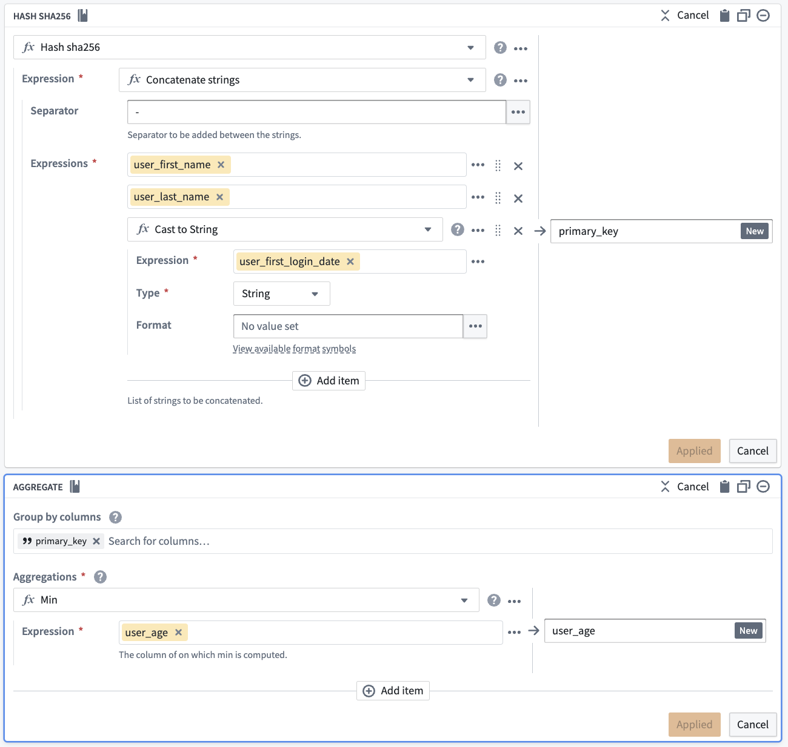

Once you have finished your configuration, name the function `Primary key generator`, give it an optional description, and select **Apply all changes**.

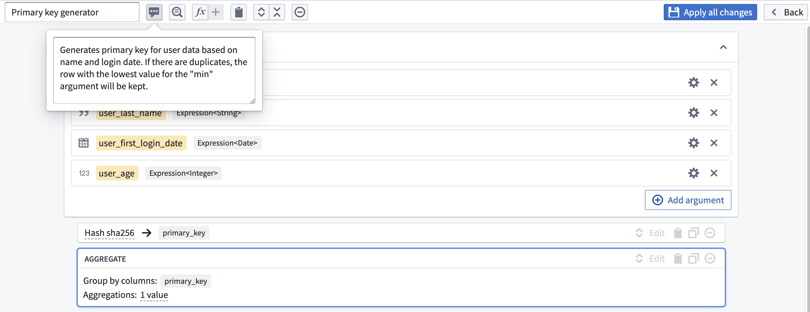

The new function is now available for use in any transform path. The next time you need to create a primary key with this pattern, you can search `Primary key generator` in the transform dropdown.

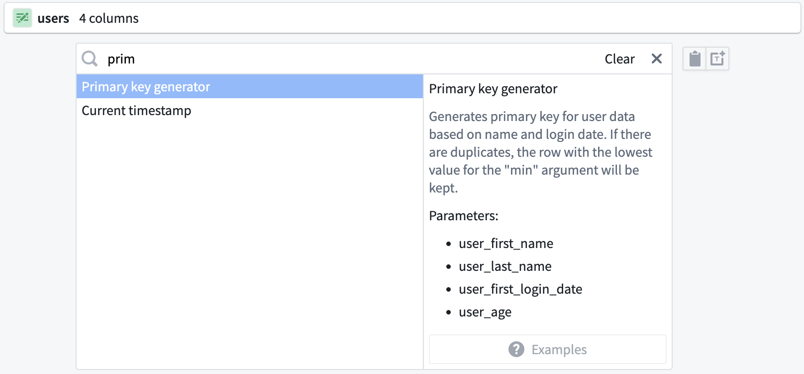

You can populate your custom function with the original columns: `first_name`, `last_name`, `first_login_date`, and `age`.

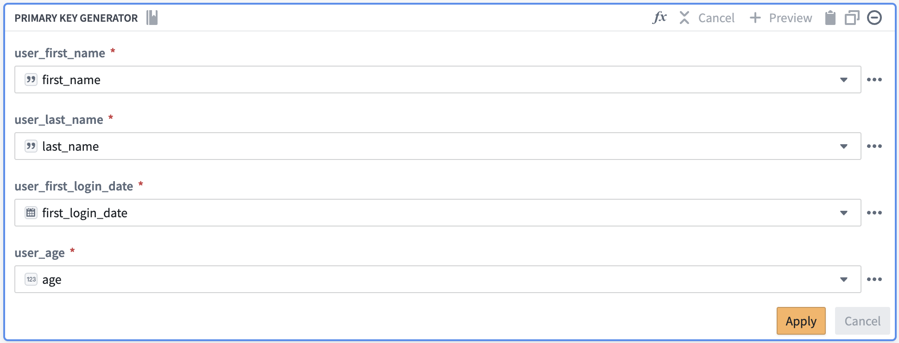

By populating the relevant column names into your custom function, you are producing the same result as if you had created the function with the same transforms in the path. However, by creating the custom function, you can save the function logic to reuse across your pipeline rather than recreating logic with separate transform boards.

