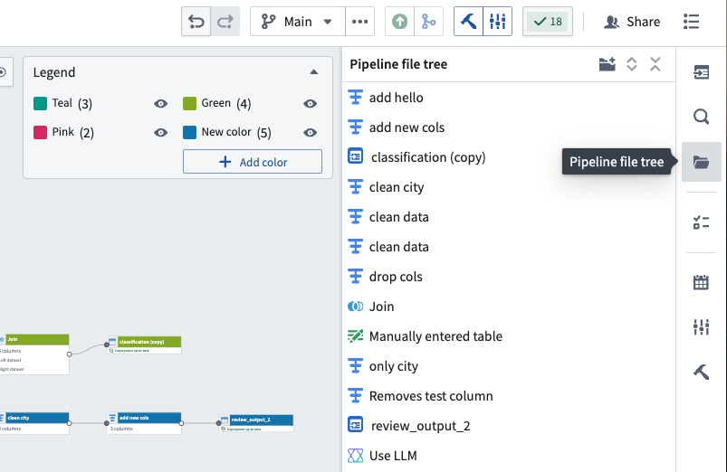
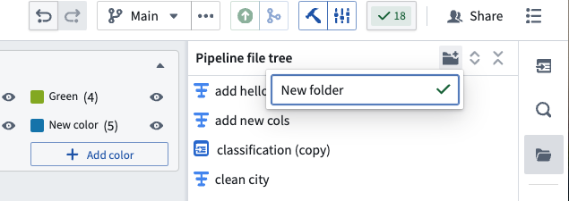
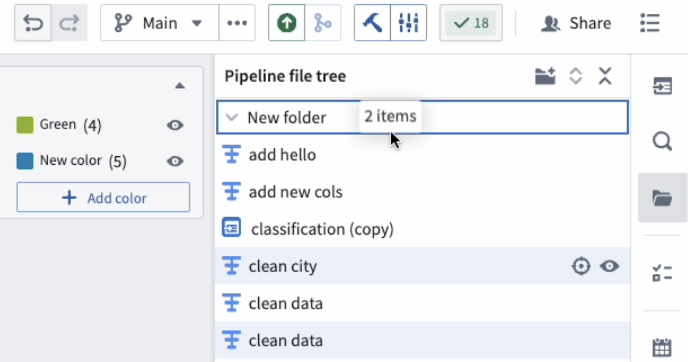
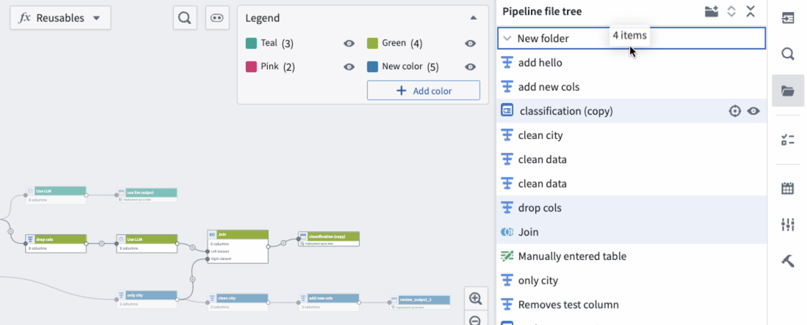
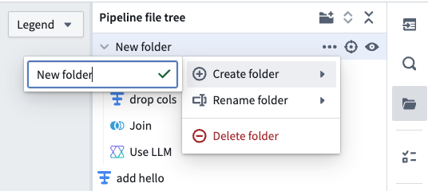
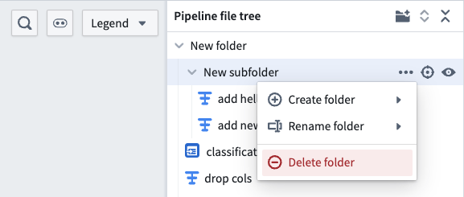
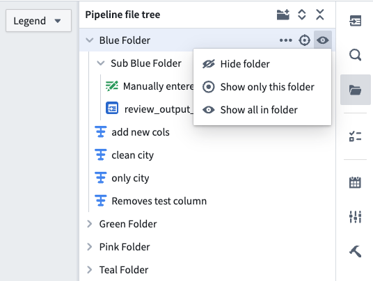
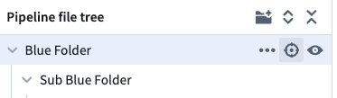

<!-- source: https://palantir.com/docs/foundry/pipeline-builder/management-file-tree/ · mirrored 2026-08-18 from Palantir Foundry docs -->

# Folders in Pipeline Builder

To help manage large pipelines efficiently, organize nodes into different folders and sub-folders in Pipeline Builder. Show only the nodes in a folder or set of folders to focus on pipeline subsections for an improved navigation and editing experience.

## Folder setup

1. To set up folders, select the **Pipeline file tree** folder icon on the left side of your pipeline workspace.

2. At the top of the sidebar, select the folder icon with the plus sign to add a new folder. You can rename the folder in the provided text box.

3. To move nodes into folders, highlight them directly from the pipeline file tree sidebar or select them on the graph, which will automatically highlight the nodes in the sidebar. Select and drag the highlighted nodes into the desired folder.

4. Optionally, you can create sub folders by dragging an existing folder into another folder, or by selecting the three dots next to the parent folder and hovering over **Create folder**. You can then rename your new sub-folder in the provided text box.

## Delete folders

1. Select the three dots on the right side of the specified folder.
2. Select **Delete folder**.

:::callout{theme="danger"}
Deleting folders will also delete the nodes inside those folders.
:::

## Show and hide folders

Once the folders are set up, you can easily show and hide node sections by selecting the eye icons on the specified folder.

To center the nodes in a folder on your graph, select the target icon.

