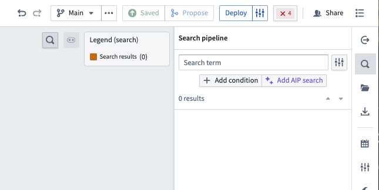
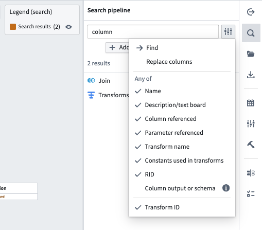
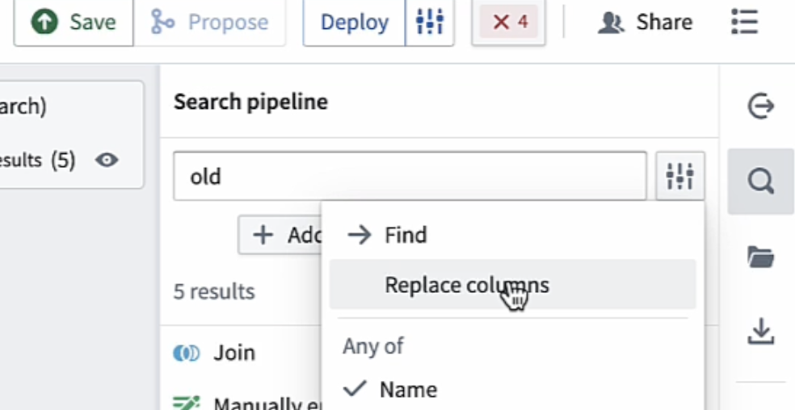
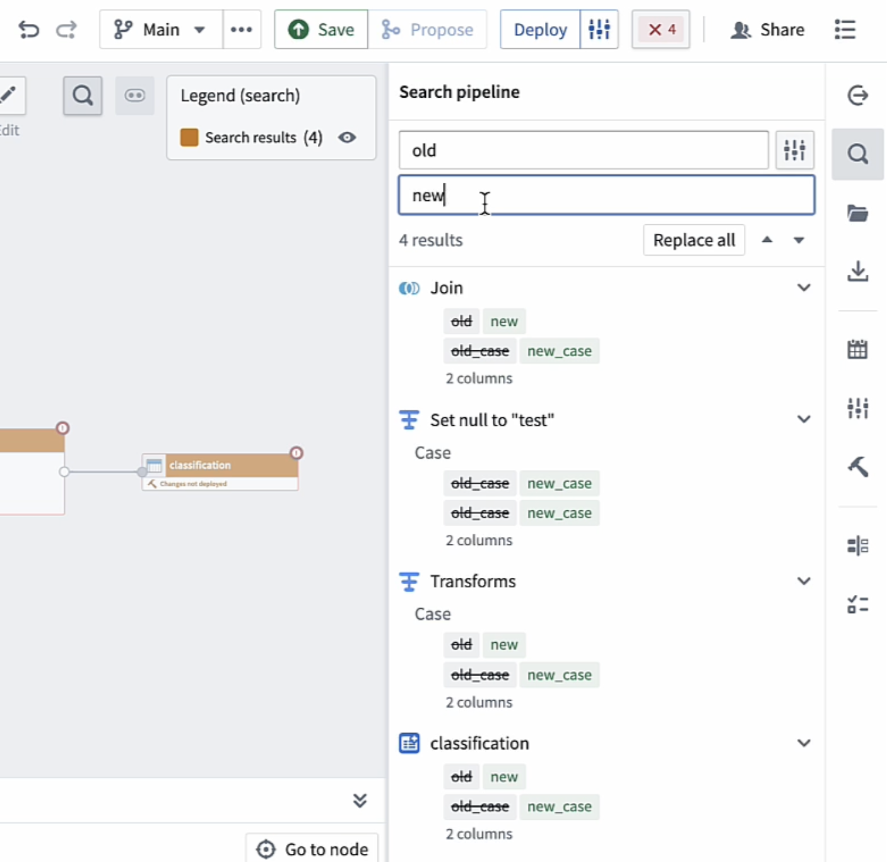
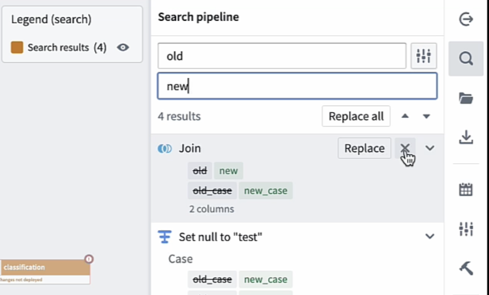

<!-- source: https://palantir.com/docs/foundry/pipeline-builder/management-find-and-replace/ · mirrored 2026-08-18 from Palantir Foundry docs -->

# Find and replace in Pipeline Builder

Pipeline Builder provides several search-related features to help with managing and debugging your pipelines. You can access these features via the **Search pipeline** panel (magnifying glass icon on the right side of the interface) or by pressing `Cmd+F` (macOS) or `Ctrl+F` (Windows) to open the panel and immediately place your cursor in the search bar.

The search panel allows you to search your pipelines along several parameters, such as:

* Names of nodes
* Description/text board
* Column referenced
* Parameter referenced
* Transform names
* Constants used
* RIDs
* Column outputs and schemas
* Transform IDs

To narrow down your search, you can unselect any of the options above.

## Replace columns

Pipeline Builder's **Replace columns** feature allows you to replace one instance or bulk replace all instances of a column name with another.

Without the ability to bulk replace column names, if you change a column input name, you would need to go into your pipeline and manually change each original column name to the new column name.

To access the **Replace columns** menu, open the dropdown to the right of the search input area.

Enter the replacement string in the lower text box. In the area below the replacement string, you will see a preview of all the instances in your pipeline where the original string will be replaced with the replacement string.

You can choose to replace all instances of the original string by selecting **Replace all**. You can also replace strings individually by hovering over the specific row and selecting **Replace**. If you want to replace all strings *except* for a selection of rows, you can select the **x** next the instances you want to exclude from the **Replace all** operation.

