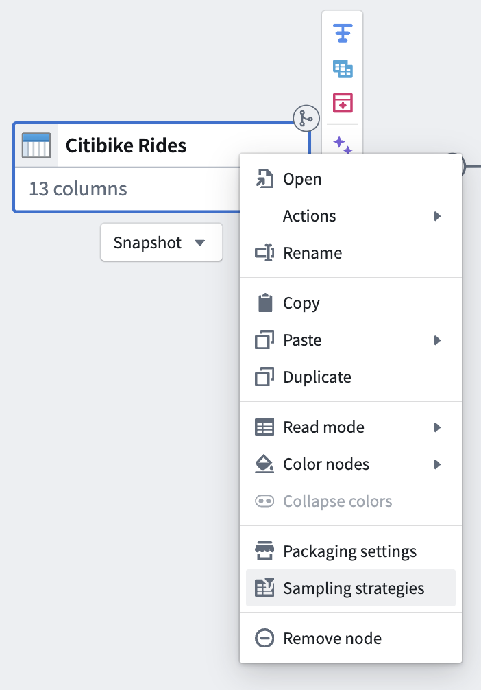
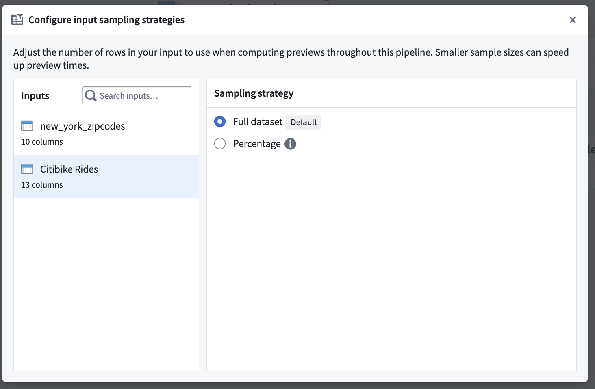
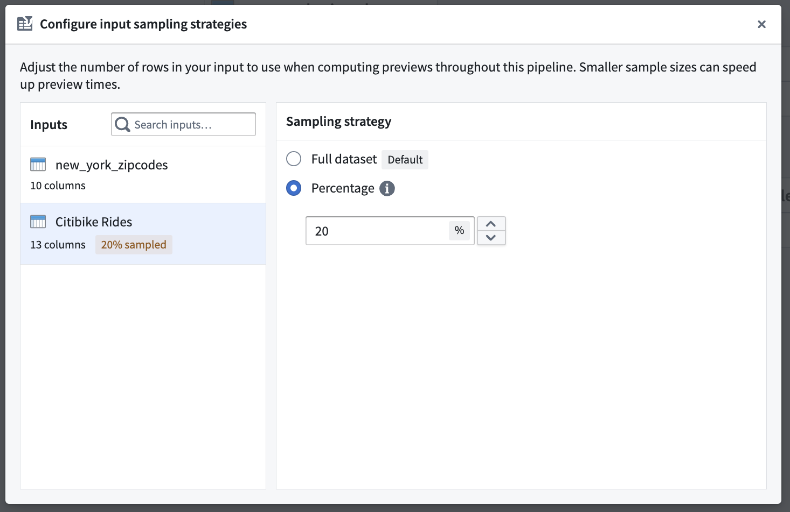
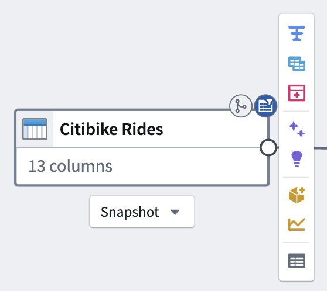
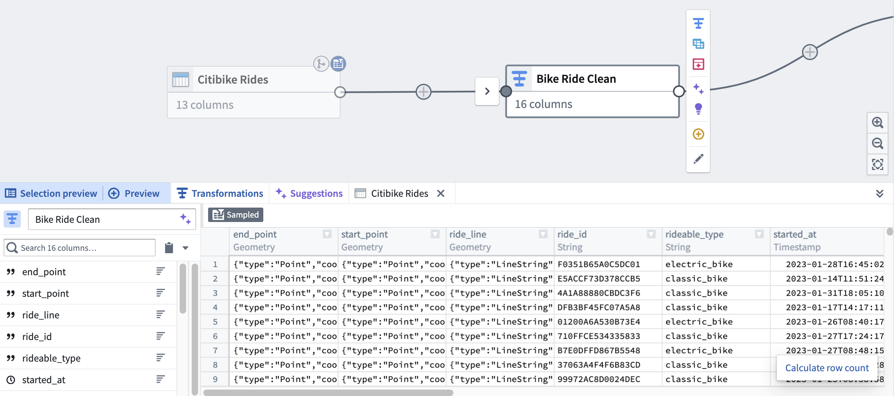

<!-- source: https://palantir.com/docs/foundry/pipeline-builder/management-input-sampling/ · mirrored 2026-08-18 from Palantir Foundry docs -->

# Add an input sampling strategy

If your input datasets are large, you can speed up preview times by adding a sampling strategy to those inputs.

1. Right-click the input node that you would like to sample, then select **Sampling strategies** in the dropdown menu.

2. From the sampling strategies dialog, select the desired input dataset.

3. Choose the **Percentage** strategy, and enter a number between 1 and 100 to downsample your input.

4. Close the dialog. A blue badge should now appear on the top right of your input node, indicating that a sampling strategy has been applied.

The preview panel of any nodes downstream of the input will also indicate that sampling was applied.

## Filter sampling strategy for file datasets

For file datasets, use a **Filtered preview** sampling strategy to select files based on metadata columns.

To configure a filter sampling strategy:

1. Open the sampling strategies dialog and select a file dataset input. Inputs of different types appear in separate sections of the dialog.
2. Choose **Filtered preview** from the sampling strategy options.
3. Configure your filter conditions based on the available file metadata columns.

:::callout{theme="neutral"}
If you select an invalid filter sampling strategy for a given input, you will receive error messaging with remediation options.
:::

## Apply a sampling strategy to multiple inputs

In the sampling strategies dialog, select **Apply to all inputs** to set the same strategy for all compatible inputs.

:::callout{theme="warning"}
Some inputs may not support certain sampling strategies. When you use **Apply to all inputs**, warnings are displayed for any inputs that do not support the selected strategy.
:::
