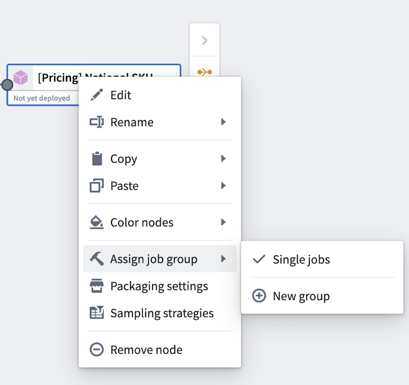
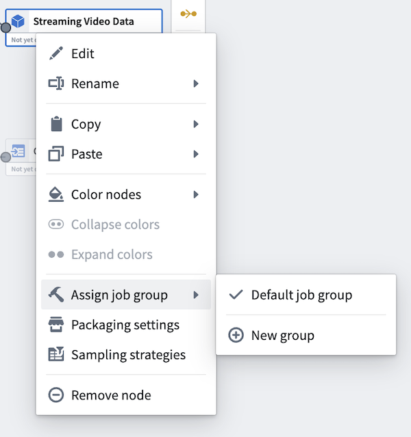
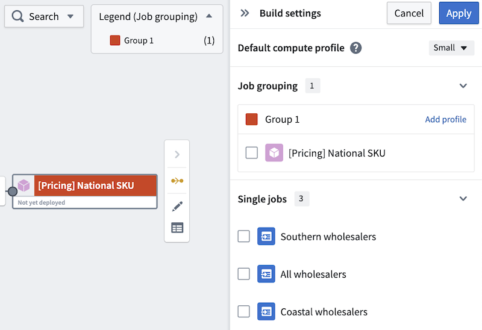
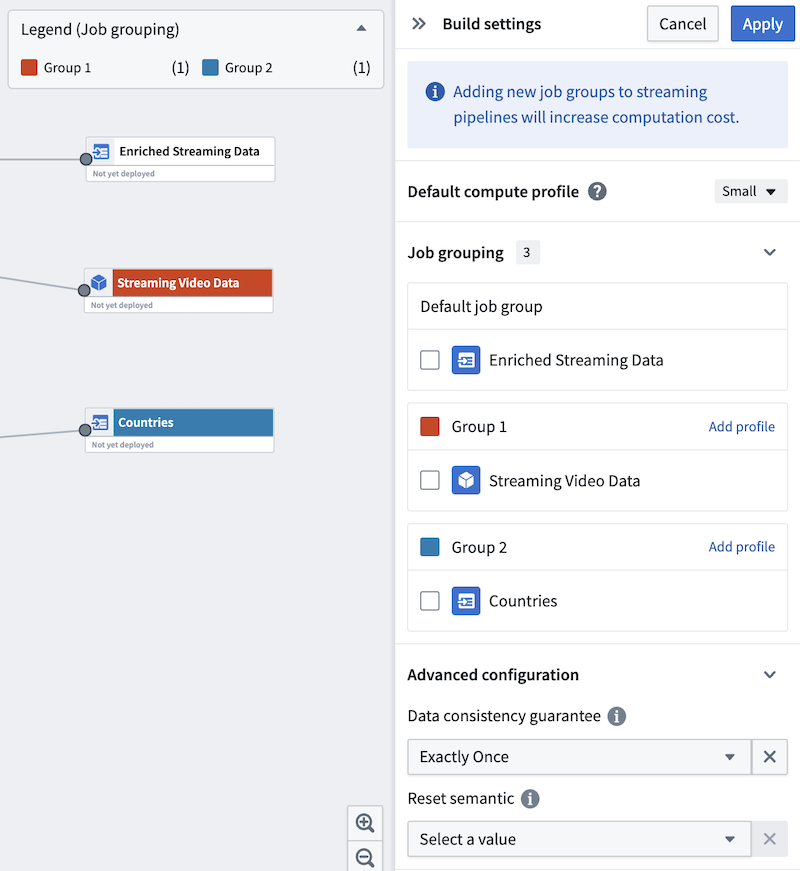
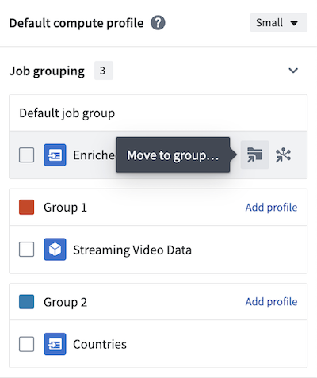
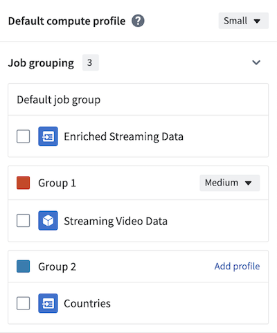
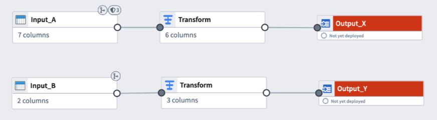

<!-- source: https://palantir.com/docs/foundry/pipeline-builder/management-job-groups/ · mirrored 2026-08-18 from Palantir Foundry docs -->

# Job groups

In Pipeline Builder, each successful deployment initiates a single build. By default, each batch pipeline output is built as its own job, and those jobs will succeed or fail independently. In streaming pipelines, all outputs are bundled into a single job running on a single Flink cluster, so all output streams will either succeed or fail together.

Job grouping in Pipeline Builder allows you to bundle outputs into one job in a batch pipeline, or split each output into its own job in a streaming pipeline. You can also specify compute profiles for each job grouping, providing granular control over how your outputs are built. The compute resources are shared across all outputs in the job group.

Grouping outputs into a single job is useful when you want output logic to update in parallel. In batch pipelines, outputs must be placed into the same job group to efficiently compute shared logic through checkpoints. Learn more about [checkpoints](/docs/foundry/pipeline-builder/management-checkpoints/) in Pipeline Builder.

Dividing outputs into smaller groups or single-output jobs is helpful when you want the output to run independently of other outputs. Remember that each job group in a streaming pipeline will require its own Flink cluster, which will increase computation costs.

:::callout{theme="warning"}
Moving outputs between job groups in streaming or incremental pipelines is considered a breaking change and will trigger mandatory replays. Learn more about [breaking changes](/docs/foundry/pipeline-builder/breaking-changes/) in Pipeline Builder.
:::

## Assign job groups

To assign job groups, right-click on any output node in your Pipeline Builder graph to open the context menu. Then, hover over **Assign job group**. In batch pipelines, outputs will default to single jobs. In streaming pipelines, outputs will default to a single job group.

**Batch view** | **Streaming view**
\--------       |------------------
 | 

Select **New group** to assign the output to a new job group, or select **Use default** to reset the output to the default job grouping behavior. A **Build settings** panel will open to the right side and automatically assign a color to the job group for easy identification on the graph.

The **Build settings** panel displays a dedicated section for single ungrouped jobs, making it easier to distinguish between grouped and ungrouped outputs. By default, all ungrouped jobs in batch pipelines are displayed in this section.

**Batch view** | **Streaming view**
\------         |------------------
 | 

Continue to edit other outputs to add them to existing or new job groups. Alternatively, use the side panel to move outputs to new groups.

The default compute profile is shown at the top of the panel. To add custom profiles for each job group, select **Add profile** in the header of each group. In the example below, the default compute profile is `Small`, but Group 1 is configured with a `Medium` compute profile.

Once you have created your job groups, select **Apply** in the upper right of the panel to save your changes.

You are now ready to deploy your pipeline.

## Job groupings and Markings

:::callout{theme="neutral"}
In a job group, Markings from all inputs will be inherited by all outputs within the same job group, even if the outputs are not directly connected to the marked inputs. Learn more about [Markings inheritance](/docs/foundry/security/markings/#inheritance).
:::

Pipeline Builder displays a badge icon on outputs in a job group when those outputs may have markings added by other inputs in the same job grouping. This visual indicator also appears in diff and rebase views to help you identify when marking changes may be affected by other inputs in the shared job group.

In the following example, **Input\_A** has Markings and **Input\_B** has no Markings. **Output\_X** and **Output\_Y** are in the same job group. Although **Output\_Y** is not directly connected to **Input\_A**, it will inherit all Markings from **Input\_A** upon deployment.

You can [preemptively remove Markings](/docs/foundry/pipeline-builder/outputs-remove-markings-and-organizations/) inherited from job groupings if you do not want the markings on **Output\_Y**.
