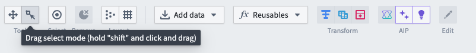
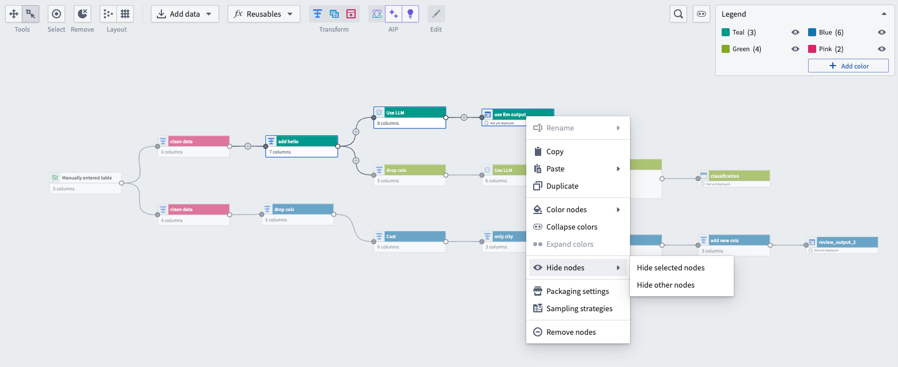
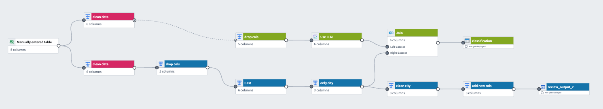
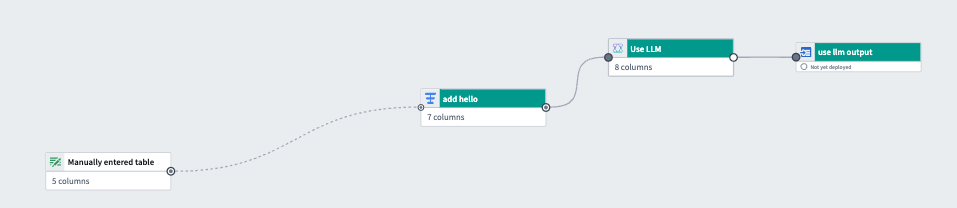
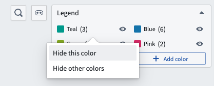
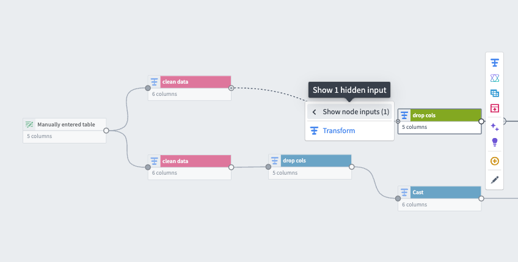
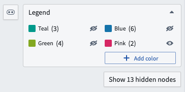
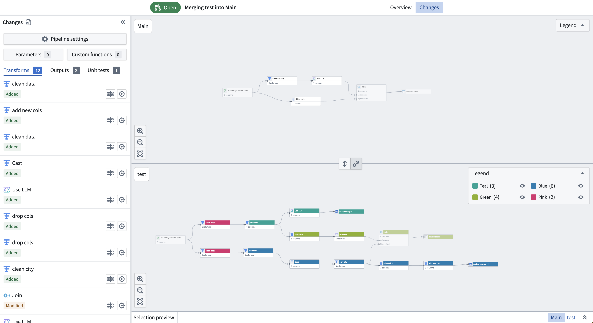
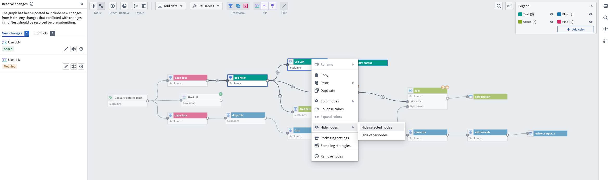

<!-- source: https://palantir.com/docs/foundry/pipeline-builder/management-show-hide-nodes/ · mirrored 2026-08-18 from Palantir Foundry docs -->

# Show and hide nodes

To help manage large pipelines efficiently, users can focus on pipeline subsections by showing and hiding nodes. This allows quicker identification of pipeline segments and an improved navigation and editing experience.

Manually select nodes in the graph view or use **Drag select mode** by choosing the area select icon in the top left.

After you select the relevant nodes, right click and choose **Hide nodes**. This will give you the option to **Hide selected nodes** or **Hide other nodes**, which will hide all nodes that were not selected.

A dotted line appears between nodes that are connected by hidden nodes, and the connected circle icon changes from filled to partially filled to indicate hidden nodes as shown in the graph below:

The graph below only shows teal nodes after all other nodes are hidden:

## Show and hide color groups

You can hide a color group, or hide all other color groups to simplify the graph view. To hide a color group, go to the color **Legend** and select the eye icon next to your chosen color.

Choose **Hide this color** to only hide the selected color group, or **Hide other colors** to hide all other color groups.

When a color group is hidden, a dotted line will appear between connected nodes to inform the user of hidden nodes. To see the number of hidden input nodes feeding into a node, select the left arrow followed by **Show node inputs** on a selected node. The number next to **Show node inputs** is the number of hidden inputs.

Select **Show x hidden nodes** under the **Legend** to show all hidden nodes. X is the total hidden node count. The color legend displays the number of nodes in each color group and whether it is hidden.

## Show and hide nodes in other tabs

You can also show and hide nodes in the **Proposals** tab under **Changes**. Select the **Legend** to display color groups, and show or hide them using the same methods described above.

You can also show and hide nodes in the **Resolve changes** tab when there are merge conflicts.

