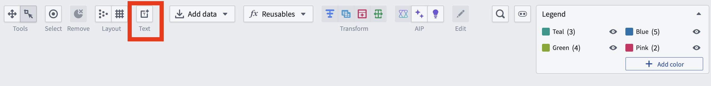
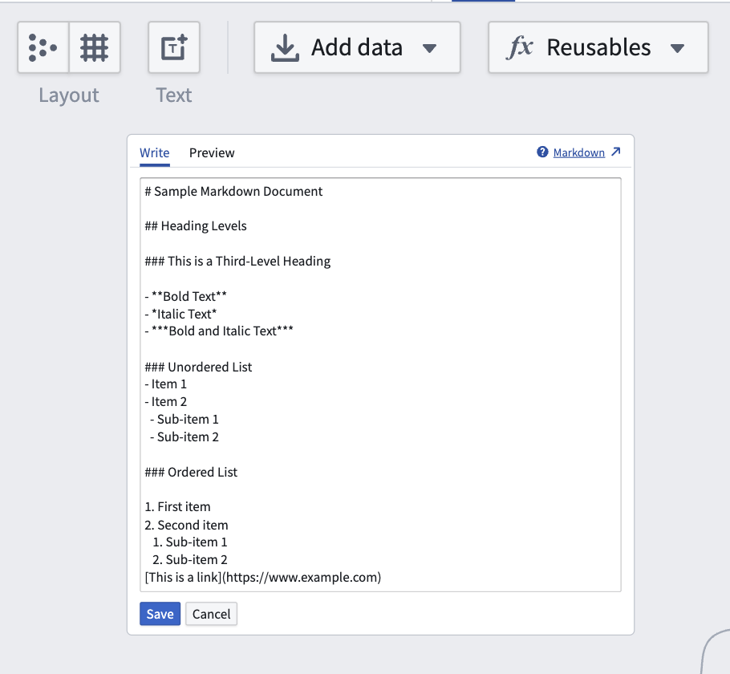
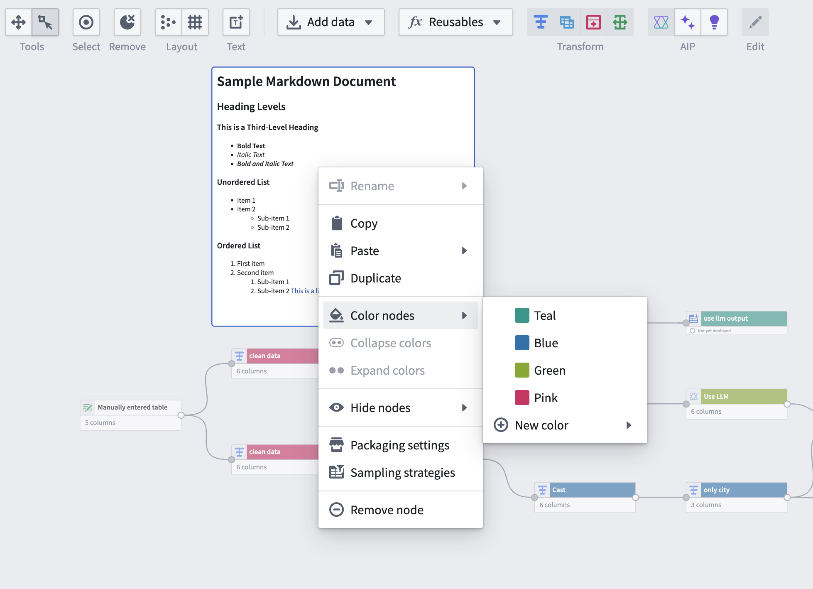
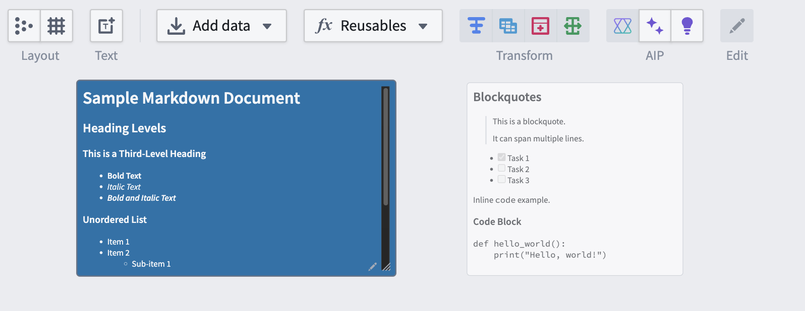

<!-- source: https://palantir.com/docs/foundry/pipeline-builder/management-text-nodes/ · mirrored 2026-08-18 from Palantir Foundry docs -->

# Text nodes

You can add text nodes to your pipelines to help document and call attention to details in your graph. Text nodes render in the background of other graph nodes, allowing you to use them as section dividers or group labels to visually organize complex pipelines. Text nodes use [Markdown syntax ↗](https://www.markdownguide.org/cheat-sheet/), and they can be colored like regular nodes. They will not be affected by layout options and are not attached to any specific node on your graph.

## Add text nodes

1. To add a text node to your graph, select **Text** in the upper left of the graph.   
      

2. Double-click the text node to edit and add Markdown text. Changes are saved automatically as you type.       

3. To exit edit mode, use the keyboard shortcuts `Mod+Enter` or `Escape`, or select outside the text node. To discard your changes and revert to the previous version, use the discard option available while editing.

## Color text nodes

To color a text node, right click and select **Color nodes**. Choose a color or add a new color.

You can also resize text nodes using the three lines in the bottom right corner. If the length of your text is greater than the length of the text node, the node will automatically become scrollable.

This feature is also supported in [Workflow Lineage](/docs/foundry/workflow-lineage/overview/).
