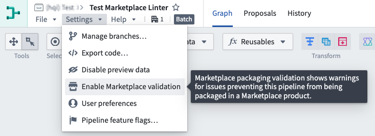
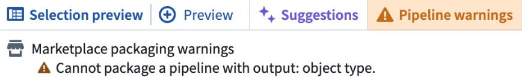
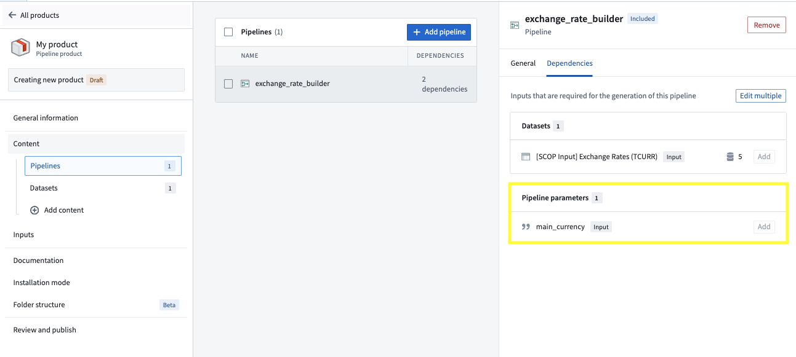
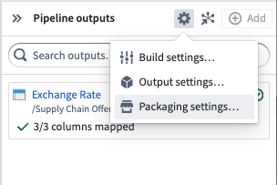
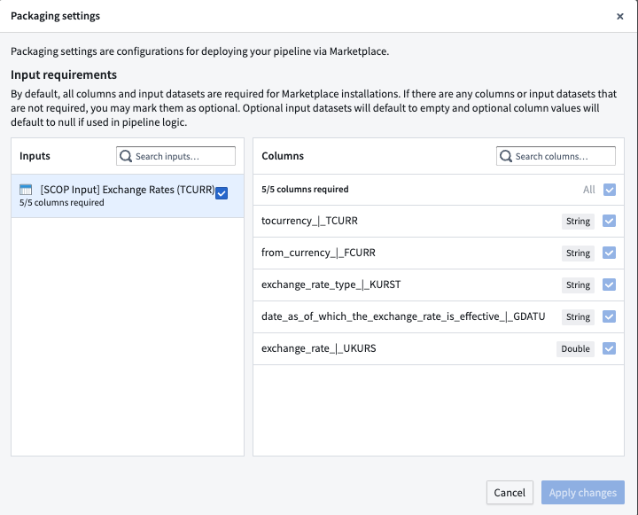

<!-- source: https://palantir.com/docs/foundry/pipeline-builder/marketplace-pipeline-builder/ · mirrored 2026-08-18 from Palantir Foundry docs -->

# Add pipeline to a Marketplace product

Use [Foundry DevOps](/docs/foundry/devops/overview/) to include your Pipeline Builder pipelines in [Marketplace products](/docs/foundry/devops/core-concepts/#product) for other users to install and reuse. [Learn how to create your first product.](/docs/foundry/foundry-devops/create-products/)

## Supported features

All Pipeline Builder features are supported by Marketplace products with the exception of:

* Streaming pipelines with time series targets
* Parameters of the following types: struct type **constants**, complex **expressions** that are not composed of constants, **options**, and **struct locators**.

:::callout{theme="neutral"}
Schedules with parameterization enabled for Python transforms cannot be included in Marketplace products.
:::

### Trained models

Pipeline Builder pipelines that contain trained model nodes can be packaged and published to Marketplace. When you package a pipeline, any models used as transforms are automatically included in the Marketplace product as **Include with content** resources. No additional configuration is required to package models with your pipeline.

### Check Marketplace compatibility with the Marketplace linter

In Pipeline Builder, you can check whether a pipeline is compatible with Marketplace by using the Marketplace linter. To enable this, navigate to **Settings**, and select **Enable Marketplace validation** in your pipeline. This setting is not enabled by default. When you configure validation settings for a pipeline, your selections are saved for that specific pipeline and will remain in place when you return to the pipeline later.

Once enabled, the **Pipeline warnings** section at the bottom of your pipeline will display any errors preventing your pipeline from being packaged in Marketplace.

If there are no Marketplace incompatibilities, no **Marketplace packaging warnings** will appear in the errors/warnings drawer. Note that other types of pipeline errors or warnings may still appear.

## Adding Pipeline Builder pipelines to products

To add a Pipeline Builder pipeline to a product, first [create a product](/docs/foundry/foundry-devops/create-products/), then [add outputs](/docs/foundry/foundry-devops/create-products/#add-outputs). Choose the **Add files** option to navigate to the pipeline from within the [Compass](/docs/foundry/compass/overview/) filesystem and add it to your product.

## Pipeline parameters

You can use [pipeline parameters](/docs/foundry/pipeline-builder/management-parameter-overview/) to give installers the ability to customize their pipeline at installation time. For example, you can use a `boolean` parameter to follow one branch of a pipeline versus another depending on the installer's input. See [supported features](#supported-features) for a list of supported parameter types. When you package a pipeline with a parameter, that parameter will be surfaced as a [dependency](/docs/foundry/foundry-devops/create-products/#add-outputs) to your pipeline and an [input](/docs/foundry/foundry-devops/create-products/#add-inputs) for installers as below.

## Packaging settings

To configure required or optional datasets and columns for installers, navigate to **Pipeline outputs panel > Settings** to access the **Packaging settings**.

By default, all columns and input datasets are required for Marketplace installations. If there are any columns or input datasets that are not required, you may mark them as optional. Optional input datasets will default to empty and optional column values will default to null if used in pipeline logic.

