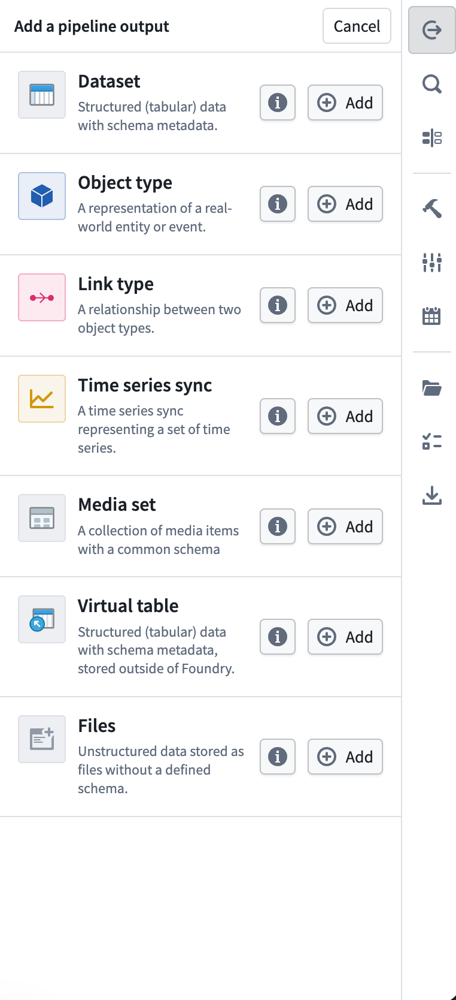
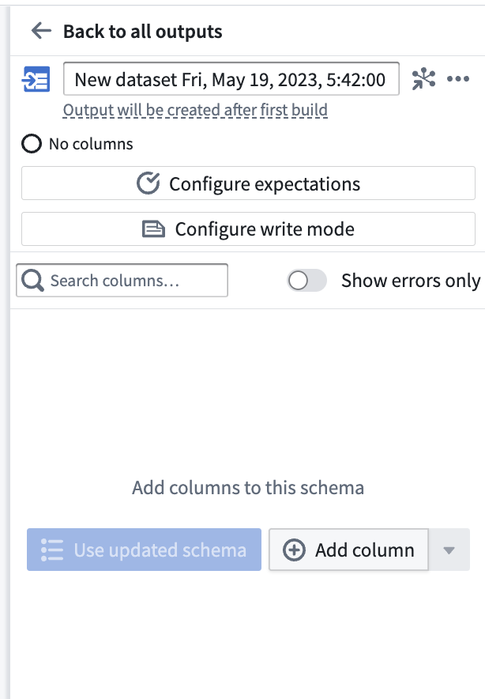
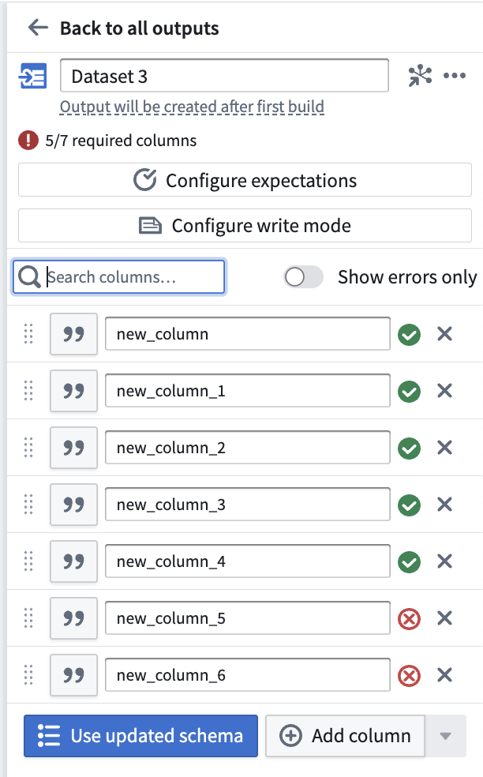
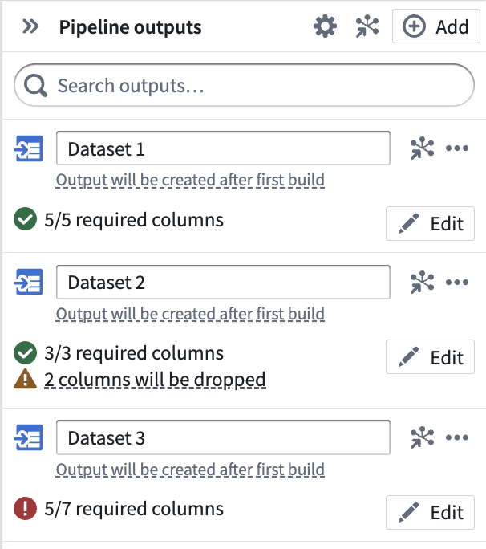
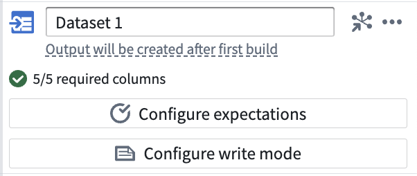
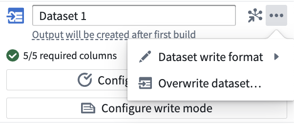
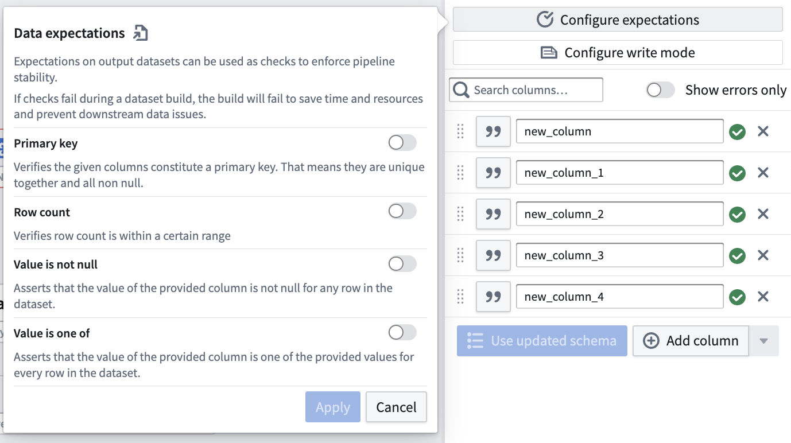
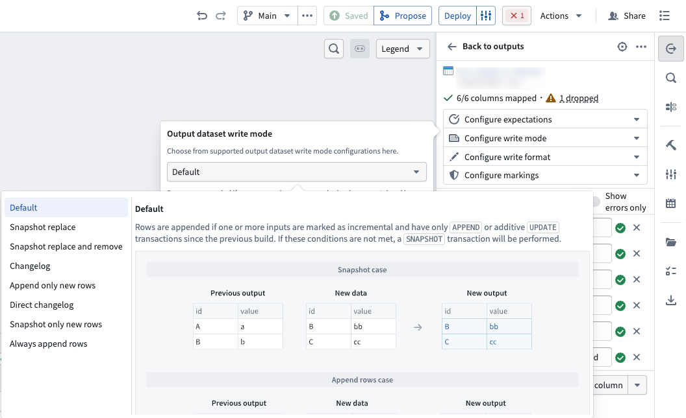
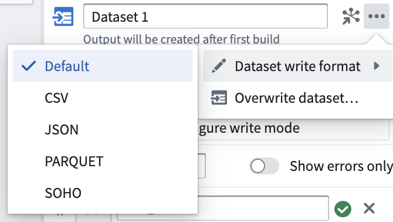
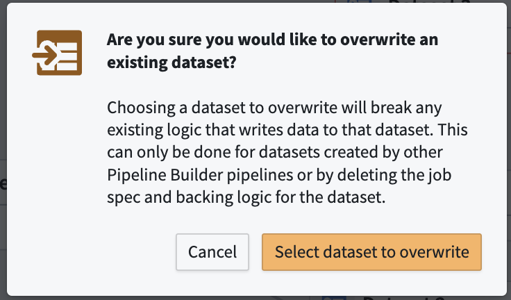

<!-- source: https://palantir.com/docs/foundry/pipeline-builder/outputs-add-dataset-output/ · mirrored 2026-08-18 from Palantir Foundry docs -->

# Add a dataset output

You can choose to add a dataset output in Pipeline Builder to guide your pipeline integration towards clean, transformed data. Learn more about [different output types](/docs/foundry/pipeline-builder/outputs-overview/).

## Create a dataset output

First, click **Add** next to the Dataset type in the outputs panel to the right of the graph.

Now you've created a new output dataset. After the first build of your pipeline, your dataset output will be created in the same folder as your pipeline. For example, the `Vendor` dataset output of the Demo Pipeline would have the following file path: `/Palantir/Pipeline Builder/Demo Pipeline/Vendor`.

Rename your output dataset by clicking into the name field. Choose **Add column** to manually add columns to your output schema, or connect a transform node to use its output schema with **Use updated schema**.

Once you've added an output schema, use the **Search columns...** field to quickly find columns within the dataset. To view only the errors in your output schema, toggle the **Show errors only** button.

After adding an output dataset, click **Back to all outputs** to view a list of all outputs in your pipeline. Understand the status of each output at a glance, including whether the output schema matches the input transform node schema. The three outputs below represent the different statuses that output schemas can have:

* **Dataset 1** has 5/5 required columns, meaning that every column in the input transform node will be built in the output dataset.
* **Dataset 2** has 3/3 required columns with 2 dropped, meaning that the input transform node has 5 columns but only 3 will be built in the output dataset. This is desirable in cases when you have unnecessary columns in the input transform node.
* **Dataset 3** has 5/7 required columns, which is an error state. You will not be able to deploy your pipeline until the 2 missing columns are mapped to columns in an input transform node.

Click **Edit** to update the output schema at any time.

Learn more about dataset schemas in [data integration](/docs/foundry/data-integration/datasets/#schemas).

To include a media reference column in your dataset output, add a [media set](/docs/foundry/data-integration/media-sets/) as a pipeline input and join its media reference column into your output data. Learn more about [transforming media in Pipeline Builder](/docs/foundry/pipeline-builder/transforms-transform-media/).

## Configure output settings

In addition to schema configuration, each individual output has a variety of default settings that can be customized.

### Configure expectations

Add an expectation on your output dataset to enforce pipeline stability. If any check fails during a pipeline build, the build will fail.

### Configure write mode

Define how data is added to a dataset output in future deployments.

**Default:** This is recommended for most batch pipelines, both [snapshot and incremental](/docs/foundry/pipeline-builder/datasets-computation-modes-for-batch/). The default write mode will output the result as an `APPEND` transaction if at least one input is marked as incremental and all inputs that are marked as incremental have only had `APPEND` or additive `UPDATE` transactions since the previous build. Otherwise, the default write mode will output the result as a `SNAPSHOT` transaction. Learn more about [transaction types](/docs/foundry/data-integration/datasets/#transaction-types).

**Snapshot replace:** Outputs the result as a `SNAPSHOT` transaction where the new data is merged with the previous output. Existing primary keys in the previous output will be dropped in favor of the new rows. If duplicate rows exist within the current transaction, all but one are dropped at random so the output only contains one row per primary key.

**Snapshot replace and remove:** This is equivalent to **Snapshot replace**, followed by a post-filtering stage to selectively remove rows from the old data. Outputs the result as a `SNAPSHOT` transaction where the new data is merged with the previous output followed by a post-filtering stage to remove rows from previous transactions based on a provided boolean `post_filtering_column`. Existing primary keys in the previous output will be dropped in favor of the new rows if `post_filtering_column = TRUE`. However, if a row exists in the current transaction with `post_filtering_column = FALSE` for a given primary key, then the corresponding row from the old data will be filtered out. However, this does not override the storage of new rows with `post_filtering_column = TRUE`. If duplicate rows with `post_filtering_column = TRUE` exist within the current transaction, all but one are dropped at random so the output only contains one row per primary key.

**Changelog:** Outputs a series of `APPEND` transactions that contain the complete history of changes to all records. In [Object Storage v1](/docs/foundry/object-databases/object-storage-v1/), you can optimize an object type's sync performance by setting a Changelog dataset configured in this way as the backing datasource. Learn more about [Changelog datasets](/docs/foundry/building-pipelines/maintaining-incremental-performance/#changelog-datasets).

**Append only new rows:** Outputs the result as an `APPEND` transaction where only new rows, defined as newly seen primary keys, are added to the output. If duplicate rows exist within the current transaction, one is dropped at random. Rows with a primary key that exists in the previous output are dropped.

**Direct changelog:** The output rows are treated as the changelog, granting full control over changelog content. Changelog metadata is written directly on the output dataset. Each row must specify a primary key, a timestamp, and a boolean signaling deletion. Learn more about [Changelog datasets](/docs/foundry/building-pipelines/maintaining-incremental-performance/#changelog-datasets).

:::callout{theme="neutral"}
[Object Storage v2](/docs/foundry/object-backend/overview/#object-storage-v2-architecture) ignores the provided timestamp column and instead uses the transaction ID to deduplicate rows with the same primary key.
:::

**Snapshot only new rows:** Outputs the result as a `SNAPSHOT` transaction where only rows with newly seen primary keys are kept in the output. If duplicate rows exist within the current transaction, they will be kept. All other rows will be dropped.

**Always append rows:** Outputs the result as an `APPEND` transaction.

### Dataset write format

The output file format of your dataset can be changed after initial deployment, and will take effect upon the next deployment of your pipeline. Learn more about [file formats](/docs/foundry/data-integration/datasets/#file-formats).

### Overwrite dataset

A one time action that grants ownership of an existing dataset to a new output in Pipeline Builder. Note that this action may require additional actions outside of Pipeline Builder.

## Build a dataset output

After adding your dataset output to your pipeline, be sure to save your changes. If you are finished transforming your data and defining your pipeline workflow, you are ready to deploy your pipeline and build your dataset output. After deploying your pipeline, use your final dataset output as a foundation for Ontology building in the [Ontology Manager](/docs/foundry/ontology-manager/overview/).

Learn how to [deploy your pipeline](/docs/foundry/pipeline-builder/outputs-deliver-pipeline/).
