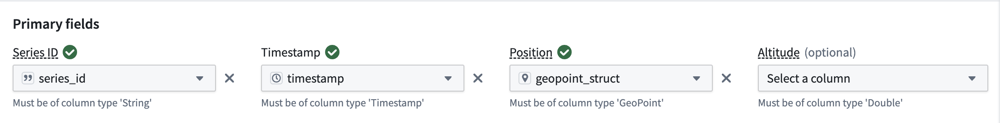
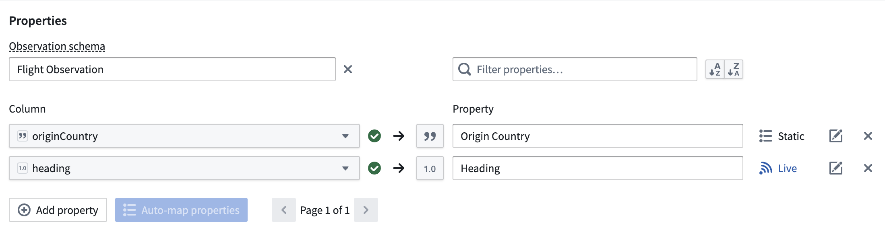
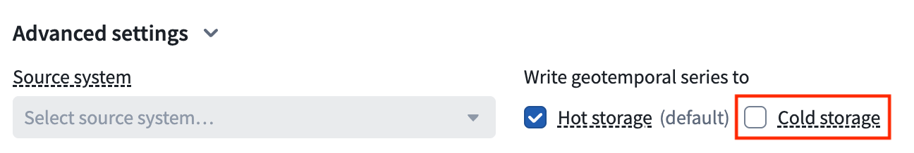
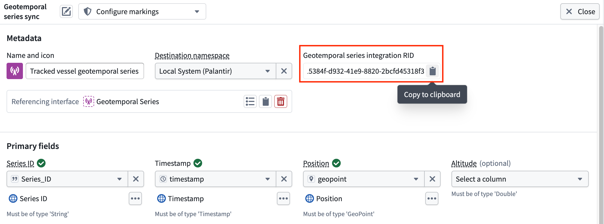
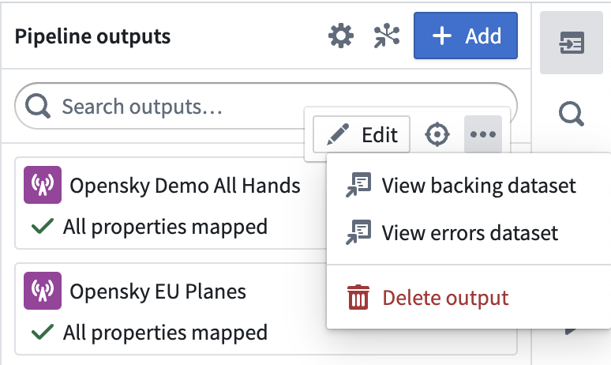

<!-- source: https://palantir.com/docs/foundry/pipeline-builder/outputs-add-geotemporal-series-output/ · mirrored 2026-08-18 from Palantir Foundry docs -->

# Add a geotemporal series output

You can add a geotemporal series sync output to pipelines to make your batch or streaming geotemporal data in Foundry available in downstream applications, such as the Map application. Geotemporal observations from Foundry are written in Pipeline Builder. Learn more about [different output types](/docs/foundry/pipeline-builder/outputs-overview/) and [geotemporal series](/docs/foundry/geospatial/geotemporal-series-overview/).

## Prerequisites

To use geotemporal series in Pipeline Builder, they must be enabled for your enrollment. Contact your Palantir representative for more information about enabling this feature.

## Create a geotemporal series output

Open the **Pipeline outputs** panel located on the right side of the Pipeline Builder interface. Then, select **Add > Geotemporal series sync > Add** to create a new geotemporal series.

:::callout{theme="neutral"}
If you cannot see the geotemporal series output type in Pipeline Builder, check whether your enrollment meets the prerequisite stated above.
:::

## Mapping primary fields

All geotemporal series outputs in Pipeline Builder have primary fields, or intrinsic fields, that must be produced as part of your pipeline's upstream transformation logic. These fields control the translation from rows in a pipeline to geotemporal observations. Please refer to [geotemporal series data modeling](/docs/foundry/geospatial/data-modeling/) for more information about primary fields. These primary fields include:

* **Series ID:** A string value used as a unique identifier for each track in an integration, such as a flight identifier used to distinguish unique flights. Refer to [geotemporal series data modeling](/docs/foundry/geospatial/data-modeling/#picking-a-series-id) for more examples on choosing a series ID.
* **Timestamp:** A value representing the time of a given observation.
* **Position:** A GeoPoint value that represents the location at the time of an observation. GeoPoint values in Pipeline Builder can be created from latitude and longitude coordinates using the [`Construct geopoint column`](/docs/foundry/pb-functions-expression/constructGeoPointV1/) expression in upstream transformation logic.
* **Altitude:** An optional value of type `Double` that represents the height above the surface of the Earth in meters.

## Mapping additional fields

In addition to the required fields mentioned above, you can map custom fields to output observations. To do so, navigate to the **Properties** section of the geotemporal series output panel and select **Add Property**. Select an upstream transformation logic output column to have the corresponding value present in downstream observations. You must specify a name, whether the mapping should be live or static, and optionally, documentation for what the field represents. Live properties change with each observation, such as the heading of a plane. Static properties are constant across the series and are used to denormalize for search and filtering capabilities, such as aircraft type.

In addition to the standard data types in Pipeline Builder, geotemporal series outputs support mapping special geometric types to their equivalents in the geotemporal series data model. Please see [Pipeline Builder's geospatial documentation](/docs/foundry/pipeline-builder/transforms-geospatial/) for more detail on these types:

* **GeoPoint:** A single point, which can be rendered on downstream maps and can be different from the point set in the "Position" primary field.
* **Geometry:** A GeoJSON object which can be rendered on downstream maps.

## Advanced settings

In addition to basic output mappings, geotemporal series outputs support the following advanced and optional settings:

* **Time to live:** A `long` type value representing the amount of time in milliseconds after which data will be considered stale or expired. Stale data will not be rendered in downstream applications. This only applies to the [hot storage feature](#hot-and-cold-storage).
* **Observation type:** A `string` type value representing a logical categorization used for filtering data in downstream applications, for example "GPS ping" or "manual report".
* **Style configuration:** Allows users to configure the appearance of an observation in downstream applications. Supported attributes include icon size, opacity, rotation, symbology, title, geometry width, geometry color, geometry fill, geometry opacity, and track color.
* **Observation schema:** You can optionally select an existing [observation schema](/docs/foundry/geospatial/data-modeling/#observation-schema) as part of your geotemporal series. Doing so will pre-populate all fields associated with that schema as properties to be mapped. To support backwards compatibility, you will not be able to delete, change, or toggle an existing field between live and static. If you do not select an existing schema, a new schema will be created for your integration upon first successful deployment of the pipeline output.
* **Source system:** Source systems are groupings of different geotemporal series syncs that you can optionally reuse. If you select an existing source system, the resulting geotemporal series integration will be upserted to the specified source system upon successful deployment. Existing integrations in the source system will not be modified. If you do not select an existing source system, a new one will be created upon first successful deployment of the pipeline output. By default, all geotemporal series outputs within a given pipeline will be grouped into a source system corresponding to that pipeline.
* **Destination namespace:** Users can specify the destination namespace that a pipeline will export observations to, if they have access to multiple namespaces with geotemporal output series configured. More details can be found [below](#security). Contact your Palantir representative for guidance on configuring additional destinations.

### Hot and cold storage

Geotemporal series syncs can be written to two specialized observation databases:

* **Hot storage:** The default setting, which is optimized for real-time access. Observation data that is stored for a certain amount of time is eventually deleted from the store.
* **Cold storage:** Stores observation data in Foundry datasets following [data retention policies](/docs/foundry/retention/manage-retention-policies/). Use cold storage when observation data must be stored long-term for geotemporal querying.

:::callout{theme="neutral"}
Reading observation data from cold storage has limited support in certain workflows. Contact Palantir Support for more information based on your use case.
:::

## Security

The security of downstream geotemporal series observations is derived from your pipeline input data:

* Mandatory permissions:
  * Downstream observations will be secured by the latest output transaction or streaming view on the geotemporal series output dataset in Pipeline Builder. This resource will propagate mandatory or classification Markings inherited from input datasets to the pipeline.
  * If upstream input data Markings change between builds of a geotemporal series output, the subsequent build will fail in order to prevent unintended changes in previously integrated data Markings. In this case, you must delete and re-create the geotemporal series output with the appropriate Markings.
  * All pipeline inputs must have organization Markings with access to the destination namespace configured for the corresponding geotemporal series output. Organization Markings present on the geotemporal series output must be a superset of the organizations with access to the output's namespace.
* Discretionary permissions:
  * When a geotemporal series output is first deployed, all groups with read permissions and above on the parent project will be granted view access to the downstream geotemporal series output. Subsequent changes to discretionary permissions of the parent project will not propagate to downstream observations. Please contact your Palantir representative if your geotemporal series workflow requires more granular discretionary permissions.

Consult the documentation below for more information on mandatory and discretionary permissions:

* [Securing a data foundation](/docs/foundry/security/securing-a-data-foundation/)
* [Protecting sensitive data](/docs/foundry/security/protecting-sensitive-data/)

## Geotemporal series sync RID

Select the geotemporal series sync output node on your Pipeline Builder graph to copy its RID from the **Metadata** section under **Geotemporal series integration RID**.

## Troubleshooting

Observations should flow into your geotemporal series shortly after a pipeline has been deployed and a build has been triggered. If data is not appearing in downstream applications, you can troubleshoot using the following steps:

* Verify that data is appearing in the observations output dataset in Pipeline Builder by navigating to the **Outputs** panel on the right side and selecting the three dots next to your output, then selecting **View backing dataset.**

* Check for errors in the error dataset by selecting **View errors dataset** in the **Outputs** panel mentioned above.
* Check for errors logs indicating a runtime failure in the currently running pipeline build. This is accessible from the **History** tab in Pipeline Builder.
* Verify that there are no security configuration errors in downstream applications by ensuring that downstream resources contain the necessary classification Markings, mandatory Markings, and discretionary groups to view the underlying geotemporal series.
