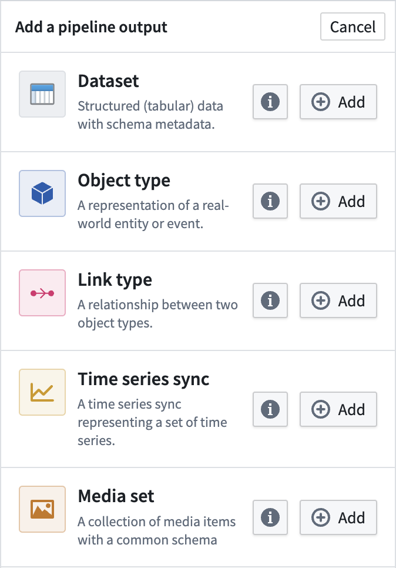
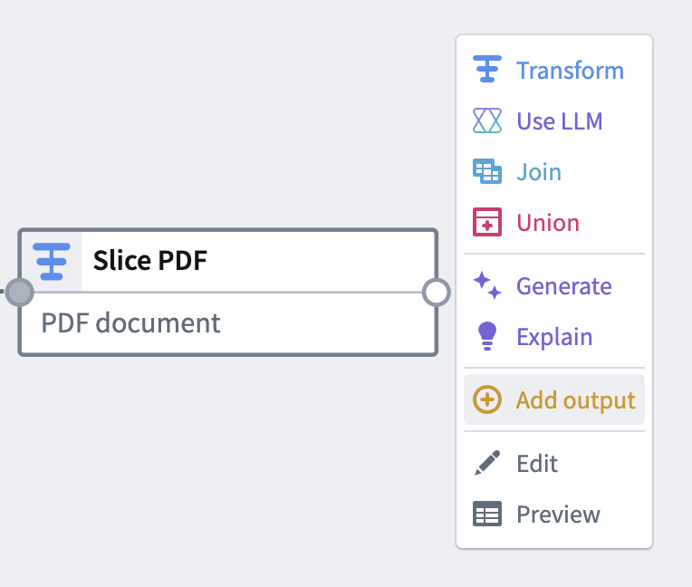
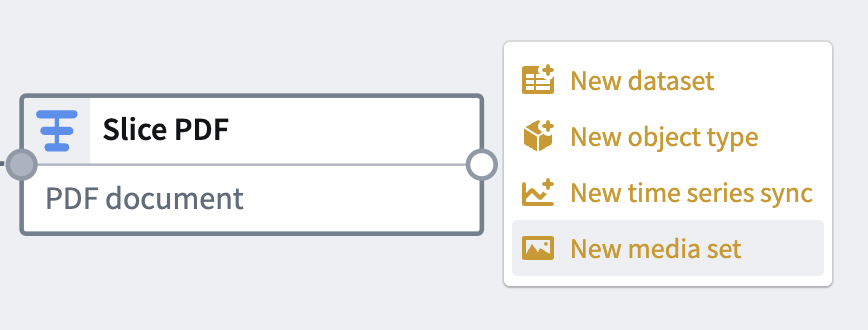
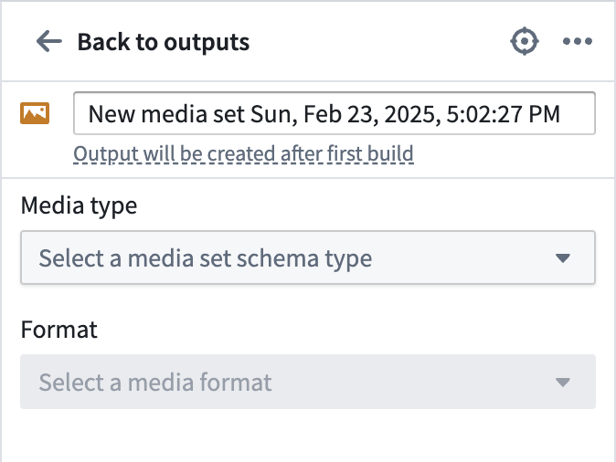
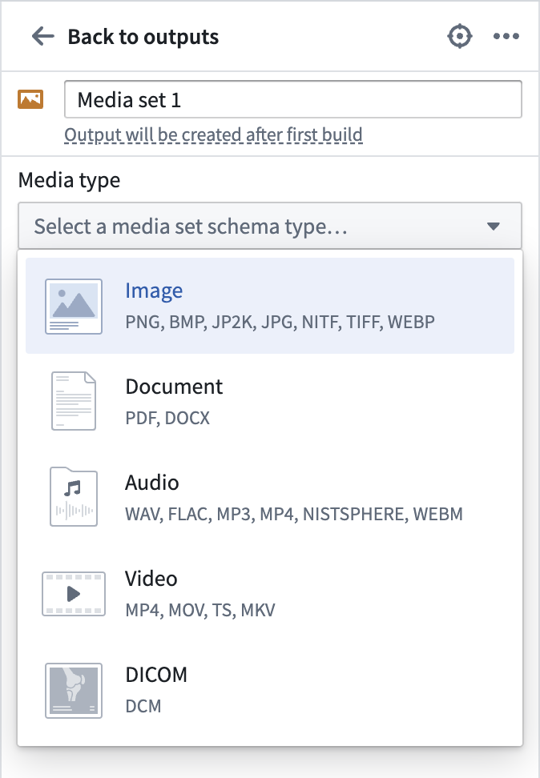
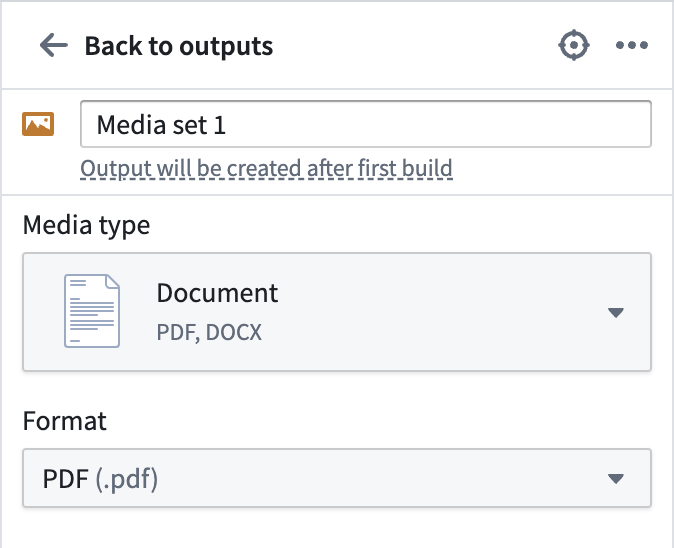

<!-- source: https://palantir.com/docs/foundry/pipeline-builder/outputs-add-media-set-output/ · mirrored 2026-08-18 from Palantir Foundry docs -->

# Add a media set output

When working with media sets in Pipeline Builder, you can create a *media set output* as the result of your pipeline. Media set outputs enable your pipelines to provide clean, transformed media data (such as images or audio) for use across the platform.

Learn more about [media sets and unstructured data](/docs/foundry/data-integration/media-sets/) in Foundry.

## Create a media set output

To create a media set output, first [generate a new media set](#generate-a-new-media-set) and then [configure](#configure-the-media-set) it in the proper format before deploying your pipeline and [building the output](#build-a-media-set-output).

### Generate a new media set

First, select **Add** next to the **Media set** type in the **Pipeline outputs** panel to the right of the graph.

Alternatively, you can choose a transform node that produces media and select **Add output**.

Then, select **New media set**.

### Configure the media set

There are several parameters required to configure the output media set. You can rename your output media set using the name field.

Select the **Media type** for your media set. This should match the output type of the media after any transformations you have applied.

Select the **Format**. This should match the specific file format of the media after any transformations you have applied.

Now you have successfully configured a new output media set. The configuration can be changed until the pipeline gets deployed. After the pipeline is deployed, your media set output will be created in the same folder as your pipeline.

:::callout{theme="neutral"}
Output media sets are transactional only. Learn more about [transactional and transactionless media sets](/docs/foundry/media-sets-advanced-formats/media-set-settings/#transaction-policies).
:::

:::callout{theme="warning"}
Incremental processing for media set inputs is not supported when the pipeline output is a media set. If you enable incremental processing on a media set input, the pipeline output must be a dataset. Learn more about [computation modes for batch inputs](/docs/foundry/pipeline-builder/datasets-computation-modes-for-batch/).
:::

## Build a media set output

After adding your media set output to your pipeline, be sure to save your changes. If you have finished transforming your media and defining your pipeline workflow, you are ready to deploy your pipeline and build your new media set output.

Learn how to [deploy your pipeline](/docs/foundry/pipeline-builder/outputs-deliver-pipeline/).
