<!-- source: https://palantir.com/docs/foundry/pipeline-builder/outputs-add-ontology-output/ · mirrored 2026-08-18 from Palantir Foundry docs -->

# Add an Ontology output

You can choose to add an Ontology output to guide your pipeline integration towards clean, structured data that defines new elements of your global Ontology. Adding output guidance can help save time on compute checks and help inform the end-to-end creation of your workflow.

Pipeline Builder currently supports creating Ontology objects and links from both batch and streaming datasets. However, it is not possible to enable edits or configure many-to-many links for objects backed by streaming datasets in Pipeline Builder.

## Add an object type output

There are two ways to add an object type output. You can create a blank object via the pipeline outputs panel, or create a populated object on the graph connected to a transform node.

### With the pipeline outputs panel

Open the **Pipeline outputs** panel located on the right side of Pipeline Builder, then select **Object type > Add** to create a blank object template where you can edit the object name, icon, and properties.

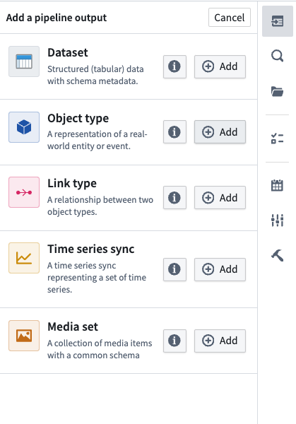

Note that the **Plural name** and **Object type ID** will auto-populate from **Name** for convenience.

:::callout{theme="warning"}
You can define new objects in Pipeline Builder, but you cannot modify or delete existing objects unless they were created in Pipeline Builder. After the first deploy, the object type ID cannot be modified; however, you can still edit the API name of object types owned by the pipeline.
:::

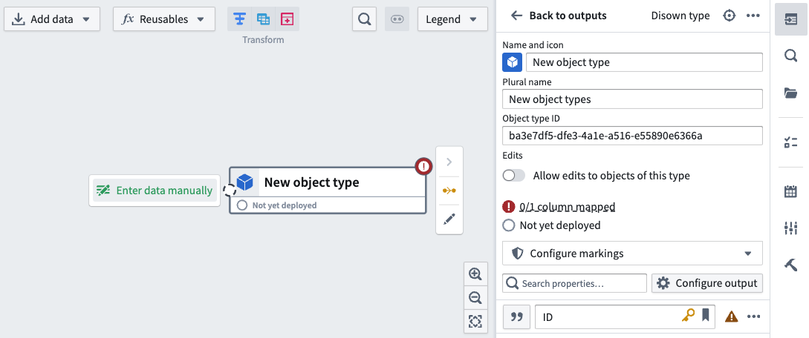

You can now populate your object with data by selecting **Enter data manually** or by dragging the output of an existing dataset or transform to this node's input.

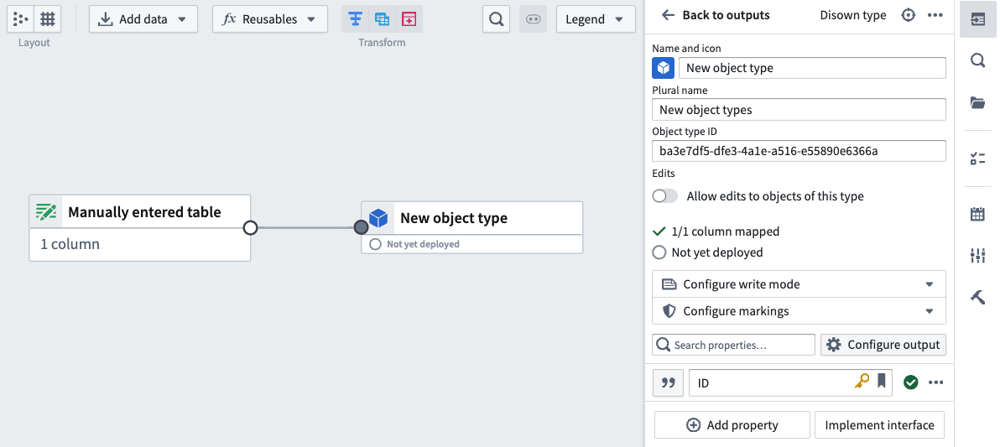

### With the graph

Select the transform node that you want to create the object from, then select **Add output > New object type**.

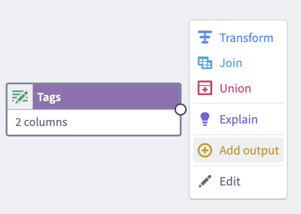

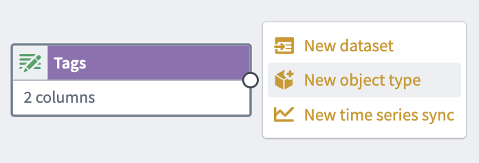

:::callout{theme="warning"}
If your enrollment has multiple Ontologies, you need to select the Ontology that an object belongs to on object creation. Otherwise, the error message `An ontology must be specified to publish ontology type outputs` will be displayed. To set the Ontology, select **Set ontology** in the bottom panel or on the object, as shown below.
:::

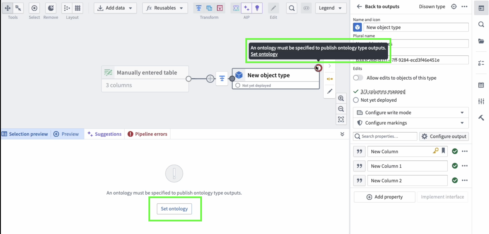

## Edit object type API names

You can edit the API name of an object type directly within the object type editor in Pipeline Builder. To edit the API name, hover on the object type in the right panel and select **Edit**, then modify the **API name** field.

The **API name** field validates names on submission, checking for:

* Duplicates within the current Ontology
* Valid formatting requirements
* Maximum length of 100 characters

:::callout{theme="warning"}
After the first deploy, the object type ID cannot be modified. However, you can still edit the API name of object types owned by the pipeline.
:::

## Enable edits on object types

You can enable edits on object types in Pipeline Builder or in Ontology Manager if the object was created in Pipeline Builder and is backed by a batch dataset.

:::callout{theme="warning"}
Stream backed object types [do not currently support edits](/docs/foundry/object-indexing/funnel-streaming-pipelines/#current-product-limitations-of-streaming-object-types). To enable edits on stream-backed object types, use the [direct datasources](#enable-direct-datasources-beta) feature.
:::

To enable edits, hover on the object type in the right panel and select **Edit**. Toggle **Allow edits to objects of this type**. Save and deploy your pipeline for this to go into effect.

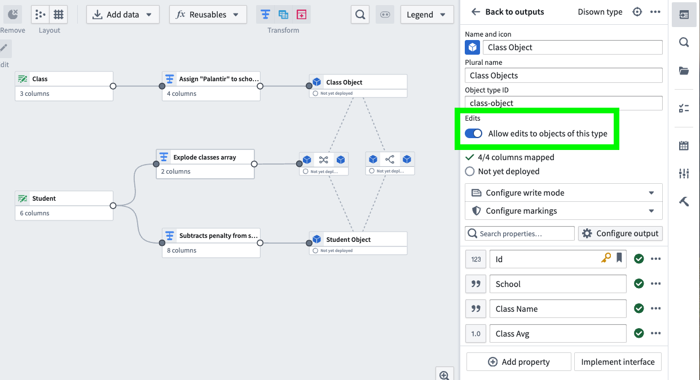

## Implement interfaces

:::callout{theme="neutral" title="Beta"}
Implementing interfaces in the object type output in Pipeline Builder is in the [beta](/docs/foundry/platform-overview/development-life-cycle/) phase of development and may not be available on your enrollment. Functionality may change during active development.
:::

You may optionally [implement interfaces](/docs/foundry/interfaces/implement-interface/) in the object type output in Pipeline Builder, mapping the interface type's properties to the object type's properties.

To implement an interface type:

1. Select **Implement interface** at the bottom of the property mapping section of the object type output panel, as shown below.   
   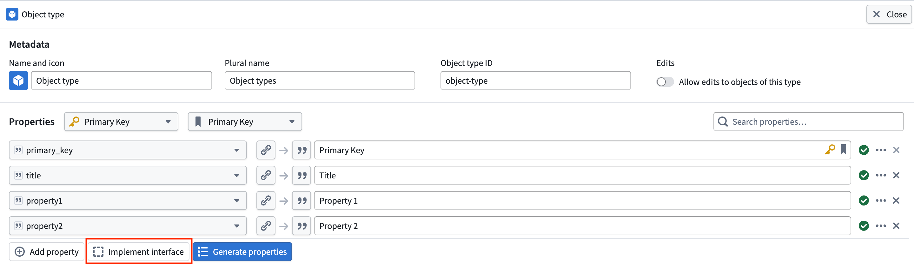   
2. Search for and select the interface type you want to implement, then choose **Next**.   
   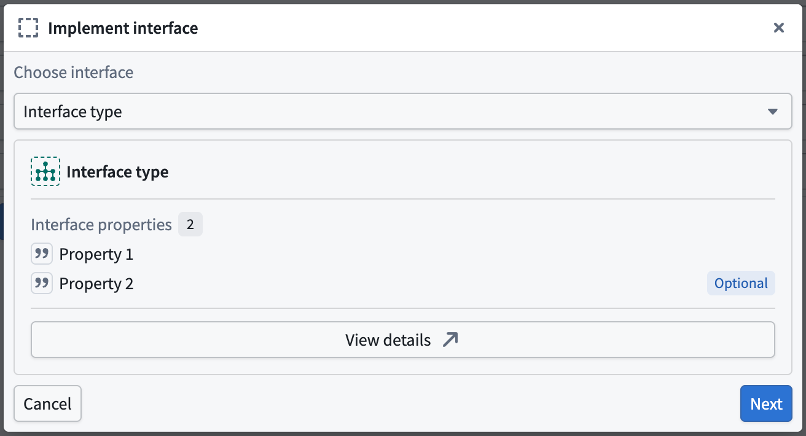   
3. Map the interface type's properties to the object type's properties. An object type property must be chosen for all interface type properties that are **not** marked as optional. Optional interface type properties may be left unmapped.
4. Once satisfied with your property mapping, select **Confirm and implement**.   
   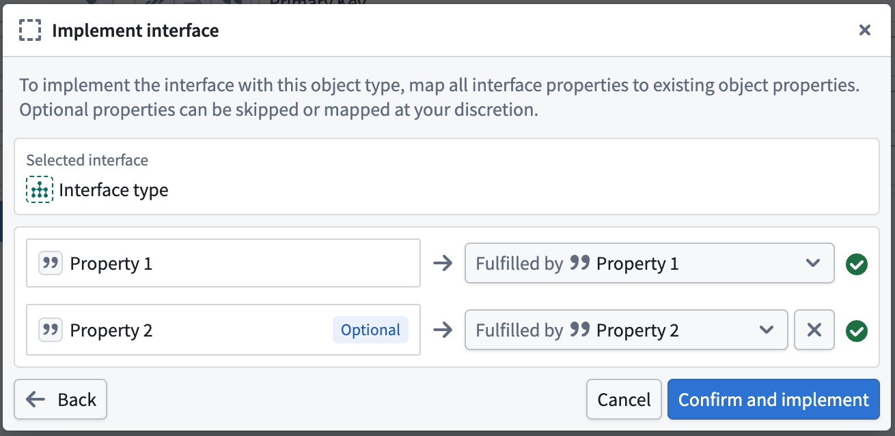   
   You can view all implemented interface types in the interface section of the object type output panel. You may also edit the interface type property mapping by selecting **Re-map**. Similarly, you may remove the interface type implementation by selecting the remove button.

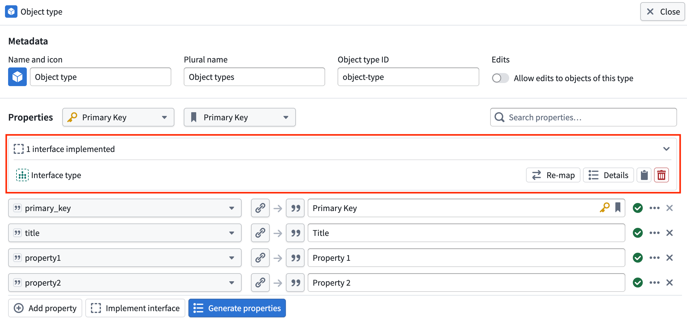

### Known limitations

* **Link type and action type constraints:** [Link type](/docs/foundry/interfaces/interface-link-types-overview/) and [action type](/docs/foundry/interfaces/interface-action-type-constraints/) constraints are not supported by this workflow in Pipeline Builder.
* **Object type properties:** Only property type configurations supported by Pipeline Builder can be used to implement similarly configured interface type properties. For example, [type classes](/docs/foundry/object-link-types/metadata-typeclasses/) and [render hints](/docs/foundry/object-link-types/metadata-render-hints/) are not configurable in Pipeline Builder.

## Enable direct datasources \[Beta]

:::callout{theme="neutral" title="Beta"}
Direct datasources are in the [beta](/docs/foundry/platform-overview/development-life-cycle/) phase of development and may not be available on your enrollment. Functionality may change during active development.
:::

[Direct datasources](/docs/foundry/object-indexing/direct-datasources/) provide low-latency, low-throughput writes into the Ontology, including [edits](/docs/foundry/object-edits/overview/) on object types backed by stream based data.

To enable a direct datasource:

1. Create a streaming pipeline with an object type output. You should have the option to **Use a direct datasource to back this object type** and **Allow edits to objects of this type**. Enable both settings.
2. Configure the object target as needed, then deploy. Once deployed, the object type appears in [Ontology Manager](/docs/foundry/ontology-manager/overview/), and its objects are viewable in [Insight](/docs/foundry/insight/overview/) and [Object Explorer](/docs/foundry/object-explorer/overview/).

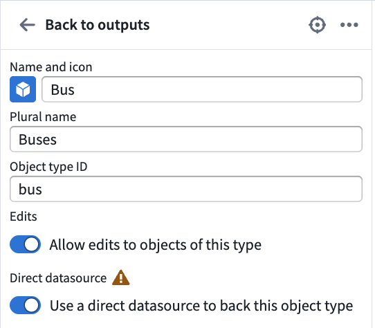

[Learn more about monitoring and debugging a direct datasource after deployment.](/docs/foundry/object-indexing/direct-datasources/#debugging).

:::callout{theme="neutral"}
If you [disown](#disown-ontology-type-outputs-in-pipeline-builder-deprecated) a direct datasource-backed object target, the disowned node in the graph displays as a stream dataset. However, this node represents the direct datasource backing the object type, not a streaming dataset. Unlike stream datasets, direct datasources do not store data directly; the data is stored in the Ontology. After disowning, you can still navigate to the object type in Ontology Manager or Insight.
:::

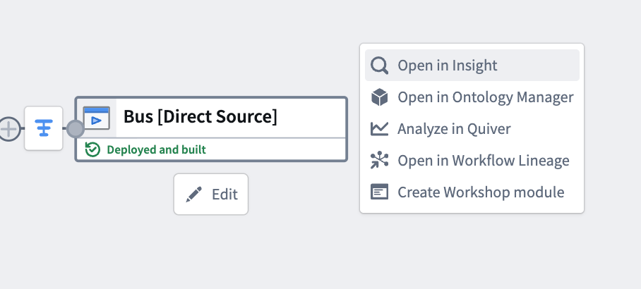

### Known limitations

As a beta feature under active development, direct datasources currently have the following limitations:

* **Replay wipes the object view:** Replaying a streaming pipeline removes the existing object view to serve the new view immediately. Because the swap is instant, the new view is not yet fully populated, so the object view can be temporarily incomplete or empty. The complete view will populate over time. replays to address this limitation are in development, and this documentation will be updated accordingly.
* **Initial deployment timeouts:** A streaming job may fail before submission on initial deployment, or when replaying with reset outputs, because of initial setup performed during deployment that can cause a timeout.
* **Branching is not supported:** Direct datasources cannot be used on branches.
* **Backfill can be slow:** Backfilling data after replay can be slow. Improvements are in development.

For remediation steps and other common issues, see the [direct datasources FAQ](/docs/foundry/object-indexing/direct-datasources/#faq).

## Add a link type output

Once object type outputs have been added, you can define link type outputs. Similar to object outputs, these can be created in the panel or on the graph.

### With the pipeline outputs panel

In the **Pipeline outputs** panel, select **Link type > Add**. This opens a form in which you can define the left and right sides of your link type.

:::callout{theme="warning"}
Links defined in Pipeline Builder can only use objects created within the same pipeline. Within the Ontology Manager application itself, you can create links between objects created in Pipeline Builder and objects created in Ontology Manager.  
After the first deploy, the link type ID or the source and target object types can no longer be modified.
:::

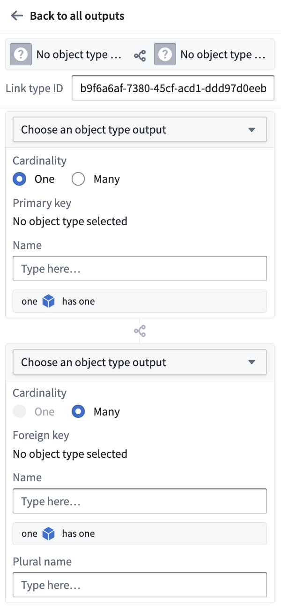

#### Legend

**Link type ID:** This is an auto-generated ID that uniquely represents this link.

**Choose an object type output:** Select an object type from the dropdown menu. If you do not have any object outputs in your pipeline, you will need to configure an object output type first.

**Cardinality:** Choose the cardinality of each side of the link type. Two types of cardinality are supported: one-to-many and many-to-many. One-to-one link types are currently not supported. In the examples below, assume that there are two object types that are related to each other through a cardinality: an `Aircraft` object type and a `Flight` object type.

* One-to-many cardinality: This indicates that one `Aircraft` can be linked to many `Flights`.
* Many-to-many cardinality: This indicates that one `Aircraft` can be linked to many `Flights` and one `Flight` can be linked to many `Aircraft`.
  * Note that when you select a many-to-many cardinality, you will see a prompt to **Click and drag the output from a dataset or transform to use as the join table**. This table should contain all combinations of links between the primary key of the first object type (`Aircraft` in this example) and the second object type (`Flight` in this example).
  * Below is an example of many-to-many cardinality, where a `Class` object can be linked to many `Student` objects and a `Student` object can be linked to many `Class` objects:

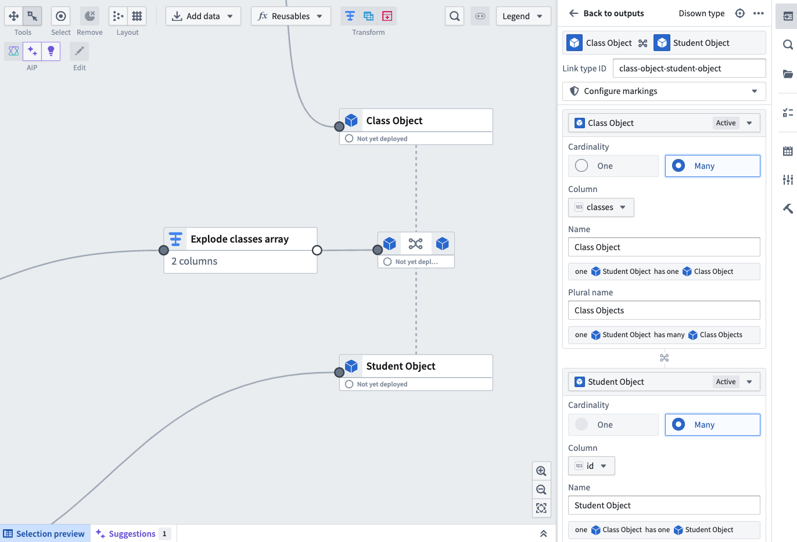

**Primary key/column:** Choose which property to use to create the left side of the link.

* In a one-to-many cardinality link type, the primary key will be determined by the object type.
* In a many-to-many cardinality link type, select which columns in the join table map to the primary keys of each of the linked object types.

**Foreign key/column:** Choose which property to use to create the right side of the link.

* In a one-to-many cardinality link type, the foreign key property of one object type must refer to the primary key property of the other object type.
* In a many-to-many cardinality link type, select which columns in the join table map to the primary keys of each of the linked object types.

**Name:** Fill in the display name for each side of the link type. A side of the link type represents the link to that object type. The display name for the `Aircraft` object type describes the link from `Flight` to `Aircraft`. In this example, you could choose the display name "Assigned Aircraft" since one `Flight` has one assigned `Aircraft`.

**Plural display name:** For sides of a link type with the cardinality many, you will also be prompted to fill in a plural display name so user applications can display the correct name when displaying the linked objects. In our example, the plural display name for the `Flight` object type will describe the link from `Aircraft` to `Flight`. We might choose the plural display name to be "Scheduled Flights" as one `Aircraft` has many scheduled `Flights`.

### With the graph

Select the two object outputs that you want to create the link from, then right-click and select **New link type**. This will create a link with all the object information populated.

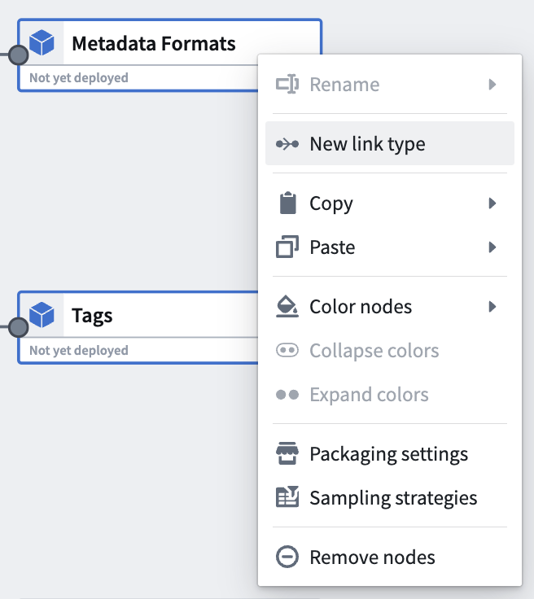
 
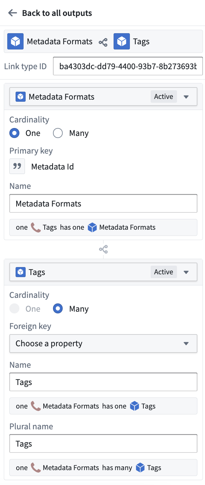

Alternatively, select a single object on the graph to create a **New link type** with one side populated.

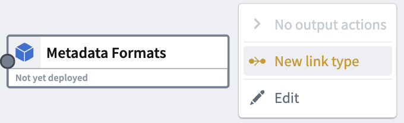
 
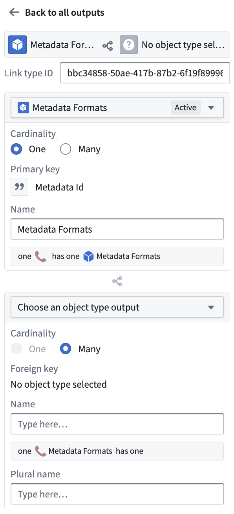

## Resolve Ontology validation errors

Users may make pipeline changes that result in validation errors in the Ontology. Some examples of errors include:

* Conflicting changes made to the same object type or link type in both Pipeline Builder and Ontology Manager.
* Changing the primary key of an object type that is referenced by a link type outside of the pipeline.
* Making breaking changes to an object type's schema such that a [schema migration](/docs/foundry/object-edits/schema-migrations/) is required.

Any errors will show up on the right side panel under the **Deploy this pipeline** section. In the **Errors** tab, there will be a message describing what type of resolution needs to happen before deployment.

You must resolve these errors before you are able to deploy your pipeline.

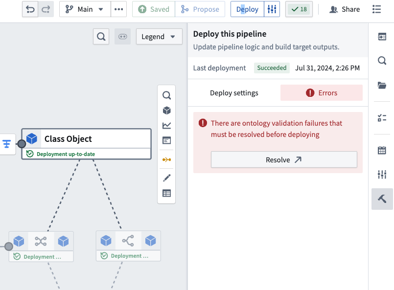

When the **Resolve** button displays an arrow, selecting it will take you to Ontology Manager to resolve validation errors. Otherwise, you will be able to resolve the errors directly in Pipeline Builder.

### Resolve merge conflicts in Ontology Manager

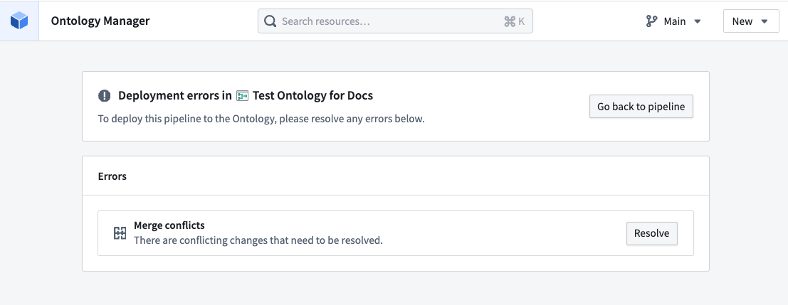

Follow the prompts in Ontology Manager to apply the merge conflict resolutions. If your changes affect potential edits, you can decide whether to drop edits or make your edits compatible with the latest version of the object. Otherwise, no additional specifications are needed for the merge conflict to be resolved, and you can select **Apply**.

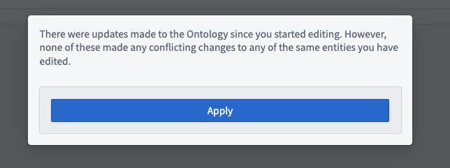

Once changes are applied, the Ontology will be updated with the latest changes and you can select **Go back to pipeline**.

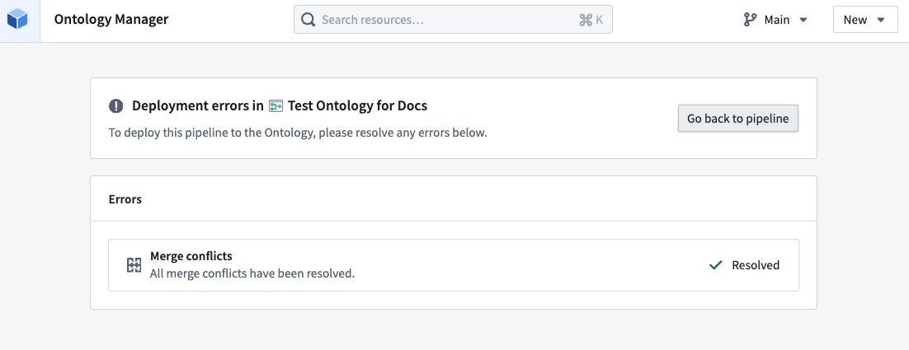

After resolving conflicts, you may occasionally encounter the error `Ontology type outputs are out of date with the ontology` when returning to your pipeline. This is because the pipeline has yet to pick up changes to your Ontology outputs made through the conflict resolution workflow above.

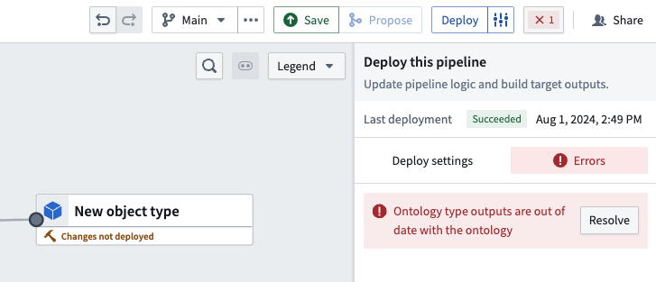

Selecting **Resolve** should fix this issue and allow you to deploy your pipeline.

### Resolve conflicts in Pipeline Builder

Some Ontology validation errors do not require switching to Ontology Manager. In the example below, a schema migration is required, which happens when an object type schema in Pipeline Builder has been modified from the latest schema on the main branch of the Ontology. Select **Resolve** to choose the migration strategy directly in Pipeline Builder.

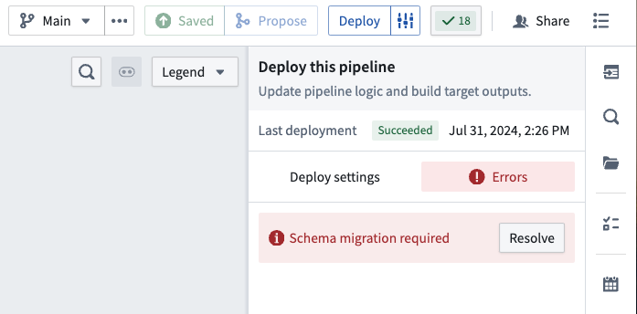

For impacted properties, you can choose whether to **Drop edits from property** or migrate your edits to make them compatible with the latest version of the property.

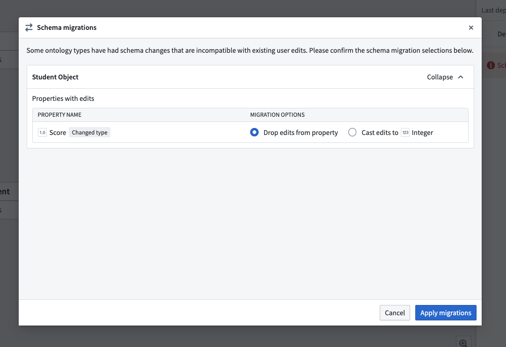

Once you have chosen the best approach, select **Apply migrations**.

## Bring object type outputs back into Pipeline Builder

You can bring object types backed by a dataset output from your pipeline into Pipeline Builder following the steps below:

On the right side panel, select the cog icon next to **Pipeline outputs**.

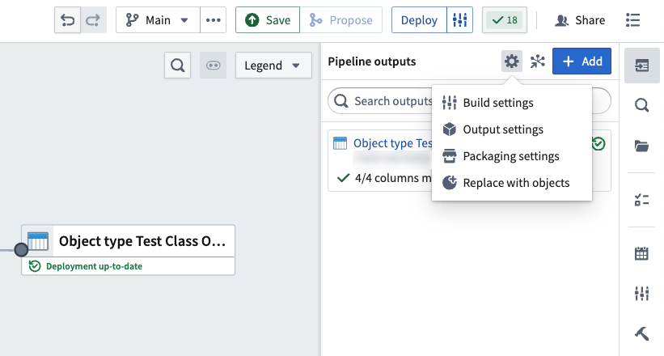

Select **Replace with objects**. This will open the **Replace datasets with ontology type outputs** dialog.

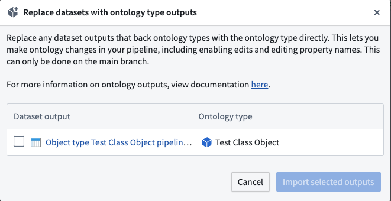

Select the dataset outputs you want to convert back to the corresponding objects in your pipeline and select **Import selected outputs**.

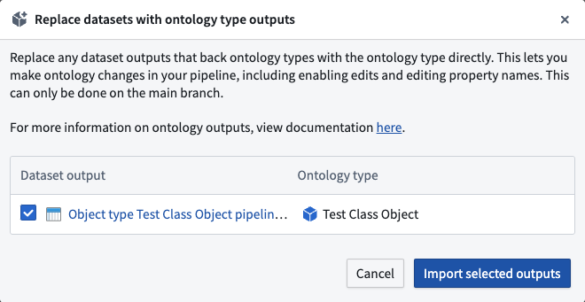

Save your changes and deploy your pipeline.

## Disown Ontology type outputs in Pipeline Builder \[Deprecated]

Disowning Ontology type outputs in Pipeline Builder will transfer management of those Ontology types to Ontology Manager. This means that all future modifications to those Ontology types will only be possible in Ontology Manager. This is useful when you need an object type configuration that Pipeline Builder does not support, such as shared property types or runtime-derived properties. To disown Ontology types, select the object types you want to disown. Any link types that reference the selected object types will automatically transfer to Ontology Manager.

:::callout{theme="warning"}
Ontology type outputs can only be replaced with dataset outputs if the latest saved version of the `main` branch was successfully deployed.
:::

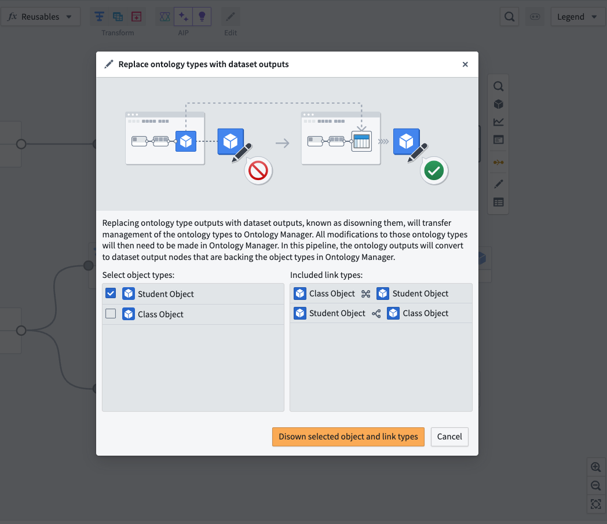

Select **Disown selected object and link types**.

In this pipeline, the *object type* output nodes will convert to *dataset* output nodes that back the object types in Ontology Manager. From the far right panel, navigate to the object type in Ontology Manager by selecting the icon next to the output.

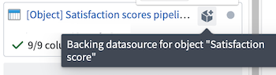

Deploy your pipeline after disowning the selected objects.

:::callout{theme="warning"}
Column names in the backing datasource must exactly match the backing column names configured for a given object type's properties. Mismatched column names will lead to missing data or broken indexing jobs. For example, a property with backing column `routeId` requires a column named `routeId` in the backing datasource.
:::

## Configure granular security permissions

You can configure granular security permissions on objects by using a **Restricted view policy** or an **Object security policy**:

* [**Restricted views**](/docs/foundry/security/restricted-views/) (RVs) enable row-level security.
* [**Object security policies**](/docs/foundry/object-permissioning/object-security-policies/) enable both row-level and column-level security.

:::callout{theme="warning"}
Object security policies in Pipeline Builder currently support a subset of features when compared with object security policies in Ontology Manager. See below for supported features.
:::

To set up your granular security policies, go to the output object and select **Configure granular security**.

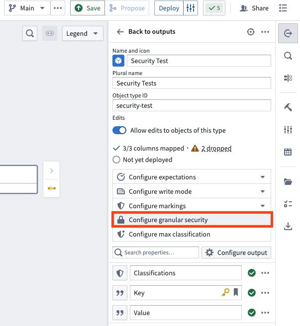

Select either **Restricted view policy** or **Object security policy** in the pop-up window.

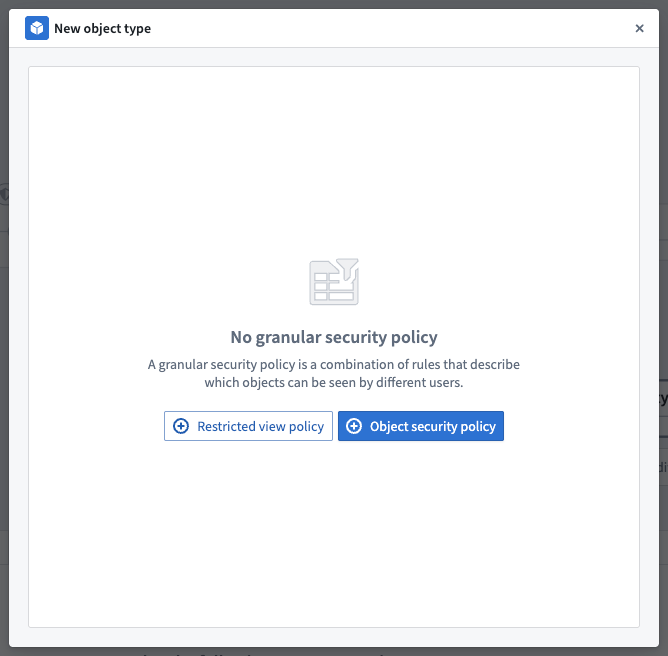

### Object security policy

The **Object security policy** option lets you configure cell level granular security using row level policies, property security policies, marking removal management, and classification changes.

By default, object security policies are applied to all properties. When a property security policy includes a property, the user must pass both the object security policy and the property security policy to view the property value.

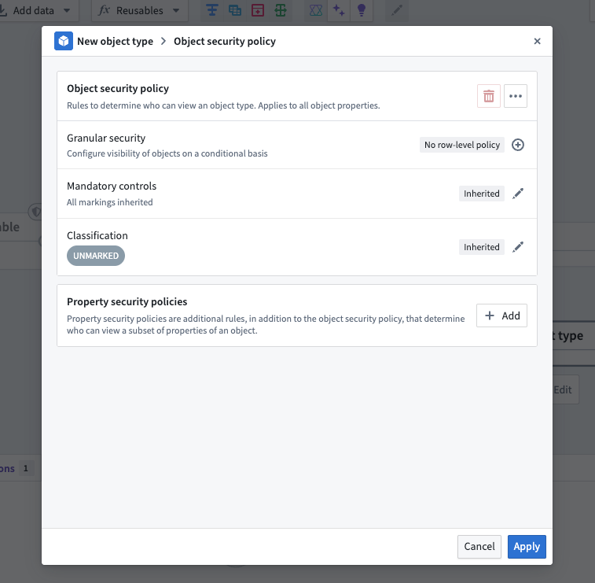

To add a row-level policy, select the plus sign (**+**) icon next to **Granular security**.

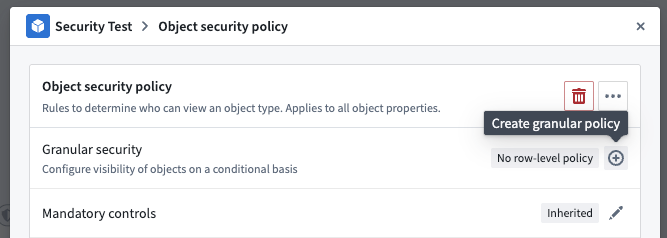

In the policy editor, you can create rules that compare property values, user properties, or constant values to define your security conditions.

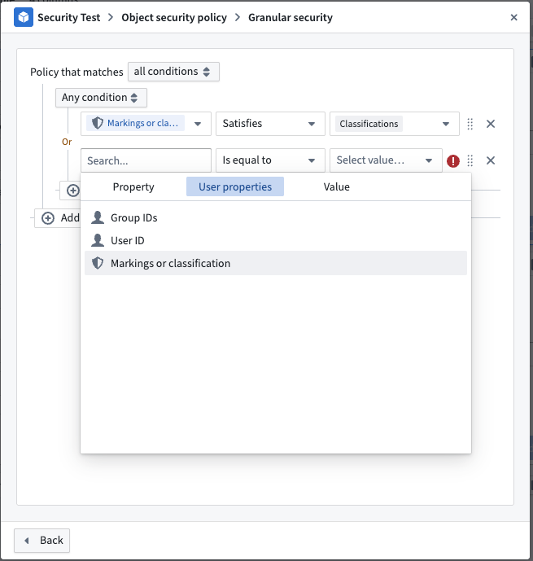

Note that to create a policy based on the **Marking or classification** user property, ensure that the value types are set to **Marking** or **Classification**.

To enforce the correct type, use the **Logical Type Cast** expression in the transform node.

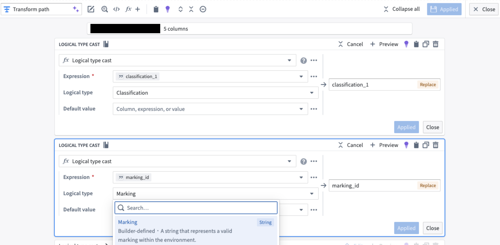

Additionally, markings and classifications must be wrapped in an array for compatibility with the ontology. Mapping a single marking or classification directly to an object property will result in an error.

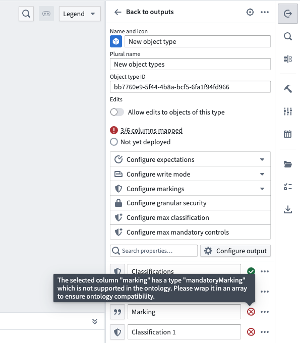

:::callout{theme="neutral"}
Markings must use the associated marking ID. Learn more about the [expected format of marking IDs](/docs/foundry/security/restricted-views/#expected-format-of-the-upstream-dataset).
:::

After configuring your granular security policy, select **Back** (bottom left) to return to the main configuration window. If no further changes are needed, select **Apply** to save your policy.

You can go to **Mandatory controls** to remove any inherited markings or **Classification** to adjust the classification.

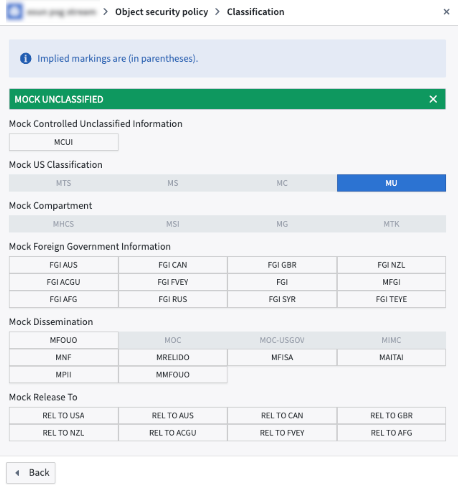

:::callout{theme="warning"}
Pipeline Builder does not currently support adjusting classifications for manually entered tables.
:::

Property security policies can be added in a similar way. Select **Add** in the **Property security policies** section. This will create a new property security policy. To configure the property security policies, select the arrow on the policy you want to edit.

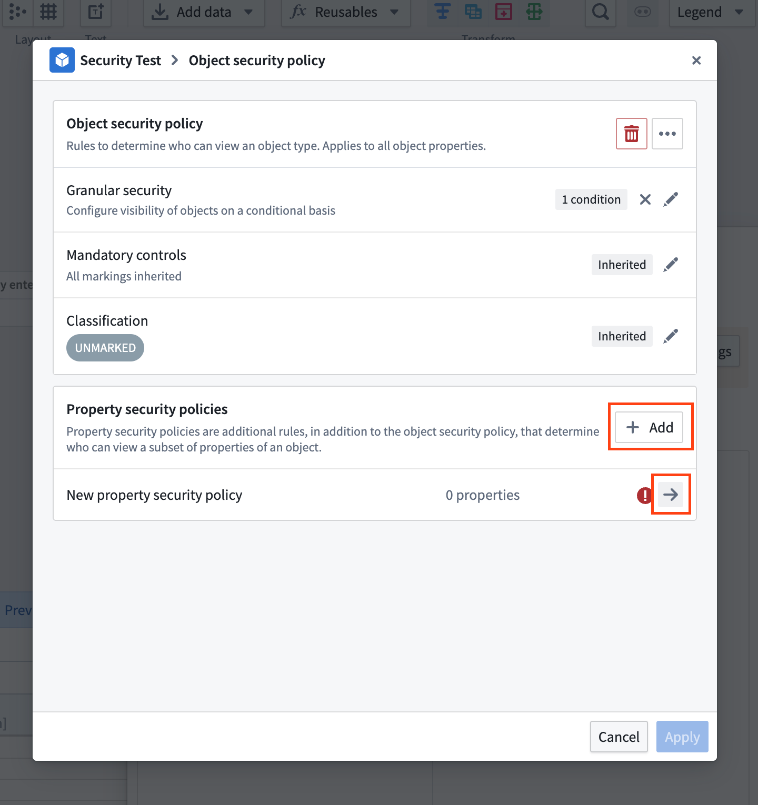

Under **Policy name**, you can rename your property security policy. Select one or more columns you want to apply this policy to under **Properties affected**, and then configure the granular security, mandatory control, or classification in the same way you would do so above.

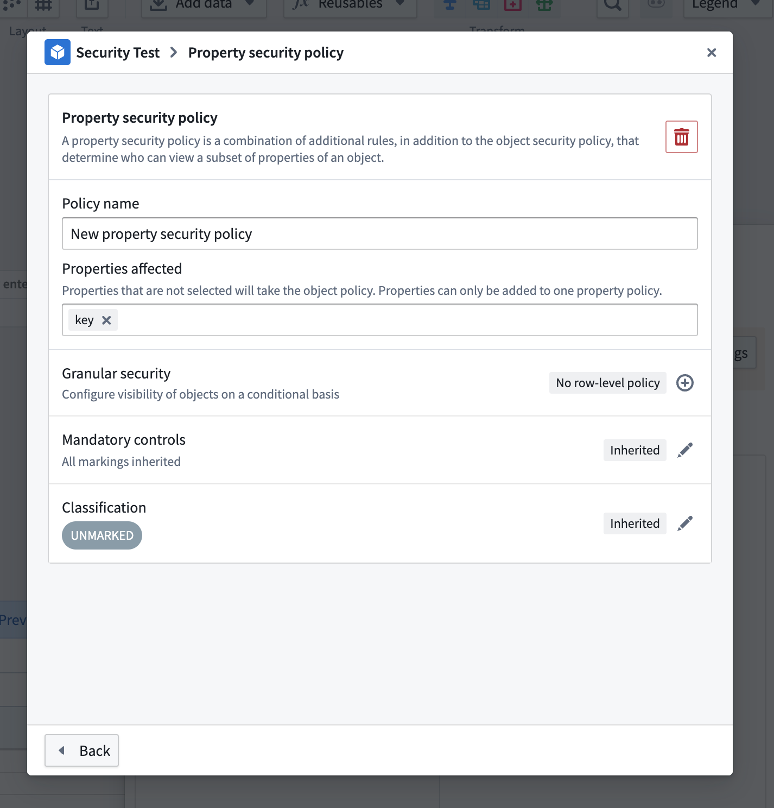

After configuring your property security policy, select **Back** (bottom left) to return to the main configuration window. Use **Apply** to save your policy.

### Restricted view policy

To configure which rows a user can view on your output, you can create a restricted view policy to apply to your object. The policy is backed by a [Restricted View](/docs/foundry/security/restricted-views/), which is built after your changes are merged and deployed to `main`.

You can configure your policy directly in the restricted view policy window. The same rules for markings and classifications apply here as stated [above](#object-security-policy). Learn more about [restricted view policies and best practices](/docs/foundry/security/restricted-views/#restricted-view-policies). You also have the option to convert the restricted view policy into an object policy for greater configurability.

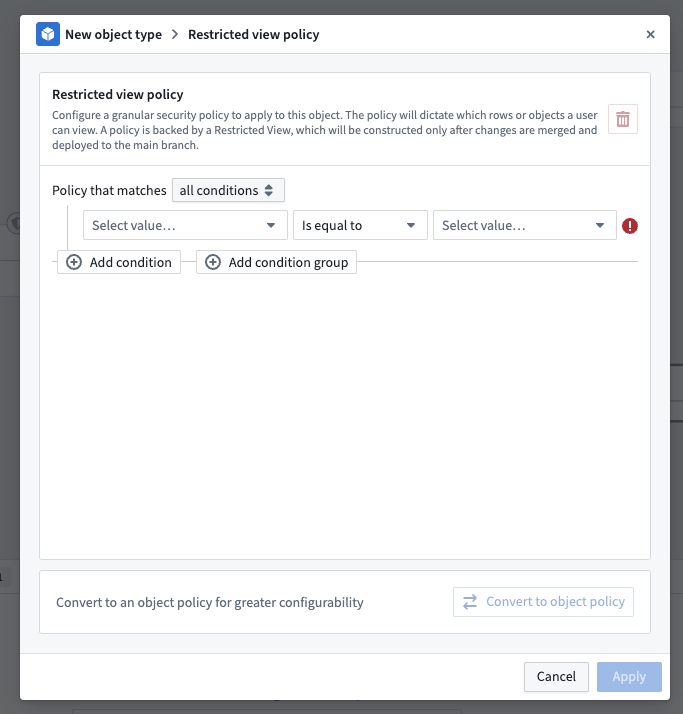

Once you have finished creating your granular security policy, save your pipeline and propose your changes. The backing security policies will only be created and go into effect after you have deployed successfully on the `main` branch.
