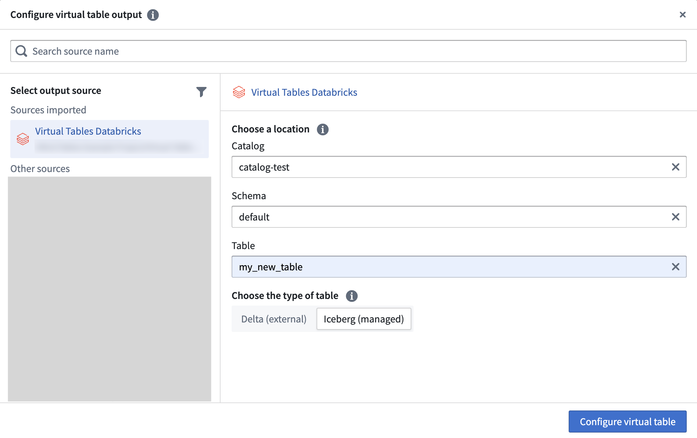

<!-- source: https://palantir.com/docs/foundry/pipeline-builder/outputs-add-virtual-table-output/ · mirrored 2026-08-18 from Palantir Foundry docs -->

# Add a virtual table output

You can choose to add a virtual table output in Pipeline Builder to guide your pipeline integration towards clean, transformed data that is stored outside of Foundry. Learn more about [different output types](/docs/foundry/pipeline-builder/outputs-overview/).

:::callout{theme="warning"}
Branching does not support virtual table outputs.
:::

:::callout{theme="warning"}
Pipelines must include at least one Foundry dataset output. Virtual table outputs are not treated as Foundry dataset outputs, so pipelines with only virtual table outputs will fail to deploy with the error `Job has no foundry output datasets`. Ensure you add at least one dataset output to your pipeline before deploying.
:::

## Create a virtual table output

First, select **Add** next to the virtual table type in the outputs panel to the right of the graph.

Next, select the source to which you would like to write your new table. Sources that have already been used in your pipeline (for example, any input virtual table's associated sources) will show up under **Sources in this pipeline** for ease of use. You will only be able to select source types [currently supported by virtual tables](/docs/foundry/data-integration/virtual-tables/#supported-sources). Sources must also have exports enabled in the [export configuration settings in Data Connection](/docs/foundry/data-connection/export-overview/).

Configure the external location. Follow the [source documentation](/docs/foundry/data-integration/source-type-overview/) and any requirements listed there for configuring where virtual tables will be stored in the source type you have chosen.

From here, you can [follow the same steps as adding a dataset output](/docs/foundry/pipeline-builder/outputs-add-dataset-output/), though please note that configuring [write modes](/docs/foundry/pipeline-builder/outputs-add-dataset-output/#configure-write-mode) and [write formats](/docs/foundry/pipeline-builder/outputs-add-dataset-output/#dataset-write-format) are not supported for virtual tables.
