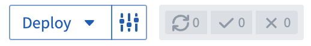
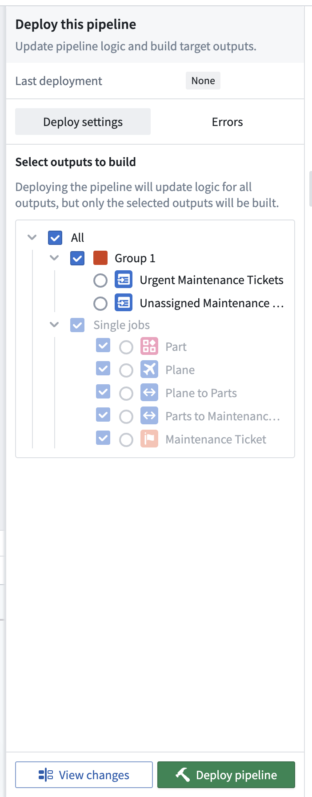
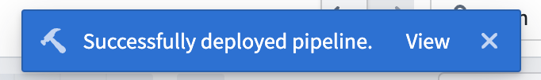
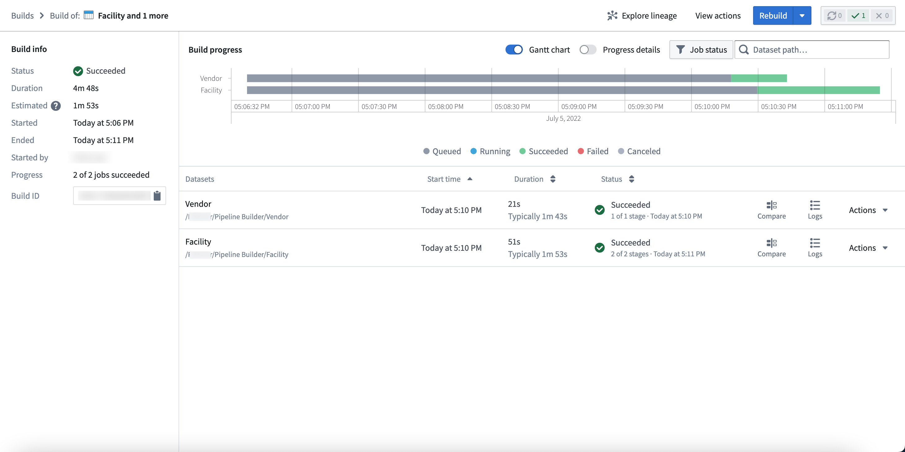
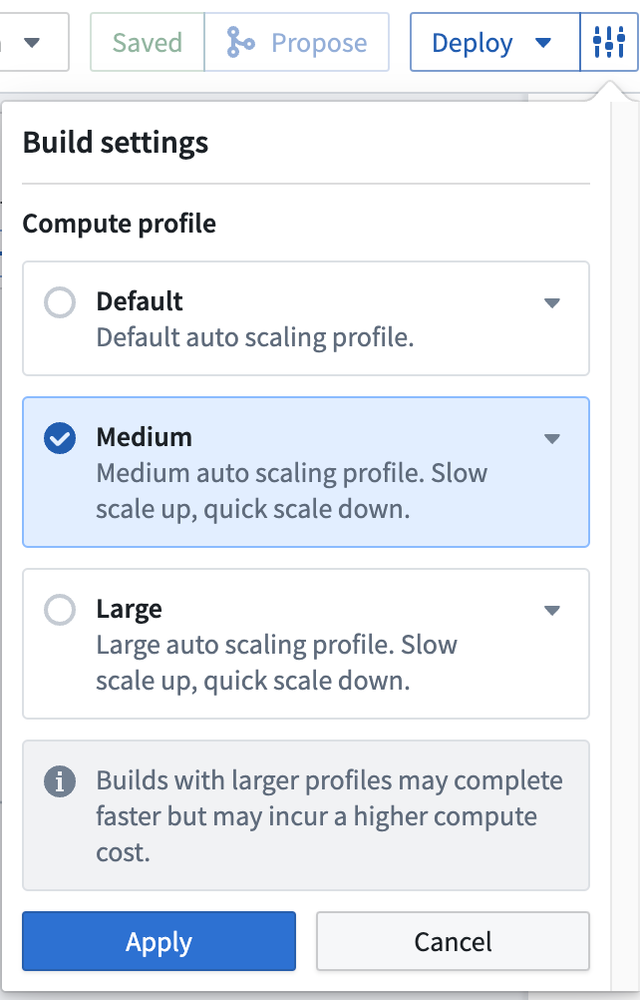
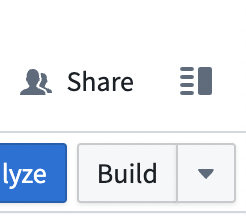
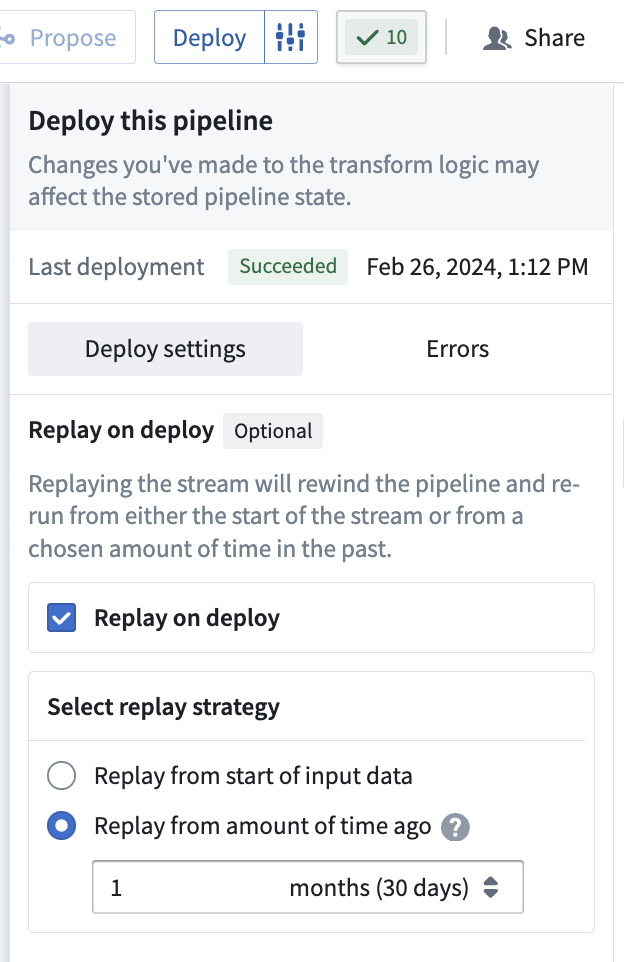

<!-- source: https://palantir.com/docs/foundry/pipeline-builder/outputs-deliver-pipeline/ · mirrored 2026-08-18 from Palantir Foundry docs -->

# Deliver pipeline

Once you finish describing your pipeline in Pipeline Builder and resolving schema errors, you are ready to deliver your pipeline.

## Deploy vs. build

A deploy updates the logic on your pipeline outputs and a build executes that logic to materialize logic changes.

Builds can be time and resource intensive, especially if your data scale is large or if you are reprocessing the entirety of your pipeline's inputs. For this reason and others, you might choose to deploy your pipeline without building. By choosing only to deploy, you can defer the cost of the build until building is necessary.

## Delivering changes

If you want to deliver your first end-to-end pipeline and include all defined logic, select **Deploy** in the right of the top toolbar.

You can choose which outputs to build after your logic changes are deployed. Builds are done per [job group](/docs/foundry/pipeline-builder/management-job-groups/), meaning you can optionally build all outputs in any given job group or individual outputs that are ungrouped. Ungrouped outputs are displayed in a dedicated **Single ungrouped jobs** section in the **Build settings** panel for easy identification. Ontology type outputs must always be built, meaning any job group with an Ontology type output must be built.

After successfully initiating a deployment, a blue banner will appear at the top of your graph. Select **View** to access the **Build details** view.

In the **Build details** view, you can find build information, progress metrics, and build schedule details.

* **Build info:** Shows the status, total duration, and estimated duration of your pipeline. You can also view a variety of metadata, including the start and end times, initiating user, progress within a job list, and build ID.

* **Build progress:** Displays details of the pipeline build over time as a Gantt chart.

* **Build schedule:** Displays the name, frequency, status history, and last modified date of the pipeline build schedule.
  * Learn more about [creating a build schedule](/docs/foundry/pipeline-builder/schedules-create-schedule/).

* **Progress details:** Toggle to see whether the build is starting, waiting in the Project's resource queue, initializing Spark application, running, or finishing.

### Replay strategy information

When a deployment involves breaking state changes, Pipeline Builder displays replay strategy information in the deployment timeline. You can view whether breaking changes were detected and which replay strategy was selected. This information appears as a task row in the deployment event details, helping you understand what replay decisions were made during deployment.

For more information on breaking changes and replay strategies, refer to the documentation on [breaking changes](/docs/foundry/pipeline-builder/breaking-changes/).

## Build settings

You can choose to edit the **Build settings** of your pipeline by clicking the settings icon next to **Deploy**. Choose from the following compute settings:

* **Default:** The default auto scaling profile. It uses the least amount of executor cores and memory.
* **Medium:** Offers a slow scale up and quick scale down compute.
* **Large:** Offers a slow scale up and quick scale down compute.
  * Note: Builds with larger profiles may complete faster but incur a higher compute cost.

For more advanced configuration options, including profile management strategies such as managed profiles and warm pool profiles, see the [Build settings](/docs/foundry/pipeline-builder/management-build-settings/) documentation.

:::callout{theme="neutral"}
If your pipeline includes transforms with expensive computations due to models, such as embeddings or LLMs, Pipeline Builder displays warning messages to alert you. These warnings guide you to the Build settings menu where you can configure appropriate compute resources for optimal performance.
:::

## Save

In Pipeline Builder, you can choose to save changes to your pipeline without initiating a deployment. This flexibility allows you to edit your workflow without committing logic changes to production.

After making a change to your workflow, select **Save** in the top toolbar.

If you click **Propose** first, the current state will be automatically saved.

:::callout{theme="neutral"}
If you only save your changes without deploying them, your pipeline logic will **not** update to the latest changes. You must deploy the pipeline to capture changes to transform logic.
:::

## Build from an output node

You can also choose to start a build of your pipeline even when you navigate outside the pipeline graph. For instance, you can open a dataset preview by right-clicking on the output node and selecting **Open**. You can then initiate a build by clicking **Build** in the upper right corner of the interface.

:::callout{theme="neutral"}
The Build option outside the pipeline graph will not update the pipeline logic with any changes made since the last deployment. To update logic and push to output, return to the pipeline graph and use **Deploy**.
:::

## Additional options for streaming pipelines

If you are running a streaming pipeline, additional options will be available to you. Note that streaming pipelines are only available on some accounts. For more information, contact your Palantir representative.

You can use **Replay on deploy** if necessary to instruct your pipeline to begin computation from a specific historical point in time.

To protect against unexpected downtime from accidental stream replays, the **Advanced settings** section of the **Deploy pipeline** panel is collapsed by default with all replay options unselected. This protects both streaming and incremental snapshot workflows, with or without state breaks.

Once you expand the **Advanced settings** section, explicit replay consequences are displayed, requiring deliberate action to reprocess a selected subset of data and reset all stateful transforms.

In the **Deploy** window, choose the start time for data processing in your pipeline delivery:

* **Start of input data:** All data from the start of your input stream will be processed.
* **From a specified time:** Select the time value from when you would like data to be processed. Any data from before this time will not be processed. For example, to *only* include data from the last two months, select `2 months` ago.

After selecting a replay strategy, a **Confirm replay strategy** modal appears to explain the strategy and identify any downstream effects before execution.

:::callout{theme="danger" title="Danger"}
Replaying your pipeline could lead to lengthy downtimes, possibly as long as multiple days. When you replay your pipeline, your stream history will be lost and all downstream pipeline consumers will be required to replay.
:::

When a state break occurs, Pipeline Builder moves the replay to the **Errors** tab and blocks pipeline deployment until the break is fixed.

For more information on replays, refer to the documentation on [breaking changes](/docs/foundry/pipeline-builder/breaking-changes/).

### Redeploy vs. replay

Stream redeployment refers to the process of resuming a streaming job from a previously saved checkpoint. When a streaming job is paused or stopped, a bookmark is created within the data, indicating the position up to which records have been read. Bookmarks, also called checkpoints, are also created periodically while a stream is running. This enables recovery in case the stream encounters a failure for any reason.

By doing so, when the stream is restarted, it resumes processing from that specific checkpoint. During redeployment, the existing output streams are preserved, and new data is appended to them.

On the other hand, stream replay entails generating a new view of the output stream. Establishing a new view on the dataset is considered as a new stream containing fresh data; however, accessing data from a prior view is still possible. Various situations may necessitate or provide advantages for stream replay, including the following:

* If you modify the logic in your Pipeline Builder pipeline and require the output data to adhere to the updated logic, replaying the stream can facilitate this by restarting the processing either from the beginning or from a specified point in time. This ensures that the output stream's data aligns with the updated transformation rules.
* In case of breaking changes, a replay will be enforced. More details can be found in the [breaking changes](/docs/foundry/pipeline-builder/breaking-changes/) documentation.
* If an input stream in your pipeline has been replayed, you must also replay the downstream pipeline as well to maintain data consistency in the output stream.

:::callout{theme="warning"}
When an upstream pipeline runs in the default "reset on replay" mode, its output dataset is cleared and repopulated only with the reprocessed data window. In this case, replay your downstream pipeline from the **Start of input data** rather than from a specified time matching the upstream replay duration. This ensures that downstream outputs are rebuilt correctly for the entire reprocessed period without creating duplicate records.
:::

Be aware that replaying a pipeline may result in extended downtimes, which could last several days depending on the replay starting point. When you replay a pipeline, all data in the output stream is lost. If you wish to retain the data from the previous stream, you can direct the output to a new destination. However, if you intend to push records to the original output stream in the future, you will need to replay the pipeline.

To redeploy a stream, follow the same procedure used for the initial deployment; select **Deploy** in the Pipeline Builder interface.

To replay a stream, add the additional setting to either replay from **Start of input data** or **From a specified time**.
