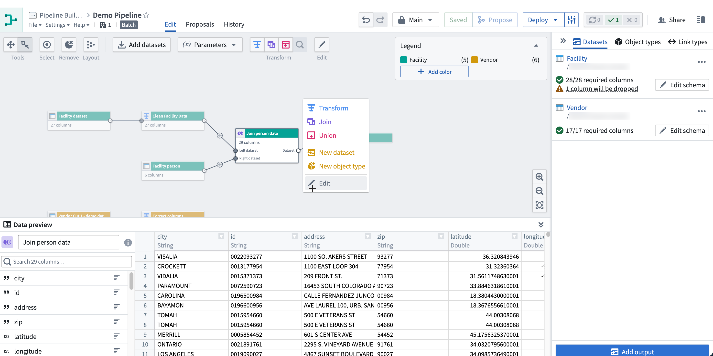
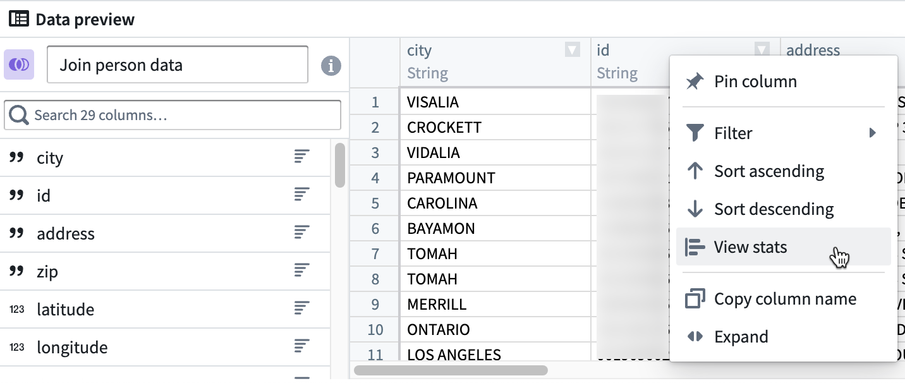
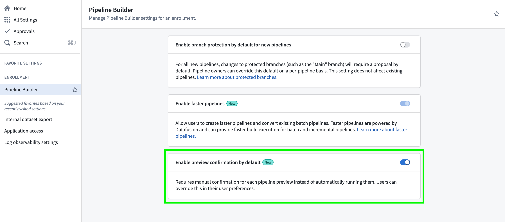
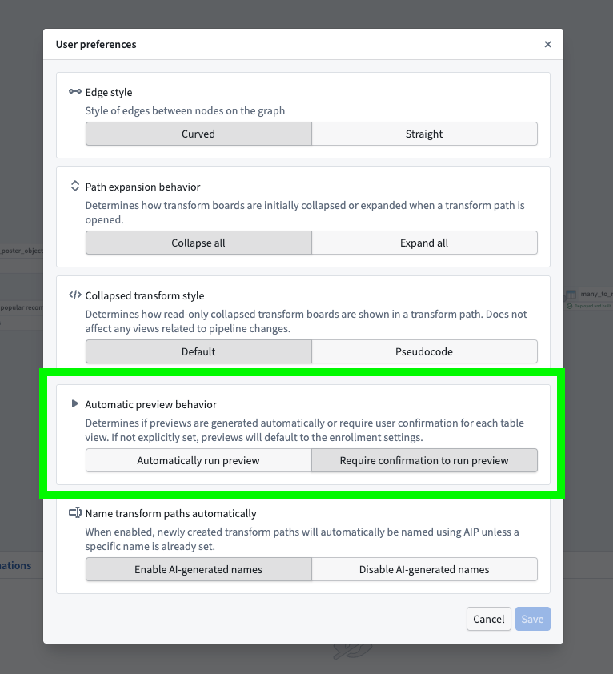

<!-- source: https://palantir.com/docs/foundry/pipeline-builder/outputs-preview-pipeline/ · mirrored 2026-08-18 from Palantir Foundry docs -->

# Preview pipeline

The preview panel allows you to preview logic and column statistics for a single selected node in your pipeline. When you select a node, this will open the preview panel and run the logic from raw datasets up until the selected node.

You can also expand the preview panel by clicking on the icon in the bottom right of the graph. Then, click on a node to preview data.

To view statistics, right-click on a column and click **View stats**.

For string columns, the statistics view includes histograms of values and value lengths and counts of string casing, whitespace, and null instances. For numeric columns, a distribution of values is displayed along with basic statistics such as min, max, mean, standard deviation, and number of distinct values.

To view the row count, select **Calculate row count** in the bottom right of the preview panel.

## Timezone selection for timestamp columns

When previewing a transform output node that contains a timestamp column, the preview toolbar displays a timezone picker. Selecting a timezone re-renders timestamp values in the chosen timezone, allowing you to verify how your data will appear in different time zones.

The timezone selection is shared across all preview types (dataset preview, SQL preview, and transform output preview), so a timezone chosen in one preview persists across the others within the same session. The timezone picker is hidden when the output schema does not contain a timestamp column.

## Configuring Preview Behavior

By default, previews will run automatically. However, administrators can set a default preview behavior at the enrollment level, and users can override this by setting their own preview preferences in their user preferences or pipeline settings.

To set a default preview behavior at the enrollment level:

1. Go to **Control Panel**.
2. Navigate to **Pipeline Builder**.
3. Toggle on **Enable preview confirmation by default** if you want users to manually confirm each time a preview is run.

:::callout{theme="warning"}
If a user has any preview setting set in Pipeline Builder, this will override the enrollment-level setting.
:::

In the Pipeline Builder application, each user can set their own preview preference which will take precedent over the enrollment-level setting. To do this, open Pipeline Builder and:

1. Go to **Settings** and then **User preferences**.
2. Under **Automatic preview behavior**, choose between allowing all your pipelines to **Automatically run preview** or **Require confirmation to run preview**.

This only changes the setting at the user level, so all pipelines you view within that enrollment will follow your selected preference.

## Preview row counts

By default, Pipeline Builder will process up to 500 rows in the preview table. This implementation may only require 500 input rows in the dataset, but many operations such as **Filter**, **Joins** and **Drop Duplicates** can require additional rows to produce a preview of 500 rows.

To speed up previews, [add an input sampling strategy](/docs/foundry/pipeline-builder/management-input-sampling/) to limit the number of input rows available for computing previews. Available strategies include percentage-based sampling and, for file datasets, filtered preview which allows you to filter on columns generated from file metadata. Input sampling strategies only affect previews and have no effect on builds.

Row count and statistic calculations are run across the sampled input. This means that if the full dataset is used, the row count and stats will match a full build; however, if a sample strategy is set to only use part of the input dataset, the row counts and stats will only be computed across this sample.

As an example, suppose we have an input dataset with 600 rows:

| id  | value   |
|-----|---------|
| 1   | row\_1   |
| 2   | row\_2   |
| ... | ...     |
| 600 | row\_600 |

Our preview will be limited to 500 rows. Note that these might not necessarily be the first 500 rows of the input.

| id  | value   |
|-----|---------|
| 1   | row\_1   |
| 2   | row\_2   |
| ... | ...     |
| 500 | row\_500 |

After setting an input strategy of a small percentage, the input will be limited to a small sample that can speed up preview compute. Suppose we are left with just six rows in our preview:

| id   | value   |
|------|---------|
| 1    | row\_1   |
| 12   | row\_12  |
| 33   | row\_33  |
| 62   | row\_62  |
| 126  | row\_126 |
| 527  | row\_527 |

If we then use a transform to add a constant column `hello` with value `world`, the preview will show the transform computed for our six sampled rows:

| id   | value   | hello |
|------|---------|-------|
| 1    | row\_1   | world |
| 12   | row\_12  | world |
| 33   | row\_33  | world |
| 62   | row\_62  | world |
| 126  | row\_126 | world |
| 527  | row\_527 | world |

Computing the row count will return six rows, and any stats will be computed across only these six rows.

When we finally build our pipeline, the sampling strategy will have no effect, and our transform will be computed across the full 600 input rows.
