<!-- source: https://palantir.com/docs/foundry/pipeline-builder/pipeline-builder-llm/ · mirrored 2026-08-18 from Palantir Foundry docs -->

# Use LLM node in Pipeline Builder

The Use LLM node in Pipeline Builder offers a convenient method for executing Large Language Models (LLMs) on your data at scale. The integration of this node within Pipeline Builder allows you to seamlessly incorporate LLM processing logic between various data transformations, simplifying the integration of LLMs into your pipeline with no coding required.

The Use LLM node includes pre-engineered prompt templates. These templates provide a beginner-friendly start to using LLMs that leverages the expertise of experienced prompt engineers. You can also [run trials](#trial-runs) over a few rows of your input dataset to iterate on your prompt before running your model on an entire dataset. This preview functionality computes in seconds, speeding up the feedback loop and enhancing the overall development process.

To use, users must be [granted permission for AIP capabilities for custom workflows](/docs/foundry/aip/enable-aip-features/#aip-and-capabilities-for-custom-workflows) by a platform administrator.

## Select a dataset

To apply an LLM to a dataset, select a dataset node in your workspace and select **Use LLM**.

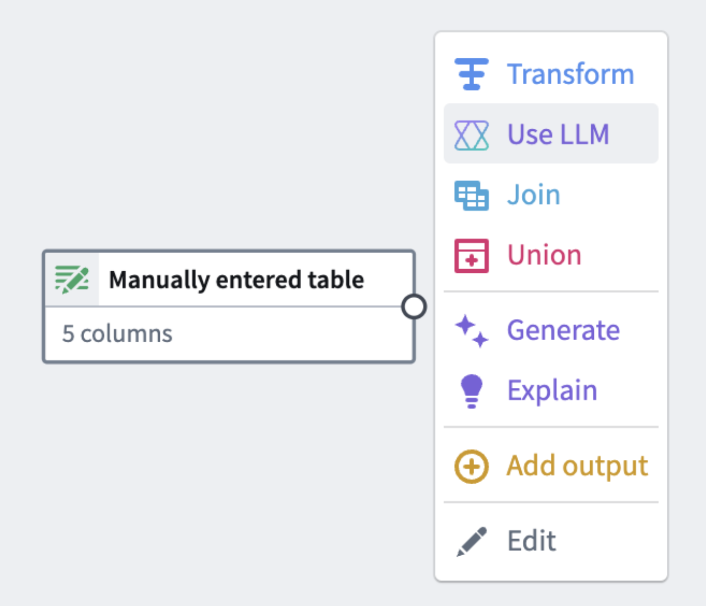

## Select a model

The Use LLM node supports both Palantir-provided models and registered models. Palantir-provided models are available by default and include options such as GPT-4o and other supported LLMs.

Alongside Palantir-provided models, the Use LLM node supports [registered models](/docs/foundry/aip/bring-your-own-model/) backed by a [REST API source in Data Connection](/docs/foundry/aip/rest-api-backed-models/) or a [compute module](/docs/foundry/aip/compute-module-backed-models/). Select the **Registered** tab in the model selector to choose one of your registered models.

## Select prompt

Below are different examples of the available template prompts. To create your own, select **Empty prompt**.

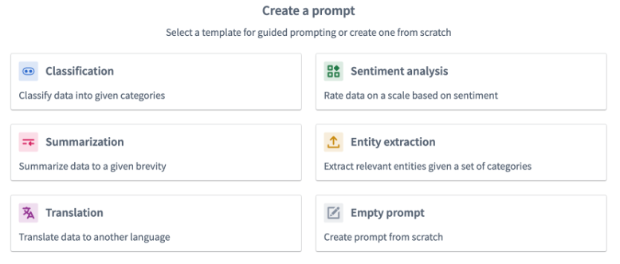

### Classification

You should use the classification prompt when you want to categorize data into different categories.

The example below demonstrates how the prompt would be filled out for our notional objective of classifying restaurant reviews into three categories: Service, Food, and Atmosphere.

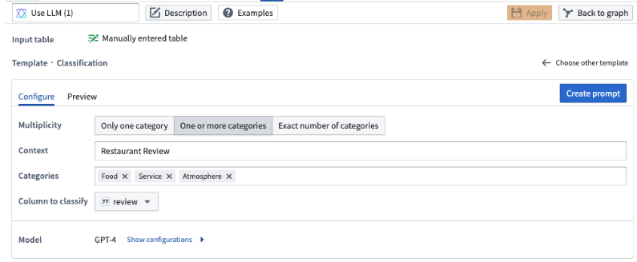

The **Multiplicity** field allows you to choose whether you want the output column to have one category, multiple categories, or an exact number of categories. In our example, we want to include all the categories a review could fall in to, so we will choose the **One or more categories** option.

In the **Context** field, enter a description for your data. In our example, we will input `Restaurant Review`.

In the **Categories** field, input the distinct categories to which you want to assign your data. In our example we specify the three categories: `Food`, `Service`, and `Atmosphere` because we want to categorize our restaurant reviews into any of these three categories.

In the **Column to classify** field, choose the column that contains the data you want to classify. In our example, we choose the `review` column because that is the column containing our restaurant reviews.

### Summarization

You can use the summarization template to summarize your data to a given length.

In this template, you can specify the length of the summarization. You can choose the number of words, sentences, or paragraphs and specify the size in the **Summarization size** field.

In our example, we want a one sentence summary of the restaurant review, so we specify `1` as the summarization size, and we choose **Sentences** from the dropdown.

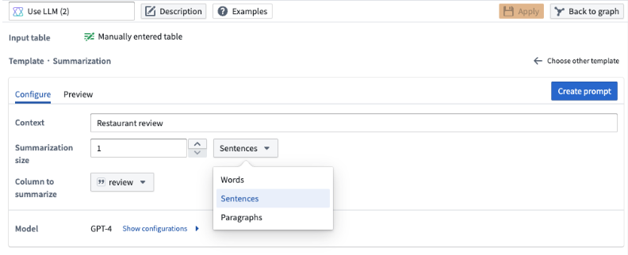

### Translation

To translate your data into a different language, use the translation prompt. Specify the language you want to translate the data to in the **Language** field. In our example below, we want to translate the restaurant reviews to Spanish, so we specify `Spanish` under the **Language** field.

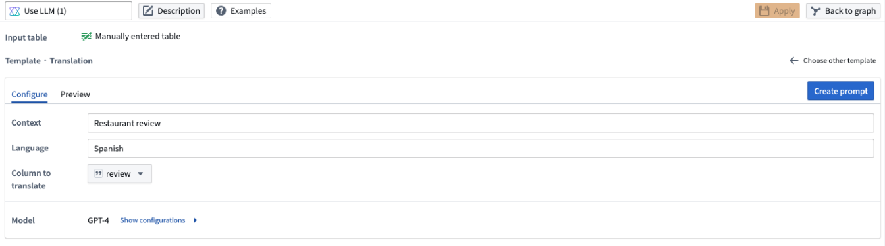

### Sentiment analysis

Use the sentiment analysis prompt when you want to assign a numeric score to your data based on its positive or negative sentiment.

In this template, you can configure the scale of the output score. For our example below, we want a number from zero to five where five denotes a review being the most positive and zero being the most negative.

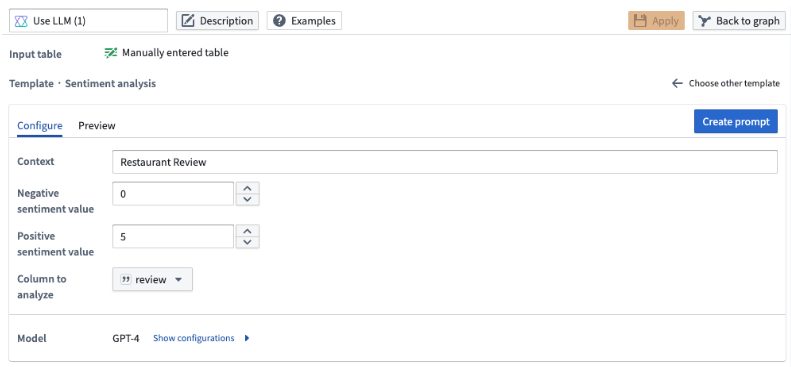

### Entity extraction

Use the entity extraction prompt when there are specific elements you want to extract from your data. In our example, we want to extract all the `food`, `service`, and `times visited` elements in our restaurant reviews.

In particular, we want to extract all food elements in a **String Array**, the service quality as a **String**, and an **Integer** denoting the number of times that person has visited the restaurant.

To obtain those results, we update the **Entities to extract** field. Enter `food`, `service`, and `number visited` under **Entity name** with the following properties:

* For `food`, specify an `Array` for the **Type** and select `String` as the type for that array.
* For `service`, select `String` as the type
* For `number visited`, select `Integer`.

The LLM output is now configured to conform to our specified types for this example.

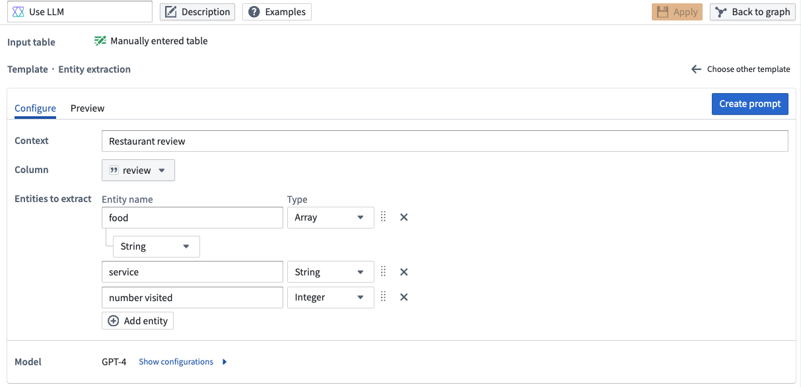

You can also adjust the types of the extracted entities within the struct under the **Output type** on the prompt page.

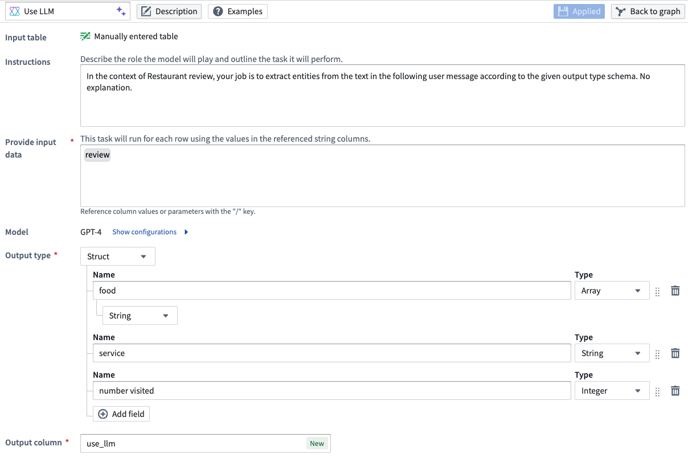

### Empty prompt

If none of the prompt templates fit your use case, you can create your own by selecting **Empty prompt**.

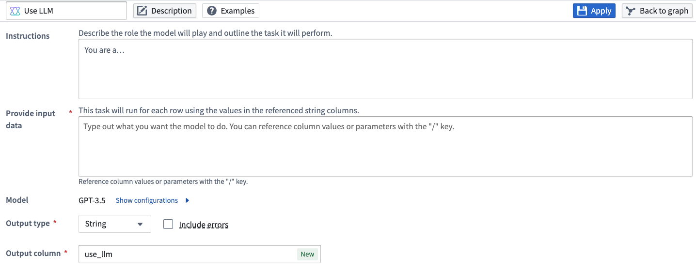

### Vision

Pipeline Builder also supports vision capabilities, allowing vision compatible models to analyze images and answer questions based on visual input. To check whether a model has vision capabilities,  check for the **Vision** label under the **Capability** of the model in the model selector.

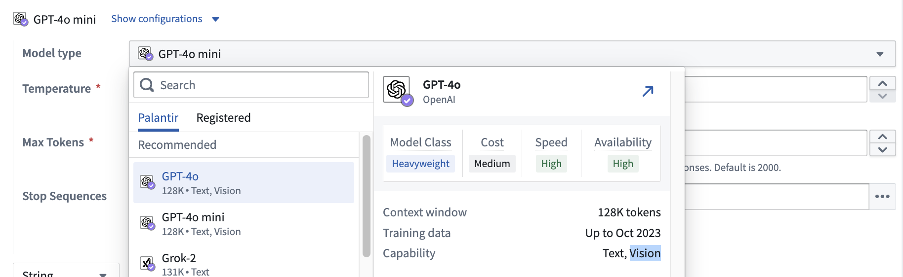
To use vision functionality, enter the media reference column in the **Provide input data** section of an empty prompt template and select the desired vision model.

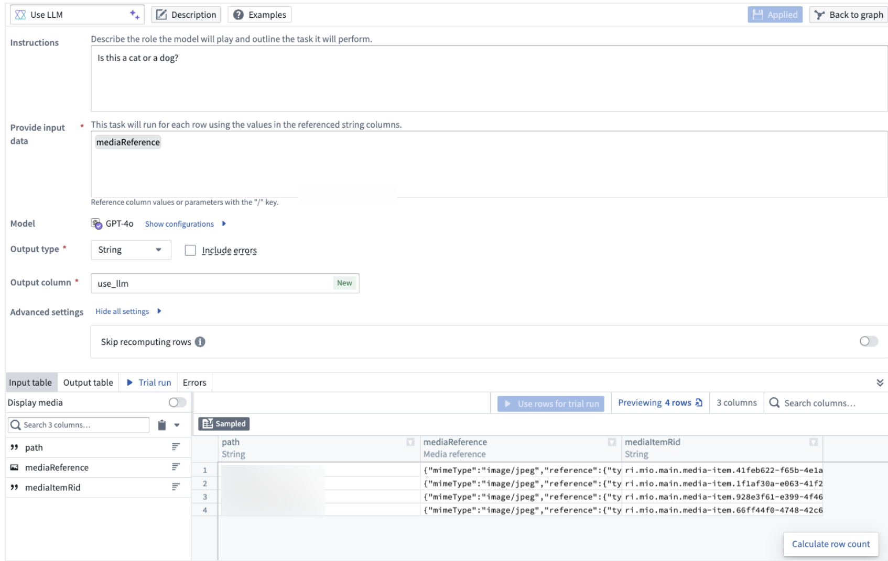

:::callout{theme="neutral"}
Currently, the vision prompt does not support media sets as a direct input. Use the **Convert Media Set to Table Rows** transform to get the `mediaReference` column that you can feed into the **Use LLM** node.
:::

## Optional configurations

### Output types

On the prompt page, you can designate the desired output type for your LLM output to conform to. Select the **Output type** option located near the bottom of the screen, then choose the preferred type from the dropdown menu.

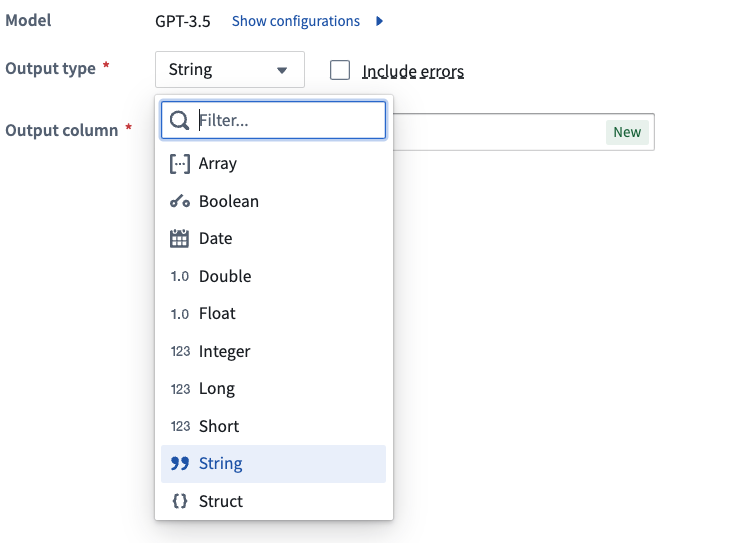

#### Struct output parsing behavior

When you configure the Use LLM node to output a struct type, the node uses strict parsing to convert the LLM's response into the specified schema. If the LLM output does not conform to the expected struct schema, the node fails with an error such as `Cannot coerce to provided output type.`

This strict behavior is intentional for non-interactive pipeline flows, ensuring that schema mismatches are surfaced clearly rather than silently producing incorrect data.

If you encounter coercion errors, a practical workaround is to configure the Use LLM node to output a JSON string instead of a struct, then use a subsequent transform to parse that string into your desired struct type. This approach gives you more control over how parsing errors are handled within your pipeline.

### Include errors

Also on the prompt page, you can configure your output to show the LLM errors alongside your output value. This configuration will change your output type to a struct consisting of your original output type and the error string. To include the LLM error, tick the box next to **Include errors**.

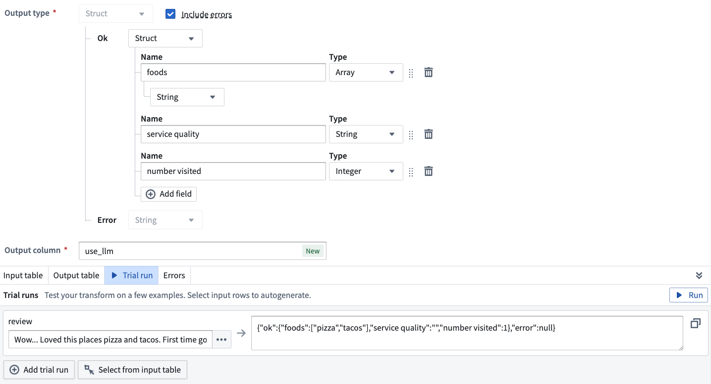

To change your output back to the original output without errors, untick the **Include errors** box.

### Skip computing already processed rows

To save on compute costs and time, you can skip computing already processed rows by toggling **Skip recomputing rows**.

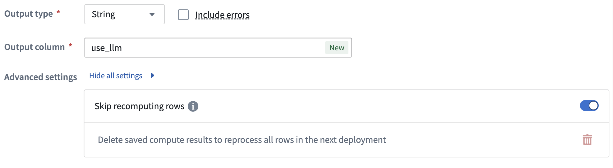

When **Skip recomputing rows** is enabled, rows will be compared with previously processed rows based on the columns and parameters passed into the input prompt. Matching rows with the same column and parameter values will get the cached output value without reprocessing in future deployments. The cache key is formed from the values of only those columns that are actually used in the prompt—if a row differs in a column that is not part of the input prompt, it will still match the cache and reuse the previously computed output.

:::callout{theme="warning"}
**Skip recomputing rows** will not apply to rows whose output value in the previous deployment was either an error or *null*. In such cases, those rows will be recomputed on the next run.
:::

:::callout{theme="warning"}
**Input rows must be deterministic between builds.** The caching mechanism identifies rows using a hash based on the selected input columns and the specific row. If upstream transformations such as deduplication produce different physical rows between builds—even if the logical values are the same—the cache will not be used. To ensure caching works correctly, make sure any deduplication or filtering steps upstream of the LLM node are deterministic, for example by using window functions to consistently select the same representative row.
:::

The cache for a Use LLM node is stored in a Foundry dataset with effectively no practical row-count limit, supporting large-scale use cases with tens of millions of rows as long as inputs are deterministic and the same rows are seen across builds.

The cache can be cleared if changes that require all rows to be recomputed are made to the prompt. A warning banner will appear over the LLM view.

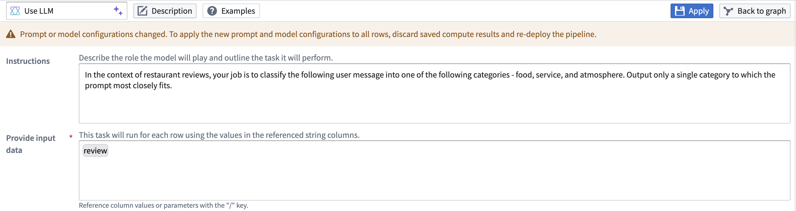

To clear the cache, select the red wastebasket icon. If the cache is cleared, a snapshot will be triggered and all rows will be reprocessed in the next deployment.

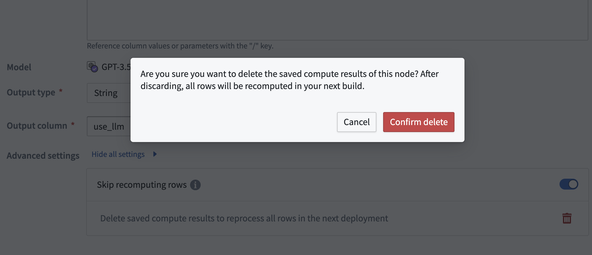

The cache will automatically be cleared if the output type is changed. When this happens, a warning banner will appear. If this was a mistake, you can select **undo change** in the banner.

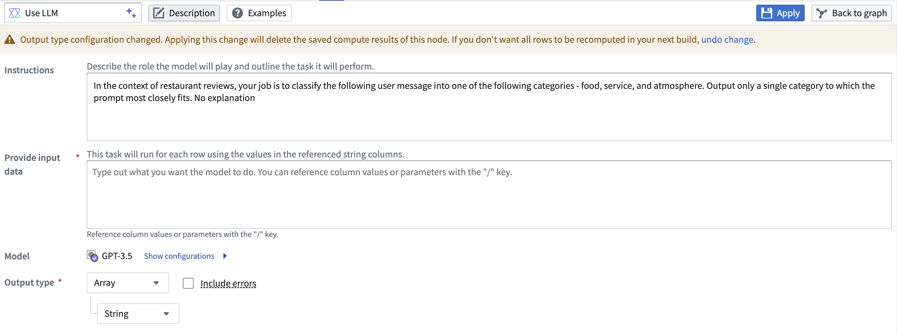

Any changes to the cache's state will show up in the **Changes** page when merging a branch.

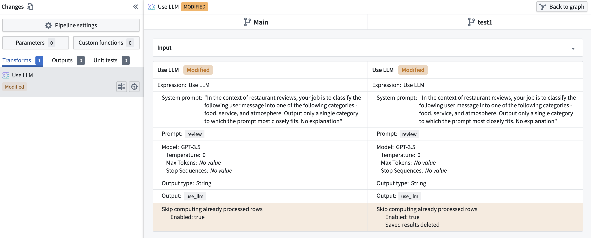

If a use LLM node with multiple downstream outputs has **Skip recomputing rows** enabled, you must put these outputs in the same job group. Otherwise, you will get the following error when attempting to deploy:

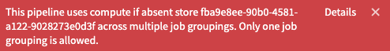

[Create a new job group](/docs/foundry/pipeline-builder/management-job-groups/) outside of the default job group to fix this error.

## \[Advanced] Show configurations for model

For every prompt, you can configure the model being used for that Use LLM node:

* **Model Type:** The model type of the GPT instance, such as `3.5` or `4`. The Use LLM node also supports open source models like Mistral AI's Mixtral 8x7b.
* **Temperature:** Higher value temperatures will make the output more random while lower values will make it more focused and deterministic.
* **Max Tokens:** This will limit the number of tokens in the output. You can consider tokens as small text pieces that language models use as building blocks to understand and process written language.
* **Stop Sequence:** This will stop the LLM generation if it hits any of the stop sequence values. You can configure up to four stop sequences.

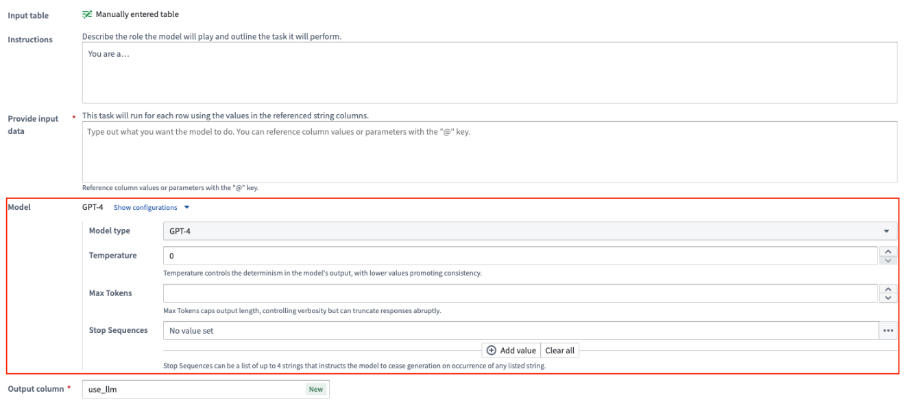

## Trial runs

At the bottom of each Use LLM board, you have the option to test out your specific LLM with examples. Select the **Trial run** tab and enter the value you want to test on the left hand side. Then select **Run**.

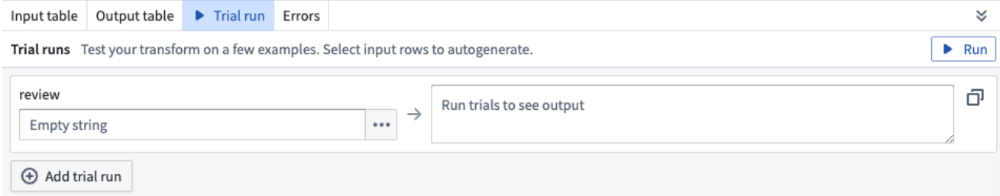

To test out more examples, you can select **Add trial run**.

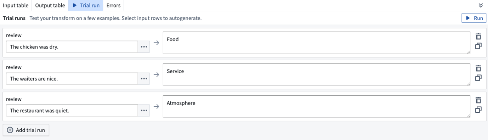

To add examples directly from your input data, navigate to the **Input table** tab and select the rows you want to use in your trial run. Select **Use rows for trial run**, then you will automatically be brought back to the **Trial run tab** with the rows that you selected, populated as trial runs.

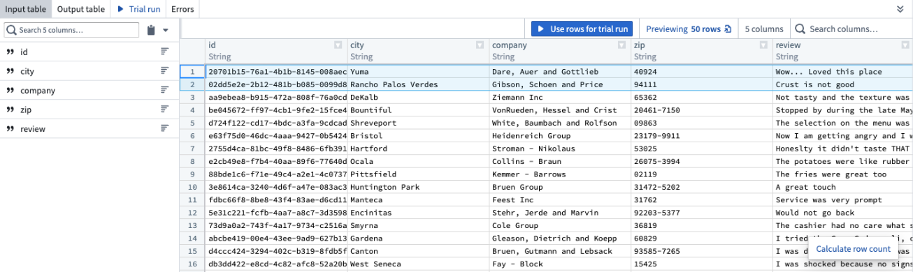

After running the trial runs, you can see the raw prompts sent to the model and the raw outputs. Simply select the `</>` icon to the right of the selected trial run.

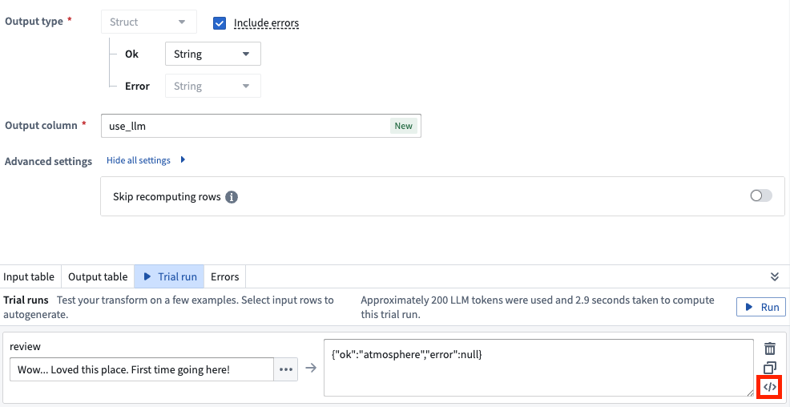

This will open up a dialog with details including:

* Initial prompt: The exact prompt sent to the model including any modifications or additions our backend makes.
* Intermediate LLM outputs: All outputs from the LLM including any failed outputs.
* Corrections: Details on corrections made for any failures.
* Final output: The ultimate result provided by the LLM.

Select the respective title on the left side to see the raw text on the right side of the panel.

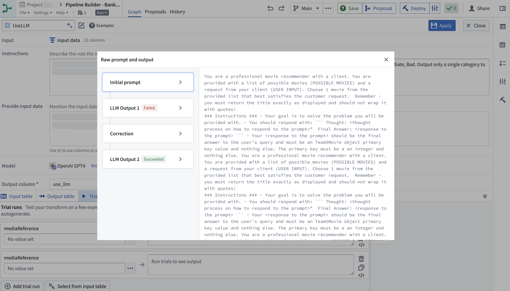

## Evaluation suite

:::callout{theme="neutral"}
Pipeline Builder LLM evaluation suite is in the [beta](/docs/foundry/platform-overview/development-life-cycle/) phase of development and may not be available on your enrollment.
:::

For more comprehensive testing of your Use LLM nodes, use the [LLM evaluation suite](/docs/foundry/pipeline-builder/evaluation-suite/). While [trial runs](#trial-runs) let you quickly test prompts on individual examples, the evaluation suite enables you to:

* Configure multiple evaluations in a suite
* Run evaluations in an isolated test environment
* Compare model outputs against expected results using evaluators like **Exact string match**
* Store evaluation results in an output dataset
* Track build progress and review detailed results

Use the evaluation suite to validate your LLM logic before deployment.

## Preview and create

If you use one of the five templates, you can preview the LLM prompt instructions before creating the prompt by selecting the **Preview** tab. You will only be able to view but not edit the instructions in the **Preview** tab. If you want to edit the template, go back to the **Configure** tab.

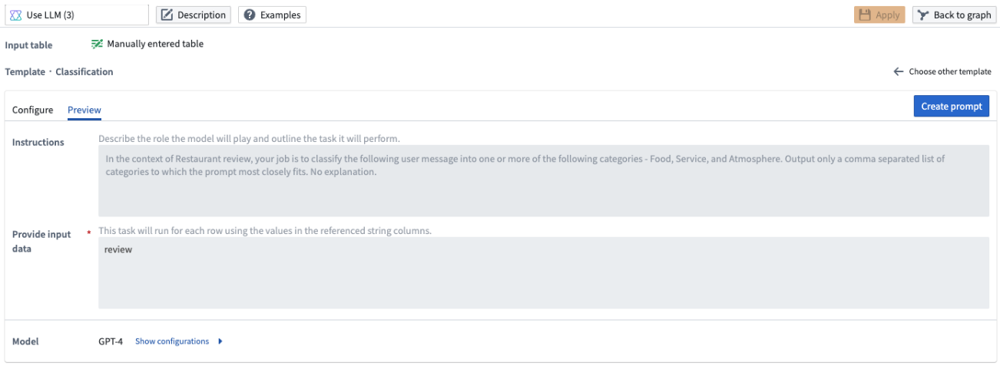

You should select **Create prompt** to edit the name of the new output column and preview the results in the **Output column**.

:::callout{theme="neutral"}
Once you select **Create prompt**, you will not be able to go back to the template for that particular board.
:::

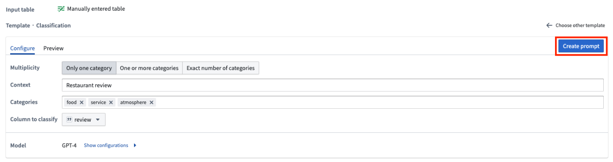

To change the output column name, edit the **Output column** section. To view your changes applied to the output table preview, select **Applied**. To preview the output table, select the **Output table** tab. This preview will only show the first 50 rows.

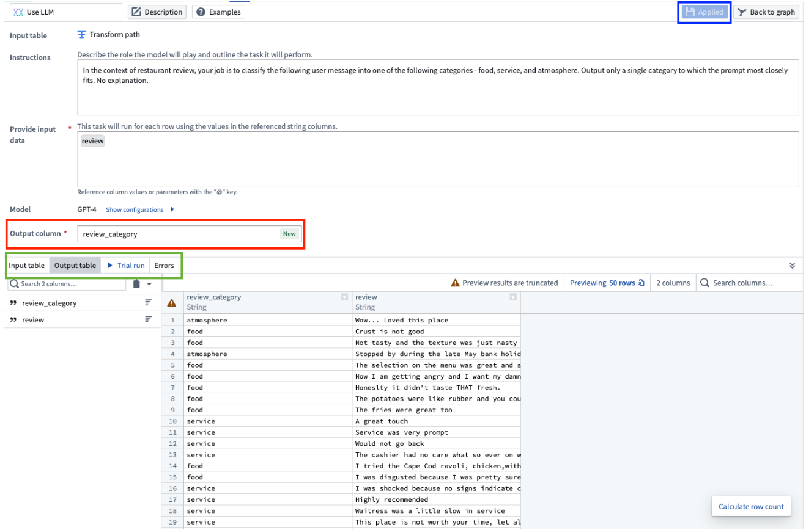

Finally, when you are finished configuring your Use LLM node, select **Apply** in the top right. This allows you to add transform logic to the output of your LLM board, and to view the preview of the first 50 rows when you select the LLM board in the main Pipeline Builder workspace.

## Compute usage in Spark batch pipelines

Spark usually performs parallel processing roughly at the granularity of the CPU core; a helpful (though slightly simplified) mental model is that each core operates on a single row of data at a time. For most operations, such as arithmetic, this architecture is efficient, since all of the computation happens locally. However, when a process interacts with an external LLM, the bulk of the computation happens externally, and the process spends most of its time waiting for a response. In cases like this, it is much more efficient to achieve concurrency using multiple threads per core, making effective use of the waiting time to dispatch new requests.

Per the above, the Use LLM node uses multiple threads per core to send many concurrent requests. Even when using the default [Extra Small compute profile](/docs/foundry/pipeline-builder/management-build-settings/#batch-compute-profiles), which uses a single core, the degree of concurrency is very high.

You can increase the degree of concurrency further by using a compute profile that provides more cores (either more executors or more cores per executor), but there is a risk that as the number of cores increases, your job will encounter rate limits imposed by the LLM provider or by [AIP](/docs/foundry/aip/llm-capacity-management/). The implementation of the Use LLM node has retry logic so that jobs can succeed even when they encounter these rate limits, but it can be inefficient or wasteful to provision multiple cores that spend much of their time retrying failed requests.

When tuning concurrency, we recommend that you use the default Extra Small compute profile as a baseline. If you want to increase concurrency further, scale up very slowly (adding no more than two cores at a time) and monitor trends in the correlation between "total runtime across all tasks" and "job duration" in the job's [Spark details page](/docs/foundry/optimizing-pipelines/understand-spark-details/#high-level-job-metrics). Ideally, as you add cores, job duration should decrease, while total runtime across all tasks should stay the same or only slightly increase. If total runtime across all tasks begins to significantly increase, especially without a corresponding decrease in job duration, you have too many cores and should scale down.

### Functions executor routing

LLM calls made via the Use LLM node are routed through the functions executor rather than directly to the Language Model Service (LMS). The functions executor handles the orchestration of the LLM processing logic within the pipeline. Because of this architecture, large builds that use LLM models will generate functions executor usage in addition to LLM compute costs.

This behavior is important to consider when planning capacity and understanding resource consumption for pipelines that make heavy use of LLM processing.
