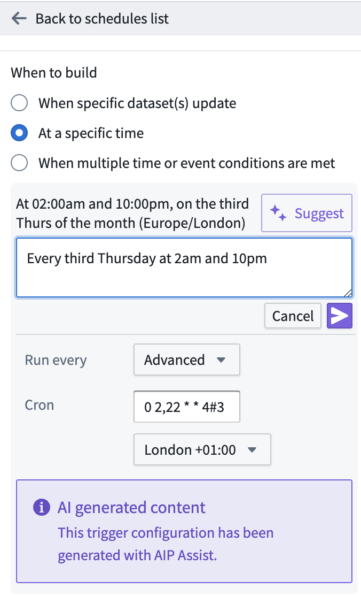

<!-- source: https://palantir.com/docs/foundry/pipeline-builder/schedules-scheduler-aip/ · mirrored 2026-08-18 from Palantir Foundry docs -->

# AIP feature in Scheduler

Use AIP to generate the schedule configuration when creating a dataset build schedule with a specific time trigger. Input a schedule trigger prompt within the **New schedule** view side-panel to generate the proper cron format for complex triggers.

## Use AIP feature

To use AIP Assist in Scheduler, open your graph in Pipeline Builder, then follow these steps below:

1. Right-click a dataset node, select **Manage schedules...**, then **Create new schedule** to enter the Data Lineage app.

2. From the **New schedule** view, find **When to build** and select **At a specific time**.

3. Finally, select **Suggest** indicated by the AIP double star icon, then enter a description of your preferred schedule in the prompt before pressing the purple arrow icon.

To accept the suggestion, select **Save**. To reject, select **Suggest** and then enter a new prompt, or manually configure your cron job.

***

Note: AIP feature availability is subject to change and may differ between customers.
