<!-- source: https://palantir.com/docs/foundry/pipeline-builder/subgraphs/ · mirrored 2026-08-18 from Palantir Foundry docs -->

# Subgraphs in Pipeline Builder

:::callout{theme="neutral" title="Beta"}
Subgraphs in Pipeline Builder are in the [beta](/docs/foundry/platform-overview/development-life-cycle/) phase of development and may not be available on your enrollment. Functionality may change during active development.
:::

The subgraph feature in Pipeline Builder lets you package one or more transforms into a reusable block. You can then apply that block anywhere in a pipeline without rebuilding the logic each time. Subgraphs offer several benefits:

* **Reuse logic:** Package complex logic and apply it across multiple pipelines or branches.
* **Reduce duplication:** Update a subgraph once to affect all its instances.
* **Simplify pipelines:** Replace long chains of nodes with a single subgraph node, making graphs easier to read and maintain.

This guide covers how to:

* Create a new subgraph from scratch
* Add a subgraph to your pipeline
* Create a subgraph from existing nodes
* Add a multi-input subgraph

## Create a new subgraph from scratch

You create and manage reusable subgraphs from the **Reusables** menu.

1. In Pipeline Builder, open the pipeline where you want to define the subgraph.

2. At the top of the graph, select **Reusables**, then select **Subgraphs**.

   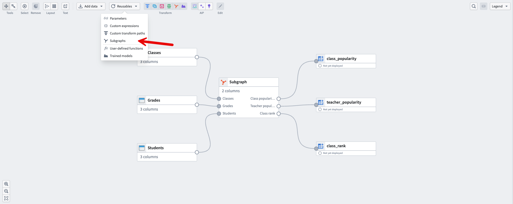

3. In the **Subgraphs** window, select **Add custom subgraph**.

   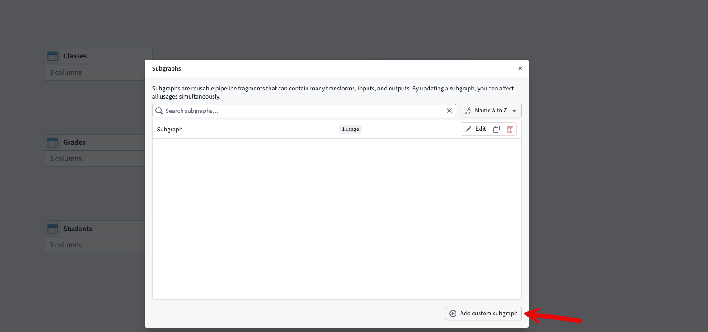

### Configure the subgraph inputs

A new, empty subgraph opens.

1. Select **Add input** in the center of the canvas.

   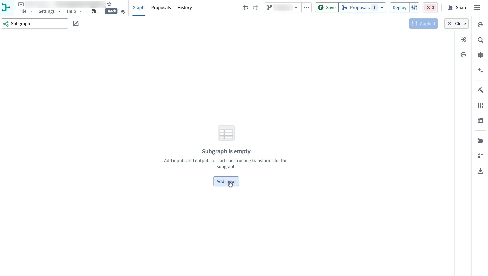

2. An **Input** node appears. Select **Edit** beneath it.

   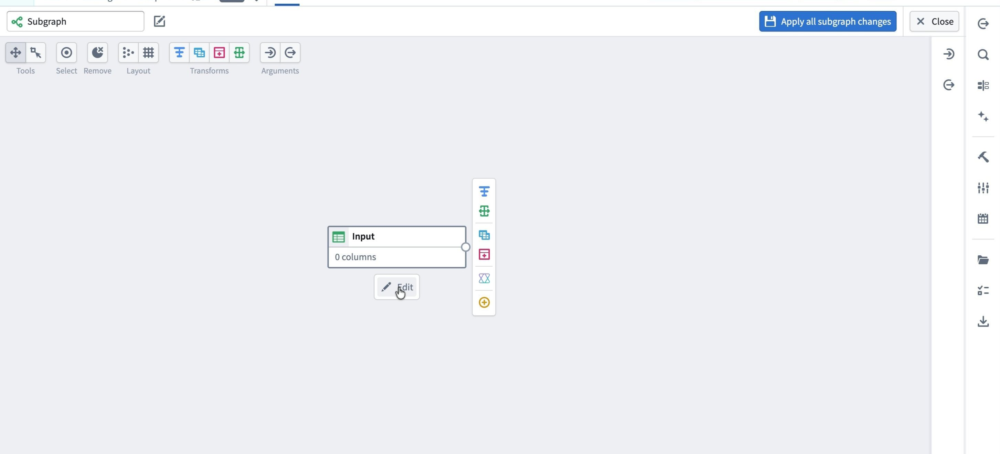

3. In the right-side pane, configure the **Required columns** for this input. You can either add columns manually or copy a schema from an existing dataset:

   * To add columns manually, select **Add column** and enter the column names.
   * To copy the schema from an existing dataset, select **From dataset**.

   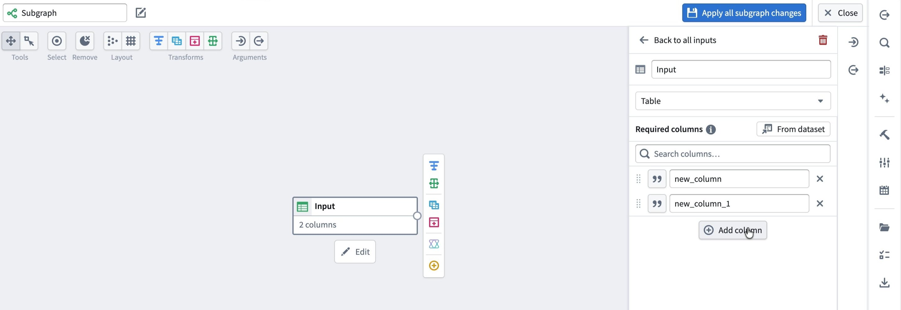

If you select **From dataset**, choose the dataset whose schema you want to use, then confirm with **Select**. The input node now expects the columns from the chosen dataset.

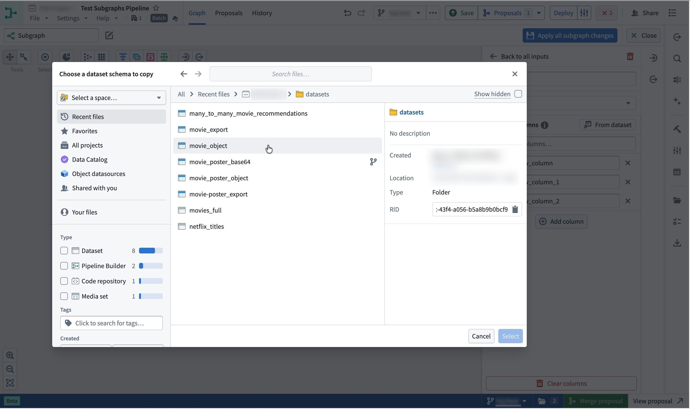

### Build the subgraph logic

With inputs defined, you can build out the subgraph just like any other pipeline:

1. From the input node, use the node menu to add transforms, splits, joins, and other logic.
2. Create an **Output** node at the end of your transform path.
3. Ensure all expected output columns are correctly defined in the **Output** node schema.

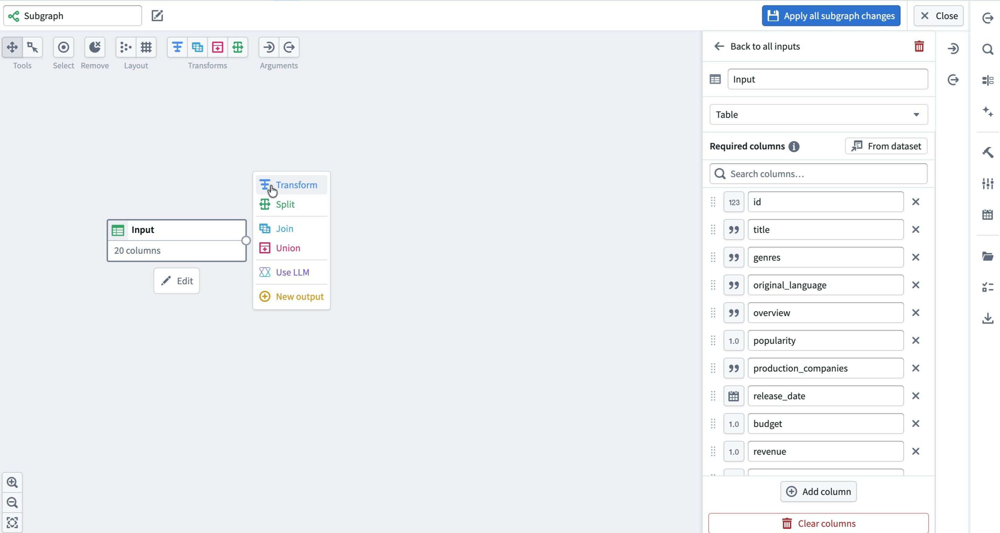

When you are done, select **Apply all subgraph changes** in the top right. Give the subgraph a clear name. In this example, the subgraph is named `Manually created subgraph`. Select **Close** to exit the subgraph editor. Your subgraph is now available as a reusable block.

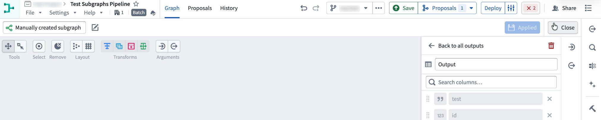

## Add a subgraph to your pipeline

You can add a subgraph after any node whose output matches the subgraph's input schema. There are two entry points:

* From the toolbar, select **Apply subgraph to table**.

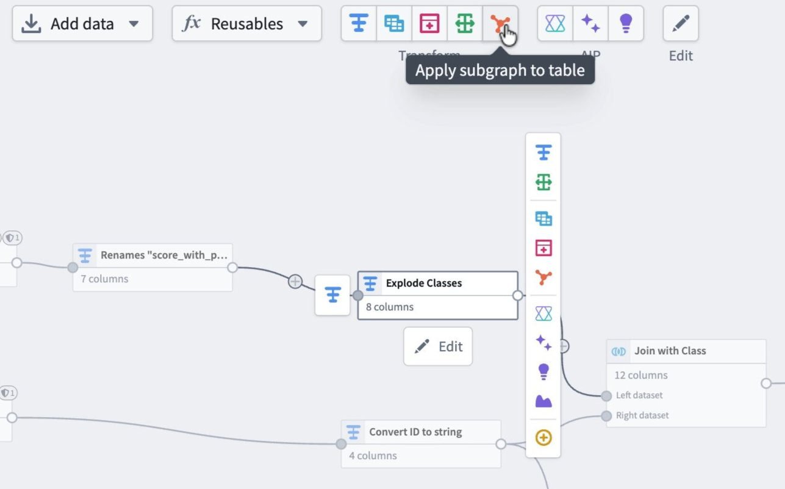

* From the node menu, select **Subgraph**.

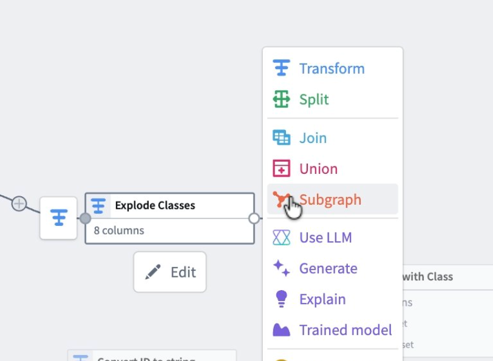

### Select and map the subgraph

1. Select the pipeline node where the subgraph should start.

2. Select **Apply subgraph to table**, or select **Subgraph** from the node menu.

3. In the banner that appears, open the **Select a subgraph** dropdown and choose your subgraph.

   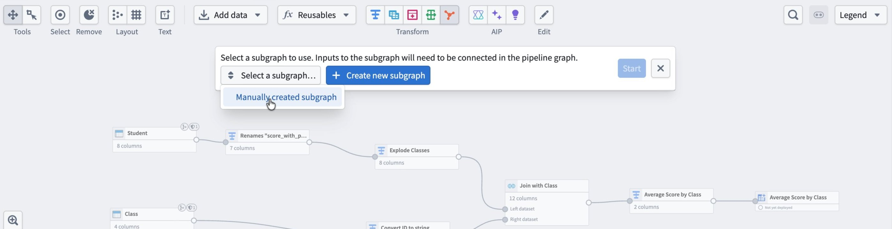

4. Map the subgraph's **Input** to the selected node in the graph. Pipeline Builder maps this automatically if you start from that node. Select **Start**.

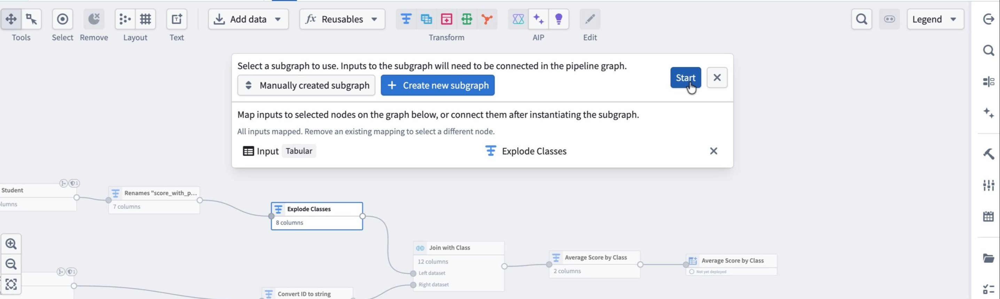

### Review and apply

The subgraph configuration panel opens:

* **Inputs** shows how the selected node feeds into the subgraph.
* **Configuration** is empty if the subgraph has no parameters that need configuration.

Review the **Outputs** tab to confirm the resulting schema, then select **Apply** and **Close**.

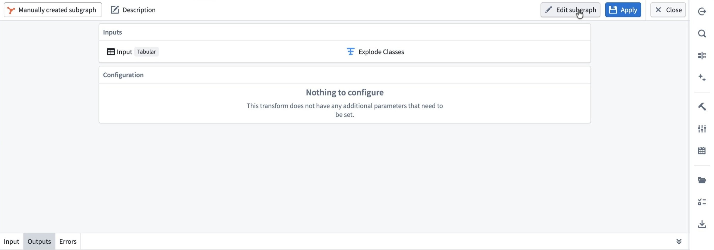

:::callout{theme="warning"}
If the subgraph's input does not contain all the required input columns, schema errors appear in the **Errors** tab and on the pipeline graph.
:::

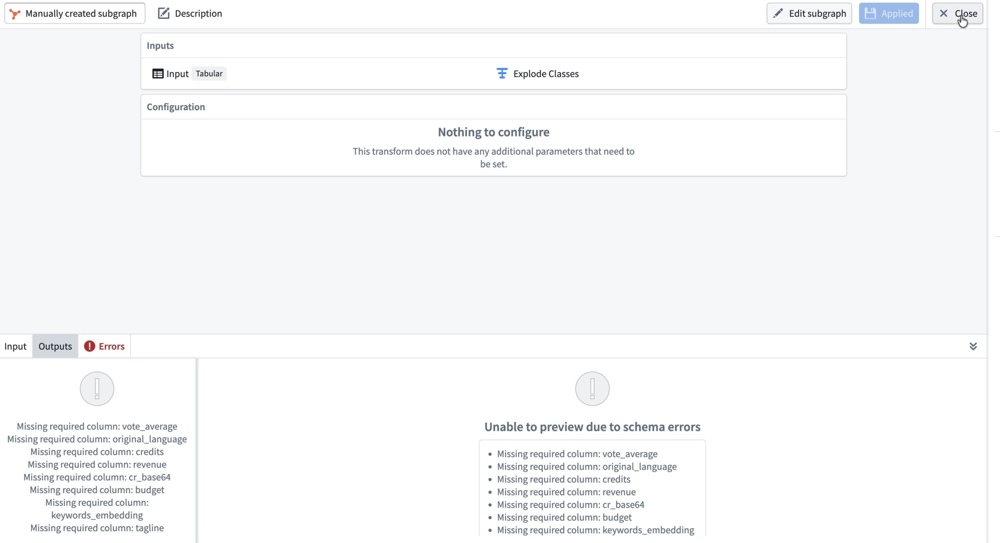

## Create a subgraph from existing nodes

You might already have a sequence of nodes that you want to reuse. You can convert those nodes directly into a subgraph, or replace them with a subgraph you have already created.

### Select the nodes to package

1. In your main pipeline, select the nodes you want to package. For example, you might select a join, sort, and aggregation sequence.
2. Right-click the selection and select **Subgraphs**.
3. To package the nodes into a new subgraph, select **Create subgraph**. To replace the selected nodes with an existing subgraph, select **Replace with subgraph**.

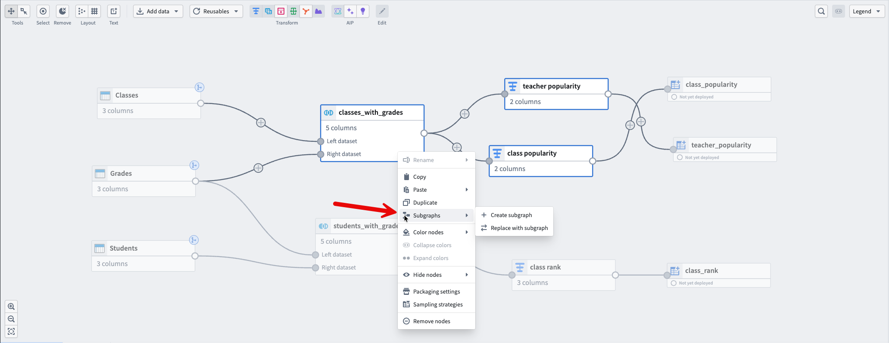

A new subgraph editor opens containing the selected nodes, along with automatically created **Input** and **Output** nodes with populated schemas.

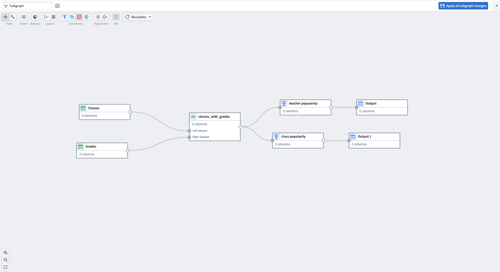

When the subgraph is valid and no schema errors appear, select **Apply all subgraph changes**.

## Add a multi-input subgraph

When your subgraph has multiple inputs, you map each input separately when you apply it.

1. On the main graph, select the starting nodes that correspond to each subgraph input.
2. Select **Apply subgraph to table** from the toolbar, or select **Subgraph** from the node menu.
3. Choose your subgraph from the dropdown menu.
4. In the **Map inputs** section, map each subgraph input to a node on the graph. For example, map `Student` to a rename transform and `Class` to a type-conversion transform. Select **Start**.

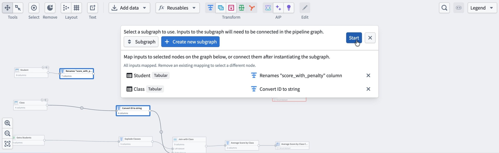

The subgraph configuration window opens, showing the mapped inputs and a preview of the outputs. Confirm the output looks correct, then select **Apply** and **Close**.

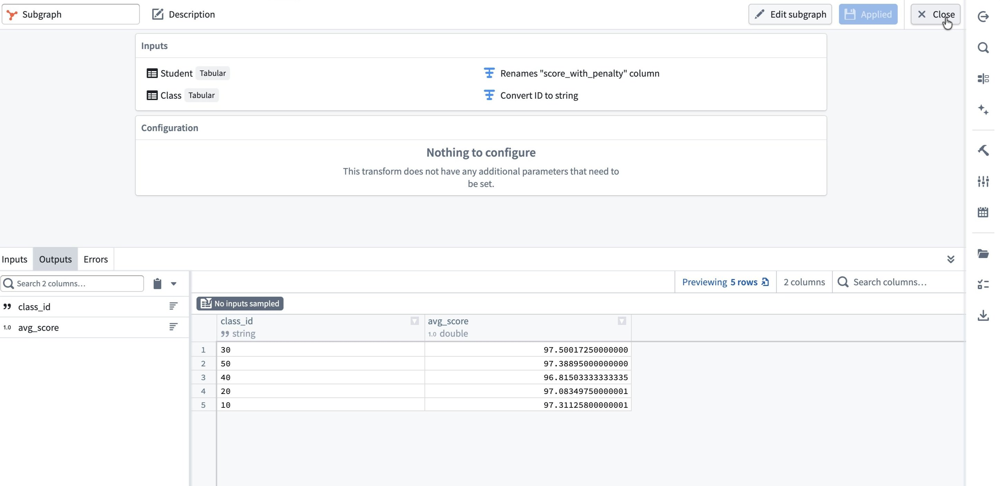

Back on the main canvas, the subgraph appears as a single node with its output schema, such as `class_id` and `avg_score`, visible in the preview panel.

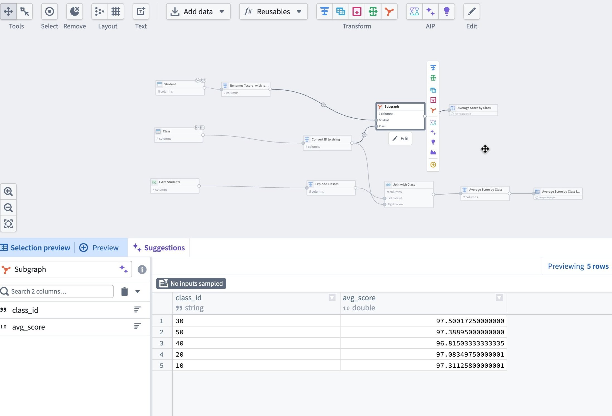

You can then rewire connected nodes to use the subgraph output, and replace duplicated logic elsewhere with additional instances of the same subgraph.
