<!-- source: https://palantir.com/docs/foundry/pipeline-builder/tips-and-tricks/ · mirrored 2026-08-18 from Palantir Foundry docs -->

# Pipeline Builder tips and tricks

Whether you are building your first pipeline or refining a production workflow, the following tips help you work faster, stay organized, and get more out of Pipeline Builder. If you already have a pipeline set up, you can skip to [Improve pipelines](#improve-pipelines) for tips on improving performance and reliability.

* [Build faster](#build-faster)
  * [Configure user preferences](#configure-user-preferences)
  * [Hotkeys (auto-layout, zoom, hide, and more)](#hotkeys-auto-layout-zoom-hide-and-more)
  * [Copy and paste nodes](#copy-and-paste-nodes)
  * [Click and drag to connect nodes](#click-and-drag-to-connect-nodes)
  * [View unsaved changes](#view-unsaved-changes)
  * [Decide how many transforms to put per node](#decide-how-many-transforms-to-put-per-node)
  * [Generate notional data with LLMs](#generate-notional-data-with-llms)
  * [AI tools for building and understanding](#ai-tools-for-building-and-understanding)

* [Improve pipelines](#improve-pipelines)
  * [Faster pipeline mode](#faster-pipeline-mode)
  * [Compute profiles to reduce build times](#compute-profiles-to-reduce-build-times)
  * [Filter preview data](#filter-preview-data)
  * [Unit tests for pipeline reliability](#unit-tests-for-pipeline-reliability)

* [Organize clearly](#organize-clearly)
  * [Folders and color groups for organization](#folders-and-color-groups-for-organization)
  * [Text nodes for documentation](#text-nodes-for-documentation)
  * [Find and replace column names](#find-and-replace-column-names)
  * [Auto-layout nodes and grid snapping](#auto-layout-nodes-and-grid-snapping)

## Build faster

### Configure user preferences

1. Navigate to the settings menu in the top right of the Pipeline Builder view and select **User preferences**, then configure and save your settings.   
   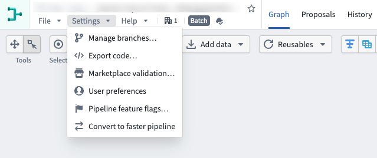   
   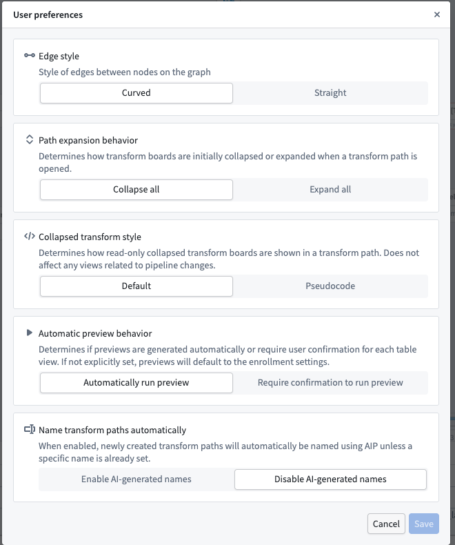   

:::callout{theme="neutral"}
Two of the most commonly used settings are **Collapsed transform style** and **Name transform paths automatically**. Within the **Collapsed transform style** selector in **User preferences**, toggling the setting to **Pseudocode** renders your transforms in a format that resembles programming code. Pseudocode does not follow the syntax of any specific programming language.
:::

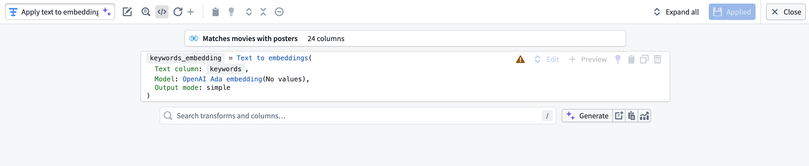

### Hotkeys (auto-layout, zoom, hide, and more)

1. Open the **Help** dropdown menu in the top left of Pipeline Builder.   
   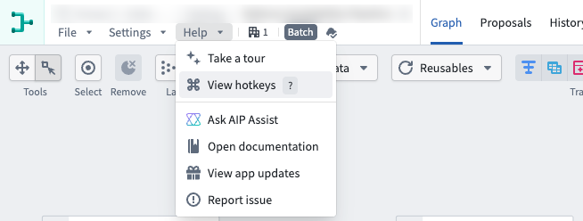   
2. Select **View hotkeys** to open the full hotkey reference for Pipeline Builder.   
   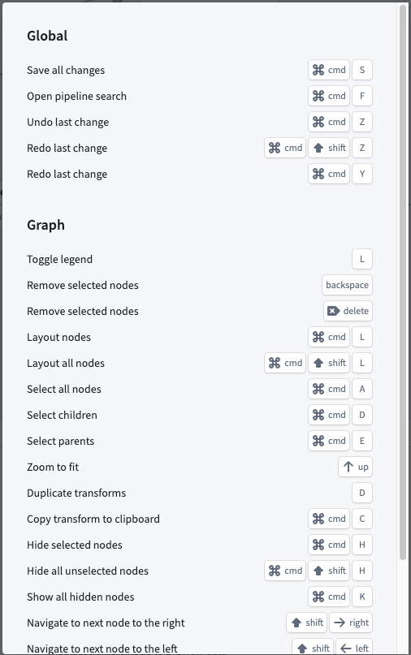   

:::callout{theme="neutral"}
Some of the most commonly used hotkeys include:

* `Cmd+F` (macOS) or `Ctrl+F` (Windows) to open the **Search pipeline** panel and place your cursor in the search bar
* `Up Arrow` to zoom and fit all pipeline nodes to the screen
* `Cmd+H` (macOS) or `Ctrl+H` (Windows) to hide selected nodes
* `Cmd+K` (macOS) or `Ctrl+K` (Windows) to unhide all hidden nodes
* `Cmd+D` (macOS) or `Ctrl+D` (Windows) to select children of a node
* `Cmd+E` (macOS) or `Ctrl+E` (Windows) to select parents of a node
* `Cmd+C` (macOS) or `Ctrl+C` (Windows) to copy nodes to the clipboard
:::

### Copy and paste nodes

1. Select the nodes you want to copy. Use the **Select** button in the top right, or use `Cmd+A` (macOS) or `Ctrl+A` (Windows) to select all nodes in the current pipeline. If required, you can also select individual nodes, or select groups of nodes by selecting and dragging around them.
2. Copy your selection by right-clicking and choosing **Copy**, or use `Cmd+C` (macOS) or `Ctrl+C` (Windows).   
   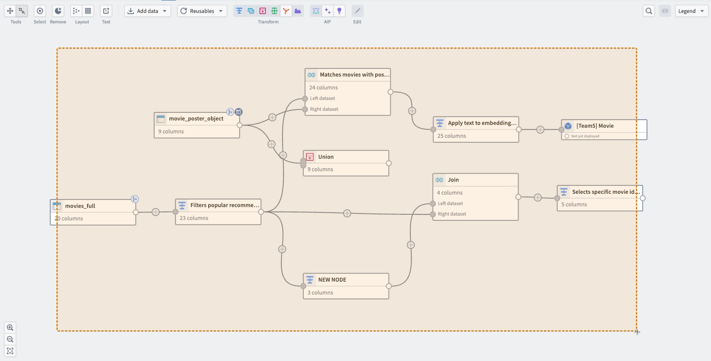   
3. Navigate to the destination pipeline and paste by right-clicking and choosing **Paste**, or use `Cmd+V` (macOS) or `Ctrl+V` (Windows).

:::callout{theme="neutral"}
Color group assignments are preserved when you copy and paste nodes, including when pasting nodes between different pipelines.
:::

### Click and drag to connect nodes

1. Select the **output circle** of the node to use as input.   
   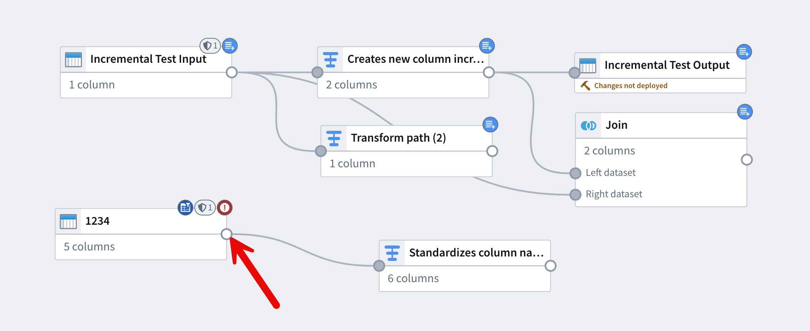   
2. Drag that output to the **input circles** of the nodes that should receive its output.   
   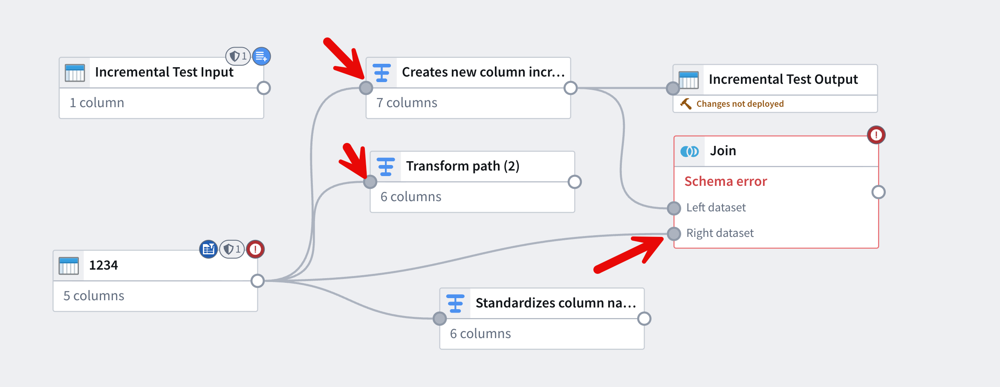

### View unsaved changes

1. Navigate to the sidebar menu on the right-hand side of your screen and select **View changes**. From here, you can view unsaved changes in your current branch and compare them with other Pipeline Builder branches.   
   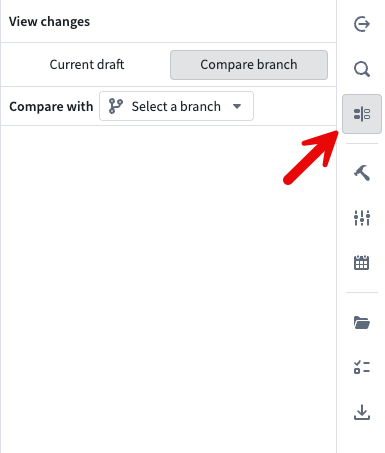

### Decide how many transforms to put per node

* There is no fixed limit on the number of transforms per node. As a general best practice, string larger transform functions together across multiple nodes rather than grouping everything into a single node. This makes your pipeline easier to maintain, troubleshoot, and update.
* Pipeline Builder also supports [custom functions](/docs/foundry/pipeline-builder/management-create-custom-functions/), which allow you to package a series of transform boards into a single reusable transform and reuse it throughout the pipeline. Select the **+** icon when in a transform node to configure a custom transform path.   
  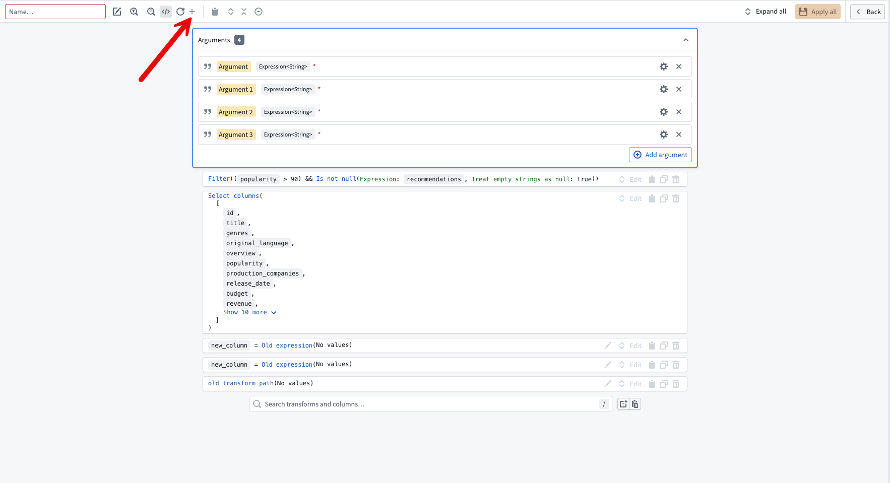

### Generate notional data with LLMs

1. After you add columns to your manually entered table, select [Generate data](/docs/foundry/pipeline-builder/datasets-generated/) from the top right.
2. For each column, use the **Auto-populate with** dropdown to choose a data type, or select **Generate with LLM** to enter a custom prompt.
3. Once your prompts are configured, select **Generate table** in the bottom right to populate the table.   
   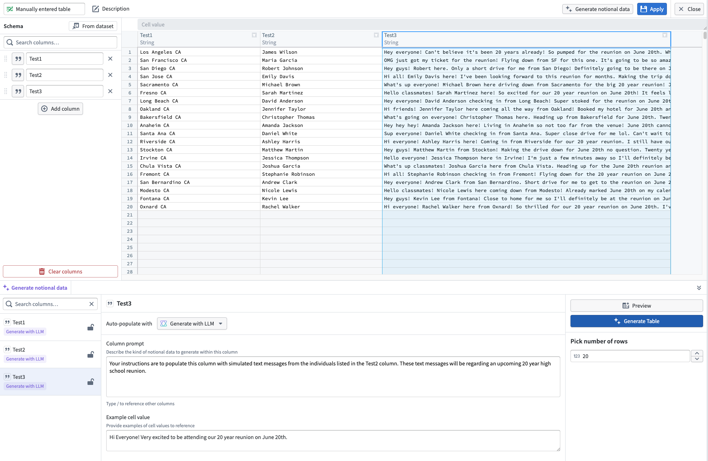

### AI tools for building and understanding

:::callout{theme="neutral"}
To use large language models (LLMs) directly in your pipeline, see [Use LLMs in Pipeline Builder](/docs/foundry/pipeline-builder/pipeline-builder-llm/).
:::

#### Use AI generate to build new transform nodes

1. Select the node you want to build from and select **Generate** from the menu.   
   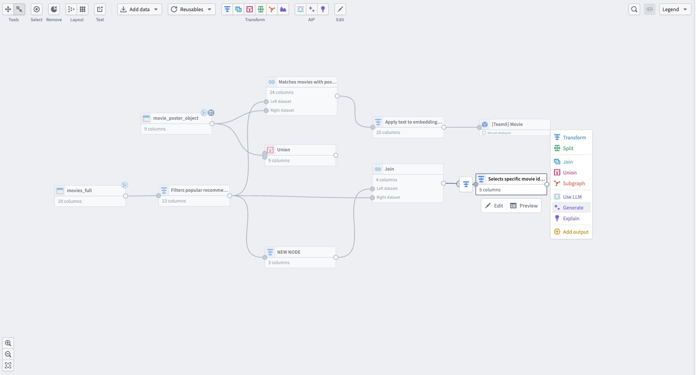   
2. Next, enter your prompt in the text box and select **Generate**.   
   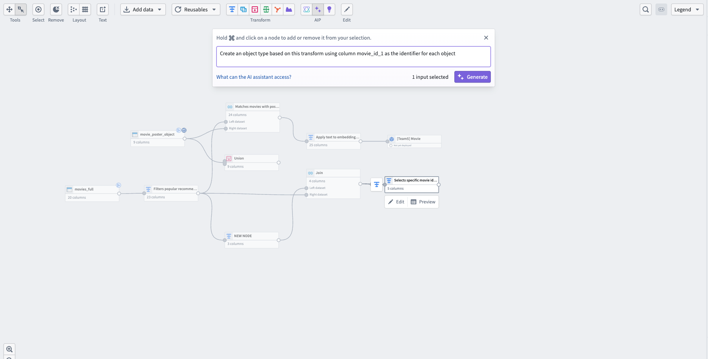   
3. Pipeline Builder generates the new node after the selected node, and you can rename it like any other node in your pipeline.

#### Use AI explain to generate a summary of your pipeline logic

1. Select the nodes you want to explain and select the purple light bulb icon in the top center of the graph view. Pipeline Builder generates a written summary of the selected nodes' logic in the text box.   
   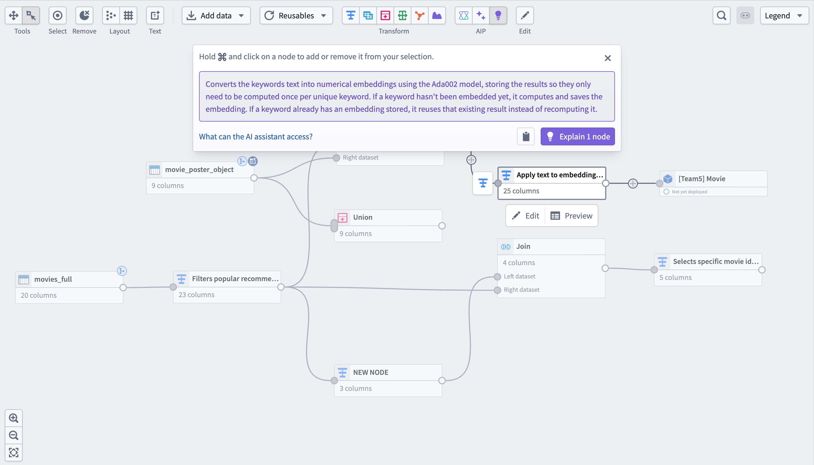   
2. You can also use explain directly in the node by selecting the purple light bulb in the top right of a transform board.   
   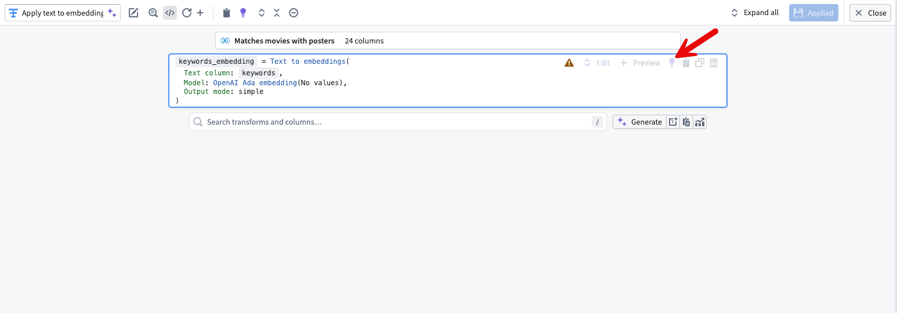

#### Use the AIP regex helper to generate regex patterns with an LLM

1. Select the dataset you want to run a regex function on, then open the **Transforms** panel.
2. In the **Transforms** window, select the regex function you need and the target column.
3. Select the purple star icon to the right of the pattern input box and enter your prompt.   
   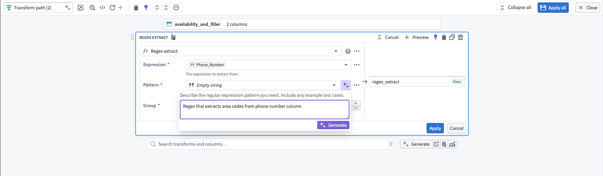   
4. Select **Generate**, then verify the output by selecting **Apply**. Return to the graph view and preview the transform's output to confirm the result.

#### Use AI FDE to support pipeline creation and building

1. Navigate to the **Applications** menu on the left of your screen and search for AI FDE.
2. Once you open the AI FDE application, you can add your existing pipeline as a resource by copying and pasting the link into the chat box.
3. From there, you can prompt AI FDE to build additional nodes in your pipeline.   
   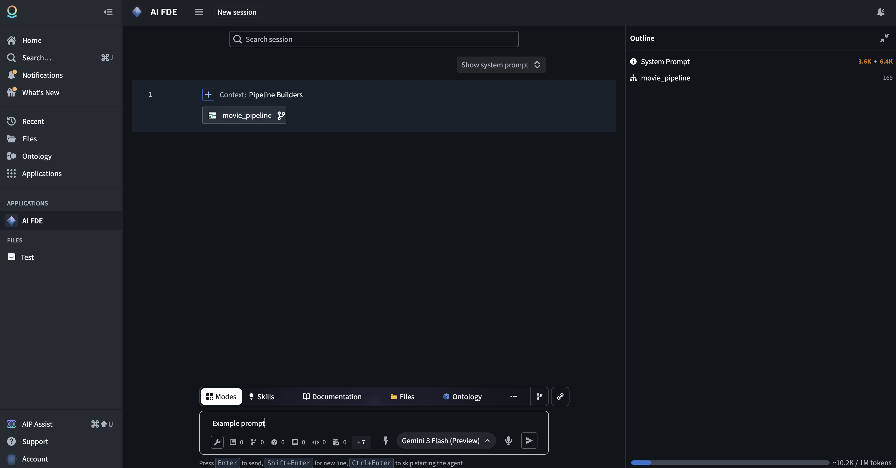

## Improve pipelines

### Faster pipeline mode

1. When creating a new batch pipeline, select **Faster** from the **Select batch compute** menu.
2. You can also convert an existing standard batch pipeline to a faster pipeline. Select the **Convert to faster pipeline** option from the **Settings** menu in your standard pipeline.   
   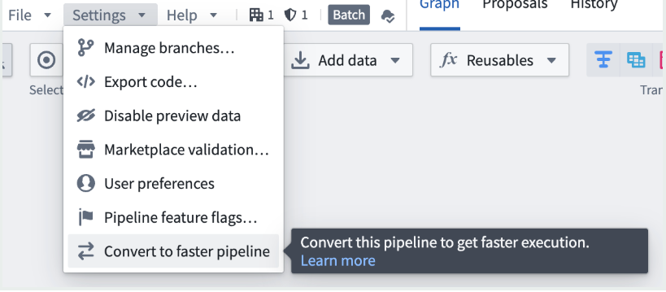   
3. Once you have selected the **Convert to faster pipeline** option, select the **Convert pipeline** button to confirm the conversion.

:::callout{theme="warning"}
If your pipeline contains functionality that is not compatible with faster pipelines, you will receive an error message indicating what to remove or change before converting. You can also turn on conversion checks to view these warnings in your pipeline using the bottom panel.
:::

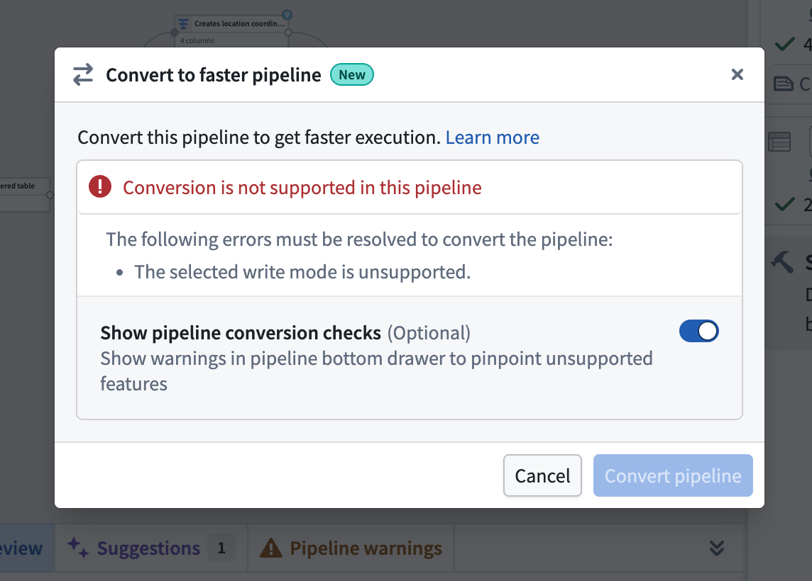

:::callout{theme="warning" title="Faster pipelines feature support"}
Faster pipelines support a subset of the functionality available in standard batch pipelines. Learn more about [faster pipelines with Pipeline Builder](/docs/foundry/building-pipelines/create-faster-pipeline-pb/).
:::

### Compute profiles to reduce build times

1. Once your pipeline is created, navigate to the **Build settings** menu on the far right of your screen to further adjust compute settings.
2. In the **Build settings** menu, go to **Default compute profile** and select the dropdown showing your current compute profile size.
3. Select the **Profile management strategy** dropdown. Three options are available. Select the one that best fits your needs:
   * **Standard:** The default compute profile setting with no additional optimizations. Best for production-scale pipelines with predictable data volumes.
   * **Warm pool:** Continuously runs virtual machines to reduce pipeline startup time. Best for small-scale, iterative pipelines and low-latency development tasks.
   * **Managed profile:** Automatically adjusts compute resource allocation based on the last five runs of your pipeline. Best for pipelines with fluctuating data sizes or a need for compute cost management.   
     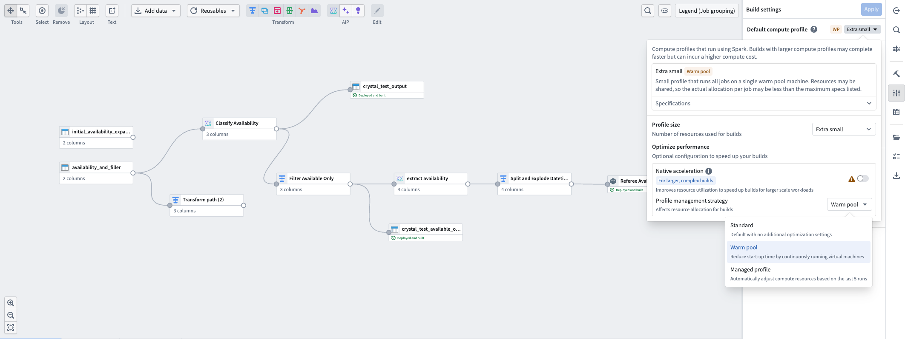

:::callout{theme="neutral" title="Compute profile permissions"}
Small and medium compute profiles are available automatically. Large and extra-large profiles must be imported to your project before use, which requires a Compass project editor or owner role and a Resource Management administrator role. If you lack the required permissions, these profiles appear disabled in the selection dropdown.
:::

:::callout{theme="neutral" title="Warning messages for model computations"}
Pipeline Builder displays warning messages for transforms that include expensive computations due to models, such as embeddings or LLMs. These warnings guide you to the **Build settings** menu where you can configure appropriate compute resources.
:::

:::callout{theme="neutral" title="Compute profiles support in faster pipelines"}
Faster pipelines only support the **Standard** profile management strategy.
:::

### Filter preview data

1. Right-click the input dataset to sample from and select **Sampling strategies** from the dropdown menu. The sampling strategy you configure applies to every node that follows the sampled input.   
   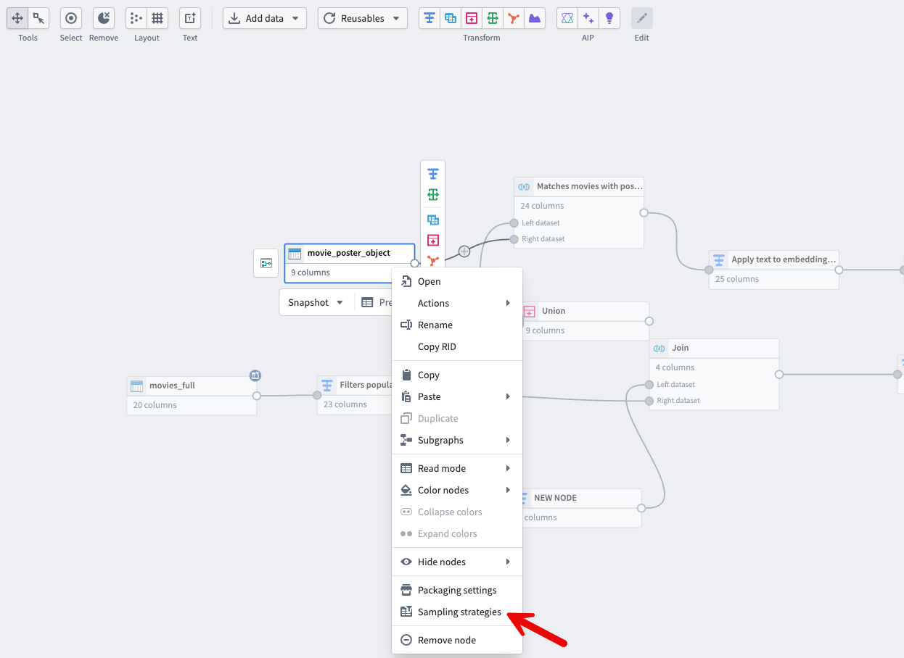   
2. Select which dataset in your pipeline to configure your sampling strategy on. **Filtered preview** allows you to filter rows based on any expression. In the following example, only rows where `original_language` is `en` are kept.   
   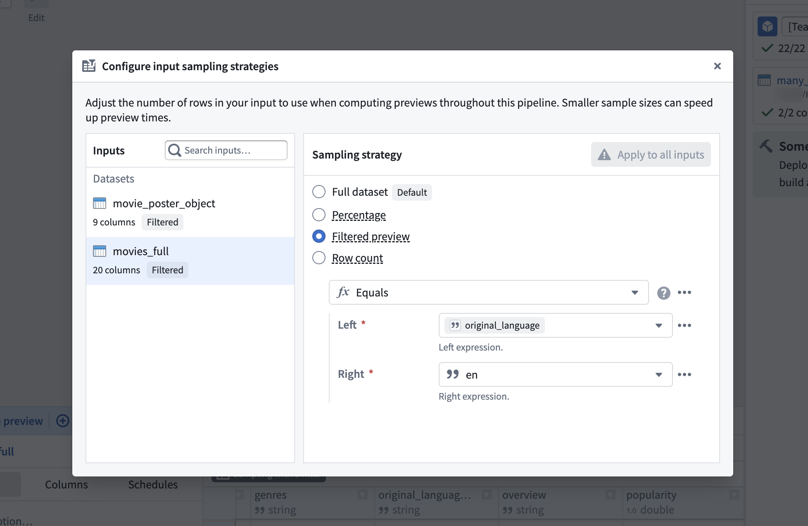

:::callout{theme="neutral"}
To apply the same sampling strategy to multiple inputs at once, use the **Apply to all** button. The system displays warnings when certain inputs do not support the selected strategy, such as when media sets do not support percentage filtering.
:::

### Unit tests for pipeline reliability

1. Create a new unit test by selecting the icon on the right-hand side menu, selecting the **+ New test** button, and selecting the transform you want to test.   
   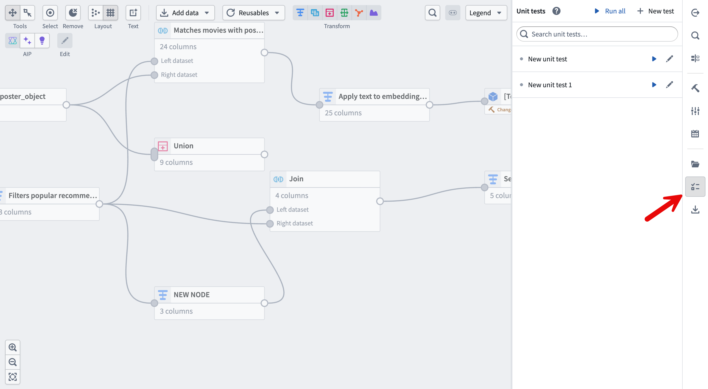   
2. Next, configure your test by choosing a schema (manually or from an existing dataset), entering a line of test data in your **Unit test input node**, and entering the expected output in the **Unit test output node**.   
   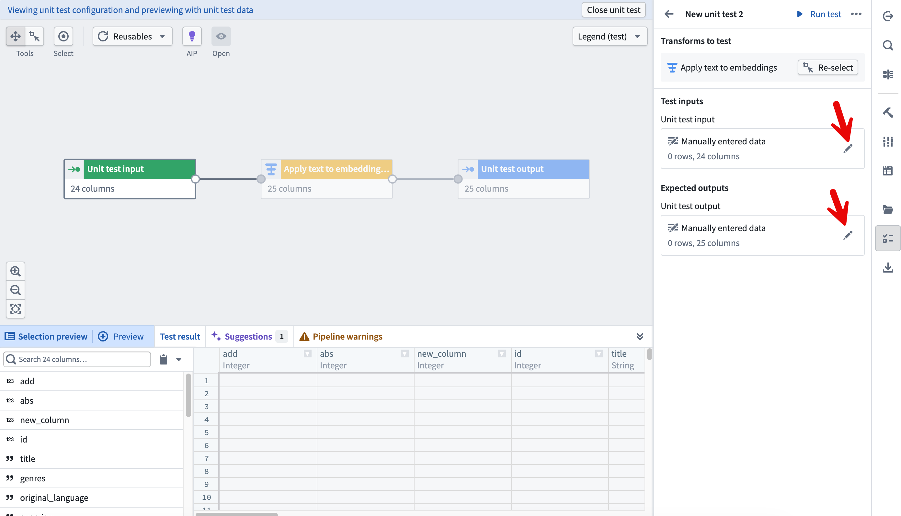   
3. Once your test is configured, select **Run test** and view the results. For more information, see [Unit testing in Pipeline Builder](/docs/foundry/pipeline-builder/dataexpectations-unit-tests/).

## Organize clearly

### Folders and color groups for organization

1. To [set up folders for your nodes](/docs/foundry/pipeline-builder/management-file-tree/) in Pipeline Builder, select the file icon on the far right of the screen. In the **Pipeline file tree** panel, you can create new folders, place nodes into folders, and show or hide nodes in specific folders.   
   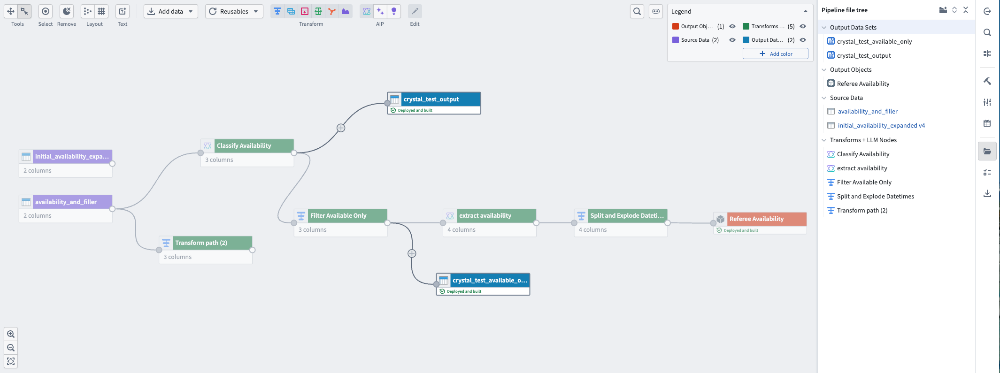   
2. You can also color nodes and collapse multiple nodes into a single node based on the coloring.   
   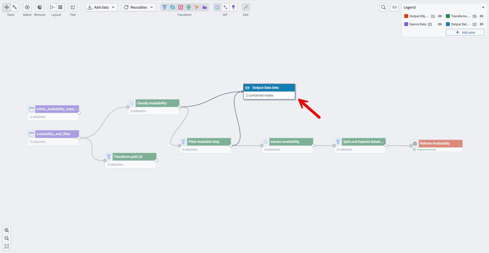

### Text nodes for documentation

1. Select **Add new text node** from the graph view toolbar. Text nodes support Markdown and are positioned behind any nodes in your graph. Learn more about [text nodes](/docs/foundry/pipeline-builder/management-text-nodes/).   
   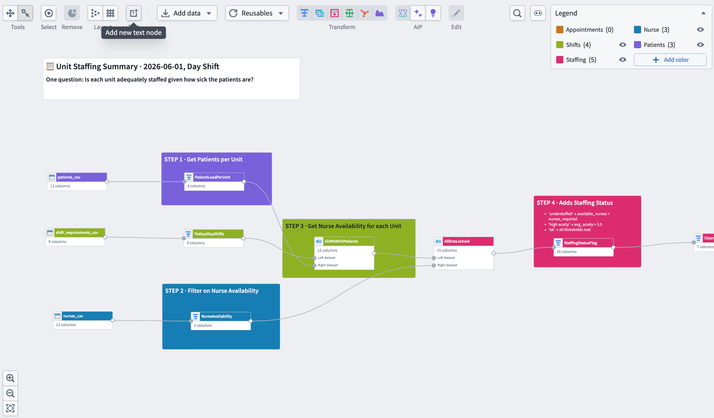

### Find and replace column names

1. Navigate to the search panel on the right-hand side of your screen. From there, you can search for and replace column names in your pipeline.   
   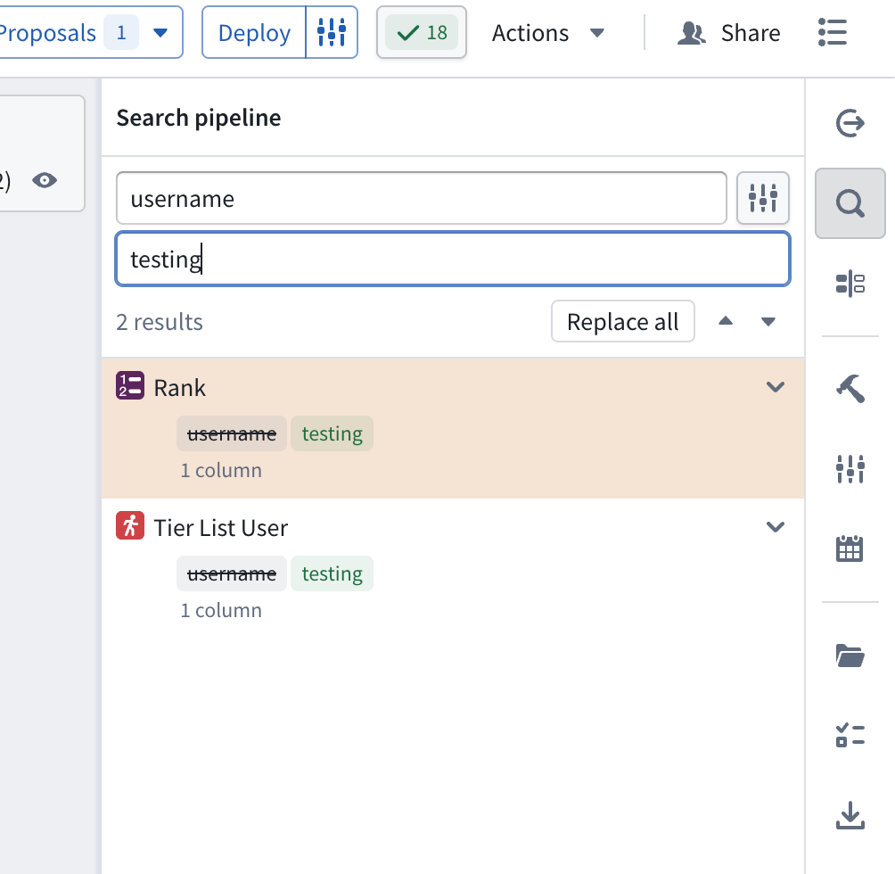

### Auto-layout nodes and grid snapping

Use the automatic layout and grid snapping options from the graph view toolbar to align your nodes and improve readability.

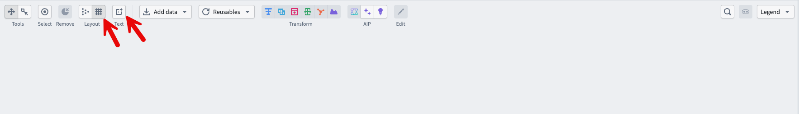
