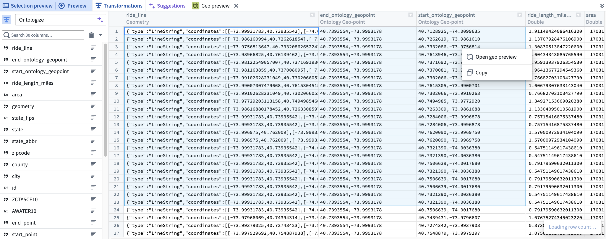
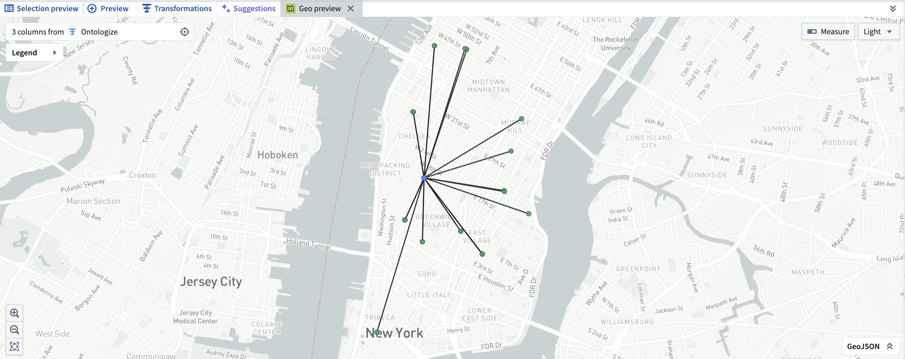

<!-- source: https://palantir.com/docs/foundry/pipeline-builder/transforms-geospatial/ · mirrored 2026-08-18 from Palantir Foundry docs -->

# Create geospatial transforms

With Pipeline Builder, you can load, transform, and wield geospatial data. If your geospatial workflow is not yet supported by Pipeline Builder's current capabilities, consult Foundry’s [legacy geospatial documentation](/docs/foundry/geospatial/overview/) to transform your data in Code Repositories.

## Modeling geospatial data

### Logical types

Pipeline Builder models geospatial data internally using the concept of a logical type, which is a base type (string, integer, boolean, array, struct) with additional constraints on the data represented. For example, the **Geometry** type is defined as a string which must be valid GeoJSON, while a **GeoPoint** must be a struct of longitude between `-180` and `180` and latitude between `-90` and `90`, both inclusive. A full list of supported types can be found [below](#supported-geospatial-types).

All logical types in Pipeline Builder are inheritors of their base types; for instance, a geometry can be used as input to an expression which expects an input of type string, but not vice versa. To cast from a base type to a particular logical type which extends that base type, you can use the “Logical Type Cast” expression, which will apply the constraints associated with that logical type to the data and null any values which fail this validation. The ability for expressions to specify logical types as input and output ensures that when a geospatial-specific expression expects a GeoJSON string, a GeoJSON string will be received.

### Supported geospatial types

Pipeline Builder currently supports the following geospatial types:

* **GeoPoint:** A struct of `longitude` and `latitude`, where `longitude` is a double between `-180` and `180`, and `latitude` is a double between `-90` and `90`, both inclusive. A GeoPoint must be a valid (x, y) coordinate according to the WGS:84 or EPSG:4326 coordinate reference system (CRS).
* **Geometry:** A stringified JSON blob adhering to the GeoJSON specification. Individual coordinates are expected to be in WGS:84/EPSG:4326 format, like the GeoPoint type.
* **H3Index:** A string which represents a valid H3 hexagonal index.
* **LatLonBoundingBox:** A bounding box, represented by a struct of `minLat`, `minLon`, `maxLat`, `maxLon`, where each entry is a valid GeoPoint and where `maxLat > minLat` and `maxLon > minLon`.
* **Ontology GeoPoint:** A string compatible with the Ontology's GeoPoint property type, fulfilling the format `{lat},{lon}`, where `-90 <= lat <= 90` and `-180 <= lon <= 180`.
* **MGRS:** A string which represents a valid MGRS (Military Grid Reference System) coordinate.

## Loading geospatial data

Pipeline Builder supports a variety of different transforms and expressions for geospatial data.

* GeoPoint:
  * **Construct GeoPoint column:** Takes a `lat,lon` pair, validates the bounds outlined above, and converts it into GeoPoint representation.
  * **Create GeoPoint from Coordinate System (CRS):** Takes an `x,y` pair and a coordinate reference system, projects that `(x,y)` into WGS:84, then constructs a GeoPoint representation. Supports conversion from most coordinate systems in the EPSG database, including all UTM zones.
* Geometry:
  * **Parse well-known text (WKT):** Converts well-known text (WKT) string to the geometry logical type. Optionally, supply a source coordinate system identifier to convert from the source CRS to WGS:84 if the WKT is not in WGS:84 already.
  * **Normalize Geometry:** Given a GeoJSON string in WGS:84 format, normalizes the following attributes: proper order (right-hand rule), closed rings, duplicate removal, and constant dimensions of points.
  * **Extract rows from Shapefile:** Given a dataset of raw shapefiles, parses each shapefile into rows containing each entry’s geometry and properties. The output dataset will have a geometry column as well as a column for each property listed by the user. Coordinate reference systems can be specified for non-WGS:84 datasets.
  * **Extract rows from GeoJSON:** Given a dataset of raw GeoJSON files, parses each shapefile into rows containing each entry’s geometry and properties. The output dataset will have a geometry column as well as a column for each property listed by the user. Coordinate reference systems can be specified for non-WGS:84 datasets.

Additional expressions exist to translate between the above two types, as well as to convert them to H3 indices, MGRS, bounding boxes, and the Ontology GeoPoint format.

[Learn more about geospatial data formats in the documentation on coordinate reference systems and projections.](/docs/foundry/geospatial/coordinate-reference-systems-and-projections/)

## Transforming geospatial data

Once you have populated your columns of Pipeline Builder’s geospatial types, you can take advantage of transforms that operate specifically on geospatial data. Most transforms are supported in both streaming and batch workflows. Some highlights are listed below.

### Geometry comparisons

* Intersection
* Difference
* Symmetric difference
* Union (column-wise and aggregate)

### Spherical geometry

* Haversine/great circle distance between two points
* Inverse haversine distance (given a starting point, distance, and bearing angle, calculate the end point)
* Area/centroid/length of a geometry

### H3

* Get neighbors of H3 hexagon at a certain resolution
* Cover a polygon with H3 hexagons at a certain resolution

### Complex shape approximation

* Ellipse/Circle
* Range fan (annulus sector)
* Convex Hull of a given geometry

### Geospatial joins

Pipeline Builder supports the following geospatial joins:

* [Geometry intersection joins](#geometry-intersection-joins)
* [Geometry intersection anti joins](#geometry-intersection-anti-joins)
* [Geometry distance joins](#geometry-distance-joins)
* [Geometry nearest neighbor joins](#geometry-k-nearest-neighbors-knn-joins)
* [Approximate nearest neighbor (ANN) joins](#approximate-nearest-neighbor-ann-joins)

#### Geometry intersection joins

Pipeline Builder's geometry intersection join requires two datasets, each of which must have a geometry typed column. The geometry intersection join does not accept Ontology GeoPoint or GeoPoint as an input type. Before applying the join, we recommend normalizing the geometry column and explicitly filtering out `null` values if they are not needed in the output. If there is non-determinism or another join in the pipeline, we recommend adding a checkpoint prior to the geojoin.

:::callout{theme="neutral"}
Pipeline Builder can join datasets of medium-sized geometries (approximately up to 34 points) with a scale of up to 1 million rows on either side, assuming a twofold increase in the number of output rows. For skewed data, the join can support up to 250 million rows on one side against 1.6 thousand rows on the other. Stability may degrade as the size of the geometries increases. The join can consistently support joining a dataset with one massive geometry (on the order of 40k points) against up to 500k rows. Any larger scale may succeed intermittently but is not officially supported.

Geometry intersection joins that have a number of rows in the output comparable to that of a cross join can cause stability degradation in the join.
:::

As an alternative to the geometry intersection join, the cross join configured with the “Geometries have intersection” filter may provide more stable memory usage. However, this approach could lead to a sharp increase in build times.

#### Geometry intersection anti joins

Pipeline Builder's geometry intersection anti join returns rows from the left dataset where the geometry does not intersect with any geometry in the right dataset. This join is supported in both batch and streaming pipelines.

The geometry intersection anti join requires two datasets, each of which must have a geometry typed column. Similar to intersection joins, we recommend normalizing the geometry column and explicitly filtering out `null` values if they are not needed in the output.

#### Geometry distance joins

Pipeline Builder's geometry distance join requires two datasets, each of which must have a geometry typed column, a value for distance greater than zero, and a coordinate reference system string which will determine the units of the distance provided. For example, if "epsg:4326" is provided for the coordinate reference system, then the distance will be assumed to be in units of degrees. Similar to the intersection join, we recommend normalizing the geometry column, and explicitly filtering out `null` values if they are not needed in the output. If there is another join or non-determinism in the pipeline, add a checkpoint prior to the join.

:::callout{theme="neutral"}
Pipeline Builder can join datasets of small geometries (approximately up to 8 points each) with a scale of up to 1 million rows on either side, assuming a 2x increase in the number of rows as a result of the join. When the number of rows output is comparable to that of a cross join, stability may degrade.

An alternative to the geometry distance join, a cross join configured with a geometry buffer and "Geometries have intersection" filter may provide more stable memory usage when the increase in row count is large. However, this approach could sharply increase build times in most cases.
:::

#### Geometry k-nearest neighbors (KNN) joins

Pipeline Builder's geometry nearest neighbors join requires two datasets: a `base` dataset of geometries and a `neighbors` dataset of points. The `k` integer parameter configures the number of nearest neighbors to find for each base geometry. A coordinate reference system is required to determine how distances between base geometries and neighbor points are calculated and compared. The result will be the set of combined rows, each of which contains a GeoPoint that is one of the `k` closest points to the base geometry. Ties are broken arbitrarily, and results are returned in no particular order.

:::callout{theme="neutral"}
Note that this join has two requirements:

* All GeoPoints in the `neighbors` dataset must be able to fit inside executor and driver memory. This is currently a hard requirement and limits the scalability of the join. Contact your Palantir representative if your use case requires distributing the `neighbors` dataset.

* Foundry currently only accepts the GeoPoint logical type in the `neighbors` dataset to limit memory consumption. Contact your Palantir representative if non-point geometries are required on the `neighbors` side of the join.
:::

:::callout{theme="neutral"}
In practice, Pipeline Builder supports modest values of `k` (< 5) with up to a few hundred thousand rows in the neighbors dataset and 1 million geometries in the base dataset. When both datasets have a few hundred thousand rows, Pipeline Builder can support much larger values of `k`. Finding up to several hundred nearest neighbors should finish quickly in such cases. Increasing the scale of the inputs beyond this point may succeed intermittently, but is not currently supported in general.
:::

#### Approximate nearest neighbor (ANN) joins

Pipeline Builder's approximate nearest neighbor (ANN) join provides an alternative to the KNN join that prioritizes processing speed over exact precision. Unlike the KNN join, which finds the exact K nearest neighbors for each row, the ANN join uses estimated close matches to provide substantial improvements in processing speed with only a slight reduction in precision.

Consider using the ANN join when processing speed is a priority over exact precision, or when working with large datasets where exact KNN joins would be too slow. For use cases requiring exact nearest neighbor results, use the [geometry KNN join](#geometry-k-nearest-neighbors-knn-joins) instead.

#### Troubleshooting

If your join is encountering stability issues, use the following steps to remediate:

1. Drop unnecessary columns prior to the join.
2. Simplify the input geometries (for example, can you use a coarser grain for large geometries?)
3. Scale vertically; manually select a compute profile with more memory for the driver and executors.
4. Split the largest input dataset into sets of about 25 million rows, then union the results together in a separate build.
5. Reduce the number of rows in the output (that is, the number of intersections between left and right geometries).

## Preview transform results

Once you have finished transforming your data in Pipeline Builder, you can validate the results of these transforms visually on a map. In the regular preview pane, select the cells you would like to preview on a map (the cells must be from columns of one of the geospatial types mentioned above). Right-click and select **Open Geo Preview**.

A new preview tab will appear, displaying the selected cells plotted on a map.

## Using geospatial data with the Ontology

Pipeline Builder’s geospatial capabilities are designed to integrate seamlessly with downstream data across the platform.

* Ontology
  * Builder’s geometry column type is compatible with the ontology’s geoshape type, but make sure to apply the "Normalize geometry" expression before mapping your column into an object in Builder. This ensures that the geoshape data will pass validations performed while indexing data into the ontology.
  * While the current GeoPoint logical type cannot be used directly in the ontology, points can be easily converted to an "Ontology GeoPoint" type (a string of the format '{lat},{lon}') prior to indexing.
* Datasets
  * Geospatial type data is persisted on output datasets on Builder pipelines, so that if you create a downstream Builder pipeline from that dataset, your data will still preserve its correct logical/geospatial types.
* Geotemporal series syncs
  * You can map GeoPoint and geometry columns to a geotemporal series sync output for rendering points and geometries in downstream applications, such as the Map application. All geotemporal series sync outputs must have a GeoPoint column indicating the position of the observation corresponding to each row. Consult the [geotemporal series output documentation](/docs/foundry/pipeline-builder/outputs-add-geotemporal-series-output/) for more details on how to configure geospatial properties in your integrations.
