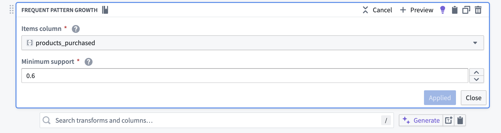

<!-- source: https://palantir.com/docs/foundry/pipeline-builder/transforms-pattern-mining/ · mirrored 2026-08-18 from Palantir Foundry docs -->

# Frequent pattern mining

Pipeline Builder simplifies the process of frequent pattern mining by using the power of the Frequent Pattern Growth (FP-Growth) algorithm in a transform. The algorithm enables you to easily construct and manage mining workflows and discover valuable and frequent patterns in large datasets.

Frequent pattern mining is a data mining technique used to identify recurring patterns or associations within large datasets. The primary goal of frequent pattern mining is to discover relationships between items or events that occur together, more frequently than expected, by chance. These patterns, often referred to as frequent item sets, can help uncover hidden associations and dependencies in the data, facilitating better decision-making and prediction.

Frequent pattern mining can be applied in numerous ways across various domains, including market basket analysis, recommendation systems, bioinformatics, network traffic analysis, customer attribute analysis, explainable AI (XAI), and more. By identifying frequent patterns, organizations can gain valuable insights, enhance their strategies, and improve overall efficiency.

## Frequent pattern mining example: Market basket analysis

A common application of frequent pattern mining in retail is called "market basket analysis". Using the Pipeline Builder Frequent Pattern Growth transform, you can identify the combinations of products that frequently occur in the same transactions.

For example, a supermarket might have a dataset of past purchases (transactions) by its customers. Each transaction contains a set of products that were bought together. Below is a simplified example dataset of such transactions:

| transaction\_id | products\_purchased |
| ----- | ----- |
| 1 | \[Bread, Butter, Milk] |
| 2 | \[Bread, Butter] |
| 3 | \[Bread, Diapers, Beer] |
| 4 | \[Milk, Diapers, Beer, Butter] |
| 5 | \[Bread, Butter, Diapers] |

The frequent pattern growth transform takes an `Items column` and a `Minimum support` value as inputs. In this example, the `products_purchased` column is the items column. Since only frequent patterns will be in the output, the `Minimum support` is set to 0.6; the transform will only return patterns that occur in at least 60% of the transactions. The following screenshot shows how to configure the transform for this example:

The output dataset of the transform is the following:

| pattern | pattern\_occurence | total\_count |
| ----- | ----- | ----- |
| \[Bread] | 4 | 5 |
| \[Butter] | 4 | 5 |
| \[Bread, Butter] | 3 | 5 |
| \[Diapers] | 3 | 5 |

In this case, frequent pattern mining reveals that `Bread` and `Butter` often appear together in transactions (they are a frequent item set that occurs three times in five transactions). This information could be used to drive various business strategies, such as product placements (placing bread and butter close together to increase sales) or promotions (discounts on butter when bought with bread, and vice versa).

The above is a simplified example of much larger and more complex datasets found in real use cases; the use of efficient algorithms like FP-Growth is crucial for effective frequent pattern mining.
