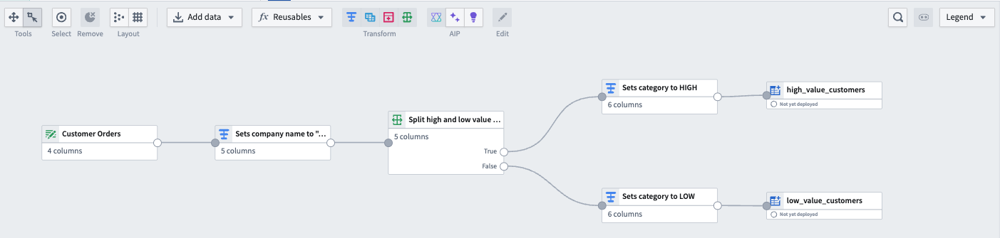
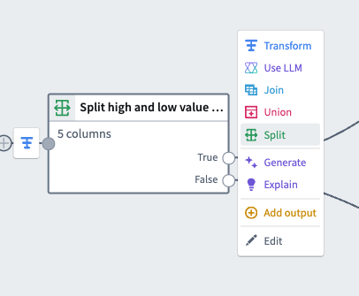
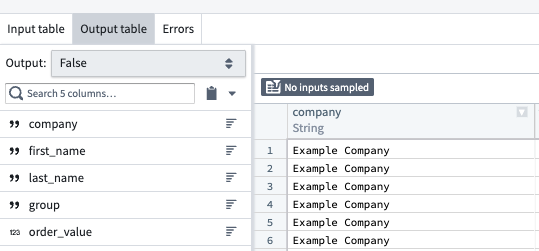
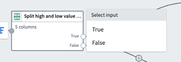
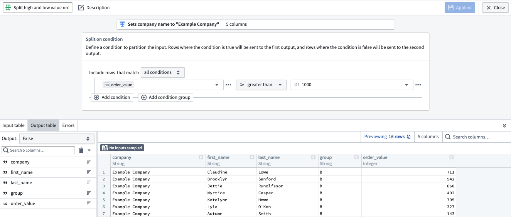

<!-- source: https://palantir.com/docs/foundry/pipeline-builder/transforms-split/ · mirrored 2026-08-18 from Palantir Foundry docs -->

# Split transform

The Split transform is used to partition input data into two distinct outputs based on a specified condition. This transform evaluates each row of the input data against the defined condition and directs the rows to one of the two outputs accordingly.

To use the Split transform, select any dataset node in your graph and select **Split**.

### Condition

The Split transform allows you to define a condition that determines how the input data is divided. This condition is a logical expression that evaluates to either **True** or **False**.

### Outputs

The **True** output will contain rows for which the condition evaluates to true. These rows are directed to the first output.

The **False** output will contain rows for which the condition evaluates to false. These rows are directed to the second output.

To preview the outputs, you can use the dropdown in the top left of the bottom panel. Select **True** to see the True output or **False** to see the False output.

To use the outputs in downstream transforms, select the transform, and then select either the **True** or **False** output to use as your next input.

### Example

Consider a dataset of customer orders. You want to separate orders into two categories: high-value and low-value orders, based on a threshold value.

In this case, the **Condition** will be `order_value > 1000`.

The **True** output will contain orders where `order_value` exceeds `1000`, and the
**False** output will contain orders where `order_value` does not exceed `1000`.

