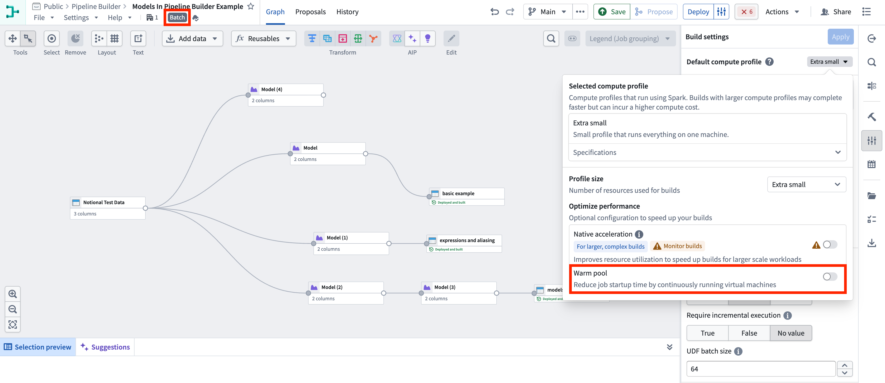
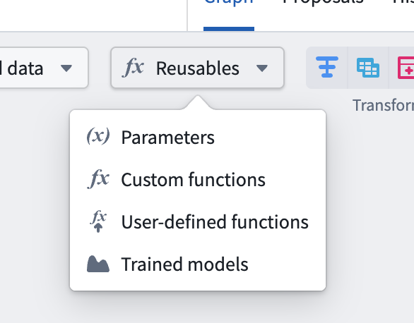
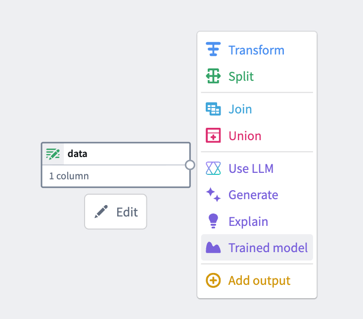
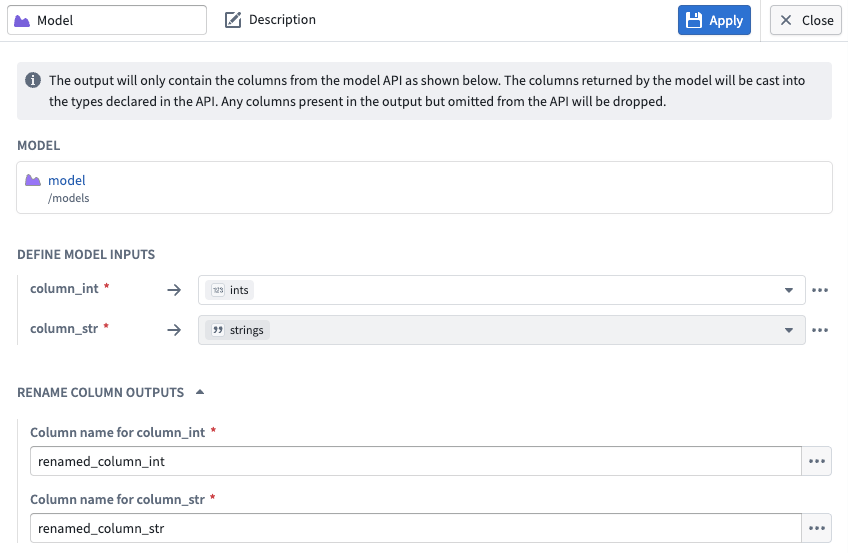
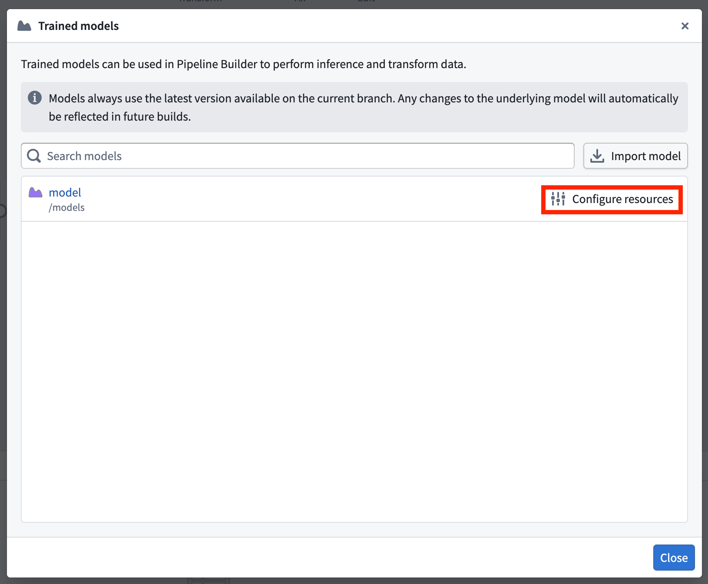
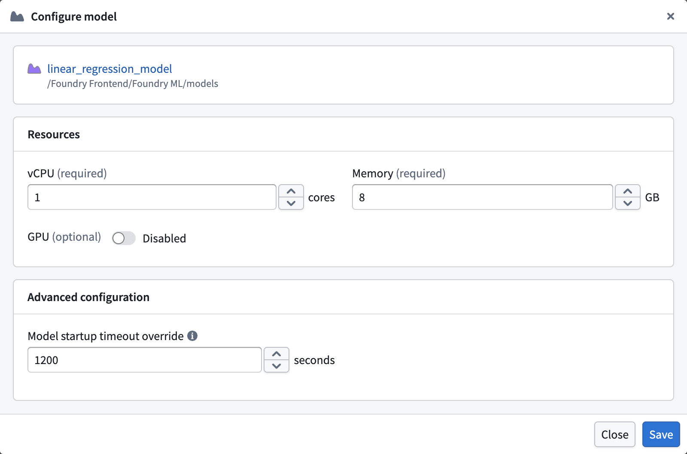
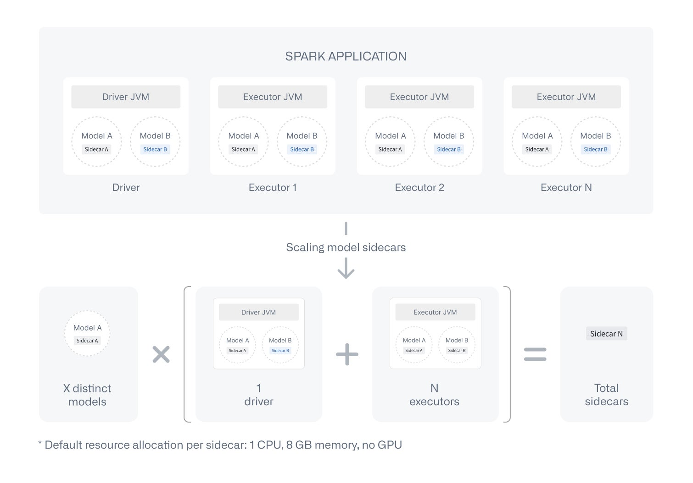

<!-- source: https://palantir.com/docs/foundry/pipeline-builder/transforms-trained-model/ · mirrored 2026-08-18 from Palantir Foundry docs -->

# Trained model node

The trained model node allows you to run user-defined [Machine Learning models](/docs/foundry/model-integration/overview/) — trained either inside or outside of Foundry — directly within a Pipeline Builder pipeline. This enables ML teams and no-code users to seamlessly integrate model inference into their data pipelines without writing any code.

## Getting started

### 1. Configure your pipeline

Ensure you are working with a Spark (batch) pipeline and that **Warm pool** is set to **OFF**. Create a new pipeline if your existing one is not configured to use Spark (batch) mode.

### 2. Import your model

Navigate to **Reusables** > **Trained Models** in the import menu and follow the resource import flow to make your model available to the pipeline.

You can select from models registered using various methods, including:

* Models trained in Palantir code repositories
* Models registered via Data Connection sources
* Models registered via Compute Module sources
* Models uploaded as files or containers

### 3. Add the model node

Select a node in your pipeline canvas and select **Trained model** to insert it.

:::callout{theme="neutral"}
The **Trained model** option only appears after you have imported at least one model into the pipeline following [step 2](#2-import-your-model).
:::

### 4. Configure inputs and outputs

Map your input and output columns to the model's expected API schema.

* **Input columns** support expressions, not just direct column mappings. You can apply casts, transformations, and other expressions to your input data before it is passed to the model.
* **Output columns** can be aliased in the result dataset. This allows you to rename model output fields without needing to modify the model itself.

## Supported models

Currently, only models with a single tabular input and a single tabular output in their [model API](/docs/foundry/integrate-models/model-adapter-api/) are supported. The model must have at least one **required** input column.

When using the model node, your model must return exactly the columns defined in the model's API. Additional columns not defined in the model API will be dropped, whereas columns that are missing may result in build errors.

:::callout{theme="warning"}
Timeseries models may produce unexpected results. Inference runs independently on each partition of your data, so models requiring grouped or sequenced data may operate on fragmented batches if data is randomly or incorrectly partitioned.
:::

Support for additional API types and timeseries models is planned for a future release.

## Supported column types

This feature supports models [whose API](/docs/foundry/integrate-models/model-adapter-api/) includes the following data types for tabular input and output columns:

* **Primitives:** `string`, `boolean`, `integer`, `long`, `float`, `double`, `date`, `timestamp`
* **Complex:** `array`, `map`, `struct` (including nested fields)
* **Media:** `mediaReference`

A `mediaReference` column lets the model read the referenced media item during inference. For details on working with media references in a model adapter, see [Media references](/docs/foundry/integrate-models/model-adapter-reference/#media-references).

Unsupported types such as `objectSet` are rejected at validation time.

## Resource configuration & compute cost

Models run as isolated sidecar processes alongside your Spark executors, each with their own dedicated resources. The default resource allocation per model sidecar is:

| Resource | Default |
| --- | --- |
| CPU | 1 core |
| Memory | 8 GB |
| GPU | None |

If you experience slow builds, you can take either or both of the following actions:

1. Increase the [compute profile](/docs/foundry/pipeline-builder/management-build-settings/) for your pipeline.
2. Increase the resources allocated to your model.

To adjust your model's resources, open the **Model import** window (**Reusables > Trained models**) and select **Configure resources**:

This opens the configuration panel where you can adjust CPU, memory, and GPU allocation, as well as the model startup timeout override under the **Advanced configuration** section:

:::callout{theme="neutral"}
Resource configurations are set per Pipeline Builder pipeline, not per model node. All nodes of the same model within a build/pipeline share the same resource configuration.
:::

Keep in mind that this sidecar process isolation comes with additional compute overhead compared to standard transforms. A sidecar is launched on every Spark executor and the driver for each model — see the diagram below for how this scales.

:::callout{theme="neutral"}
If a model is imported into a pipeline but not used as a node, no sidecar is spun up and no additional cost is incurred.
:::

## Execution modes

| Execution mode | Supported |
| --- | --- |
| Batch (Spark) | ✅ |
| Streaming | ❌ (planned) |
| Faster (Lightweight/DataFusion) | ❌ (planned) |
| Preview | ❌ (planned) |

## Auto-upgrades & branching

Pipeline Builder always uses the latest available version of a model on the build's branch. For example, builds on `master` will always use the latest model version published to `master`. If the model version is not found on the build's branch, the system falls back to configured [fallback branches](/docs/foundry/pipeline-builder/branches-fallback-branches/#configure-fallback-branches-in-pipeline-builder), typically the `master` branch unless otherwise configured. This allows machine learning teams to retrain and publish new model versions with confidence that downstream builds will automatically pick up the latest version.

:::callout{theme="warning"}
Models do not yet support [Global Branches](/docs/foundry/global-branching/overview/). When a pipeline uses a Global Branch, model version resolution falls back to the configured fallback branches, defaulting to `master` if no fallback branches are configured.
:::

:::callout{theme="neutral"}
Static version pinning is planned as a future feature. All builds currently use the latest available model version.
:::

## Marketplace

When you package a pipeline that uses trained model nodes, the models used as transforms are automatically added as resources to the Marketplace package using the [**Include with content** packaging mode](/docs/foundry/model-integration/marketplace-models/#include-with-content). This means installers receive both the pipeline and its associated models in a single installation — no additional configuration is required to package models.

Alternatively, models can be configured as [**product inputs**](/docs/foundry/model-integration/marketplace-models/#use-a-model-as-a-product-input) in DevOps, allowing installers to select a model already available on their enrollment rather than receiving the model as packaged content.

For more details on adding Pipeline Builder pipelines to Marketplace products, see [Add pipeline to a Marketplace product](/docs/foundry/pipeline-builder/marketplace-pipeline-builder/).

## Sidecar timeouts

When a build starts, each model sidecar must download and load the model before it can serve inference requests. By default, the system allows up to 10 minutes for a sidecar to become ready. If it does not become ready within that window — whether because the model is still loading or because the sidecar has died (often due to running out of memory) — the build fails with a timeout error.

If your model requires more (or less) time to load, you can override the default startup timeout. In the **Configure model** dialog, under **Advanced configuration**, set a **Model startup timeout override** value in seconds. Leave the field empty to use the default.

The startup timeout override is configured per model, per pipeline, and applies to every sidecar launched for that model in the build.

Once a sidecar is ready, individual inference requests have **no timeout limit**. This means long-running models — such as those performing complex computations or processing large batches — are not subject to per-request time constraints and will run to completion.

[Learn more about training and deploying models in Foundry.](/docs/foundry/model-integration/models/)
