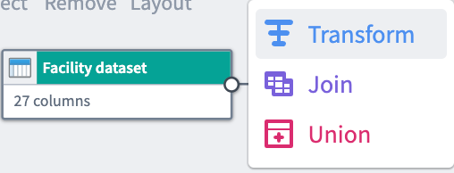
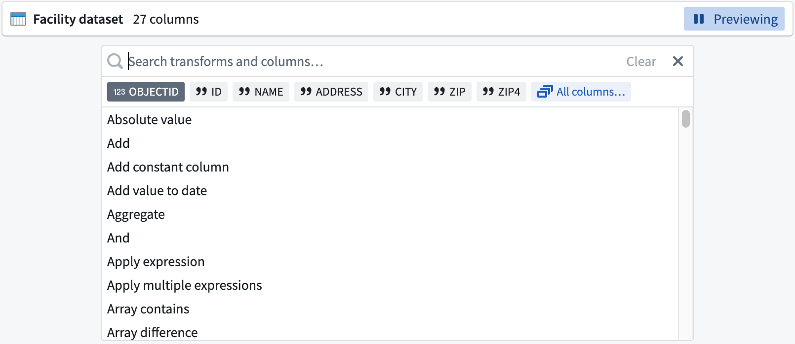
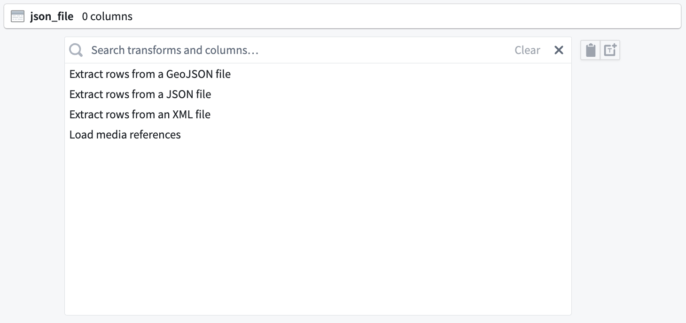
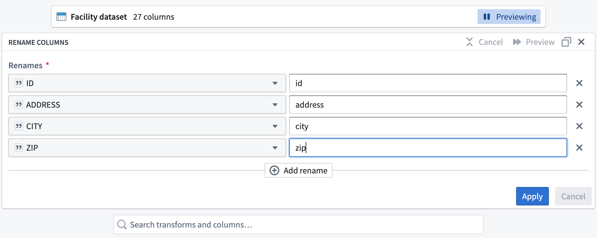
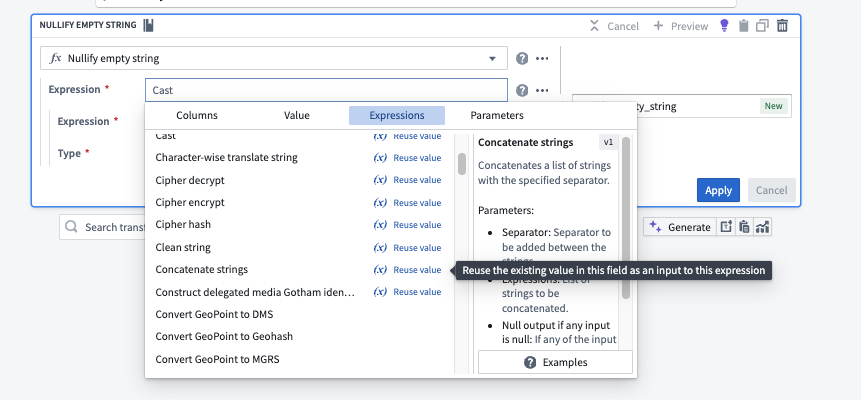
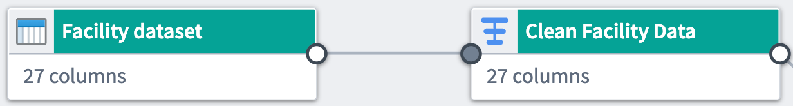
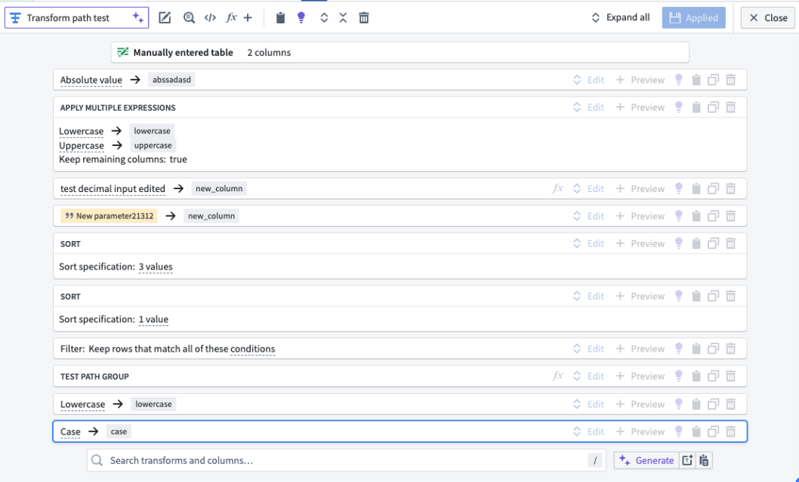
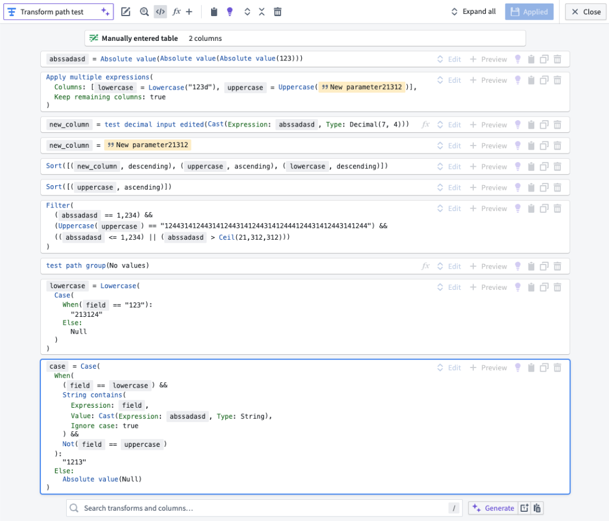
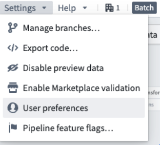
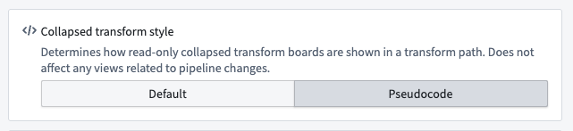

<!-- source: https://palantir.com/docs/foundry/pipeline-builder/transforms-transform-data/ · mirrored 2026-08-18 from Palantir Foundry docs -->

# Transform data

You can start transforming and structuring your data in Pipeline Builder after [adding datasets](/docs/foundry/pipeline-builder/datasets-add/) to your workspace.

## Select a dataset

To apply a transform to a dataset, select a dataset node in your workspace and click **Transform**.

## Search for a transform

In the transform page, search for a transform type by name or browse from a list of available transforms. If you are using a structured (tabular) dataset, this field shows a comprehensive list of table transforms.

For semi-structured datasets like JSON files, the search field includes file transforms that allow you to parse your dataset into table format.

[Learn more about datasets.](/docs/foundry/data-integration/datasets/#datasets)

## Configure a transform

Complete the transform configuration board with required information, including columns, expressions, or values. In the example below, we chose the `Rename columns` transform, selected columns to rename, and entered new name values for the columns.

### Reuse existing expressions

Pipeline Builder lets you reuse values from existing expressions when creating new ones.

When you replace an expression within a nested expression, the new expression will, by default, remove any fields or values you previously set. If you want to keep these existing fields or values, select **Reuse values** next to the expression. This will automatically copy the previous values into your new expression.

## Apply a transform

After completing the transform form, click **Apply** to add the transform to your workflow. You will see the transform node connected to the origin dataset in your graph. We named our new transform `Clean Facility Data`, and it is a direct output of the original `Facility dataset`.

You can rename or edit the transform by clicking the transform node and selecting **Edit.**

:::callout{theme="neutral"}
Drag the white output circles on nodes to change connections on the graph.
:::

## Transform view

Pipeline Builder offers two ways to view transforms: the traditional collapsed board rendering and pseudocode rendering. Setting your view preference will update your personal view globally across the Palantir platform.

### Collapsed board rendering

The collapsed board rendering format displays transforms in a compact, board-like structure. This view is the traditional format and may be preferred by users who are accustomed to this layout.

### Pseudocode rendering

The pseudocode rendering format displays transforms in a cleaner format resembling code but does not adhere to any specific programming language's syntax.

:::callout{theme="warning"}
The joins, unions, and LLM nodes are not affected by the pseudocode rendering option.
:::

This option is particularly beneficial for users familiar with coding or those who prefer a more textual representation of their pipeline logic. The pseudocode automatically adjusts to fit your screen, reducing the need for scrolling as well.

:::callout{theme="warning"}
Enabling pseudocode rendering does not allow code editing within Pipeline Builder. The format is solely to create a more familiar view.
:::

You can enable the pseudocode rendering option via the following methods:

* **Settings menu:** Navigate to the **Settings** menu. Then, select **User preferences** and toggle the option for **Pseudocode** under **Collapsed transform style**.

* **Within a transform path:** Within any transform path, select the **\</>** icon.

