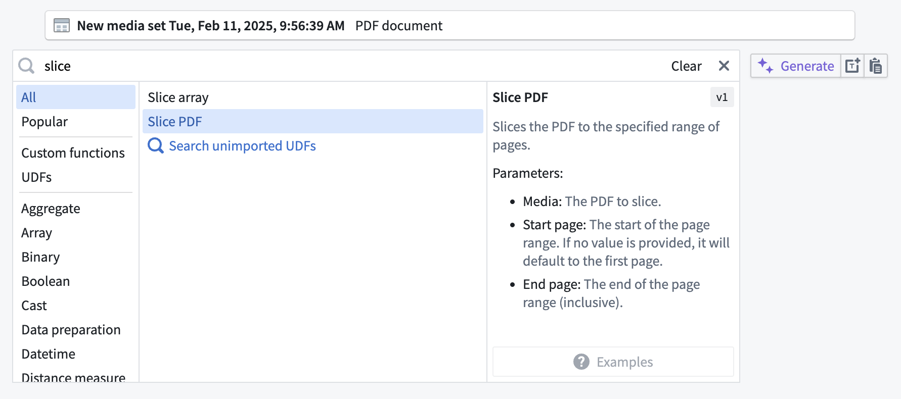
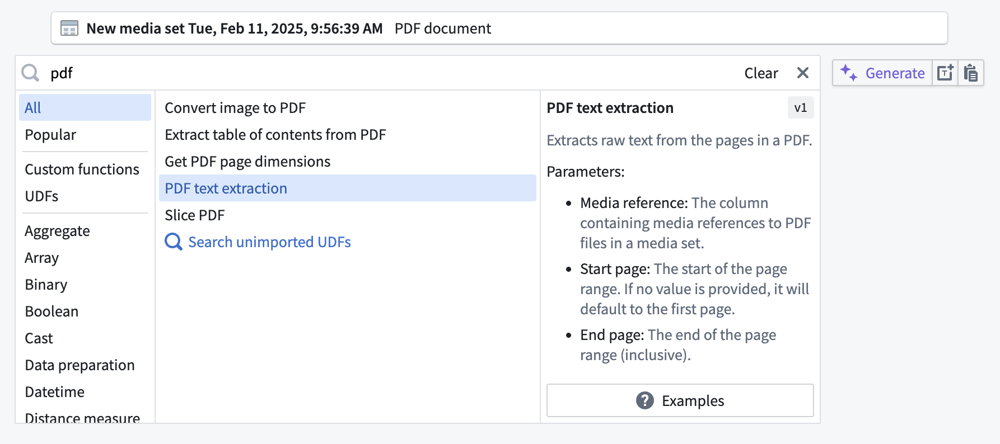
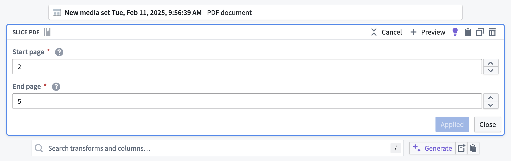
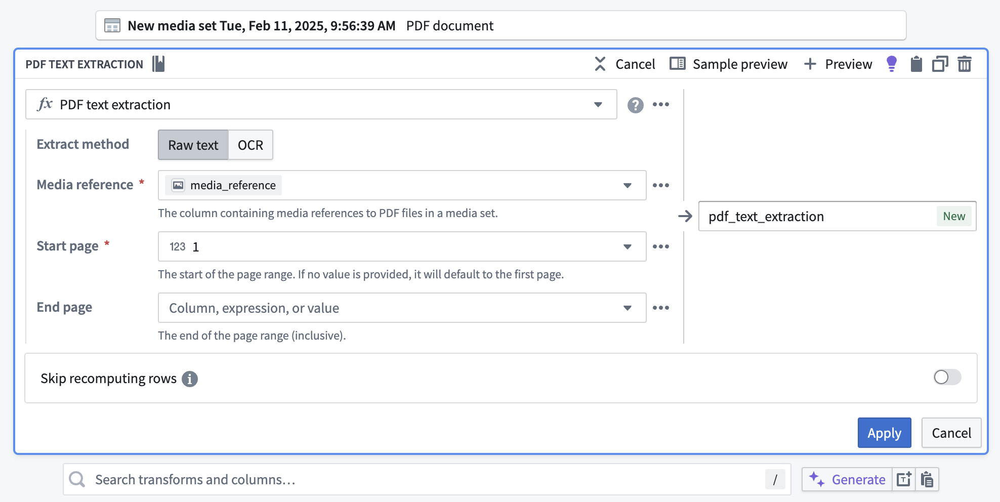
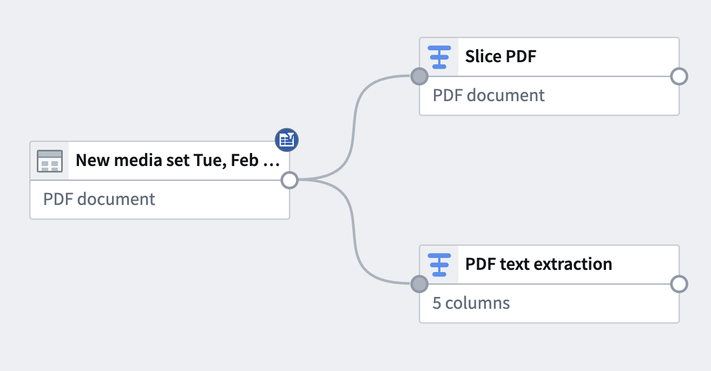

<!-- source: https://palantir.com/docs/foundry/pipeline-builder/transforms-transform-media/ · mirrored 2026-08-18 from Palantir Foundry docs -->

# Transform media

In addition to [transforming tabular structured data](/docs/foundry/pipeline-builder/transforms-transform-data/), Pipeline Builder allows you to transform unstructured data, represented in the Palantir platform as media sets.

Transforming media generally means one of two things: either *manipulating* media or *extracting information* from media. A transform that manipulates media will take a media input and produce a media output. An expression that extracts information from media will take a media input and produce a tabular output.

You can start transforming your unstructured data in Pipeline Builder after [adding data from Foundry](/docs/foundry/pipeline-builder/datasets-add/#add-data-from-foundry-to-pipeline-builder) in the form of a [media set](/docs/foundry/data-integration/media-sets/) to your workspace.

:::callout{theme="neutral"}
Media set inputs do not need to be converted to tables. When a media set input is added to a pipeline, it can be read as a media set or tabular input, meaning you can apply media transformations or tabular expressions without needing to convert it.   
To get a media reference into a dataset output, read a media set as a tabular input and join its media reference column into your output data.
:::

## Select a media set

To apply a transform to a media set, choose a media set node in your workspace and select **Transform**.

## Search for a transform

In the transform page, search for a transform type by name or browse from a list of available transforms. You can also select the **Media** category on the left-hand side to browse only available media transforms.

The example below shows how to take a media set input containing PDF documents and trim down, or "slice", the documents to a subset of their pages. You can do this by searching for and selecting the **Slice PDF** transform.

Slicing PDF documents is an example of transforming media by *manipulating* it. However, you may wish to *extract information* from your documents instead.

The example below begins with the same media set input containing PDF documents; if you want to extract the text from the documents, you can search for and then select the **PDF text extraction** transform.

## Filter a media set

The **Filter media set** transform enables you to filter media sets based on various conditions. This is particularly useful when working with multimodal media sets that contain items of different schemas and formats.

By using the **Has media schema** expression as a condition, you can filter a multimodal media set to only include items matching a specified schema and format. The resulting filtered media set node's type is narrowed, which unlocks subsequent schema-specific transformations such as **Extract text from PDF** and **Crop image**.

For example, if you have a media set containing both PDF documents and images, you can use the **Filter media set** transform with the **Has media schema** expression to create a filtered media set containing only PDF documents, then apply the **PDF text extraction** transform to the filtered result.

## Configure a transform

Many transforms will prompt you to provide parameters to configure how the transform should run. Complete these parameters as appropriate for your workflow.

The example below shows how to configure the **Slice PDF** transform in order to slice the documents to pages 2 through 5.

Below is an example of how to use the **PDF text extraction** transform to extract text for an entire document. In configuration, select **Raw text** because the text is embedded in the documents, but **OCR** is available if that were not the case.

For **Media reference**, select the `media_reference` column from the dropdown. For **Start page** and **End page**, leave the default values at `1` and *empty* respectively in order to extract text for all pages.

## Apply a transform

After configuring the transform board, select **Apply** to add the transform to your pipeline. The example below shows the addition of two different transform paths with the transforms used above, renamed to `Slice PDF` and `PDF text extraction` respectively.

From here, you can add an output or add subsequent downstream transforms.

Learn more about [adding pipeline outputs](/docs/foundry/pipeline-builder/outputs-overview/).

:::callout{theme="warning"}
Media transforms and expressions, such as **PDF text extraction**, require an input from an actual media set. [Media references produced from a dataset of files](/docs/foundry/media-sets-advanced-formats/media-overview/#media-reference-types) (for example, using the **Get media references (datasets)** transform) are not accepted, and will be rejected.   
It is not currently possible to extract information from media that has been transformed, or to transform media that is referenced in a dataset.   
It is also not possible to transform media in changelog mode when using a media set input that contains deleted items.   
Incremental transforms on media sets are not supported in Pipeline Builder. To achieve incremental processing on media sets, use [Python transforms](/docs/foundry/transforms-python/overview/) instead.
:::
