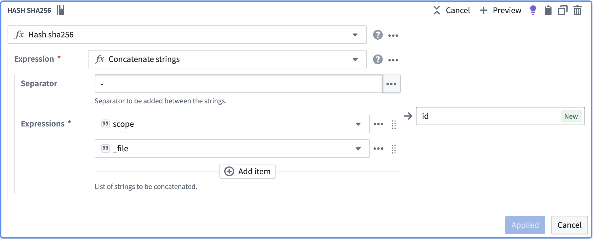
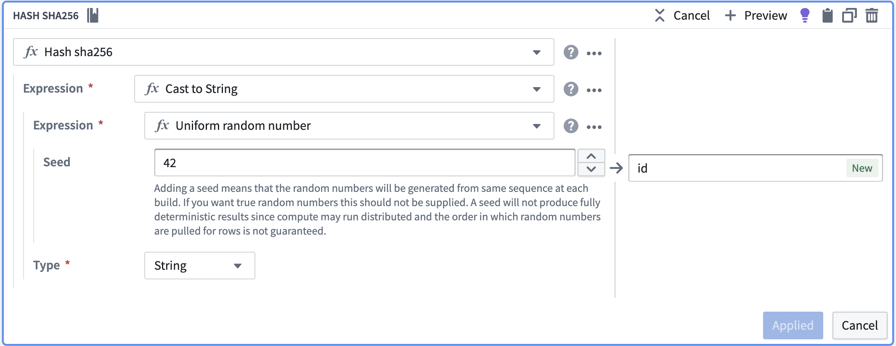

<!-- source: https://palantir.com/docs/foundry/pipeline-builder/unique-id-creation/ · mirrored 2026-08-18 from Palantir Foundry docs -->

# Create unique IDs in Pipeline Builder

In Pipeline Builder, unique IDs facilitate tracking, processing, and analysis of the data, ensuring that each record can be individually identified and properly handled. For this reason, it is often necessary to create unique identifiers (IDs) for records. This section explains why using a monotonically increasing ID is not the best approach and why the preferred method for generating unique IDs is the concatenation of string columns followed by a SHA256 hash.

### Using Concatenation of String Columns and SHA256 Hash

The best approach to generate unique IDs is to concatenate string columns from the input data and then create a SHA256 hash of the concatenated string.

To generate unique IDs using this method in Pipeline Builder, follow these steps within the Pipeline Builder transform path:

1. Identify the string columns that, when combined, can uniquely identify each record in your dataset.
2. Concatenate the selected string columns to form a single string for each record.
3. Use “Hash sha256” to compute the SHA256 hash of the concatenated string. The resulting 256-bit hash can be represented as a 64-character hexadecimal string, which will serve as the unique ID for each record.

This method has several advantages:

* **Consistency:** The same input data will always result in the same unique ID, ensuring consistency across different runs of the data pipeline. This makes it easier to track records, identify duplicates, and perform data reconciliation. Notably, if the IDs are used as primary keys for objects, you do not want those primary keys to change as a result of rebuilding the pipeline. Additionally, consider whether someone working on the data downstream at any point might depend on the IDs to be stable.
* **Distributed Generation:** Since the unique ID is derived from the data itself, multiple processes can generate unique IDs concurrently without the need for synchronization or centralized coordination. This improves scalability and performance in a distributed data processing environment.

By using the concatenation of string columns followed by a SHA256 hash, you can generate unique IDs that are scalable, secure, and consistent, making it an ideal choice for your data pipeline application.

### Using UUID V5 for deterministic unique IDs

Another approach to generate deterministic unique IDs is to use the UUID V5 function. UUID V5 generates a deterministic UUID from a namespace UUID and a name string using SHA-1 hashing (RFC 4122). The same namespace and name always produce the same UUID, making it suitable for scenarios where you need standardized, reproducible identifiers.

To generate unique IDs using UUID V5 in Pipeline Builder:

1. Choose a namespace UUID that represents your data domain. You can use standard namespace UUIDs or create your own.
2. Use the concatenation of identifying columns as the name string.
3. Apply the "UUID V5" expression to generate the deterministic UUID.

This method provides:

* **Standards compliance:** UUID V5 follows RFC 4122, making the generated IDs interoperable with other systems expecting standard UUIDs.
* **Consistency:** The same namespace and name combination always produces the same UUID.
* **Deterministic generation:** Like SHA256, multiple processes can generate the same UUID independently given the same inputs.

### Disadvantages of monotonically increasing IDs

While monotonically increasing IDs are not supported in Pipeline Builder, they are often used by data engineers who are familiar with Spark. Monotonically increasing IDs are generated sequentially, such as 1, 2, 3, and so on. While this approach has an inherent simplicity, it has several disadvantages:

* **Inconsistency between builds:** When using monotonically increasing IDs in Spark, the generated IDs can change between different runs of the same application. This is because the way Spark assigns tasks to its executors can vary, leading to different ID assignment orders. Consequently, this inconsistency can make it difficult to reproduce results, compare different runs, or perform incremental updates, making it a less reliable choice for an ID column. If used as a primary key to an ontology object, this will force a full re-index on every build.
* **Reliance on State:** Generating monotonically increasing IDs requires maintaining state between rows.

These disadvantages indicate that using monotonically increasing IDs is not the best approach for generating unique identifiers in a data pipeline application. Instead, as detailed in the previous sections, we recommend using the concatenation of string columns followed by a SHA256 hash or UUID V5.

### If a set of unique columns to hash is not available

:::callout{theme="warning"}
Be aware that this will not be consistent across builds or previews. This method should be an absolute last resort if a unique set of columns can not be identified.
:::

If you do not have a set of columns that define a unique row in your data, you can use the hash of a random number to create the ID. To create an ID in this way, follow the steps below within the Pipeline Builder transform path:

1. Create a random number using “Uniform random number”.
2. Cast the column to string.
3. Use “Hash sha256” to hash that column.

