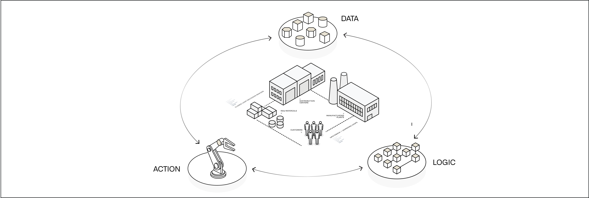
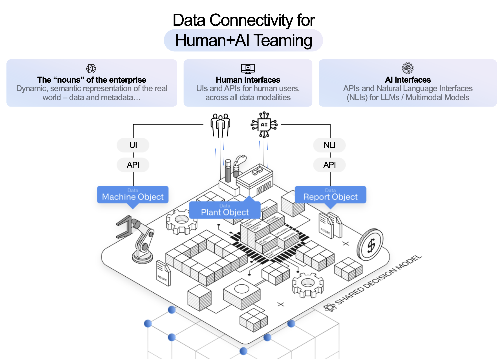
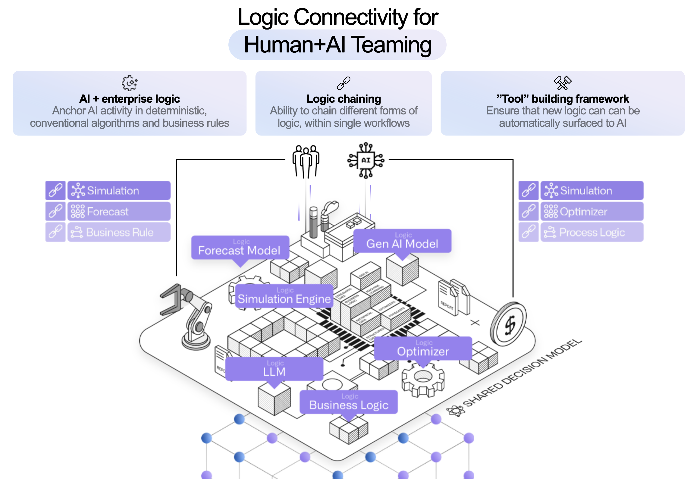
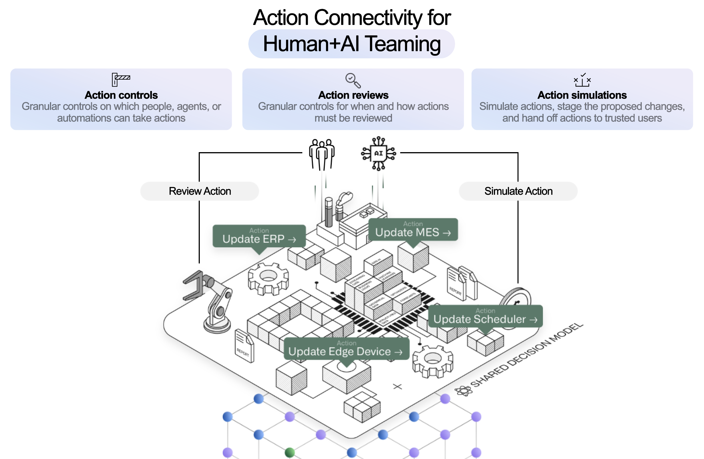

<!-- source: https://palantir.com/docs/foundry/platform-overview/ · mirrored 2026-08-07 from Palantir Foundry docs -->

# Platform overview

Palantir AIP powers real-time, AI-driven decision-making in the most critical commercial and government contexts around the world. From [public health ↗](https://www.youtube.com/watch?v=1F7apO2hFXk\&list=PLmKm_LhXXgqQra-4olkIlUtsUPAchcfJv\&index=4) to [battery production ↗](https://www.youtube.com/watch?v=3C4_3O2Grn4\&list=PLmKm_LhXXgqRam-Dgv5UWLhGweN9nmeUp\&index=3), organizations depend on Palantir to safely, securely, and effectively leverage AI in their enterprises — and [drive operational results ↗](https://www.youtube.com/watch?v=CmpQTrnL3ko\&list=PLmKm_LhXXgqQQGVPa4l88ExP556vDMTgF).

In short, Palantir AIP connects generative AI to operations. Together with Foundry - Palantir's data operations platform - and Apollo - Palantir's mission control for autonomous software deployment, AIP is part of an *AI Mesh* that can deliver the full gamut of AI-driven products, from LLM-powered web applications to mobile applications using vision-language models to edge applications that embed localized AI. We call this entire set of capabilities, functionality, and tooling the *Palantir platform*.

While many factors contribute to achieving and scaling operational impact with the Palantir platform — including [AIP Bootcamps ↗](https://www.palantir.com/platforms/aip/bootcamp/), where customers are hands-on-keyboard and achieving outcomes with AI in a matter of hours — the key differentiator is a software architecture which revolves around the Palantir [Ontology](#the-ontology).

:::callout{theme="success" title="Palantir Learning portal"}
Learn important platform concepts in the ["Introduction to Foundry & AIP for Enterprise Organizations" course on learn.palantir.com ↗](http://learn.palantir.com/introduction-to-foundry-aip-for-enterprise-organizations), or read on below.
:::

## The Ontology

The Ontology is designed to represent the *decisions* in an enterprise, not simply the data. Every organization in the world is faced with the challenge of how to execute the best possible decisions, often in real-time, while contending with internal and external conditions that are constantly in flux.

The complexity of these decision processes is reflected in the Ontology, which facilitates deep, two-way interoperability with existing enterprise systems. The Ontology automatically integrates the relevant data, logic and action components into a modern, AI-accessible computing environment. This unlocks the rapid development of operational applications with AI teaming, in addition to conventional business intelligence and analytical workflows.

## Decision components

Every decision can be broken down into **data**, **logic**, and **actions**.

* **Data:** What are the relevant facts or truth about the world and our operations that form the context for this decision?
* **Logic:** What organizational or business rules act as guardrails for this decision? What are the probabilities of certain outcomes under different assumptions? What have we done in previous, similar situations and what have the outcomes been? What are the inputs from our forecasting and optimization models?
* **Actions:** What are the "kinetics" or effects of this decision - that is, how does the decision manifest in the world? How do we reduce or collapse the steps between taking a decision in AIP and affecting an outcome in a production setting?

In the Palantir platform, all of these components are designed to facilitate AI teaming patterns to unlock the full potential of your operators, analysts, and subject-matter experts.

:::callout{theme="success" title="Suggested reading"}
To learn more about how these decision components interact to guide workflow development, refer to the documentation on [distilling functional requirements](/docs/foundry/use-case-life-cycle/distilling-functional-requirements/) as part of the [use case lifecycle](/docs/foundry/use-case-life-cycle/overview/), or find examples of industry-specific end-to-end workflows in the [AIP Now showcase ↗](https://aip.palantir.com/).
:::

### Data

The Ontology integrates data as [objects and links](/docs/foundry/ontology/overview/#object-and-link-types) in order to make the real-world complexity of operations understandable for both humans and AI. This unlocks the ability to build *Human + AI teaming* workflows.

The Ontology natively supports a wide range of data types as well as a number of extended primitives, such as [semantic search](/docs/foundry/ontology/overview-semantic-search/) for unlocking unstructured data, [media references](/docs/foundry/media-sets-advanced-formats/media-overview/#media-references) for working with images and video, and [value types](/docs/foundry/object-link-types/value-types-overview/) for embedding additional constraints and context into data. These are the data building blocks for AI workflow development, described further in the [Logic](#logic) and [Actions](#actions) sections below.

This data model powers out-of-the-box applications for exploring structured, unstructured, geospatial, temporal, simulated, and other data modalities. These baseline tools are enriched with the context-aware [AIP Assist](/docs/foundry/assist/overview/) to dramatically shorten the time-to-value when exploring and analyzing data in the platform.

In addition to application building and analytics, modeling data in the Ontology automatically creates a robust API gateway and Ontology Software Developer Kit (OSDK) to serve as an “operational bus” for connectivity throughout the enterprise.

#### Data connectivity

Data rarely comes packaged in the clean, correct, and well-shaped formats needed to accurately and reliably present truth to decision makers. To that end, the Palantir platform provides an extensible, multimodal data connection and integration framework that works with enterprise data systems out-of-the-box.

[Pipeline Builder](/docs/foundry/pipeline-builder/overview/) puts the power of [LLM data transformation](/docs/foundry/pipeline-builder/pipeline-builder-llm/) into a point-and-click package, making it easy to use the latest LLMs to power pipeline-based transforms such as classification, sentiment analysis, summarization, entity extraction, or translation. This sets the stage for automatically creating "proposals" in the Ontology for operators to review and approve, without the lag of always running a live request to a model. (Note that, as discussed in the [Logic](#logic) section below, these two approaches to interacting with models are highly complementary.)

In addition, [AIP Assist](/docs/foundry/assist/overview/) in [Pipeline Builder](/docs/foundry/pipeline-builder/overview/) and [Code Repositories](/docs/foundry/code-repositories/overview/) accelerates data engineering with an AI partner that not only has access to Palantir documentation and repositories of generic code snippets, but also is deeply integrated into the platform frontend and can suggest next actions or relevant tutorials.

### Logic

If data defines the context for our decisions, logic encapsulates the reasoning and analysis that enriches this context, enabling Human+AI teams to make better decisions. This can be provided as additional context in the form of model outputs and visualizations presented within an operational application, or baked directly into the mechanics of an Action.

Given this broad definition, the ability to define and execute logic shows up throughout the platform; for example, let us consider [models](#models), [business logic](#business-logic), and [templated analyses and reports](#templated-analyses-and-reports).

#### Models

*Generative AI, LLMs, forecasts, optimizers, etc.*

Models like LLMs or forecasts take parameters and provide an output to serve as context for the decision at hand. In a cycle familiar to data scientists, these models often undergo an iterative process of training and refinement; however, using these models as operational workflows in production can be a challenge. Palantir's modeling capabilities can facilitate operational deployment of models.

In the Palantir platform, the full lifecycle of a model is captured as a [modeling objective](/docs/foundry/model-integration/objectives/) and the logic of the model itself is abstracted with a [model adapter](/docs/foundry/integrate-models/integrate-overview/). This approach means whether you [train in the platform](/docs/foundry/integrate-models/model-asset-code-repositories/), [bring your own container](/docs/foundry/integrate-models/container-overview/), or [upload a pre-trained model](/docs/foundry/integrate-models/model-asset-files/), models of all varieties can be bound to the Ontology through [Functions](/docs/foundry/functions/functions-on-models/) for live interaction embedded in operational apps, or configured for [batch deployment](/docs/foundry/manage-models/set-up-batch/) and scheduled for execution in a data pipeline.

Specifically for generative AI, Palantir's [Language Model Service](/docs/foundry/aip/supported-llms/) provides a unified interface for multi-modal interactivity while abstracting the specific model and provider implementation details, making it simple to develop across the landscape of commercially-available LLMs. To further improve outcomes, Palantir's [Evaluations](/docs/foundry/aip-evals/overview/) tool enables you to benchmark LLM performance over time and between models to monitor drift and make changes with confidence.

#### Business logic

*Business rules, process mapping, semantic search*

Where modeling approaches take a "bottom-up" approach to training on data, business logic generally goes "top-down" based on the explicit or implicit rules that govern an operational domain. These may live on an external system, to which Palantir can connect directly with [External Functions](/docs/foundry/data-connection/external-functions/) and [Webhooks](/docs/foundry/data-connection/webhooks-overview/) for live interactions in operational workflows, or through [External Transforms](/docs/foundry/data-connection/external-transforms/) for pipeline connectivity. Business logic may also be authored directly within the Palantir platform using [Rules](/docs/foundry/foundry-rules/overview/) and Pipeline Builder for logic in data pipelines, and Automate and Functions for logic that will be executed live.

#### Templated analyses and reports

*Object views, analysis templates, generated reports*

Logic does not live only in data science models or as hard-coded business rules; analysts often capture and collect high-value logic in one-off investigations, analyses, or reports. In the Palantir platform, you can build analyses and dashboards with point-and-click analysis tools like [Contour](/docs/foundry/contour/overview/) and [Quiver](/docs/foundry/quiver/overview/), and notebooks like [Code Workspaces](/docs/foundry/code-workspaces/overview/). The semantics of the Ontology data model make it easy to template these analytical products and reuse them, whether embedded in [Object Views](/docs/foundry/object-views/config-overview/) or [Workshop applications](/docs/foundry/workshop/module-interface/), or presented as stand-alone [dashboards](/docs/foundry/notepad/widgets-quiver-dashboard/). These object views, templated analyses, and dashboards can be plugged into operational apps to provide at-a-glance insights to guide decision-making, while providing avenues for further ad-hoc exploration.

Taken together, these three facets of logic - models, business logic, and templated analyses and reports - provide a toolkit or palette from which users can mix-and-match to provide decision makers with all of the context needed at the critical moment.

### Actions

For any decision to have an impact, the decision must propagate into the world. This is where Actions define the "verbs" of the enterprise - the things that are done - and control how human operators or AI agents can ensure that their decision persists, either within the Ontology data model or through interaction with [external systems](/docs/foundry/action-types/side-effects-overview/). In addition, capturing decision outcomes in the Ontology allows users to pair a particular decision with observations of the results in future data. This enables feedback loops that put future decisions in the context of past choices and can be used to retrain or fine-tune models, or simply support operators with a clearer picture of the past.

The atomic unit for representing these "kinetics" in the Ontology is an [Action](/docs/foundry/action-types/overview/), which provides specific, granular control for changing or creating data, as well as for orchestrating changes in external systems. Basic actions are simple to define with a point-and-click form configuration interface. Actions of arbitrary complexity can be specified with [Function-backed Actions](/docs/foundry/action-types/function-actions-overview/) and the [Ontology Edits Typescript API](/docs/foundry/functions/api-ontology-edits/). Actions are also available to package within the [Ontology Software Development Kit](/docs/foundry/ontology-sdk/overview/) (OSDK) and within the [platform API](/docs/foundry/api/ontology-resources/actions/action-basics/) so that custom application development and existing third-party tools can easily and securely write back to the Ontology.

[Permissions](/docs/foundry/action-types/permissions/) for each Action determine which user or agent, under what conditions, is able to execute the action laying the foundation at the lowest level for secure, auditable, and transparent control.

In complex, tightly-coupled environments, such as a supply chain or a manufacturing floor, a small change can cause cascading effects with unexpected or unintended outcomes. The [Scenario](/docs/foundry/vertex/scenarios-overview/) primitive allows users to project these consequences by making changes to a branch of the ontology, effectively creating a sandbox universe in which forecasts, business process models, and other analyses can be made on top of (and downstream of) the potential change. The [Vertex](/docs/foundry/vertex/overview/) application specializes in this kind of process visualization and scenario testing; the [Workshop](/docs/foundry/workshop/scenarios-overview/) application builder natively supports scenarios for developing operational applications that incorporate “What if...” workflows.

These primitives create an environment for safe development of Human+AI teams operating in production workflows. The granular permissions and access control from Actions provide a "control plane" in which agents are sandboxed with specific limitations on the data and tools they can wield. In most patterns, rather than directly make changes, AI agents create proposals either synchronously through direct integration with [AIP Logic](/docs/foundry/logic/overview/) functions integrated into Workshop, or asynchronously through [Automate](/docs/foundry/automate/overview/) or the [Use LLM](/docs/foundry/pipeline-builder/pipeline-builder-llm/) node in Pipeline Builder. The resulting proposal can then be surfaced to an operator for refinement, feedback, and a resulting decision. This proposal-based pattern, in addition to reinforcing the “human in the loop” paradigm, also generates valuable metadata that enables a positive cycle where the Agent can learn and evolve with continuous feedback.

## What’s next?

The best way to experience the power of AIP is to start building. Read the [getting started](/docs/foundry/getting-started/overview/) guide for more information, or - if you have access to the platform - just ask AIP Assist where to start based on your intended goals.

:::callout{theme="success" title="Palantir Learning portal"}
To jumpstart building your first end-to-end sample workflow, navigate to [learn.palantir.com ↗](http://learn.palantir.com/speedrun-your-first-e2e-workflow).
:::

For details on how various platform decision components interact to guide workflow development, refer to the discussion about [distilling functional requirements](/docs/foundry/use-case-life-cycle/distilling-functional-requirements/) in the discussion of [use case development](/docs/foundry/use-case-life-cycle/overview/), or find examples of industry-specific end-to-end workflows in the [AIP Now showcase ↗](https://aip.palantir.com/).

Additionally, you can learn more about how AIP is built and how it integrates with existing investments across your organization:

* [Architecture](/docs/foundry/architecture-center/overview/)
* [Interoperability](/docs/foundry/architecture-center/interoperability/)
* [Development lifecycle](/docs/foundry/platform-overview/development-life-cycle/)

## Platform capabilities

The remainder of the documentation is organized as a collection of [platform capabilities](#platform-capabilities). Summaries of each can be found below:

* [Data connectivity & integration](#data-connectivity--integration)
* [Model connectivity & development](#model-connectivity--development)
* [Ontology building](#ontology-building)
* [Use case development](#use-case-development)
* [Analytics](#analytics)
* [Product delivery](#product-delivery)
* [Security & governance](#security--governance)

### Data connectivity & integration

Palantir provides an extensible, multimodal data connection framework that connects to enterprise data systems out-of-the-box and provides:

* In-place, zero-copy access to existing data lakes and platforms;
* An auto-scaling, Kubernetes-based build system for data that works across batch and streaming pipelines;
* Integrated pipeline scheduling and orchestration;
* Native health checks for all data flows; and
* Comprehensive security functionality that spans role-, classification-, and purpose-based access controls.

:::callout{theme="success" title="Suggested reading"}
Learn more with these resources:

* [Overview: Data connectivity & integration](/docs/foundry/data-integration/overview/)
* [Connecting to data](/docs/foundry/data-integration/connecting-to-data/)
* [Virtual Tables](/docs/foundry/data-integration/virtual-tables/)
* [What is a data pipeline?](/docs/foundry/data-integration/data-pipeline/)
* [Health checks](/docs/foundry/health-checks/overview/)
* [Securing a data foundation](/docs/foundry/security/securing-a-data-foundation/)
:::

### Model connectivity & development

Palantir offers an integrated, end-to-end environment for model development (e.g., in Python and R); flexible integration of external models built using industry-standard toolsets; governed paths to production for all developed or integrated models; and a “mission control” for continuous evaluation of deployed models.  The architectural goal is to provide a connection path for all business logic and modeling in the enterprise, regardless of where the given asset was trained, tested, and/or hosted.

:::callout{theme="success" title="Suggested reading"}
Learn more with these resources:

* [Overview: Model connectivity & enablement](/docs/foundry/model-integration/overview/)
* [Model development](/docs/foundry/integrate-models/integrate-overview/)
* [Integrating external models](/docs/foundry/integrate-models/external-model-connection/)
* [Evaluating models](/docs/foundry/evaluate-models/model-evaluation-automatic/)
* [Models in the Ontology](/docs/foundry/functions/functions-on-models/)
:::

### Ontology building

As mentioned above, to create a comprehensive decision-centric model of the enterprise, the Ontology integrates:

* *Data*, as [objects and links](/docs/foundry/ontology/overview/#object-and-link-types);
* *Logic*, as [models](/docs/foundry/model-integration/overview/) and [functions](/docs/foundry/functions/overview/); and
* *Actions*, as platform [actions](/docs/foundry/action-types/overview/).

These building blocks of the Ontology make the real-world complexity of operations understandable to both operators and AI, unlocking the ability to build hybrid human-AI workflows. Additional capabilities include:

* Structured mechanisms for capturing data from end users back into the semantic foundation;
* Out-of-the-box applications for exploring the Ontology in structured, unstructured, geospatial, temporal, simulated, and other paradigms; and
* The Ontology Software Developer Kit (OSDK) for leveraging the Ontology as an “operational bus” throughout all parts of the enterprise.

:::callout{theme="success" title="Suggested reading"}
Learn more with these resources:

* [Overview: Ontology building](/docs/foundry/ontology/overview/)
* [Why create an Ontology?](/docs/foundry/ontology/why-ontology/)
* [Ontology and AIP Logic](/docs/foundry/logic/overview/)
* [Models in the Ontology](/docs/foundry/ontology/models/)
* [Ontology-aware applications](/docs/foundry/ontology/applications/)
* [System graphs and simulations](/docs/foundry/vertex/overview/)
* [Ontology SDK](/docs/foundry/ontology-sdk/overview/)
:::

### Use case development

Palantir's application development framework enables enterprises to build operational workflows and develop use cases that leverage user actions, alerting, and other end-user frontline functions in collaboration with tool-wielding, data-aware AIP Chatbots.

Use case development capabilities include:

* Integration with AIP Logic for building custom workflow agents;
* AI-assisted, low-code / no-code application building that automates security enforcement and the management of underlying storage and compute as well as data and model bindings;
* An application development framework with live preview; and
* APIs, webhooks, and other interfaces that allow for full-spectrum integration with the enterprise.

:::callout{theme="success" title="Suggested reading"}
Learn more with these resources:

* [Overview: Use case development](/docs/foundry/app-building/overview/)
* [Creating operational applications](/docs/foundry/app-building/operational-apps/)
* [Connecting analytics to operations](/docs/foundry/app-building/analytics-operations/)
* [Low-code and no-code application building](/docs/foundry/workshop/overview/)
* [Integrating with existing systems](/docs/foundry/action-types/webhooks/)
:::

### Analytics

The platform provides analytical capabilities for every type of user, whether they can code or not. Capabilities include both point-and-click and code-based tools that enable table-based analysis, top-down visual analysis, geospatial analysis, time series analysis, scenario simulation, and more.

Palantir's Analytics suite goes beyond conventional “read-only” paradigms to write data back into the Ontology, producing valuable new insights within unified security, lineage, and governance models.

The platform also interoperates with common modeling environments (supporting native usage of JupyterLab® and RStudio® Workbench with [Code Workspaces](/docs/foundry/code-workspaces/overview/)) and business intelligence platforms (including [dedicated connectors](/docs/foundry/analytics-connectivity/overview/) for Tableau® and PowerBI®).

:::callout{theme="success" title="Suggested reading"}
Learn more with these resources:

* [Overview: Analytics](/docs/foundry/analytics/overview/)
* [Types of analysis](/docs/foundry/analytics/types-of-analysis/)
* [Code-based analysis](/docs/foundry/code-workbook/overview/)
* [Time series analysis](/docs/foundry/analytics/types-of-analysis/#time-series-analysis)
:::

### Product delivery

The Palantir platform provides DevOps tooling to package, deploy, and maintain data products built in the platform. These product delivery capabilities include a packaging interface to create "products" consisting of collections of platform resources (pipelines, Ontologies, applications, models, etc.); a Marketplace storefront for product discovery and installation; and the ability to manage product installations with automatic upgrades, maintenance windows, and more.

:::callout{theme="success" title="Suggested reading"}
Learn more with these resources:

* [Overview: Product delivery](/docs/foundry/devops/overview/)
* [Core concepts](/docs/foundry/devops/core-concepts/)
* [Finding and installing products in Marketplace](/docs/foundry/marketplace/overview/)
* [Creating products](/docs/foundry/foundry-devops/create-products/)
:::

### Security & governance

The Palantir platform features a comprehensive, best-in-class security model that propagates across the entire platform and, by default, remains with information wherever it travels. Capabilities include:

* [Encryption of all data](/docs/foundry/security/overview/#enterprise-security), both in transit and at rest;
* Authentication and identity protection controls;
* Authorization controls that can blend role-, marking-, and purpose-driven paradigms;
* Robust security [audit logging](/docs/foundry/security/audit-logs-overview/); and
* Highly extensible information governance, management, and [privacy controls](/docs/foundry/security/protecting-sensitive-data/).

:::callout{theme="success" title="Suggested reading"}
Learn more with these resources:

* [Overview: Security & governance](/docs/foundry/security/overview/)
* [Enterprise security](/docs/foundry/security/overview/#enterprise-security)
* [Audit logging](/docs/foundry/security/audit-logs-overview/)
* [Privacy controls](/docs/foundry/security/protecting-sensitive-data/)
:::

### Management & enablement

Platform administrators have access to a robust set of tools for managing the Palantir platform. The core applications for platform management are:

* [Control Panel](/docs/foundry/administration/control-panel/)
* [Resource Management](/docs/foundry/resource-management/overview/)
* [Upgrade Assistant](/docs/foundry/upgrade-assistant/overview/)

Platform administrators and program managers also have access to resources to facilitate user enablement, such as [AIP Assist](/docs/foundry/assist/overview/). These resources are described in the [management & enablement documentation](/docs/foundry/administration/overview/).

:::callout{theme="success" title="Suggested reading"}
Learn more with these resources:

* [Overview: Management & enablement](/docs/foundry/administration/overview/)
* [Enrollments and organizations](/docs/foundry/administration/enrollments-and-organizations/)
* [Authentication](/docs/foundry/authentication/overview/)
* [Retention](/docs/foundry/retention/overview/)
:::
