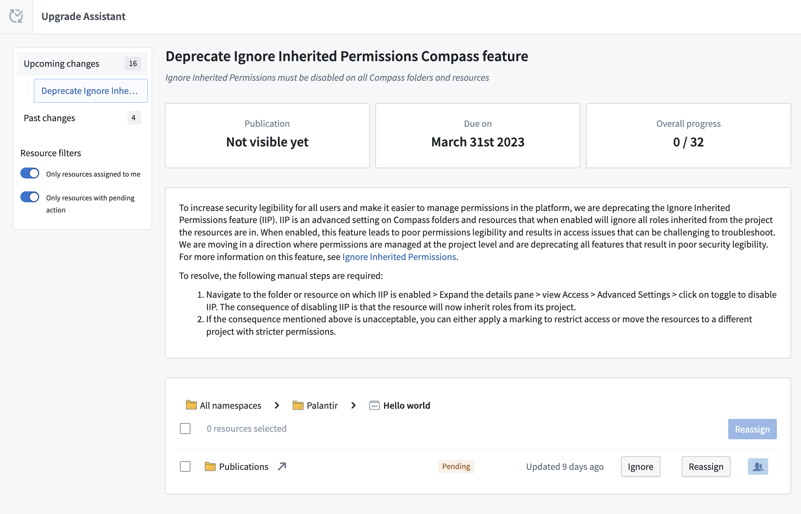
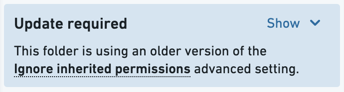
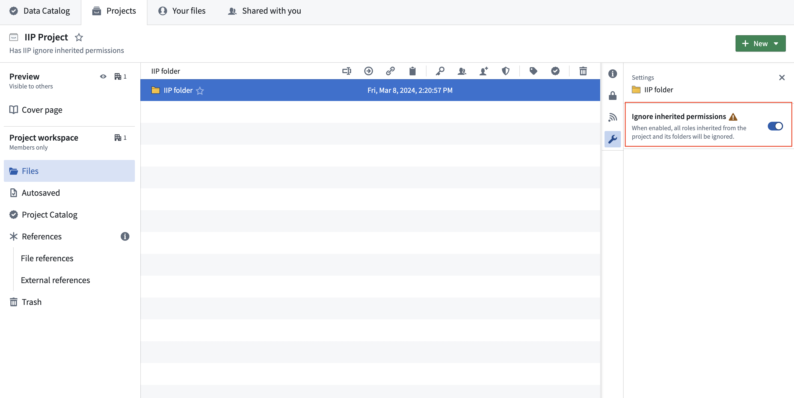

<!-- source: https://palantir.com/docs/foundry/platform-security-management/disabling-ignore-inherited-permissions/ · mirrored 2026-08-22 from Palantir Foundry docs -->

# Migrate from and disable "Ignore inherited permissions" setting \[Planned deprecation]

:::callout{theme="warning" title="Planned deprecation"}
The **Ignore inherited permissions** setting is in the [planned deprecation](/docs/foundry/platform-overview/development-life-cycle/) phase of development, and most enrollments are no longer able to use this feature as of December 2024. Any enrollments still using the **Ignore inherited permissions** setting are strongly encouraged to follow the guide below to migrate away from this usage in favor of other security features.   
Contact Palantir Support if you require additional help with this migration.
:::

When the "Ignore inherited permissions" setting is enabled on a folder or file in the platform, all permissions to the folders or files (along with the child folders and files that live within them) will be revoked unless they are explicitly added to a folder or file. For example, granting a user `Viewer` permissions on the Project will not automatically grant `Viewer` permissions on the folder that has "Ignore inherited permissions" enabled.

When disabling the "Ignore inherited permissions" setting, we recommend either moving the folder or file contents to another [Project](/docs/foundry/security/projects-and-roles/) with the specific permissions you require, or replacing the folder or file with a [Marking](/docs/foundry/security/markings/). Projects and Markings are the preferred tools because, unlike the "Ignore inherited permissions" setting, they visibly define the requirements necessary to view underlying data.

Below is a summary of the steps to take to migrate away from the "Ignore inherited permissions" setting:

1. Start in the [Upgrade Assistant](/docs/foundry/upgrade-assistant/overview/) application and pick a folder or file that needs to be migrated.
2. Complete any required updates on the folder or file.
3. Consider your migration options and decide which is best for your situation.
4. Perform the migration.
5. Disable "Ignore inherited permissions" on the folder or file.
6. Return to Upgrade Assistant and confirm that there is no longer a pending action corresponding to this folder or file.

## Migration steps

### 1. Upgrade Assistant

Go to the Upgrade Assistant application in Foundry and navigate to a specific folder or file where "Ignore inherited permissions" is enabled. Select the folder or file to start the migration process.

### 2. Complete required updates

If you see an “Update required” notice, select **Update**. Doing so will separate this process of disabling the "Ignore inherited permissions" setting from the additional requirement of disabling and migrating from the "Propagate view requirements" setting. Learn more about this [additional required migration](/docs/foundry/platform-security-management/disabling-propagate-view-requirements/).

### 3. Choose how to migrate

There are several different ways to migrate away from using the "Ignore inherited permissions" setting. The method you choose depends on the sensitivity of your data, what Projects and Markings already exist on your platform, and the security architecture of your enterprise. Below is a list of migration options and questions you should ask to help decide next steps:

* **Disable the permission:** Does this folder or file require separate permissions from its parent project? Was "Ignore inherited permissions" enabled for legacy reasons that are no longer relevant? If this is the case, you can disable "Ignore inherited permissions".
* **Move to another Project:** Does another Project exist that uses the stricter permissions you are enforcing on this folder or file? Does the destination Project have a similar set of users? If so, you can move the contents of this folder or file into that existing Project.
* **Create a new Project:** Does this data require its own space that does not exist? Has this folder grown large enough to benefit from its own Project? If so, consider creating a new Project and moving the folder or file to it.
* **Apply an existing Marking:** Is the data sensitive, and is there an existing Marking that semantically represents this data? Do you want downstream protections on these resources? If so, consider applying the existing Marking on this folder or file.
* **Create a new Marking:** Is the data inside of this folder or file sensitive and unique? Do you want downstream protections on the contents of this folder or file? If so, consider creating a new Marking and applying it to the folder or file.

### 4. Complete migration

Below are instructions on how to execute the migration options listed above.

#### Move to another Project

Before moving the contents of a folder or file to another Project, review the permissions of the destination Project. You may need to add additional users to the destination Project to mirror the original security settings of the folders and files with the "Ignore inherited permissions" setting enabled.

To move the contents of a folder or file to another Project, you will need at least `Editor` permissions on the destination Project. Highlight the resources, then right-click and select **Move**. For detailed instructions, review our documentation on [moving and sharing Project resources](/docs/foundry/compass/move-and-share-resources/).

#### Create a new Project

To create a new Project, follow the steps to [create a Project](/docs/foundry/compass/create-a-project/). You should assign permissions on the Project so users of the original folder or file with enabled "Ignore inherited permissions" settings have the same set of permissions. Doing so will ensure no one loses access to these resources.

To [move the contents](/docs/foundry/compass/move-and-share-resources/#move-resources) of a folder or file to this new Project, highlight the resources, then right-click and select **Move**.

#### Apply an existing Marking

Add all the users who have access to the folder or file using the "Ignore inherited permission" settings as members of the existing Marking. This ensures that no one will lose access after the migration.

:::callout{theme="warning"}
Once users are added as members to an existing Marking, they will potentially be able to see any data throughout the platform where this Marking is applied.
:::

Before applying an existing Marking, review the [steps to apply Markings](/docs/foundry/platform-security-management/manage-markings/#apply-markings). Consider the downstream impact of applying a Marking and potentially locking out downstream users. When you are ready, apply the Marking on the folder or file enabled with the "Ignore inherited permissions" setting.

#### Create a new Marking

First, [create a new Marking](/docs/foundry/platform-security-management/manage-markings/#create-markings). Then, add all the users who have access to the folder or file with the "Ignore inherited permissions" setting enabled as members of this new Marking. This ensures that no one will lose access after the migration.

Similar to [applying an existing Marking](#apply-an-existing-marking), review the documentation on how to [apply Marking steps](/docs/foundry/platform-security-management/manage-markings/#apply-markings) before applying the Marking.

### 5. Disable "Ignore inherited permissions" on the folder or file

After completing the migration, be sure to disable "Ignore inherited permissions" on the folder or file where it was originally applied. You can find this in the **Settings** tab of the right side panel in the folder or file view. Confirm the migration is complete before disabling. If the resource in question is a folder with no remaining contents, you can likely delete the folder.

:::callout{theme="warning"}
You will not be able to re-enable the "Ignore inherited permissions" setting after disabling it.
:::

### 6. Confirm action is complete

Return to Upgrade Assistant and confirm that there is no longer a pending action corresponding to this folder or file.
