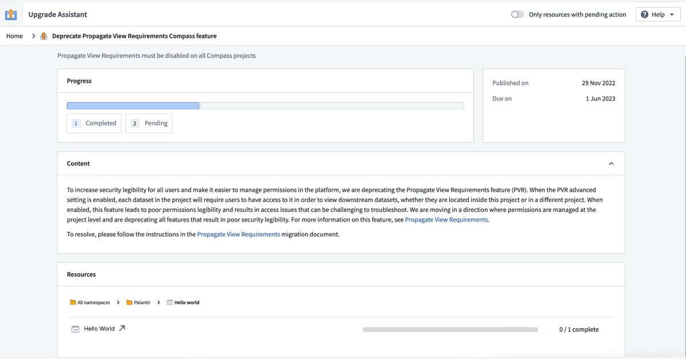
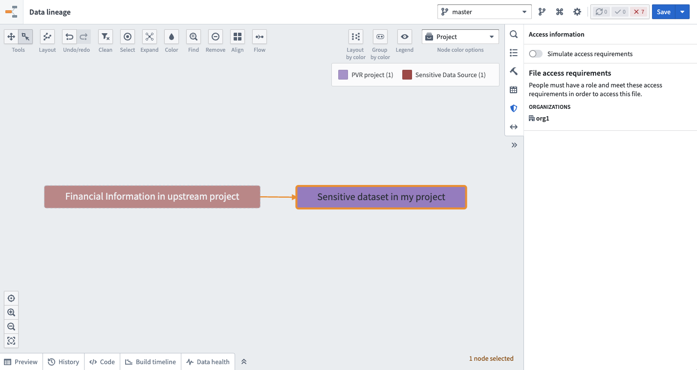
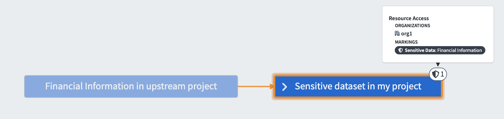
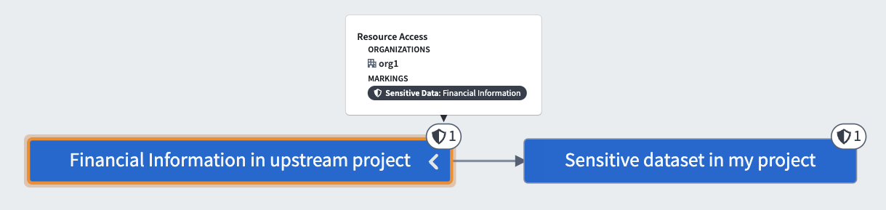
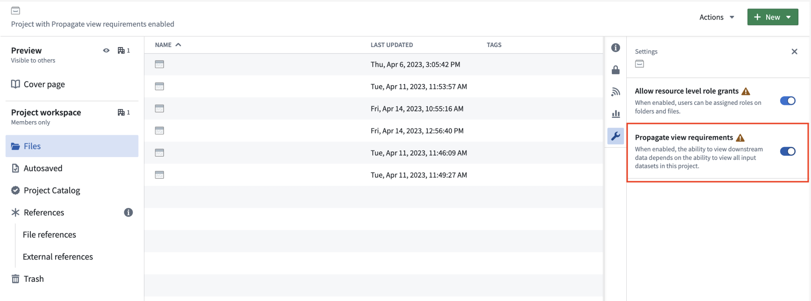

<!-- source: https://palantir.com/docs/foundry/platform-security-management/disabling-propagate-view-requirements/ · mirrored 2026-08-12 from Palantir Foundry docs -->

# Migrate from and disable the "Propagate view requirements" setting \[Planned deprecation]

:::callout{theme="warning" title="Planned deprecation"}
The **Propagate view requirements** security setting is in the [planned deprecation](/docs/foundry/platform-overview/development-life-cycle/) phase of development, and most enrollments are no longer able to use this feature as of October 2024. Any enrollments still using the **Propagate view requirements** setting are strongly encouraged to follow the guide below to migrate away from this usage in favor of [Projects](/docs/foundry/security/projects-and-roles/) and [Markings](/docs/foundry/security/markings/), which offer improved security legibility and management.   
Contact Palantir Support if you require additional help with this migration.
:::

When the "Propagate view requirements" setting is enabled on a Project, each dataset in the Project will require users to have access permissions to view its downstream datasets, whether they are located inside this Project or in a different Project.

We recommend disabling the "Propagate view requirements" setting and replacing it with a Marking if necessary. Unlike the "Propagate view requirements" setting, Markings more clearly define the requirements necessary to view the underlying data. If only some datasets contain sensitive data, consider adding the appropriate Marking to those specific datasets. If the entire Project is sensitive, add the Marking at the Project level.

Below is a summary of the steps to take to migrate away from the "Propagate view requirements" setting:

1. Start in the [Upgrade Assistant](/docs/foundry/upgrade-assistant/overview/) application and pick a Project that needs to be migrated.
2. Consider your migration options and decide which is best for your situation.
3. Perform the migration.
4. Disable "Propagate view requirements" on the Project.
5. Return to Upgrade Assistant and confirm that there is no longer a pending action corresponding to this project.

## Migration steps

### 1. Upgrade Assistant

Go to the Upgrade Assistant application in Foundry and select a specific project where "Propagate view requirements" is enabled to start the migration process.

### 2. Choose how to migrate the selected Project

There are several different ways to migrate away from using the "Propagate view requirements" setting. The method you choose depends on the sensitivity of your data, what Projects and Markings already exist on your platform, and the security architecture of your enterprise. Below is a list of migration options and questions you should ask to help decide next steps. As there may be significant privacy implications for your decision, we strongly suggest reading through all provided options.

#### Classify sensitive data

First, determine whether the Project contains sensitive data. Context matters; whether or not certain data is considered sensitive depends on relevant privacy regulations and standards for your organization.

Sensitive data at Palantir is defined as any data that is broadly classified and/or requires extra security. Some laws formally designate specific data elements as sensitive (for example, [the EU's General Data Protection Regulation ↗](https://commission.europa.eu/law/law-topic/data-protection/data-protection-eu_en)), while others are determined by data owners or common recognition regardless of legal status (such as Social Security Numbers). Whether data is classified as sensitive generally depends on the type or classification of data (for example, Personally Identifiable Information (PII)), the types of workflows (such as those limited to specific purposes), or any content that may trigger restricted access controls (including sensitive enterprise information).

One common example of sensitive data, as mentioned above, is Personally Identifiable Information (PII), which includes direct identifiers and other information that can be used to re-identify or single out individuals.

Here, you should identify cases where restricting access to data in a Project should restrict access to any downstream datasets, objects, or resources derived from it. If no data in the Project has a PII property, you can skip ahead to [disable the "Propagate view requirements" setting](#4-disable-propagate-view-requirements-on-the-project) on the Project.

If data sensitivities exist in the Project, categorize them. For example: “Datasets X, Y, and Z in this Project contain PII, and datasets A, B, and C in this Project contain Financial Information”.

#### Verify if Markings are applied to sensitive data

[Markings](/docs/foundry/platform-security-management/manage-markings/) are a security control in Foundry that define eligibility criteria to restrict visibility and actions to users.

Like the "Propagate view requirements" setting, [Markings](/docs/foundry/security/markings/) are a security primitive that propagate to downstream datasets and resources. When considering whether it is safe to turn off the "Propagate view requirements" setting for this Project, we recommend checking whether the sensitive data in this Project is already protected by an appropriate Marking. If this is the case, it may be appropriate to turn off "Propagate view requirements."

Use the [Data Lineage](/docs/foundry/security/checking-permissions/#data-lineage) application to verify Markings on a dataset. First, add one or more datasets in your Project to the graph. Then, choose the **Permissions** node coloring option. Shield icons will appear on the graph next to resources protected by Markings. Select a node, then select **Access Information** in the right sidebar to expand details about the Markings on that node.

For example, if you determine that a Project with an enabled "Propagate view requirements" setting contains only one sensitive data category (PII), and a PII Marking is already applied to every relevant dataset in the Project (either directly or through inheritance from a data dependency or the file hierarchy) then the "Propagate view requirements" setting is likely redundant and can be safely [disabled for the Project](#4-disable-propagate-view-requirements-on-the-project).

#### Determine if data sensitivity is introduced upstream or inside this Project

If the Project contains sensitive data, and that data is not already secured by a [Marking](/docs/foundry/security/markings/), then we recommend applying a Marking before disabling the "Propagate view requirements" setting to ensure that downstream data is continuously protected by propagating security controls.

However, the Project may not necessarily be the correct place to apply the Marking to the data.

##### Example

In the example below, a sensitive dataset in a Project with an enabled "Propagate view requirements" setting does not have a Marking applied to it. However, the sensitive dataset is actually derived from an upstream dataset.

**Approach 1 (Incorrect):** If you apply a Marking directly to the sensitive data in this Project, the upstream data would not be correctly marked; this would impact security legibility.

**Approach 2 (Recommended):** If you instead apply a Marking to the *upstream* data, then the Marking will automatically propagate to the data in this Project; both datasets would be correctly marked.

If any sensitive data in your Project should be protected by a Marking, we recommend securing that data as far upstream as possible to ensure that the sensitive data is consistently secured wherever it appears in the platform. Be sure to take appropriate upstream action before returning to your Project and continuing the migration.

#### Reuse existing Markings, if appropriate

If your Project is the origin (farthest upstream location) of some sensitive data, and the data is not protected by a Marking, then the Project may be the right place to apply a Marking to the data as a replacement for the "Propagate View requirements" setting. For each sensitive data category, [verify whether a Marking already exists](#verify-if-markings-are-applied-to-sensitive-data) on the platform that correctly represents this data.

From a data governance perspective, if the data is PII and there is already a PII Marking on the platform, we recommend applying the existing Marking rather than creating a second PII Marking; this ensures that user authorization can be managed in a single place.

Record your decision about which Markings you plan to reuse before [continuing with the migration](#3-complete-migration).

#### Create a new Marking

If an appropriate Marking does not exist for the type of sensitive data in your Project, consider creating a new Marking. This should only be necessary if the following is true:

* The data in the Project is unique, and there is no existing Marking that can be used.
* The data originates in the Project; if it does not, the Marking should be applied to the upstream dataset from which the data is derived,

Record your decision and complete the migration following the steps in the sections below.

### 3. Complete migration

The next sections describe how to complete your migration given the options discussed above.

#### Disable "Propagate view requirements"

No action needed. Continue to [4. Disable "Propagate view requirements" on the Project](#4-disable-propagate-view-requirements-on-the-project).

#### Apply an existing Marking

Add all users who have access to the sensitive datasets of a particular category in the Project (for example, the datasets containing PII) as members of the existing Marking (PII). This ensures that no one will lose to access to the Project after the migration. Be aware that once the users are added as members to the existing Marking, they may be able to see any data where this Marking is applied throughout the platform.

Before applying an existing Marking, review the steps to [apply a Marking](/docs/foundry/platform-security-management/manage-markings/#apply-markings). Consider the downstream impact of applying a Marking and potentially locking out other downstream users.

When you are ready, apply the Marking on the set of resources that require it. If there is only one category of sensitive data in the Project and all data is of that category, then apply the Marking to the Project itself. Otherwise, apply the Marking directly to the sensitive datasets or to their parent folder if they are colocated.

#### Create a new Marking

First, [create a new Marking](/docs/foundry/platform-security-management/manage-markings/#create-markings). Then, add all users and/or groups who should have access to the data it describes as members of this new Marking. This ensures that no one will lose access after the migration.

Before attempting to apply any Markings, review the [steps to do so](/docs/foundry/platform-security-management/manage-markings/#apply-markings).

### 4. Disable "Propagate view requirements" on the Project

After [completing the migration](#3-complete-migration) as many times as needed for the number of sensitive data types in the Project, be sure to disable the "Propagate view requirements" setting from the **Settings** tab in the right side panel of the Project view.

:::callout{theme="warning"}
You will not be able to re-enable the "Propagate view requirements" setting after disabling it.
:::

### 5. Confirm action is complete

Return to Upgrade Assistant and confirm that there is no longer a pending action corresponding to this project.
