<!-- source: https://palantir.com/docs/foundry/platform-security-management/manage-markings/ · mirrored 2026-08-22 from Palantir Foundry docs -->

# Manage markings

Markings are managed in the Foundry Settings under the Markings section. Markings are then applied on resources across the platform.

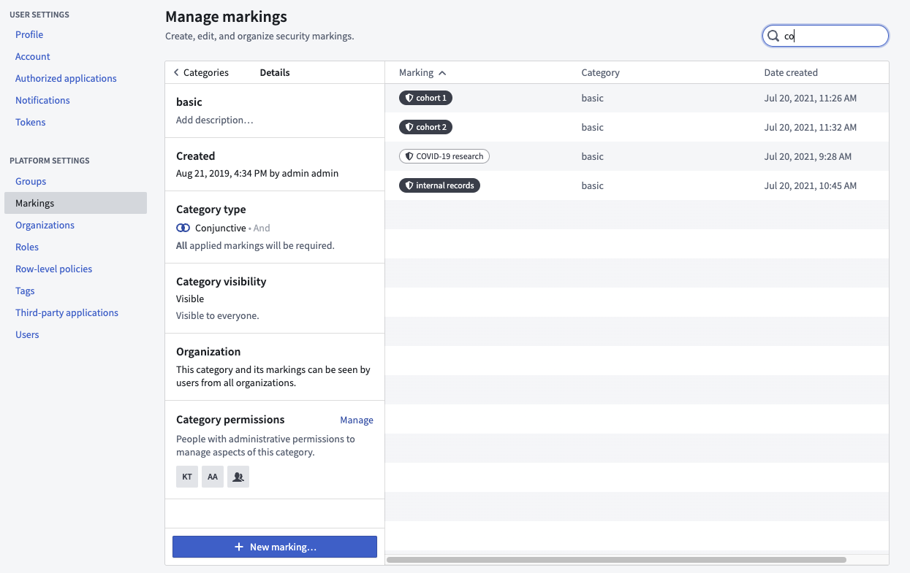

## Create Marking categories

:::callout{theme="warn" title="Category deletion"}
Once created, marking categories cannot be deleted.
:::

Administrative users can create Markings and Marking categories and control their metadata, visibility, and membership. Access to the Marking section of the Platform Settings requires special platform permissions.

If you are an administrative user with the necessary permissions, you can create Marking categories in the Marking section of Platform Settings by clicking the **New marking category** button.

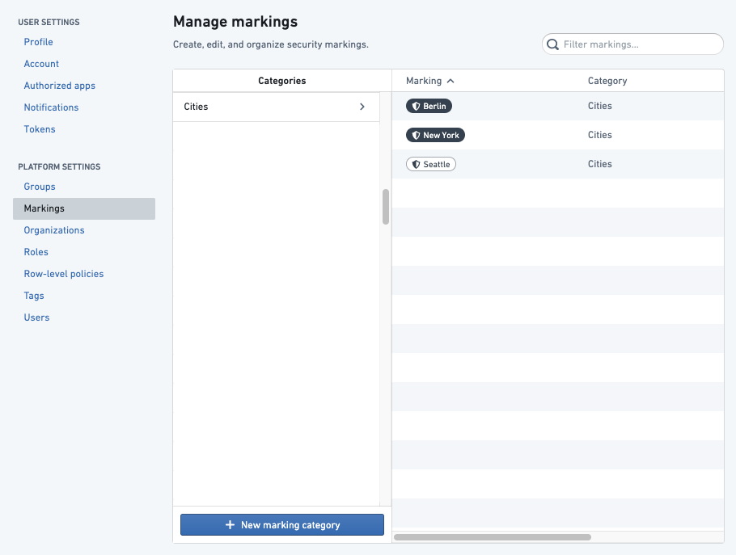

When you create a Marking category, you can set the [category visibility](#category-visibility) and assign category permissions. By default, the category creator will be an administrator. The category creator can choose to remove themselves as the creator and add another administrator instead.

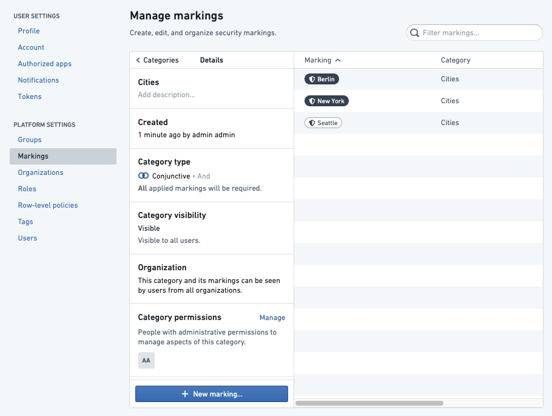

### Category visibility

Marking visibility is assigned on a per-category basis, with the exception of the Organization category. Individual Organizations each have their own visibility settings.

In most cases, the names and descriptions of Markings and categories are not sensitive information and should be visible even to users who do not have Marking access. This behavior is determined by the category visibility, which is `Visible` by default.

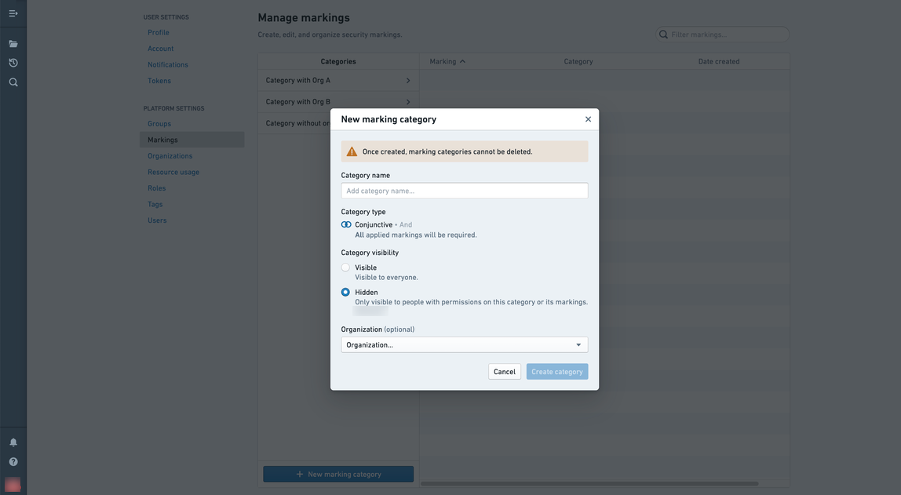

If the category visibility is set to `Visible`, all users in the Organization can see the existence of the category and its Markings in the Marking interface. If users fail to meet Marking permissions, they will not see the existence of the Marking or category.

If a Marking category visibility is `Hidden`, the existence of this category and its Markings is considered sensitive information. The `Hidden` category can be made invisible to all users who have not explicitly been granted `Category Viewer` permissions.

Marking categories ensure these visibility rules:

* Visibility is defined for a category and all of its Markings together; it cannot be assigned on a per-Marking basis.
* All users with access to a Marking can view existence of the category and all other Markings within the category. These users will not appear in API results as “category viewers” but should be assumed.
* All users with roles (administrator, remover) on a Marking can view the category and existence of all Markings within the category. These users will not appear in API results as “category viewers” but should be assumed.
* All users with roles (administrator, viewer) on a category can view the category and the existence of all Markings within the category.

### Category permissions

Users can have permissions that designate how they interact with Marking categories:

* **Category Administrators:** Users who can change the description and permissions for the category and create Markings in the category.
* **Category Viewers:** Users who can see the existence of the category and all the Markings within it.

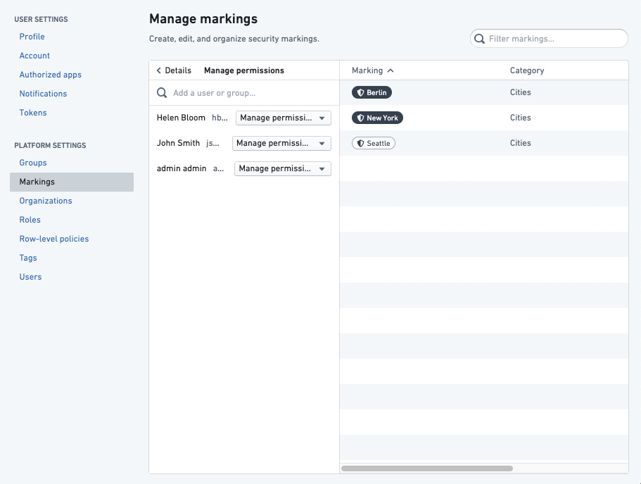

### Restrict categories by Organization

A Marking category can be restricted to a single Organization to ensure that it is never visible to users outside of that Organization.

## Create Markings

:::callout{theme="warn" title="Marking deletion"}
Once created, markings cannot be deleted or moved to a different category.
:::

If you are an administrative user with the necessary permissions, you can create new Markings in the Marking section of Platform Settings by clicking the **New marking** button. You can then assign Marking Administrators and Marking Removers.

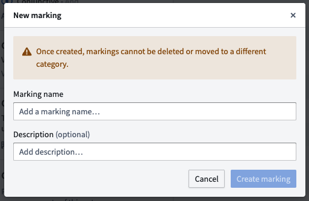

When you create Markings from within Foundry, you are automatically granted "Manage permissions" access. We recommend assigning different team members these permissions on new Markings. That way, you can avoid relying on a single administrator to manage all Markings permissions.

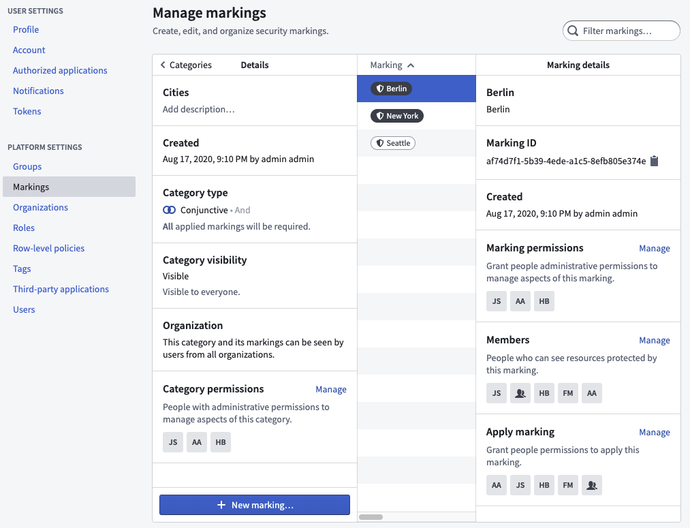

### Marking permissions

:::callout{theme="neutral"}
The permissions below apply to resource-level markings. Organizations have a separate permission model with their own **Apply organization** and **Expand access** permissions. For details on organization-level permissions, see [organization permissions](/docs/foundry/platform-security-management/manage-orgs-and-spaces/#organization-permissions).
:::

When you create a new Marking, you can add users and groups with different levels of access and permissions:

* **Manage permissions:** Users who can grant permissions to manage this Marking, its members, and its metadata.
* **Apply marking:** Users who can apply this Marking to Projects and resources. This permission only grants the ability to apply a Marking and does not grant membership of a Marking.
* **Remove marking:** Users who can remove this Marking from Projects and resources. To remove a Marking, a user must also be able to apply the Marking.
* **Members:** Users who can see resources and Projects protected by this Marking.

All the permissions above are distinct and do not automatically provide users with membership permissions. For example, a user can have “Apply marking” and "Manage permissions" access on a Marking and not be a member of the Marking. In that situation, the users could apply the Marking to files, folders, and Projects in the platform and manage the Marking, but they could not see the data marked with that Marking.

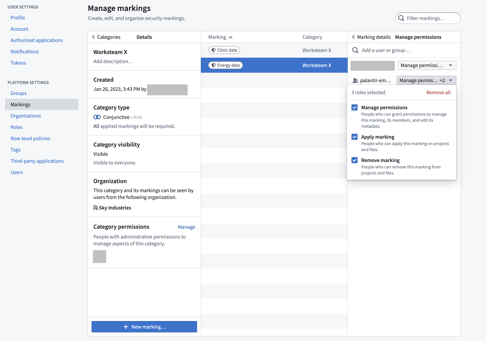

### Grant Markings to users

Markings are granted globally to users. When a user is granted a Marking, the user is globally entitled to view the type of content restricted by that Marking. However, having access to a Marking does not mean that the user can view all content with that Marking; the user must still have permissions through their role. Users cannot grant access to Markings to other users unless they have additional administrative permissions on the Marking.

If Marking permissions are granted to a group, then a new user to the group will inherit those permissions.

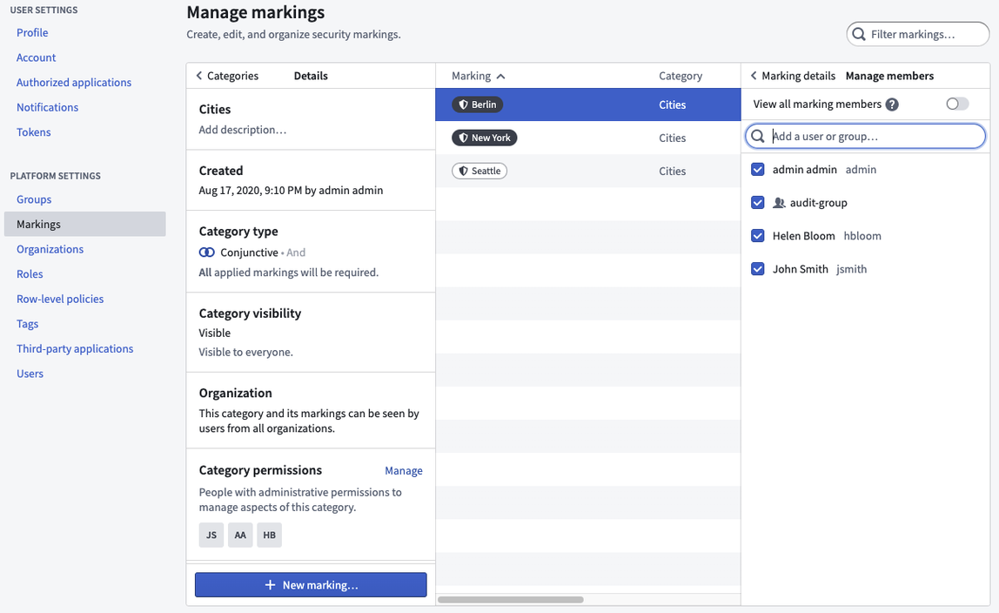

## Apply Markings

You can apply a Marking on a resource, folder, or Project if you meet two requirements:

1. You have the “Apply marking” permission on the Marking.
2. You have the “Update Markings on resource” permission, which is included in the Owner role by default.

Applying a Marking is a sensitive operation and can restrict downstream users. Before applying a Marking to an existing pipeline, we recommend taking the following steps:

1. **Confirm the existence of the Marking:** Ensure that the Marking you want to apply has been created, or [create the marking](/docs/foundry/platform-security-management/manage-markings/#create-markings).
2. **Make a branch of your pipeline:** Create a new branch to continue with these steps. When applying a Marking to an existing pipeline, you will likely need to stop propagation of the marking at some point in the pipeline (for example, so that a dataset cleaned of PII can be opened by an end user). The [`stop_propagating`](/docs/foundry/api-reference/transforms-python-library/api-input/#transforms.api.Input) syntax will only take effect on protected branches. You cannot `stop_propagating` an inherited marking until your new branch is merged into the protected branch.
3. **Review data lineage:** Confirm that you have the complete set of nodes on your data lineage graph and confirm that you understand the downstream impact of your potential change.
4. **Review transaction types in your pipeline:** Markings propagate along data dependencies at the transaction level. Incrementally built datasets (of type APPEND or UPDATE) require special treatment. Specifically, the latest view of a dataset built with APPEND transactions will include dependencies from old upstream transactions; by contrast, the latest view of a dataset built with SNAPSHOT transactions (the Foundry default), only depends on the latest transactions from upstream datasets. If you are only dealing with SNAPSHOT transactions, you can continue with these steps. If not, see the documentation on [APPEND and UPDATE transactions](/docs/foundry/data-integration/datasets/#transactions) and on [how Markings propagate](/docs/foundry/building-pipelines/remove-markings/#scenario-3-applying-a-new-marking-followed-by-marking-removal-at-the-dataset-level).
5. **Determine when to stop inheriting the Marking:** Explore the nodes in the data lineage of your pipeline and review columns and data previews in order to determine the point at which you should stop inheriting the Marking you want to apply. For example, you might want to stop propagating a PII marking once the DOB (date of birth) column is removed in a pipeline. You can activate the simulation mode during this step to see where and how the Marking will propagate.
6. **Preemptively make necessary transform changes:** In your branch, add the `stop_propagating` syntax in the transforms you identified. Merge your branch into the protected branch so that the `stop_propagating` syntax is active.
7. **Build your production pipeline:** Build all the transforms downstream, including the nodes you identified to `stop_propagating`. You will need to rebuild the datasets that have the `stop_propagating` syntax and all the datasets downstream of the `stop_propagating` transforms. If you have downstream `APPEND` or `UPDATE` datasets, review [this guide](/docs/foundry/building-pipelines/remove-markings/#scenario-3-applying-a-new-marking-followed-by-marking-removal-at-the-dataset-level).
8. **Review the simulated change:** Review the final simulated data lineage of your pipeline. Confirm that datasets downstream of your `stop_propagating` transforms are not affected by the application of the new Marking. Ensure that sensitive columns do not appear in datasets that will not receive the propagated Marking.
9. **Apply the Marking:** The steps above should establish that applying the Marking will protect datasets containing sensitive data and that the Marking will not propagate beyond what is necessary. At this point, you can apply the marking.

:::callout{theme="neutral"}
If you notice a mistake after applying the Marking (for example, a large group of users cannot see data they should be able to see), you can remove the Marking and it will immediately stop propagating. Then, you should review simulated changes again to identify the cause of the issue.
:::

In the example below, the DOB column was removed and the `stop_propagating` syntax was applied on the ontology `passengers` dataset. The PII marking was applied on the raw `passenger` dataset and only propagated to the clean `passenger` dataset.

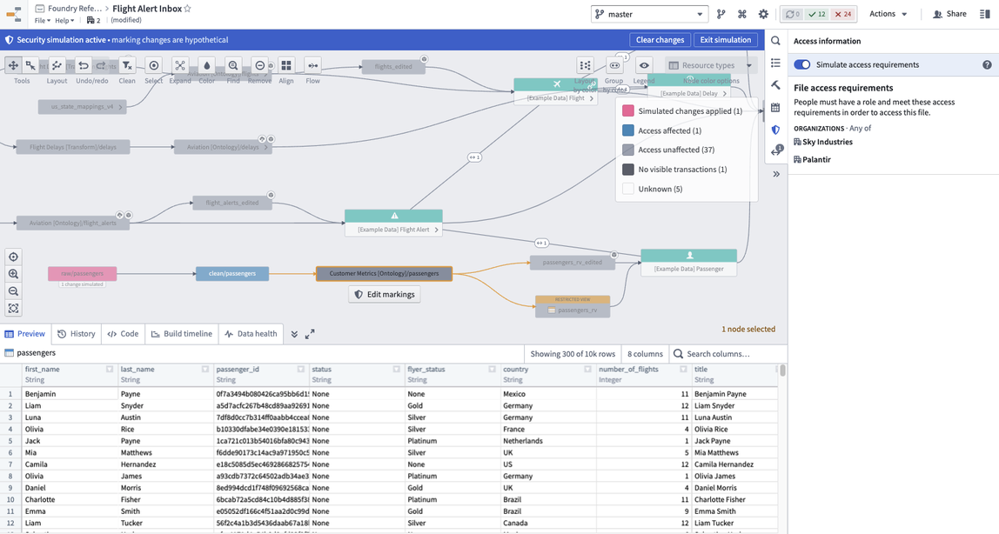

## Remove Markings

You can remove Markings to give access to more users, re-classify transformed data, or to separate derived resources from inherited Markings.

For example, assume that dataset A contains PII and a marking protects datasets derived from dataset A. If dataset B is derived from dataset A but has been transformed to remove the PII, you may want to remove the marking from dataset B to allow broader use of the data.

To remove a Marking, you must have permission to both apply and remove the specific Marking. You also need access to the resource of interest through a role that allows you to change its Markings. If you are using default roles, this access is available with the `Owner` role.

### Remove a directly-applied Marking

Removing a Marking directly from a file, folder, or Project will immediately remove the Marking from any dependencies that inherited the Marking. You do not need to rebuild datasets downstream after directly removing a Marking since the Marking will immediately be removed downstream. The following notional example shows a directly-applied `PII` Marking.

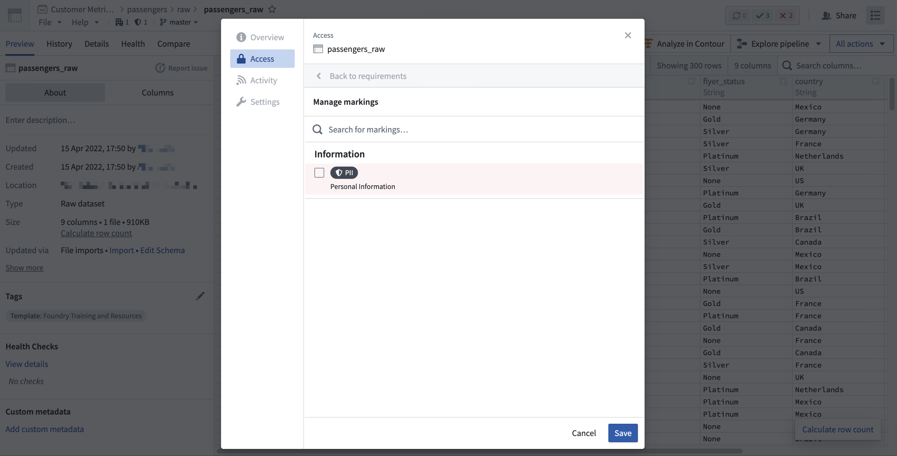

### Remove an inherited Marking

You can only remove inherited Markings from Restricted Views and datasets. If restricted content is removed or obfuscated while deriving a dependent file, you can remove the Marking from the derived file. When the inherited Marking is removed, the downstream datasets will not be protected by the Marking and more users may have access to the dataset. Users will still need access to the Marking to see upstream data.

To remove an inherited Marking from a Restricted View, edit the Restricted Views and click **Stop Propagating** next to the appropriate Marking.

To remove an inherited Marking from a dataset, use the `stop_propagating` syntax in your transformation code. To safely remove an inherited Marking, follow these steps:

1. **Determine where to remove sensitive data:** Review your full pipeline and decide where you want to remove the sensitive data.
2. **Create a branch:** The `stop_propagating` syntax will only take effect on branches that are both protected and have the setting `Require security approvals before merging` enabled. You will not be able to `stop_propagating` an inherited Marking until your branch is merged into the protected branch.
3. **Make necessary transform changes:** In your selected datasets, remove the sensitive data and add the `stop_propagating` syntax to the transforms.
4. **Build your branch:** Build your branch and confirm that the sensitive data is removed in the output dataset. The `stop_propagating` syntax will not stop the Marking from being inherited at this point since you are on a non-protected branch.
5. **Merge your branch:** After confirming that your sensitive data is removed, you can safely merge your transform changes into the main branch. Merging your branch will apply the `stop_propagating` syntax.
6. **Build your main branch and downstream dependencies:** The `stop-propagating` change must propagate along the latest transactions in your pipeline, which requires you to rebuild the datasets that have the `stop_propagating` syntax and all the datasets downstream of the `stop_propagating` transforms. Once all the datasets are built, confirm that the inherited Marking was removed. If there are downstream APPEND or UPDATE transactions, review [additional documentation.](/docs/foundry/building-pipelines/remove-markings/#scenario-3-applying-a-new-marking-followed-by-marking-removal-at-the-dataset-level)

In the notional example below, the DOB column was removed and the `stop_propagating` syntax was applied on the Ontology *passengers* dataset to stop the PII marking from propagating further downstream.

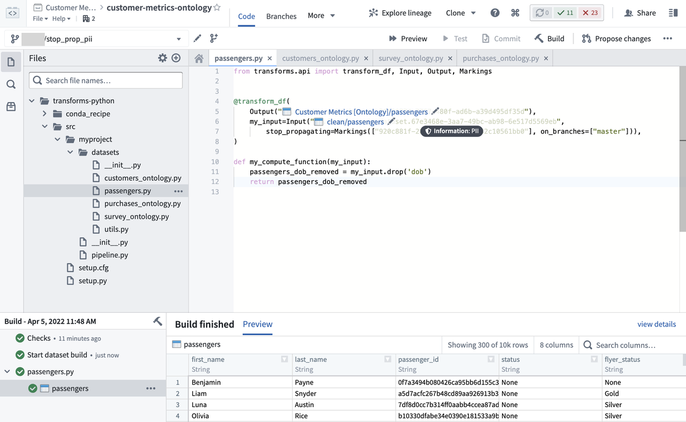

## Investigate marking inheritance

Markings are [inherited](/docs/foundry/security/markings/#inheritance) along both the file hierarchy and data dependencies. This means the file itself can be protected by a Marking and/or the data itself is protected by a Marking. Sometimes you need to investigate where a Marking is coming from and conceptually understanding the different ways a Marking can be inherited is important.

You can view a file's marking by selecting it to open the right-side detail pane, and looking under the **Access requirements > Markings** section.

### Investigate file hierarchy

To view a file's marking, select it and open the resource panel. Look under the **Access** section.

A marking inherited along the file hierarchy is indicated by a folder sidecar icon.

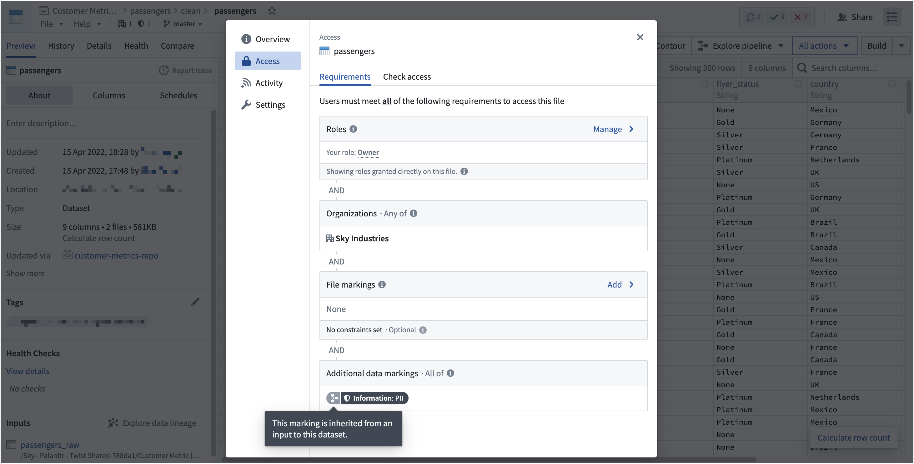

To figure out at which point in the file hierarchy the Marking originates, traverse the file hierarchy in the Foundry workspace. In the notional example below, we can verify the **flight data** folder as having PII Marking having traversed the file hierarchy starting from the original file and that of the folder resource. Access information is shown on the resource sidebar.

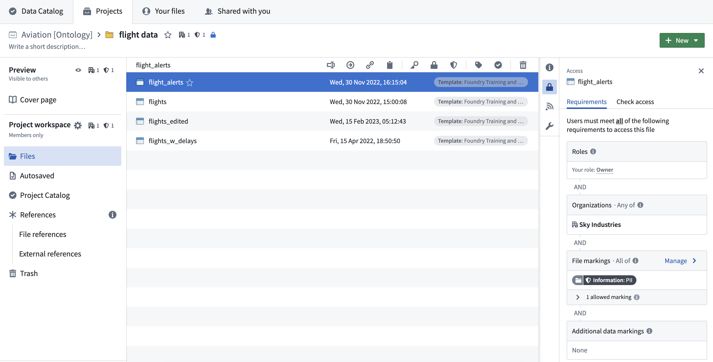

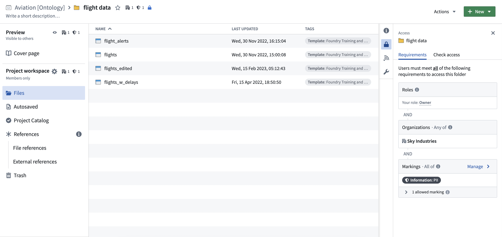

### Investigate data dependencies

To figure out which data dependency the Marking originates from, you can use the Data lineage application or use the Compare tab after opening a dataset file.

As Markings are applied at the [file level](/docs/foundry/platform-security-management/manage-markings/#apply-markings) but propagate along [transactions](/docs/foundry/data-integration/datasets/#transactions), it can be difficult to figure out when a Marking was introduced for a dataset. We recommend first checking the Data Lineage application to see where a Marking originated.

Using the Data lineage application, click **Legend > Permissions type: Data access in datasets**. Then expand all upstream nodes of the data lineage and traverse the data lineage to see where a Marking originated. A marking inherited along a data dependency is indicated by a data lineage sidecar icon.

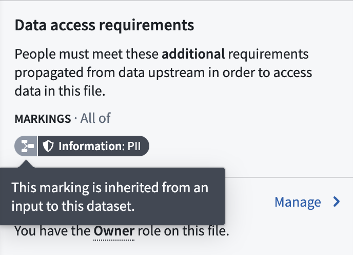

In the following example screenshots below, the `employee_sensitive` dataset is where the PII Marking originates:

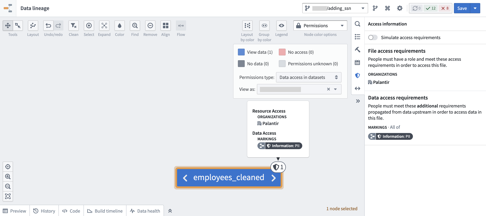

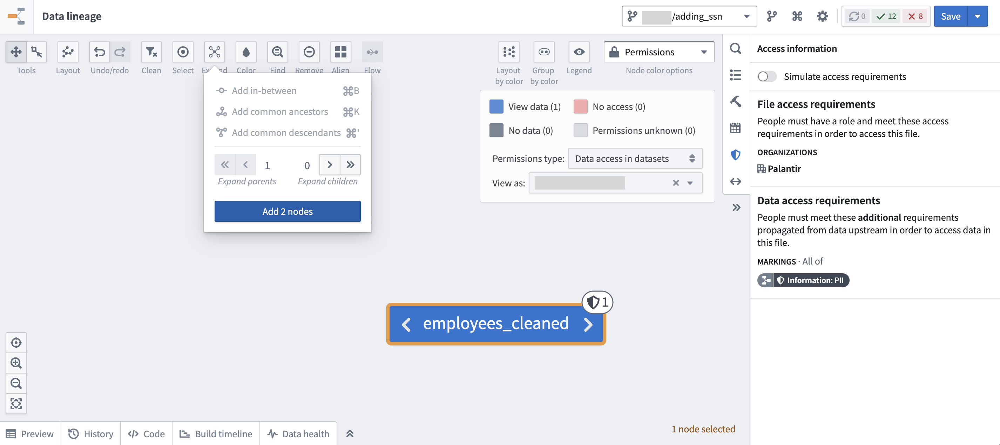

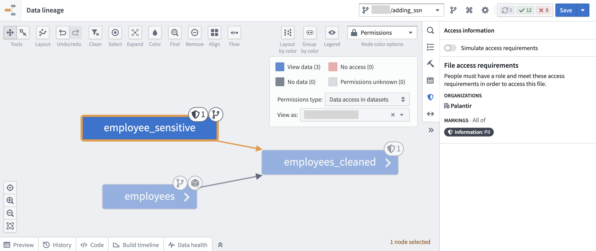

To get the full picture about when a Marking was specifically introduced, look at the transactions on the file of interest. Open the specific file and navigate to the **Compare** tab to compare different transactions from both branches and timestamps to learn what security and logic changes happened over time.

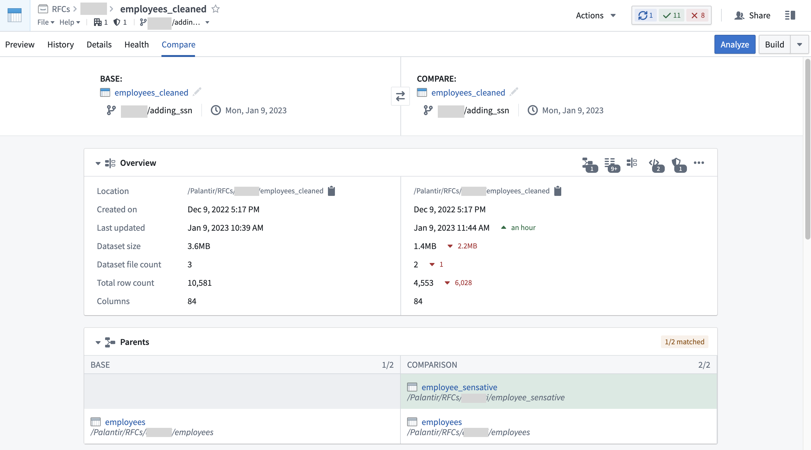

At the bottom of the transaction comparison tool, you can see both the logic and security changes which will help you figure out exactly when a Marking was introduced or removed. The example below shows a new input was added which introduced the PII Marking:

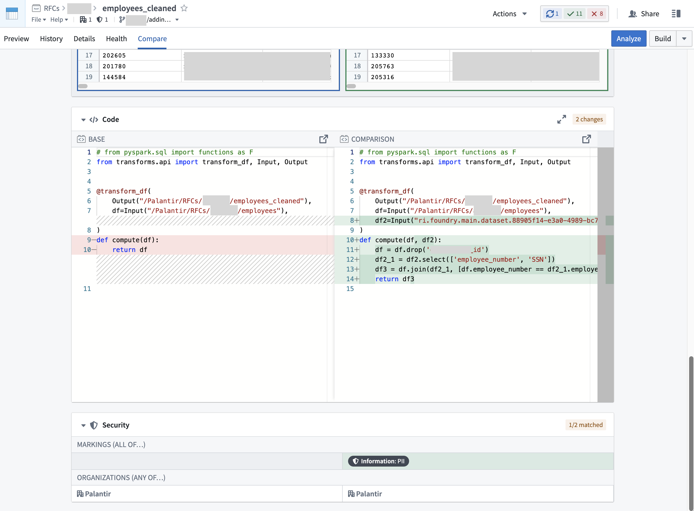

The example below shows PII Marking being removed due to an input being dropped from the logic:

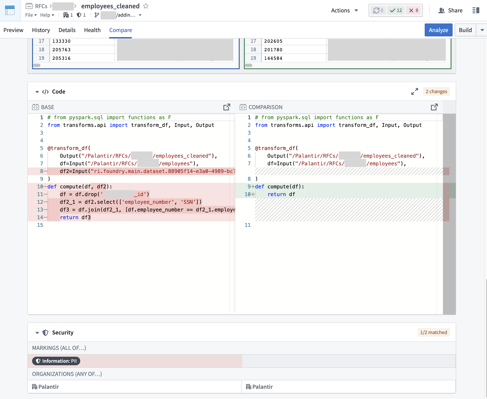
