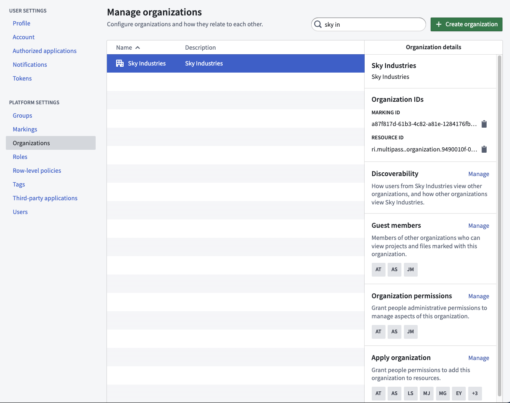
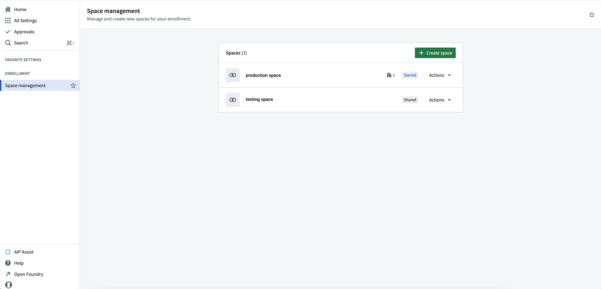
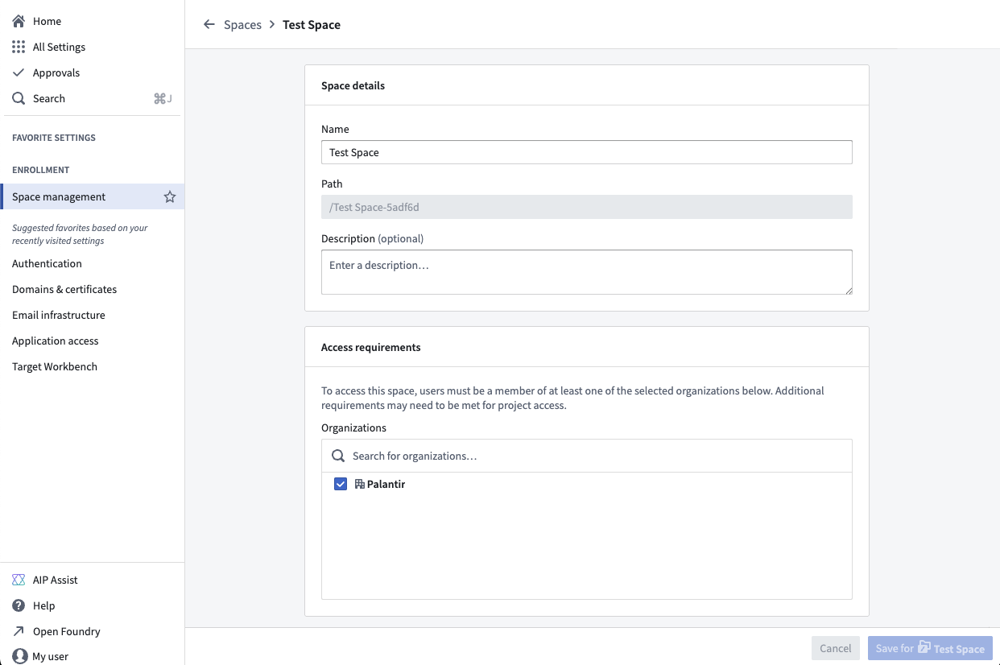
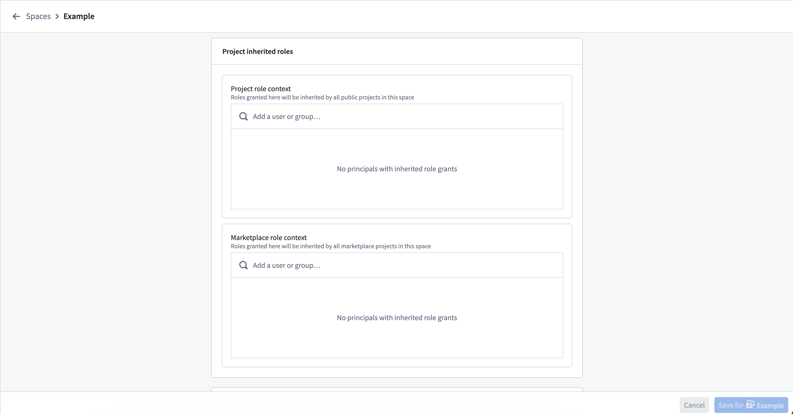
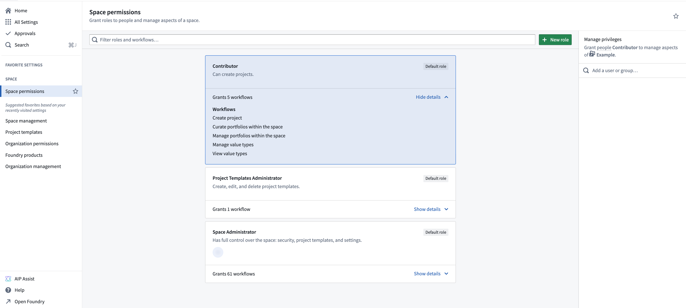

<!-- source: https://palantir.com/docs/foundry/platform-security-management/manage-orgs-and-spaces/ · mirrored 2026-08-12 from Palantir Foundry docs -->

# Manage organizations and spaces

## Organizations

Organization permissions should be managed via [Control Panel](/docs/foundry/administration/enrollments-and-organizations-access/). Further Organization configuration is managed in the Foundry Settings tab.

### Organization permissions

Organizations have their own set of permissions that control how users can interact with organization access requirements on resources. These permissions are managed in [Control Panel](/docs/foundry/administration/enrollments-and-organizations-access/).

#### Marking permissions

Organizations use two permissions that govern how users can modify organization access requirements on resources:

* **Apply organization:** Allows a user to add this organization to resources. A user with this permission can apply the organization as an access requirement on a resource, folder, or project.
* **Expand access:** Allows a user to expand access to resources by adding other organizations or removing this organization. This permission is required when a user needs to broaden the audience that can access a resource by modifying its organization access requirements.

For more information on these terms, see the [security glossary](/docs/foundry/security/security-glossary/).

:::callout{theme="warning" title="Common error: missing Expand access permission"}
If a user receives an error stating they lack the **Expand access** permission after trying to move a resource to a different organization or to remove an organization from a resource, an administrator must grant the user the **Expand access** permission on the source organization in [Control Panel](/docs/foundry/administration/enrollments-and-organizations-access/) by navigating to **Organization permissions > Marking permissions**.
:::

### Home folders and organizations

When Foundry home folders are enabled, they are automatically marked with the organization of the user.

:::callout{theme="neutral" title="Beta"}
Configuration options to disable home folders are in the [beta](/docs/foundry/platform-overview/development-life-cycle/) phase of development and may not be available on your enrollment. Functionality may change during active development. Contact Palantir Support to request access to this feature.
:::

## Spaces

:::callout{theme="neutral"}
**Spaces** have been rebranded from their previous name, **namespaces**.
:::

Spaces settings are managed in [Control Panel](/docs/foundry/administration/enrollments-and-organizations-access/) on the **Space management** page of enrollment settings.

### Create a space

From the **Space management** page, select **+ Create space**.

As part of space creation, you will be asked to specify the following settings:

* **Access requirements:** Users need permission from at least one organization to access this space. Projects in this space can only be visible by organizations in this list.
* **Deletion policy:** Defines when the space and its projects are deleted. The space is deleted only after all organizations in this policy have been deleted.
* **Filesystem:** Where project data is stored. Cannot be changed after creation.
* **Usage account:** Tracks resource usage costs. Sets the default billing account for projects in this space. Can be overridden per project.
* **Resource queue:** Where projects get their compute resources from. All projects in this space use this queue.
* **Role set:** Controls which roles are available to projects. Defaults to `Project defaults`, but you can use [a custom role set](/docs/foundry/platform-security-management/manage-roles/) instead.

If you are an enrollment admin but are not able to create a new space, it may be because your enrollment is not suitable or you have hit a quota limit; contact Palantir Support for more information.

### Manage a space

From the **Actions** dropdown menu, you can **Manage** the settings of a space. In addition to the settings mentioned above, you can configure:

* **Maven identifier:** Uniquely identifies resources published from this space.
* **Project inherited roles:** roles that all projects in the space inherit. These role grants appear in the Compass side panel for the project in this space. There are two inheritance role grant pickers, one for regular projects and one for locked marketplace projects.

From the **Space permissions** page in Control Panel, you can set the roles users have in the space. Each space comes with a set of default roles and the ability to create custom roles for greater flexibility in managing permissions. For each role, you can open the workflows dropdown menu to view the permissions granted with the role. Select a role to view the role grants in the panel on the right, where you can add or remove users.

To create a custom role, select **+ New role** in the top right of the page, then select which workflows to include with this role. After creating the custom role, you can grant that role to users the same way you would for other roles. Custom roles can be edited or deleted through the **Actions** menu in the top right of each custom role.

:::callout{theme="warning"}
Custom roles are "frozen", meaning that new workflows added to default roles will not automatically apply to custom roles. To include new workflows in a custom role, select **Edit role** and add them manually.
:::

Legacy spaces might provide additional configuration settings. Below is a description of those settings:

* **Roles:** Users must have a role on the space and meet its access requirements to create projects or manage space settings.
* **Role grants on folders and files:** When enabled, users can be assigned roles on folders and files in new projects by default. This setting only initializes this behavior when a new project is created and does not enforce this behavior for existing projects. Learn more about disabling [role grants on folder and files](/docs/foundry/security/projects-and-roles/#role-grants-on-folders-and-files).
