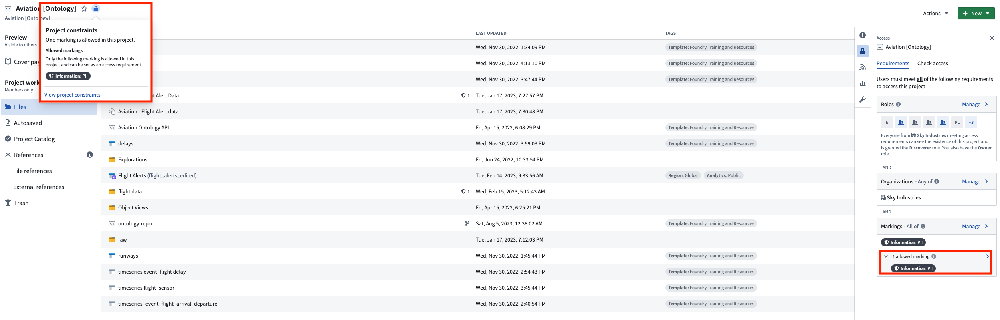
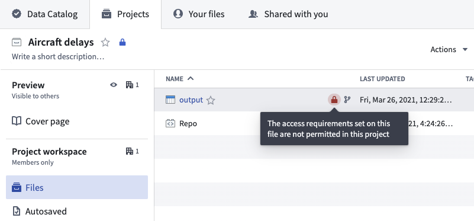

<!-- source: https://palantir.com/docs/foundry/platform-security-management/manage-project-constraints/ · mirrored 2026-08-12 from Palantir Foundry docs -->

# Manage Project constraints

To add a constraint on a Project, you must have an `Owner` role on the Project and add “Apply marking" permissions on all markings added as a Project constraint. You will not be able to add or modify a Project constraint if doing so would cause an existing file in the Project to be in violation of the constraint you are trying to add.

To manage constraints, navigate to the Markings section in the Access panel to the right.

## Project constraint violations

After a Project constraint is applied, a dataset could still violate the Project constraint if a violating marking was added somewhere upstream and inherited by a dataset in the Project. This is surfaced by a warning on the dataset that is in violation. If the dataset violates the Project constraints, it cannot be built until the violation is resolved.

Project constraint violations can be resolved through the following actions:

* Add this inherited marking as an allowed Project constraint.
* Remove the inputs that introduce the new marking from the necessary transformations.
* Remove the inherited upstream marking. Learn how to [remove markings](/docs/foundry/building-pipelines/remove-markings/) in our documentation.
